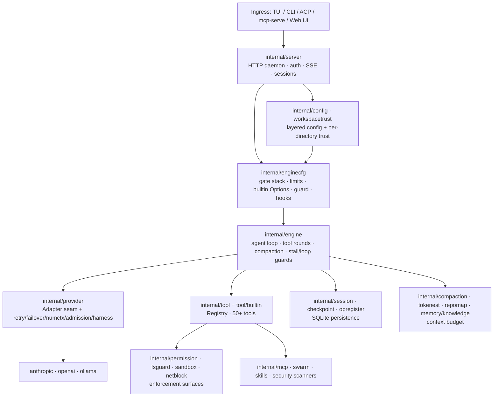
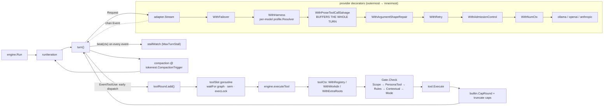

# Aegis Release History

This is the shipped-feature changelog and historical design record for Aegis — every completed
roadmap item, why it was built, what it touched, and how it was tested. For what's currently open
or next, see [roadmap.md](roadmap.md).

---

## Latest changes

**Last updated:** 2026-09-02 (thirty-seventh record) — **QUAL-05, P67.14, P64.4 shipped, and P81.33's
argv half done in part: the `internal/tui` package was opened for its own reason and four items folded
in, as QUAL-05's own "promote when" condition asked for.** `model` (`tui.go`) dropped from 97 flat
fields to 19, grouped into ten cohesive sub-structs (`streamState`, `toolsUI`, `overlays`, `chrome`,
`usage`, `conn`, `composer`, `sessionMeta`, `splitTerm`, `attention`) continuing the `streamPhase`/
`toolState` precedent (P77.2) rather than a new one, each group moved and verified independently.
P67.14's state-vs-transition rule for hand-composed ANSI is now written down in `internal/termsafe`'s
package doc, with pointers from `ansi16.go` and `imagerender.go`. P81.33's approval prompt now shows
the effective sandbox backend for a pending shell call (`renderApprovalBody`) — full resolved-argv
display was scoped out, since it turned out to need touching `classifyShellCommand`, the plan-mode
security-boundary parser CLAUDE.md flags, not the small TUI-only change the entry's own text suggested.
P64.4 gave tool results an opaque `Presentation` payload (`tool.Result.Presentation`), threaded through
the engine, session storage and the TUI, with `write_file` as its first consumer: the approval/transcript
diff now shows the file's actual prior content instead of an "everything added" preview, live and on
replay. `go build ./...`, `go vet ./...` and `go test ./...` are green except one pre-existing,
unrelated failure (`TestEveryRegisterCallSiteDecidesTheLocalProfile`, from the same-day P74.21 commit,
confirmed to fail identically on the unmodified tree). Full record:
[QUAL-05, P67.14, P64.4 and P81.33's argv half, 2026-09-02](#qual-05-p6714-p644-and-p8133s-argv-half-2026-09-02).

**Last updated (previous):** 2026-09-02 (thirty-sixth record) — **P74.21 shipped: the local-model harness can now
touch a prompt or a tool description, built speculatively at direct request with no concrete cargo
behind it yet.** `profile.Harness` gained `PromptSuffix`, `ToolDescriptionOverrides` and
`DeferredTools`, layered additively by `profile.NewResolver` exactly as the two existing repair bools
already are. All three are applied per request in `provider.WithHarness` — never at registration time —
so none of them touch `internal/tool.Registry`'s exposure/clone machinery: `PromptSuffix` is appended to
`Request.System`, `ToolDescriptionOverrides` rewrites matching `Request.Tools[i].Description`, and
`DeferredTools` strips a named schema from `Request.Tools` and folds its name+description into a system-
prompt note instead — deliberately *not* the registry's loadable-via-`tool_search` deferral, since that
tool remains permanently absent from that model's requests for the life of the session; the doc comment
says so to head off the obvious confusion with `builtin.Options.LocalProfile`. `profile.RequiredExposedTools`
(`tool_search` today) and `profile.ValidateOverrides` enforce the item's own "required scaffolding must
not be excludable" constraint at `providerfactory.Build` time, and a per-model `PromptSuffix` is checked
against a new `sysprompt.LocalPromptSuffixMaxTokens` (200) budget there too — both fail the whole `Build`
call rather than degrading silently on whichever request first resolves the offending model. Full record:
[P74.21, 2026-09-02](#p7421-2026-09-02).

**Last updated (previous):** 2026-09-01 (thirty-fifth record) — **P84.1, P84.2 and P84.3 shipped: the whole Tier 1
list, filed and closed same-day.** All three were found by **P80.2**'s read-only pass and re-verified
line-by-line before being filed. **P84.1** gives `aegis chat` and `aegis debate` the same sandbox overlay
`worker.go` already had for the subprocess swarm path (P10.2): both now call `server.SelectSandbox(cfg.Sandbox,
cwd, logger)` and set `regOpts.Sandbox` before `builtin.Register`, so a configured `sandbox.backend` of
`container`/`os`/`strict` is actually honored by these two local entry points instead of every shell/test-runner
call silently falling back to direct host exec via `sandbox.NewLocalBackend()`. Sandbox selection failure is
non-fatal at both sites, matching `worker.go`: the run falls back to unsandboxed with a logged warning rather
than refusing to start (whether the daemon-only SEC-09 auto-approve-vs-unsandboxed startup refusal should also
reach these two CLI paths was left as a deliberate open question, not folded into this fix). **P84.2** routes
`sessionpicker.go`'s model-generated session title through `stripDangerousSeqs` in `sessionPickerItems`,
closing the one title-render path in `internal/tui` that skipped the sanitization every other path
(`/session`, `/session list`, `/runs`) already applied. **P84.3** adds `api.KindSteer` to `applyEvent`'s
existing `stripControlSeqs` switch (alongside `KindGuard` and `KindError`), closing the one text-bearing event
kind that reached the transcript raw — steer text originates from a plain HTTP endpoint (`handleSteer`) and,
unlike normal assistant prose, is appended directly rather than passing through `mdRender`. `go build ./...`
is clean and `go test ./internal/cli/... ./internal/tui/...` is green. Full record:
[P84.1, P84.2 and P84.3, 2026-09-01](#p841-p842-and-p843-2026-09-01).

**Last updated (previous):** 2026-09-01 (thirty-fourth record) — **P71.6 and P71.11 shipped**, out of the Tier 4
validation pass this same day: in-session web_fetch/web_search memoization (a new `internal/webcache`
package, session-scoped and freed on session delete) and a deep-research round/source budget derived
from the run's resolved context window instead of a flat cloud-sized prose number. Both were parked —
unblocked since **P71.8** landed 2026-08-19 but with no demonstrated cost behind them — and were built
on direct request rather than promoted speculatively. Full record:
[P71.6 and P71.11, 2026-09-01](#p716-and-p7111-2026-09-01).

**Last updated (previous):** 2026-09-01 (thirty-third record) — **P81.10 and P81.23 shipped: the last two Tier 3
build items from the P81 batch**, closing the batch down to P81.33's batched-approval half and P81.12's
release-artifact half (both parked, not blocked). The container sandbox (**P81.10**) now shadows
`.aegis/.env` (plus `sandbox.secret_exclude_paths`) out of every mount — one-shot and persistent alike —
with an empty read-only file/dir instead of leaving it reachable through the bind mount, and a
one-shot container command the capability memo already classified `CapRead`/`CapNetwork` mounts the
workspace read-only via a new `ExecOpts.ReadOnly`; a persistent container's mount stays read-write
always, since `docker exec` reuses one fixed mount across calls with different verdicts — a documented
limitation, not an oversight. Subtree-only mounting is left as noted future work. Scheduled jobs
(**P81.23**) now refuse `auto_approve` at creation time unless the effective sandbox backend is a real
isolation backend, mirroring `allow_unsandboxed_auto_exec`'s own escape hatch; the registered job set is
logged at daemon start and summarized in `/status` and a new TUI CRON sidebar section; a job created
from a non-interactive surface (ACP, MCP, the web UI) starts unconfirmed and the scheduler skips it
until a new `cron_confirm` tool clears it, while a TUI/CLI-created job is confirmed immediately; and a
cron fire's shell execution — which bypasses the tool registry's own hook dispatch entirely — now
stamps `reqorigin.Cron` on its context and routes through the daemon's existing `hooks.Audit`
Pre/PostToolUse pair, closing the one gap where a scheduled run left no origin-stamped audit record at
all. ACP's `session/new` was checked against the finding's fourth ask (a client-chosen mode with no
ceiling) and found already safe — `newSessionParams` has no client-settable mode field. `go build ./...`,
`go vet ./...` and `go test ./...` are green across the whole tree. Full record:
[P81.10 and P81.23, 2026-09-01](#p8110-and-p8123-2026-09-01).

**Last updated (previous):** 2026-09-01 (thirty-second record) — **P81.20, P81.22, P81.26, P81.27 and P81.30
shipped: five Tier 3 items from the P81 batch, built by four parallel agents in one sitting** (the
sandbox pair — P81.22 and P81.26 — went to one agent since both touch `internal/sandbox`). Plan mode's
read-only guarantee (**P81.20**) is now trust-conditioned rather than resting only on classifier
correctness: `permission.plan_mode_shell_reads` defaults to `false` for a workspace without a trust
grant and `true` for a trusted one (operator-overridable either way), `classifyShellCommand` gained an
explicit character-allowlist ahead of its existing per-command tables so an unrecognized raw command
string fails closed, the fuzz corpus now names every previously-fixed escape (CRIT-1, CRIT-2, P79.1) by
seed, and personas gained an opt-in `tools_enforced` mode that refuses an out-of-list call outright
instead of only warning. Sandbox isolation (**P81.22**) stopped failing open silently: `sandbox.strict`
now defaults to `true` but guards only the final cascade step onto unsandboxed `local` (a
container→OS-level fallback still succeeds), the effective backend is now visible in the approval
reason and a new TUI sidebar section, Windows got real job-object memory/process-count limits, and a
`reset_sandbox` shell input forces a fresh persistent container without evicting the session's; POSIX
rlimits and Windows CPU-rate limiting are explicitly deferred. Sandboxed commands (**P81.26**) now get
an allowlisted environment (`PATH`/`HOME`/locale/Go-toolchain/proxy vars, extensible via
`sandbox.env_allow`) instead of the daemon's full environment minus a denylist, applied identically to
the container backend. The workspace trust store (**P81.27**) gained a locally-derived HMAC-SHA256 MAC
per entry (no OS-credential-store dependency exists anywhere in this codebase, so none was added
speculatively — the docstring is explicit this detects a corrupted/hand-edited store, not a
fully-privileged same-user attacker) plus a `GrantedVia`/`GrantedByProcess` stamp reusing P81.14's
`reqorigin`; the ACL half was already shipped. Parallel tool rounds (**P81.30**) now order a `shell`
call against a concurrent write on an overlapping or unresolvable path, via a new `tool.PathToucher`
interface reusing the classifier's existing argv resolution — closing the batch's one pure-correctness
finding. `go build ./...`, `go vet ./...` and `go test ./...` are green across the whole tree after
integrating all four agents' concurrent edits, including files more than one touched
(`internal/enginecfg/gate.go`, several `internal/server/*.go`). Full record:
[P81.20, P81.22, P81.26, P81.27 and P81.30, 2026-09-01](#p8120-p8122-p8126-p8127-and-p8130-2026-09-01).

**Last updated (previous):** 2026-08-31 (thirtieth record) — **P81.14, P81.8, P80.1 and P79.1 shipped; P81.1
shipped in part.** The top four items of [Up next](roadmap.md#up-next)'s ranking plus the highest-tier
item outside it, taken in the order the table specified: **P81.14** first, since six other items wanted
its origin stamp or its sink — the audit sink turned out to already be default-wired for tool calls
(the finding's core premise was wrong), so what shipped is size rotation, a message-origin stamp
(`internal/reqorigin`) threaded onto every tool-call audit record, and a new audit event for every
accepted config PATCH with before/after values. That origin stamp is also what let **P80.1** close in
full rather than stay at its interim: sessions now carry a durable origin recorded at creation, and both
the MCP and ACP surfaces refuse outright a borrowed session a different surface created, not merely
mode-ceiling it. **P81.8** shipped the URL-secret refusal and folded its egress ledger into the same
audit mechanism (byte counts added to `PostToolUse` records); the opt-in host allowlist it asked for
turned out to already exist (`security.network_allowlist`, unrelated to this batch). **P81.1**, the
report's one `Critical`, shipped the taint-after-untrusted-content rule — a
`permission.ContextualGate` addition, on by default, gating write/execute/network for the rest of a
turn once anything wrapped as untrusted has entered context, regardless of mode — but not the
scan-hit-as-decision-point half, which needs the tool layer to reach the approval system and is left
open. **P79.1** closed on a negative result: driving the exact Windows path-escape shapes through the
real `shellTool.CapabilityFor` → `permission.Gate.Check` seam (not just the classifier the four
regression tests exercise) found the escape is not reachable — the fix already in the tree covers the
production path, not only the unit-level one. Full record: [P81.14, P81.8, P81.1, P79.1 and P80.1,
2026-08-31](#p8114-p818-p811-p791-and-p801-2026-08-31).

**Last updated (previous):** 2026-08-31 (twenty-ninth record) — **P76.2 and P76.3 shipped, closing the two items
that had led [Up next](roadmap.md#up-next) since 23 August.** Both were part-built already: P76.2's
three quit paths already cancelled the terminal run (what shipped is the test that keeps them doing
it), and P76.3's disclosure half was already in `Report.Format` (what shipped is the trust gate on
top). Full record: [P76.2 and P76.3 shipped, 2026-08-31](#p762-and-p763-shipped-2026-08-31).

**Last updated (previous):** 2026-08-31 (twenty-eighth record) — **P82 and P83 shipped**, filed from an
operator report rather than the threat model. P82: first-run and `/config` model selection took an
unranked first entry from Ollama's API (ordered most-recently-modified) instead of ranking by size
under a memory ceiling — `internal/modelpick` is now the one answer three call sites share. P83, found
while building it: the KV-cache formula was **4x wrong** on hybrid-attention models (state-space layers
counted as full attention), which had been silently capping every solo session's context window and
undervaluing model weights by 27%. Full record: [P82 and P83 shipped, 2026-08-31](#p82-and-p83-shipped-2026-08-31).

**Last updated (previous):** 2026-08-30 (twenty-seventh record) — **the comprehensive architecture and security
audit is closed out in full, and `Review.md` is gone.** A five-phase principal-level pass over the whole
tree (~109,700 non-test Go lines) had produced 28 findings across 26 rows plus two coverage-debt
entries; 24 rows were already closed, and this sitting closed the remainder. Running the `live_workflow`
tier for the first time — the only tier that drives a real model through the daemon's own HTTP/SSE seam
— found three product defects, all fixed and re-verified live: **P79.2** (the daemon released nothing
unless it exited through `ListenAndServe`, and even there teardown was split across two exits, so a
daemon that failed to bind left LSP children and a sandbox container running), **P79.3** (compaction's
summarizer returned empty on every cycle, its entire 1,024-token budget spent on a thinking preamble —
measured, not inferred), and **P79.4** (the empty-answer nudge re-asked over the channel that had just
swallowed the answer; fixing it took `SecurityTriage` from 3/12 to 12/12 on the same model and fixture,
so what looked like a weak 9B failing a security task was the harness losing the reply). The
unreviewed-surface pass closed `internal/mcpserver` — a caller could escalate its own permission mode
past `mcp_server.default_mode`, which also made `auto_approve` vacuous — and the `internal/swarm`
subprocess backend, whose spec file carried the child's clamped mode through a Windows ACL that did not
restrict it. `internal/server/server.go` went 1,814 → 535 lines as a lossless split. What the audit did
*not* finish is filed as **P80.1–P80.4** in [roadmap.md](roadmap.md) rather than left in a deleted
document. Full record, including the audit's own register and all five phases of evidence:
[Comprehensive architecture and security audit, remediated in full,
2026-08-30](#comprehensive-architecture-and-security-audit-remediated-in-full-2026-08-30).

**Last updated (previous):** 2026-08-26 (twenty-sixth record) — **P78.1–P78.9 shipped: a nine-item code-quality
batch, filed and shipped the same day.** A five-track audit (sprawl/duplication/gaps, not security —
that axis is `CodeReview.md`'s and P76.1's) read the whole tree in parallel by package group and filed
nine Tier 4 items; rather than leave them parked, all nine were picked up the same sitting as seven
subagents working disjoint packages in parallel. Four god-file splits mirroring the P77.2-P77.5
`tui.go` precedent (`internal/cli/chat.go`, `internal/engine/engine.go`'s `Run()`,
`internal/tui/slash.go`, `internal/drive/drive.go`); a provider-layer cleanup (deduped
OpenAI-compat/Ollama adapter helpers into `internal/provider`, bundled `providerfactory.buildOne`'s
12-arg call into a struct, gave the Anthropic adapter a `Healthy()` so P50.1's wait-and-resume now
covers cloud-backend outages too); a generic `patchConfigSection[T]` collapsing `internal/server/config.go`'s
repeated PATCH-endpoint boilerplate, which also surfaced and closed a real gap (no `/config/cost`
GET/PATCH pair, even though `handleConfigHarden` could already write it); and six smaller residue
findings (further `tui.go`/`toolview.go` splits, a `server.go` `New()` two-phase `wire*` restructure, a
new `internal/sqlitestore` shared by `internal/knowledge`/`internal/longmem`, a table-driven fix for
`internal/permission/rules.go`'s duplicated field extraction, and one investigation-only item confirmed
as deliberate). Full repo `go build ./...`, `go vet ./...`, and `go test ./...` all green, including one
test fix of its own (`internal/drive`'s backend-recovery control case, which had encoded "Anthropic
never waits" as an assumption P78.7 deliberately reversed). Full record: [P78.1–P78.9 shipped,
2026-08-26](#p781-p789-shipped-2026-08-26).

**Last updated (previous):** 2026-08-25 (twenty-fifth record) — **P77.1 shipped: local reasoning is now on by
default.** Filed 2026-08-23 as a Tier 4 item needing "a user report specifically wanting the reasoning
content itself" before it needed code — the user asked directly. Investigating first found the item's
own premise out of date: `provider.ThinkingBlock`/`EventThinkingDelta` were already wired through both
the Anthropic and Ollama/OpenAI-compat adapters, and `internal/tui` already rendered them live (dim
text above the answer) and as a collapsible transcript block (`✻ thought for Ns`, `ctrl+o` to expand)
— none of that needed building. The actual gap was that every path was opt-in, buried behind
`provider.think`/`reasoning_effort` config a user would have to already know exists. Scoped to the
narrowest safe fix: native Ollama's `provider.think` default flips from `false` to `true`
(`internal/providerfactory/factory.go`, `buildOne`'s `"ollama"` case) — local reasoning carries no
per-token billing (unlike Anthropic's thinking budget, deliberately left opt-in — see the roadmap
entry's original cost-disclosure concern), and a model that rejects the `think` parameter already gets
a graceful one-shot-400-then-latch fallback via the adapter's existing `thinkRejected` machinery
(P38.5), so the downside of defaulting it on is at most one harmless failed request per unsupported
model per process. `provider.think: false` still opts out explicitly (`TestBuildOne_OllamaThinkExplicitFalseWins`).
Anthropic and openai-compat targets are unchanged. Two new tests
(`TestBuildOne_OllamaThinkDefaultsOn`, `TestBuildOne_OllamaThinkExplicitFalseWins`) pin the default and
the override against a fake `/api/chat` server. Live-verified against this machine's real Ollama
server with `provider.think` left unset: `aegis-qwen35-9b:16k` streamed genuine `EventThinkingDelta`
content end to end, while `aegis-phi4-reasoning:16k` and `phi4-mini-reasoning:3.8b` both 400'd
("does not support thinking") and were silently absorbed by the retry/latch path — proving the
fallback on the exact models this machine has, not just in a mock. Full record: [P77.1 shipped,
2026-08-25](#p771-shipped-2026-08-25).

**Last updated (previous):** 2026-08-24 (twenty-fourth record) — **P77.4 shipped**, closing out the last open
item from the `internal/tui/tui.go` cleanup pass (P77.2/P77.3/P77.5 shipped earlier the same day).
A new `fetchCmd[T any](timeout, fn, wrap) tea.Cmd` generic now backs the four command constructors
that really were a single-call round trip — `fetchTeammates`, `fetchTeammatesQuiet`, `fetchSessions`,
`switchSessionCmd` — collapsing each to a two/three-line body. `fetchBacktrackTargets`/
`forkAndSwitchCmd` (a second dependent call plus branching) and `startStream`/`startDrive`
(`context.WithCancel`, since the returned cancel must keep the stream alive rather than just bound a
timeout) don't fit the shape and were deliberately left as literal functions — the earlier review's
own caution about forcing every one of the seven through a shared generic held up once the code was
actually in front of us. Full record: [P77.4 shipped, 2026-08-24](#p774-shipped-2026-08-24).

**Last updated (previous):** 2026-08-24 (twenty-third record) — **P77.2 and P77.3 shipped**, the two
remaining non-cosmetic items from the `internal/tui/tui.go` cleanup pass (P77.5 shipped earlier the
same session; P77.4 reviewed and left parked at the time — see the P77.4 record above for why it was
later revisited and shipped). P77.2: `model`'s tool-tracking fields
(`pendingTools`/`pendingToolOrder`/`pendingToolSeq`/`toolBlocks`/`activeReadGroup`/`soloReadCard`/
`soloReadEntry`/`pendingReadPaths`) now live on a named `toolState` sub-struct, and the streaming-phase
fields (`streamStart`/`firstTokenAt`/`outBytes`/`modelWaitAt`) on a named `streamPhase` sub-struct —
done as two separate incremental steps (`streamPhase` first, `toolState` second), each verified green
before starting the next, exactly the caution the roadmap entry called for given call sites spread
across a dozen+ files. P77.3: `sandbox.shellCommand` is now exported as `sandbox.ShellCommand`, and
`internal/tui`'s `bangShellCommand`, `internal/security`'s `shellInvocation`, and (found during the
work — a fourth copy the original filing didn't name) `internal/hooks`' own `shellCommand` all deleted
in favor of calling it directly. Full record: [P77.2 and P77.3 shipped,
2026-08-24](#p772-and-p773-shipped-2026-08-24).

**Last updated (previous):** 2026-08-22 (twenty-second record) — **P68.1 shipped: the live tier can now run a
measurement it can read back.** Filed 2026-08-16 from running the live tier rather than reading it —
four verification closure conditions (**LLM-03**, **LLM-10**, **ARCH-04**, **P65.2**'s prompt half)
were scheduled against `TestLiveWorkflow` but were facts about what the *engine* decided, invisible on
the SSE stream the tier actually watches. Two fixes: `newLiveWorkflowDaemonTweaked` now keeps its
throwaway data dir (and logs it, plus the session id, at every `CreateSession` call site in
`live_workflow_test.go`) when `AEGIS_EVAL_KEEP_DATA_DIR` is set, instead of always deleting
`sessions.db` on cleanup; and `trace.TurnTrace` gained `CalibrationSamples` (populated every turn from
`compactionGuard.calibrationSamples()`) plus `trace.Compaction.SummaryText` and
`trace.ToolCall.ErrorText` (both bounded — 4000 and 2000 chars respectively — mirroring the existing
`boundReason` pattern for guard verdicts), so a compaction's actual summary text and a failing tool
call's actual error body now survive in the session store instead of living only in a notice/count on
the stream. `aegis sessions trace <id>` prints both in full under the table, and `calib=N` in the
`WHY` column. Closure was live-verified on this machine against `aegis-qwen35-9b:16k`: ran
`TestLiveWorkflow/FixSeededBug` with `AEGIS_EVAL_KEEP_DATA_DIR=1`, pointed a daemon at the kept data
dir via `AEGIS_DATA_DIR`, and confirmed `aegis sessions trace <id>` printed the real compaction summary
(the `<read-files>`/`<modified-files>` skeleton intact), a real tool-error traceback, and a rising
`calib=1..5` across turns — exactly the evidence LLM-03/LLM-10/ARCH-04/P65.2 need, still unjudged but
now judgeable whenever the parked live-tier row is next picked up. Full record:
[P68.1 shipped, 2026-08-22](#p681-shipped-2026-08-22).

**Last updated (previous):** 2026-08-21 (twenty-first record, same day as P75.1) — **P63.10 shipped**, both of
its small TUI message-handling asymmetries, taken opportunistically while `internal/tui` was already
open for P75.1. The spinner-tick half turned out to already be safe on measurement — every path to a
new stream goes through `updateStreamStarted`, which unconditionally re-arms `m.sp.Tick`, so the
tick chain never actually stays dead across a turn boundary as the roadmap entry worried it might; no
code change there, just the measurement recorded so the question doesn't get re-asked. The toast half
was real: `toastExpiredMsg` now carries the `*toast` its timer was armed for, and
`updateToastExpired` only clears `m.activeToast` when it still names the currently shown toast, so a
stale timer from an earlier toast can no longer retire a newer one shown within the same 5s TTL. Full
record: [P63.10 shipped, 2026-08-21](#p6310-shipped-2026-08-21).

**Last updated (previous):** 2026-08-21 (twentieth record, same day as P74.17) — **P75.1 shipped in full**, both
the keyboard and mouse slices, closing the item filed as a same-day user follow-up to P74.3's styling
pass. `toolCard`/`toolGroup` each carry their own expand state now instead of reading one session-wide
`toolCompact` bool at render time; `Ctrl+↑` flips the last resolved block, and a left click on a small
▸/▾ disclosure icon in front of the toggleable line flips whichever one was clicked — not the whole
row — both through the same `model.toolBlocks` registry. The mouse slice needed no new input plumbing —
`internal/tui` already had a `tea.MouseClickMsg` handler from the earlier text-selection work — and
along the way fixed a real trailing-newline bug in the tool-card renderers that was corrupting row
hit-testing (and occasionally the display itself) whenever a resolved card was the
last transcript item with the streaming status tail right behind it. Full record: [P75.1 shipped in
full, 2026-08-21](#p751-shipped-in-full-2026-08-21).

**Last updated (previous):** 2026-08-21 (nineteenth record, same day as P74.16) — **P74.17 shipped its provider-
decorator half** — the row that closed the Up next table. A new `internal/profile` package resolves a
`Harness{ProseToolCallSalvage, ArgumentShapeRepair bool}` per `Request.Model` (P52.4: the model is a
property of the request, not the adapter that carries it) instead of the blanket
`cfg.Provider.LocalPromptProfile()` boolean P74.8 and P74.9's first half both had to gate on before this
existed. `profile.NewResolver(local bool, overrides map[string]profile.Override) profile.Resolver` layers
a per-model override — new config key `provider.model_harness`, keyed and pointer-fielded exactly like
`model_capabilities` — additively on top of the provider-level local/cloud default, so naming a model to
flip one field leaves the other at the default rather than resetting the harness to zero.

**The second piece of P74.9's deferred cargo, argument-shape repair, is new code, not a rewire.**
`provider.WithArgumentShapeRepair` (`internal/provider/argshaperepair.go`) inspects a genuine
`EventToolUse`'s `Input` against the calling tool's JSON-Schema `properties` and repairs three shapes: a
double-encoded JSON string (unwrap and recurse, so a wrapped-and-double-encoded call gets both repairs),
an object nested one layer under a redundant key (`arguments`/`parameters`/`input`/`args`/`params` —
the same vocabulary `parseCallObject` already accepts for a prose-salvaged call) when the object has
exactly that one field and unwrapping it, and a bare scalar where the schema names exactly one property
(wrapped into `{"<that property>": value}`; a multi-property schema is left alone rather than guessed at,
since a wrong guess would fail silently instead of failing loud). An object that already names at least
one declared property is left untouched — a wrong key name is not this decorator's problem, and it never
invents one. Unlike `WithProseToolCallSalvage` it never buffers a turn: the OpenAI adapter's
`chunkDecoder.Finish` only emits `EventToolUse` once the accumulated arguments are valid JSON, so each
event is inspected and rewritten in place as it streams through.

**`provider.WithHarness`** (`internal/provider/harness.go`) is the composition point: it builds all four
decorator chains (neither / salvage only / repair only / both) once at wrap time and picks per request
from `profile.Resolver(req.Model)`, so one shared adapter serving a primary model, a task-routed small
model and a debate seat's model each get the harness their own model resolves to. `providerfactory.Build`
wraps the primary adapter and every fallback target with it, replacing the old `salvage()` helper that
only ever looked at the provider-level boolean; a cloud model with no override still resolves to the zero
Harness and pays only the resolve call, not either decorator.

**Deliberately scoped to the provider-decorator half — the tool-registration half is not this record.**
The roadmap's generalization also asked for a `Harness` carrying `PromptSuffix`,
`ToolDescriptionOverrides` and `DeferredTools` that would fold `builtin.Options.LocalProfile` itself into
the same per-model mechanism, plus a runtime rejection for a profile that tries to exclude required
scaffolding. Both are real, both are unbuilt: `LocalProfile` still gates tool registration exactly as it
did, unchanged, and every one of P74.9's closure conditions was about the two response-repair behaviors
specifically — those are what P74.8/P74.9 filed as this item's cargo, and what shipped here is that cargo
registered per model rather than per provider boolean. The tool-registration generalization is a
follow-up filed on its own terms, not a corner cut on this one.

**Tests:** `TestNewResolver_*` (`internal/profile/profile_test.go`, five cases: cloud/local defaults,
a single-field override on each default, and an unnamed model staying at the unmodified default);
`TestArgumentShapeRepair_*` (`internal/provider/argshaperepair_test.go`, eight cases covering the three
repairs, the two respects — an already-matching object and a schema-mismatched key both left alone — the
no-tools bypass, and the empty-input-becomes-`{}` case `NormalizeEmptyResult`'s P74.9 sibling already
established for tool *results*); `TestWithHarness_*` (`internal/provider/harness_test.go`: per-request
model resolution on one shared adapter, neither-engaged passthrough, both-engaged composition — a
wrapped-under-`arguments` prose-salvaged call getting shape-repaired too — and the nil-resolve no-op).
`go build ./...`, `go vet ./...` and `go test -race ./internal/profile/... ./internal/provider/...
./internal/providerfactory/... ./internal/config/...` are green; `go test ./...` is green.

**Last updated (previous):** 2026-08-21 (eighteenth record, same day as P74.15) — **P74.16 shipped**, row #1
of the Up next table. `engine.Run` treated any provider error as fatal to the run, including a
context-overflow error the model server returned mid-turn — the same class of error the phased drive
(`internal/drive`) already recovers from by resetting to a fresh conversation, but ordinary
(non-phased) sessions had no equivalent. A new `clipOverflowBatch` (`internal/engine/overflowclip.go`)
clips the most recent tool-result-bearing message in place when `provider.IsContextOverflowError`
fires on a turn, and the run retries the same turn instead of aborting — bounded by
`maxOverflowClipRounds` (3) so a window too small for even one clipped result still fails rather than
spinning. A `read_file` result is head-sliced with a pointer back to the file it already read (no new
write — `offset`/`limit` gets the rest), matching the roadmap entry's "no new write is needed" case;
every other tool's oversized result collapses to a stub naming what ran and how much was discarded,
since this package has no posture (head/tail) for a result it did not build. Record: [A context
overflow now clips and retries instead of failing the
run](#a-context-overflow-now-clips-and-retries-instead-of-failing-the-run-2026-08-21-p7416).

**Last updated (previous):** 2026-08-21 (seventeenth record) — **P74.15 shipped**, the row Up next ranked
first once the motion group and the harness lane's first three rows were shipped. Aegis injected
`memory.md` (project and user) whole into the system prompt on every turn via `Sources.Load`, paying
prompt budget for any hand-authored HTML comment left in either file — the same kind of authoring note
`deepagents`' memory middleware strips before injection. A new `stripHTMLComments`
(`internal/memory/memory.go`), applied to each file's text right after the integrity check and before
it's wrapped in the untrusted-provenance marker, removes `<!-- ... -->` spans (including multi-line
ones) from the copy that reaches the model. The on-disk file, the integrity hash and `Append` are all
untouched — stripping happens only on the string `Load` returns, so a tool leaving a delimiter comment
in `memory.md` no longer spends prompt budget on it every turn. Record: [Injected memory files stop
paying for their own authoring
notes](#injected-memory-files-stop-paying-for-their-own-authoring-notes-2026-08-21-p7415).

**Last updated (previous):** 2026-08-20 (sixteenth record the same day) — **P74.14 shipped**, the row Up next
ranked first once the motion group and the menu lane were both fully closed. `repairOrphanedToolUses`
(`internal/engine/engine.go`) reported every orphaned tool_use the same way when the caller had no
started-set record for it: "tool call interrupted; NAME did not run". That wording is correct for a
call cut off mid-round by a stall/wall-clock/interrupt cancel — it genuinely might have run had the
round continued — and wrong for a call whose `Input` never parsed as JSON at all, truncated or
malformed. Nothing about resuming that round would have let it dispatch, so "interrupted" invites the
model to retry the identical, still-broken call instead of reissuing it with valid arguments. A new
`interruptedMalformedText` and a `json.Valid(tu.Input)` check, keyed on the block's own `Input` rather
than on `started` (a call can only be malformed-and-never-started; a call that reached `Execute` did so
with whatever arguments the tool itself is responsible for validating), gives that case its own message:
"tool call never dispatched; NAME's arguments were malformed or truncated JSON. Reissue the call with
valid arguments." The started-but-cut-off and clean-but-never-started branches are unchanged. Record:
[A dangling call whose arguments never parsed gets its own
message](#a-dangling-call-whose-arguments-never-parsed-gets-its-own-message-2026-08-20-p7414).

**Last updated (previous):** 2026-08-20 (fifteenth record the same day) — **P74.13 shipped**, the row Up next
ranked first once the motion group closed out and left it the sole remaining independent row. Three
concurrent sub-agents rendered as three near-identical grey lines in the sidebar's `AGENTS` section —
`m.th.tool` styled all of them alike, and nothing else in the UI tied a sidebar line, a `/teammates`
transcript row, or a status segment back to which agent produced it. A new `agentColor` (a package-level
FNV-1a hash of the agent id into each `colorScheme`'s fixed 8-entry `agentPalette` — Charmtone hues for
dark, matching-role hex for light) picks a colour that is stable per id across restarts without threading
any assignment state. `internal/tui/view.go`'s sidebar `AGENTS` list and `internal/tui/tui.go`'s
`renderTeammates` (the `/teammates` transcript listing) both render the agent id in that colour now, the
latter keeping its status-based tag colour (red for failed) so a failure still stands out alongside the
identity colour. Record: [A running swarm gets a stable colour, not three grey
lines](#a-running-swarm-gets-a-stable-colour-not-three-grey-lines-2026-08-20-p7413).

**Last updated (previous):** 2026-08-20 (fourteenth record the same day) — **P74.12 shipped**, the row Up next
ranked first once the menu and harness lanes' first two rows closed out. `renderStats`
(`internal/tui/view.go`) now prints two new `model` fields, `displayedInputTokens`/
`displayedOutputTokens`, instead of `inputTokens`/`outputTokens` directly. A new
`model.easeStatCounters` (`internal/tui/update_tick.go`), called from the same `updateSpinnerTick` that
already drives `animStep`, moves each displayed counter an eighth of its remaining gap toward the real
value every tick — large steps when far behind, small ones near convergence, floored at ±1 so it always
reaches the target rather than stalling short — so the status bar's token count climbs continuously
instead of jumping in the chunk-sized steps `KindTurnDone` delivers once per turn. Reduced motion
(P74.10) snaps the displayed counters straight to the true values instead of easing, and the counters
are snapped again on stream close/error so a finished run's numbers are always exact even if a run ended
mid-ease. Record: [The token counter jumps instead of
climbing](#the-token-counter-jumps-instead-of-climbing-2026-08-20-p7412).

**Last updated (previous):** 2026-08-20 (thirteenth record the same day) — **P74.11 shipped**, the row Up next
ranked first once P74.10 gave it the reduced-motion flag it had to honour. The "working" shimmer's
highlight color now ramps from `colAccent` toward `colWarning` as the current wait (waiting for the
first token, or a post-tool-round re-eval) lengthens toward `cost.max_turn_stall`, via a new
`stallRampColor` (`internal/tui/shimmer.go`) fed by `model.stallElapsed()` and a new `Config.MaxTurnStall`
wired from `cfg.Cost.MaxTurnStall()` in `internal/cli/root.go`. The ramp is front-loaded and saturates at
70% of the bound so a stuck run reads as visibly getting stuck well before the 900s abort actually fires,
rather than looking identical at second 2 and second 400. Record: [Stall becomes a visible ramp, not just
an abort](#stall-becomes-a-visible-ramp-not-just-an-abort-2026-08-20-p7411).

**Last updated (previous):** 2026-08-20 (twelfth record the same day) — **P74.10 shipped**, the row Up next ranked
first once the P74 harness/motion lanes were rewritten. A new `Config.ReducedMotion` /
`tui.reduced_motion` setting (default off) freezes `model.animStep` instead of advancing it on the
streaming spinner tick, which freezes `shimmerText`, `caretGlyph` and `thinkingPhrase` together (all
three read `animStep`) and skips the per-tick `updatePendingToolCards`/`refresh()` re-render — the
"unsubscribe the clock" shape the comparison client uses, rather than rendering a static frame every
tick. The P2.5 sub-agent roster poll was moved off `animStep` onto its own `model.pollTick` counter so
it keeps its 20-tick cadence under reduced motion instead of freezing along with the animation. Record:
[There is no reduced-motion setting → fixed](#there-is-no-reduced-motion-setting-fixed-2026-08-20-p7410).

**Last updated (previous):** 2026-08-20 (eleventh record the same day) — **P74.9's first half shipped**, the row
Up next ranked first once P74.8 opened the harness lane. `builtin.NormalizeEmptyResult`
(`internal/tool/builtin/truncate.go`) replaces a legitimately empty, non-error tool result with a named
placeholder before it reaches the model, wired at the one seam both the sequential and parallel tool-call
paths share (`Engine.executeTool`, `internal/engine/engine.go`). The argument-shape repair half stays
filed and deferred to P74.17, unbuilt. Record: [An empty tool result becomes a named
placeholder](#an-empty-tool-result-becomes-a-named-placeholder-2026-08-20-p749).

**Last updated (previous):** 2026-08-20 (tenth record the same day) — **P74.8 shipped**, the row Up next ranked
first once the menu lane closed out with P74.7, and the head of the harness lane. A new response-side
decorator, `provider.WithProseToolCallSalvage` (`internal/provider/prosetoolcall.go`), catches a tool
call a local model emitted as text instead of a structured `tool_calls` entry — a fenced JSON object, a
`<tool_call>`/`<function_call>` tag, or a bare JSON object narrated in prose — and turns it into the
`EventToolUse` the engine actually dispatches on, only when the turn produced no structured tool call at
all and only when the parsed name matches a tool the request actually sent. Wired into
`providerfactory.Build` (`internal/providerfactory/factory.go`) behind
`cfg.Provider.LocalPromptProfile()`, so every cloud turn pays nothing for a failure mode it doesn't have.
Record: [A tool call written as text becomes a call](#a-tool-call-written-as-text-becomes-a-call-2026-08-20-p748).

**Last updated (previous):** 2026-08-20 (ninth record the same day) — **P74.7 shipped**, the row Up next ranked
first once P74.5/P74.6 landed, closing out the menu lane. `model.render` (`internal/tui/view.go`) now
returns `(string, *tea.Cursor)` instead of a plain string: `listDialog.cursorPos` and the new
`approvalCursorPos` locate the selected row's pointer glyph (`❯` for a picker, `▸` for the approval
dialog, or the `▎` typed-feedback caret once that dialog's feedback mode is active) inside the
already-rendered overlay text, and `render` translates that local position into full-frame coordinates
via a new `overlayOrigin` helper (factored out of `renderOverlay`'s own centering math) before handing
it to `tea.View.Cursor` in `View()`. The real terminal cursor now sits on whichever row is actually
focused instead of wherever the composer last left it. Record: [The real terminal cursor lands on the
focused row](#the-real-terminal-cursor-lands-on-the-focused-row-2026-08-20-p747).

**Last updated (previous):** 2026-08-20 (eighth record the same day) — **P74.5 and P74.6 shipped together**, the
row Up next ranked first once P74.4 landed, taken in one sitting because P74.6's own filed text said
to. `configureDialogList`/`aegisListDelegate`/`listDialog.View` (`internal/tui/dialog.go`) drop the
pickers' three stacked "selected" signals — a brand chip on a solid fill, a rounded primary frame, and
a bordered-plus-bold focused row — to one: a bold title over a hairline rule, and a single `❯` pointer
plus a colour shift on the focused row, with no frame and no fill so the terminal's own background is
the surface (the frame stays for `dialogFrame`'s other two callers, approval and quit-confirm, which
are actually modal). The same `View` now also renders a dim footer line — `type to filter · ↑↓ move ·
enter select · esc close`, right-aligning a live `n/m` match count once filtering is active — closing
the only genuinely undiscoverable interaction the app had. Record: [Pickers drop to one selection cue,
and a filter hint](#pickers-drop-to-one-selection-cue-and-a-filter-hint-2026-08-20-p745-p746).

**Last updated (previous):** 2026-08-20 (seventh record the same day) — **P74.4 shipped**, the row Up next ranked
first once P74.3 gave the collapsed line its `⎿` gutter shape. A read-only exploration phase — a run of
consecutive, successful `read_file`/`grep`/`glob` calls — now folds into one collapsed card
(`"Searched 3 patterns, read 6 files"`) instead of one card per call, the largest density win left once
P74.2/P74.3 landed. The grouping rule stays narrow: a call only ever joins a group once its own result
has confirmed success, never a still-pending sibling, so a genuinely out-of-order parallel round
under-groups rather than ever claiming a call before it's known to have succeeded; any error, write, or
execute call breaks the chain. Record: [An exploration phase reads as a narrative, not a wall of
cards](#an-exploration-phase-reads-as-a-narrative-not-a-wall-of-cards-2026-08-20-p744).

**Last updated (previous):** 2026-08-20 (sixth record the same day) — **P74.3 shipped**, the row Up next ranked
first once P74.19 landed. A completed tool call used to emit two lines that each led with the tool
name — `renderToolCall`'s `● read_file  internal/x.go`, then `renderToolResult`'s `✓ read_file → …` —
which reads as two events rather than one block with an outcome. `renderToolResult`'s header no longer
repeats the name: it hangs off a `⎿` continuation gutter instead, and a result that would need
truncating now collapses to a single one-line summary (`N lines  (/tools full to expand)`) rather than
a chopped body — `/tools full` remains the expand path, unchanged. Results that already fit within the
active line cap (compact or full) still render through the same specialized paths as before —
`renderReadFileResult`'s chroma highlighting included — verbatim. Unblocks P74.4. Record: [One tool
block, not two events](#one-tool-block-not-two-events-2026-08-20-p743).

**Last updated (previous):** 2026-08-20 (fifth record the same day) — **P74.19 shipped**, the row Up next ranked
first once P74.20 landed and closed out the selection/clipboard group. `tui.mouse: off` releases mouse
capture in `View()` while leaving `AltScreen` on — the one combination `/scrollback` can't produce,
since that releases both — so a `tmux`/`kitty` copy-mode workflow gets terminal-native selection without
giving up resize re-wrap. Off by default, read once from config at startup, no in-session toggle (unlike
`/scrollback`). Record: [Mouse capture becomes a config choice, not a package
deal](#mouse-capture-becomes-a-config-choice-not-a-package-deal-2026-08-20-p7419).

**Last updated (previous):** 2026-08-20 (fourth record the same day) — **P74.20 shipped**, the row the Up next
table ranked first once P74.18 landed. `copyToClipboard` (`internal/tui/view.go`) shelled out to
`pbcopy`/`xclip`/`xsel`/`wl-copy`/`clip.exe` with no OSC 52 path, so every copy affordance wrote to the
clipboard of the machine Aegis runs on — the wrong one over SSH, in a container, or in WSL reaching a
Windows terminal. `copyToClipboardCmd` now emits `tea.SetClipboard` (bubbletea v2's built-in OSC 52
command) for any payload at or under a 50,000-byte threshold, and falls back to the native tools only
above it, where OSC 52 risks silent truncation. Record: [OSC 52 becomes the primary clipboard
path](#osc-52-becomes-the-primary-clipboard-path-2026-08-20-p7420).

**Last updated (previous):** 2026-08-20 (third record the same day) — **P74.18 shipped**, the row the Up next table
ranked first out of tier order because it lands on the exact capability the P74.2 direction decision
named important. `selection.go`'s drag-selection overlay used `lipgloss.NewStyle().Reverse(true)` (SGR-7)
to highlight a selected range — a per-cell fg/bg swap that fragments visibly over chroma-highlighted
content, since every differently-colored token inverts to a different background. A new `selectionBg`
role, added to both built-in schemes and derived for every JSON-loaded theme, replaces it: the overlay now
sets background only and leaves each cell's own foreground untouched, matching how a real terminal's
native selection reads. Record: [Selection stops fragmenting over chroma
color](#selection-stops-fragmenting-over-chroma-color-2026-08-20-p7418).

**Last updated (previous):** 2026-08-20 (second record the same day) — **P74.2 shipped**, the TUI chrome removal
headed by a direction correction recorded the same day: the batch had been filed against public Claude
Code's document-flow rendering, and the actual internal-staff mode is alt-screen — the architecture
Aegis already has — so the 4–6 day commit/live rewrite the item was filed as twice shrank to one
sitting. **Six framed regions become one**: the sidebar now composites over the live chat via
`renderAnchoredOverlay` instead of being joined into the layout, so opening or closing it no longer
reflows the transcript pane; the scrollbar column auto-hides while pinned to the bottom (the normal
state) and only draws once scrolled away; the title bar is gone, its brand mark and connection/model
badge folded into the status line's existing priority-ordered segment list. Resize re-wrap, `/search`
and drag-selection all still work — the property the whole alt-screen decision exists to keep.
`internal/tui/selection.go`'s mouse-coordinate math (`paneOrigin`, `toPaneCoord`, `clampPaneCoord`) was
updated to match: one fewer row (no title bar), and clicks under the sidebar overlay's screen columns
no longer resolve to the transcript content now geometrically underneath them. Record: [Six framed
regions become one](#six-framed-regions-become-one-2026-08-20-p742).

**Last updated (previous):** 2026-08-20 — **P74.1 shipped**, the same day it was filed, and the last Tier 1 gap
the P74 batch found. A path-scoped `deny grep(secrets/**)` rule was a silent no-op: `subjectFor`'s
`CapRead` branch only ever read `path`/`file_path`, and `grep` declares neither — its scope is a search
root, not a named object — so the extracted subject was always the empty string and no pattern matched
it. `grep`/`glob`/`ls` (and `security_scan`/`latex_build`, `project_knowledge`/`entity_recall`) are now
classified as bulk/query-scope tools whose call is matched against a rule's pattern by root
intersection, firing unconditionally when the call names no root at all. Closed by
`TestRuleGateDenyBlocksPathlessGrep` and `TestSubjectExtractionAgreesWithSchemaForEveryRegisteredTool`
(`internal/permission`), the second of which is the regression-class guard: for every registered tool,
if `toolHasSubjectField` says a rule can match it, `subjectFor` must return non-empty for some input
satisfying its schema. Record: [The grep/bulk-scope permission
gap](#the-grepbulk-scope-permission-gap-2026-08-20-p741).

**Last updated (previous):** 2026-08-19 (second record the same day) — **P72.3 shipped**, filed straight out of
P72.1 by a user question about the debate case: two models resident, both needing windows, one model
again afterwards. The question found a live refusal — with a memory budget set, **a debate whose
arbiter runs a different model refused to start on every cold start**, because a member that has
never been loaded has no measurable weights. A resident-set claim now loads its set before planning
it, commits the planned windows to the runners, and unloads on release what it brought in. Measured
cold on this machine: refused before, then `29696` for both seats afterwards — against the `82944`
the same 9B gets solo. Record: [A claim owns residency, not just
windows](#a-claim-owns-residency-not-just-windows-2026-08-19-p723).

**Last updated (previous):** 2026-08-19 — **P72.1 shipped**, the last live build item, and the only one in
this document's recent history whose *live verification found a defect the feature itself caused*.
`context_window` is no longer a number someone works out once and pastes in: with a memory budget
stated, the daemon loads the model, measures its weights, solves for the largest window that fits,
and reloads at it before the first turn. Measured on this machine: **16,000 → 82,944 tokens**, 8.01
GiB fully on the GPU, `config.yaml` untouched. Record: [The window the machine could always have
served](#the-window-the-machine-could-always-have-served-2026-08-19-p721).

**Also recorded here for the first time, same day:** the whole **P71 batch** — twelve items filed
2026-08-19 out of a user report that a `/research` run on a local 9B "either timed out or didn't
produce any real results", eight of them fixed the same day — plus **P72.2**, **P71.8**, **P73.1**
and **P73.2**. They shipped before this file caught up with them; the two records above them
([the web-research stack](#the-web-research-stack-fixed-the-day-it-was-filed-2026-08-19-p711-p712-p713-p714-p715-p719-p7110-p722)
and [phasing, a content gate, and the search config nobody
wired](#phasing-a-content-gate-and-the-search-config-nobody-wired-2026-08-19-p718-p731-p732))
are that backlog, written from the measurements each item was closed against.

**Last updated (previous):** 2026-08-18 (third sitting the same day) — **P70.4 shipped**, the last open build
item in the tree, and **both of its halves rather than the cap alone**. A sub-agent's result now
reaches its parent capped and wrapped as untrusted on all four paths it can travel and on both swarm
backends. The item predicted a split — take the cap, defer the wrap until there was appetite for the
posture question — and the user answered the question immediately: **zero trust, wrap it**.
Commissioning a sub-agent's work does not vouch for what that work read. Record: [Both halves of the
sub-agent boundary](#both-halves-of-the-sub-agent-boundary-2026-08-18-p704). With it, **Tier 1,
Tier 2 and Tier 3 are all empty** and the "Up next" table is down to its one parked verification row.

**Last updated (previous):** 2026-08-18 (second sitting the same day) — **the three items the morning's audit
filed all shipped that afternoon**: **P70.1**, **P70.2** and **P70.3**. Record: [Three rows and a
posture](#three-rows-and-a-posture-2026-08-18-p701-p702-p703). Two of the three closed on a **user
decision rather than on code**, and the two decisions point opposite ways: the swarm mailbox is now
wrapped as untrusted (zero trust — content in it crossed a boundary before it was relayed), while
`security_scan`'s workspace-derived output is deliberately **not** wrapped (a file the model can
already read is not a boundary crossing). P70.2's build also found the channel beside the one it
fixed — the sub-agent *result* path, bare on both backends — filed as **P70.4**, which shipped that
evening.

**Last updated (previous):** 2026-08-18 — **five items shipped in one sitting**: **P66.15**, **P67.6**,
**P67.7**, **P67.8** and **P67.9**, which is the whole of the "Up next" table except its
parked-by-choice last row. Record: [Five rows of Up next](#five-rows-of-up-next-2026-08-18-p6615-p676-p677-p678-p679).
Two of the five **contradicted their own item text while being built** — P67.7 named four constraints
and there were six, and P67.9's payoff turned out to be gated on a Windows console call the item did
not mention — and P66.15, being an audit, ended by filing three new items (**P70.1**, **P70.2**,
**P70.3**) out of what it verified but deliberately did not fix.

**Last updated (previous):** 2026-08-17 (sixth record the same day) — **P69.6 shipped**, the last open Tier 1
item and the multi-model half P69.5 deliberately left open. A debate now plans its seats as one
resident set against a stated memory budget, installs the resulting windows for its duration, and
restores them afterwards — or refuses before spending a turn. Record: [Nothing planned a resident
set](#nothing-planned-a-resident-set-2026-08-17-p696). Building it **corrected two figures in its own
source documents**, one of which was about to be pinned into a regression test.

**Last updated (previous):** 2026-08-17 (fifth record the same day) — **P69.1 and P69.5 shipped**: a debate
seat now resolves its own model, and `aegis models --fit` sizes a context window from measured
KV-cache cost instead of the model's training maximum. Record: [A context window sized to the
machine, not to the model](#a-context-window-sized-to-the-machine-not-to-the-model-2026-08-17-p691-p695).
Testing P69.1 found a **verdict-inversion bug** in `parseVerdict` that fires on any arbiter whose
reasoning trace lands in content — confirmed present in 5/5 live debates. The multi-model half is
filed as **P69.6**, now the only open Tier 1 item.

**Last updated (previous):** 2026-08-17 (fourth record the same day) — **P66.13 shipped**, the top of the
rewritten "Up next" list and the most serious defect left in the open set. `aegis chat` built a bare
one-layer permission gate where the daemon stacks five. Record: [The gate stack finally has one
home](#the-gate-stack-finally-has-one-home-2026-08-17-p6613). The extraction found a **fourth** bare
gate the review had not (`aegis debate`), a **fifth partial** one (the subprocess worker, two layers
behind), and a hook-chain bug in the daemon itself.

**Last updated (previous):** 2026-08-17 (third record the same day) — **the top five of the "Up next" ten
shipped**: **P67.3**, **P66.25**, **P67.4**, **P67.5** and **P67.2**, one commit each, no live-model
work in any of them. Records below under [The top five, 2026-08-17](#the-top-five-2026-08-17).
Three of the five correct the item they were built from, which is the part worth reading: P67.5's
recall path turns out to have **no production callers at all**, P67.2's memoization is safe on only
four of ten prompt sections, and P67.3's item lists cron among the callers when cron never makes a
provider request.

**Last updated (previous):** 2026-08-17 (second record the same day) — **the tier's own task was the bottleneck**.
P68.2's re-run returned p ≈ 0.45, and the diagnosis was the instrument, not the sample size: the task
was pass/fail. **P68.3** replaced it with a graded 12-point security-triage task that separates two
models completely at n=3. Record: [The tier's task was a
boolean](#the-tiers-task-was-a-boolean-2026-08-17-p683).

**Last updated (previous):** 2026-08-17 — **a chat template was deleting tool calls from history**, found while
asking why `aegis-qwen35-9b:32k` outperforms `qwen3:14b-32k` on the workflow tier. Most of the answer
turned out not to be the models. Record: [The template that ate the tool
calls](#the-template-that-ate-the-tool-calls-2026-08-17) below. **P68.2 was filed and closed the same day**: the end-to-end re-run (n=6 per arm) came back underpowered and is reported as such, and the reusable procedure is now [docs/local-model-tuning.md](../docs/local-model-tuning.md).

**Last updated (previous):** 2026-08-16 (fourth sitting the same day) — **the live-tier sitting ran**, against a
reachable `qwen3:14b-32k` on `:11434`. It is row #1 of the "Up next" ten and the first measurement
this line has produced since 2026-08-14. The full record is [The live-tier sitting,
2026-08-16](#the-live-tier-sitting-2026-08-16--the-compaction-ab-finally-measured-something) below;
the short version is that **P62.2's A/B measured something for the first time** (its fixture was
defeated by a one-word tool argument and had to be rebuilt mid-sitting), **P65.3's local half is
answered**, and **P38.1 did not run** — it needs a permission the session did not have, not a model
server.

**Last updated (previous):** 2026-08-16 (third sitting the same day) — **five more of the "Up next" ten
shipped**: **P66.14**, **P66.11**, **P67.1**, **P66.21** and **P66.12**. Tier 2 is down to five items,
one of them the only remaining P66 entry. Every change is `go build ./...` + `go test ./...` +
`staticcheck ./...` green — and `staticcheck` is now a **blocking** CI step, which is P66.12's actual
closure condition rather than the 28 findings themselves.

**Row 3 of that ten did not run.** The live-tier sitting (P66.22 plus four verification items) needs a
reachable model server and nothing was listening on `:11434`; it is a measurement, so there is no
partial credit and nothing to substitute for it. It is now row #1 of the ten with **both of its gates
closed**, which is a more useful outcome than a fifth build item would have been. *(It ran later the
same day — see the record below.)*

**Three of these records correct or retire something already in the tree**, which is the part worth
reading:

| # | Item | Outcome |
|---|------|---------|
| 1 | **P66.14** — reconcile the two compaction thresholds | **SHIPPED.** One shared trigger in `internal/tokenest`, passed *per call* to the compactor so the two gates cannot drift. Closes LLM-02, LLM-03, ARCH-07, PERF-03. **It also deleted the phenomenon P62.7 was built to rate-limit** — see below. |
| 2 | **P66.11** — redaction + turn trace | **SHIPPED.** `internal/redact` is the new home of the credential pattern set (three consumers now); `TurnTrace` carries stop reason, compaction event, guard verdict, correctives and a run id, readable in a new `WHY` column. |
| 3 | **P67.1** — per-round tool-result cap | **SHIPPED.** A round budget above the per-call caps. The finding was understated: `maxParallelTools` is **8**, so the worst case was 256 KiB (~65k estimated tokens) in one message. |
| 4 | **P66.21** — doc corrections the review disproved | **SHIPPED.** One of the three was already gone: ARCH-13's wrong sentence had been *deleted* by the CLAUDE.md cut, leaving the guarantee undocumented rather than wrong. |
| 5 | **P66.12** — staticcheck cleanup | **SHIPPED.** Clean tree, `continue-on-error` deleted. One thing worth knowing came out of it: a symbol used only by a build-tagged test reads as U1000 dead to the untagged run, and must be annotated rather than deleted. |

### P81.17, P81.12 (pinning), P81.9, P81.13, P81.24, P81.25 and P81.33 (render-bound), 2026-09-01

The first two sittings of 2026-09-01, ahead of the P81.20/P81.22/P81.26/P81.27/P81.30 batch above (both
same day; this content is chronologically earlier). Rows 1-5 of [Up next](roadmap.md#up-next)'s ranking
as it stood that morning.

**P81.17 + P81.12's `codeql.yml` pinning half**, taken together as the entries themselves suggested:
`dist/` drift is now a runtime digest check logged at daemon start
(`internal/server/webui_manifest.go` + `cmd/webuimanifest`), and every `uses:` reference in
`codeql.yml` now pins a commit SHA, with `govulncheck` pinned to v1.7.0. **P81.12**'s release-artifact
half (checksums/signatures/provenance) stays open, parked behind a product decision about whether this
project resumes publishing releases — see its remaining roadmap entry.

**P81.9** — the session-workdir allowlist now applies unconditionally instead of exempting the default
bind, keyed on `reqorigin.TUI`/`CLI` (from P81.14) instead of `server.allow_remote`, with a
`config.WorkspaceTrusted` fallback reusing the `additional_roots` trust grant.

**P81.13** — found mostly already shipped on inspection: the multiscanner/netscanner images were
already ID-pinned and re-verified before every run, and `security.tools.*.image` already required a
digest. What was missing was `sandbox.image`, now pinned at first use via
`internal/sandbox/imagepin.go`, plus a `Verified`/`AllowUnverified` gate that makes `verify-image` an
actual precondition of a scan run rather than a command nobody is forced to run.

**P81.24 + P81.25's remainders** — the ACL half, the cert regeneration warning and the fingerprint log
were already shipped in an earlier sitting; `checkpoint.Store.PruneOlderThan` and
`session.Store.PruneArchived` existed but had no caller, so archived sessions and checkpoints were
still effectively immortal. Both are now wired into one daemon retention ticker behind two new
`cleanup.*` config keys, and `handleDeleteSession` now reaps a workdir's spill directory once no other
live session shares it.

**P81.33's render-bound half**: `capLineLengths` bounds any single transcript line to 20,000 runes with
an SGR-safe truncation marker, closing the "one multi-megabyte line stalls the render loop" half of the
finding. **The batched-approval half is deliberately not done** — the daemon's approval protocol
correlates one pending approval per *run*, not per call (`sseApprover.ch`/`ApprovalID`), so presenting
a parallel round's approvals as one reviewable summary needs a real protocol change, not a TUI-only
fix; it stays open in its roadmap entry. P81.25's client-side TLS fingerprint acknowledgment is
likewise left for the rotation decision that already covers it.

Every change was run against its package's test suite (`go test ./internal/server/...`,
`./internal/security/...`, `./internal/sandbox/...`, `./internal/tui/...`, `./internal/config/...`,
`./internal/cli/...`) plus a full `go build ./...`; new regression tests were added at each layer.

### QUAL-05, P67.14, P64.4 and P81.33's argv half, 2026-09-02

Four items taken together in one sitting: QUAL-05 was parked with an explicit "take it the next time
`internal/tui` is opened for its own reason" (see [P66.18](../roadmap.md#p6618--architecture-quality-and-maintainability-residue)),
and the user asked for exactly that plus three related small items folded in while the package was open
— P67.14 (a documentation-only rule), the resolved-argv/sandbox-backend half of P81.33's already-shipped
approval-protocol fix, and P64.4 (edit results carry no diff).

**QUAL-05 — the 97-field `model` struct.** `internal/tui/tui.go`'s `model` (the Bubble Tea root, value-
receiver `Update`/`View`) already had two fields grouped this way — `streamPhase` and `toolState`
(P77.2) — and every other field sat flat. QUAL-05 continued that precedent rather than inventing a new
one: ten sub-structs, each a cohesive slice of the field comments already implied —

- `streamState` — live-streaming and last-turn state (buffers, renderer, cancellation, `phase`,
  `lastAssistantText`/`lastAnswerBlock`/`thinkEntries`).
- `toolsUI` — tool-call display state, folding in the existing `toolState` as `toolsUI.state`.
- `overlays` — every modal/dialog (`dialog`, `wizard`, `securityConfig`, `transientPanel`, `approval`/
  `approvalQueue`, `completion`, `search`, `keys`, …).
- `chrome` — terminal geometry and per-session display toggles (size, sidebar, scrollback, mouse,
  reduced-motion, dashboard sections).
- `usage` / `conn` — token/cost accounting and the daemon connection-health/cron/sandbox readout.
- `composer` — input-box bookkeeping (history, queue, pending steers, completion caches); the Bubbles
  textarea itself stays top-level (`model.ta`), since it's the component, not bookkeeping around it.
- `sessionMeta` — workspace root, draft persistence, sidebar file/agent/timeline listings.
- `splitTerm` — the embedded terminal split pane, named to avoid colliding with its own `term termPane`
  field.
- `attention` — the P16.1 notification system, named to avoid colliding with the imported `notify`
  package.

`model` itself is down to 19 top-level fields (`cfg`, `ta`, `sp`, `transcript`, `slash`, the ten group
fields above, plus `status`, `th`, `sel`/`focusedIdx`, all too small or too central to be worth their
own wrapper). Each group was a separate step — add the type, move the constructor literal, mechanically
rewrite every `m.<field>` reference package-wide, remove the old top-level field, then `go build`/
`go vet`/`go test ./internal/tui/...` before the next group — so a mistake in one group never had to be
untangled from nine others. The mechanical rewrite's real hazard, confirmed a few times along the way:
`m` is also the receiver name for `securityConfigModel` and `modelItem` in the same package, so a
field-name collision (`securityConfigModel.phase`, a `securityConfigPhase`, unrelated to `streamState.
phase`) silently renamed the wrong struct's field until caught by the next build. Every group's rename
was checked against every type sharing the `m` receiver name before running, not just against `model`
itself.

**P67.14 — the state-vs-transition rule.** A discipline note, not a feature, exactly as the entry asked
for: `internal/termsafe`'s package doc now states the rule for anywhere Aegis hand-composes or rewrites
escape sequences — a transition sequence (an SGR run computed as a diff from the previous style) may
never drop an earlier one when concatenating, since its reset codes aren't guaranteed to be a subset of
the later one's; a state sequence (absolute cursor position, an explicit colour) can be collapsed to the
last one freely. `internal/tui/ansi16.go`'s `remapANSI16` and `imagerender.go`'s
`kittyGraphicsSequence` both gained a comment pointing at the rule — the former is exactly the
transition case the rule warns about, the latter is protocol framing outside the rule's scope entirely.
No behavior change; the comment is the whole deliverable, as filed.

**P81.33's argv half — done in part.** The entry asked for two things in the approval prompt: the
resolved argv and the effective sandbox backend. The backend half shipped —
`renderApprovalBody` (`approval.go`) now appends the session's effective sandbox backend
(`m.conn.sandboxBackend`, already known from `/status`) to a shell call's approval preview, reusing the
existing sidebar badge renderer, so confinement is visible in the one place an operator is actually
about to decide something rather than only in the sidebar. **Resolved-argv display was not built.**
Investigating it found the entry's "small, independent TUI change" framing didn't hold: showing the
argv as the shell/path confinement will actually interpret it (after `~` expansion, quoting, argv
splitting) needs the same parsing `classifyShellCommand` does — the ~1,080-line plan-mode security-
boundary parser CLAUDE.md names explicitly ("a change to that file is a change to a security boundary").
Reusing it read-only for display isn't unsafe in principle, but it's a materially bigger and more
security-adjacent change than a renderer tweak, and was left out of this sitting rather than done
quickly. `TestApprovalBodyShowsSandboxBackendForShell` (`approval_test.go`) covers the shipped half.

**P64.4 — edit results carry a diff.** The mechanism the entry asked for: `execute` attaches an opaque,
tool-private JSON payload alongside a result, persisted with it, read back unchanged on replay (no I/O
at render time). `tool.Result` gained `Presentation json.RawMessage`, threaded through both engine tool-
execution paths (`executeTool`, called from the sequential path in `toolexec.go` and the parallel-round
path in `toolround.go`) into `engine.Event.ToolPresentation` → `api.Event.ToolPresentation` (live
streaming) and `provider.ToolResultBlock.Presentation` (session storage/replay, wired through
`codec.go`'s `wireBlockJSON`). It never reaches the model: provider adapters build their own request
bodies field-by-field and simply don't reference it, confirmed by reading both before relying on it
rather than assuming a shared codec meant a shared blast radius. Two places explicitly drop the payload
rather than let it leak: the P24.12 secret-redaction branch (`redact.Text` only scrubs `Content`, so a
`Presentation` diff echoing raw file text would defeat the redaction) and the P81.1 scan-hit-withheld
branch (withholding `Content` and still shipping `Presentation` would be withholding in name only).

`write_file` is the first, and so far only, consumer — it already read the file's prior content for
`filetracker.RecordAgentWrite`'s hunk attribution, just never kept it past that call; `writeDiffPresentation`
(`internal/tool/builtin/file.go`) now attaches it (capped at 256 KiB combined old+new — not covered by
`roundcap.go`'s per-round bound, which only trims `Content`, so it needed its own), nil for a new file or
a no-op rewrite. Before this, every write_file diff — call-time preview and finished-card render alike —
showed every line as "added," even when overwriting a file with only one changed line, because the
model's own call input carries only the new content. The TUI now recomputes the diff at result time: live,
`toolCard` gained a `writeInput` field (P64.4 is the second reason a call needs to remember its own input
past `KindToolCall`, after P74.4's `groupLabel`) so the `KindToolResult` handler can replace `card.call`
with an accurate diff once `ev.ToolPresentation` arrives; on replay, `update_session.go`'s `loadHistory`
appends a write_file call as an addressable transcript item (`AppendBlock`, mirroring the live `toolCard`
mechanism) instead of the plain immediate `Append` every other tool uses, so the matching
`ToolResultBlock` can upgrade it in place — and so an orphaned call with no matching result (shouldn't
happen; `repairOrphanedToolUses` exists specifically to prevent it) still renders instead of silently
vanishing, which a naive "defer the append entirely" version would have risked.

**Tests:** `internal/tool/builtin/builtin_test.go` (`TestWriteFilePresentationCarriesPriorContent` — new
file gets no payload, an overwrite carries the prior content, a no-op rewrite gets no payload);
`internal/tui/toolcard_test.go` (`TestToolCard_WriteFileResultUpgradesToAccurateDiff` — live path);
`internal/tui/update_session_test.go` (new file: `TestLoadHistoryUpgradesWriteFileToAccurateDiff` for
replay, `TestLoadHistoryOrphanedWriteFileStillRenders` for the orphan safety net);
`internal/tui/approval_test.go` (`TestApprovalBodyShowsSandboxBackendForShell`). `go build ./...`,
`go vet ./...` and the full `go test ./...` are green tree-wide except the one pre-existing,
unrelated `internal/tool/builtin` failure named above.

### P74.21, 2026-09-02

**Filed 2026-08-21 the day P74.17 shipped without it, parked in Tier 4 with an explicit "do not build
speculatively" — no concrete model quirk needed a prompt suffix or tool-description override. Asked for
directly on 2026-09-02 with no such need cited**, which the roadmap's own precedent (P71.6/P71.11,
2026-09-01) treats as the trigger the parking condition was written for: a direct request is not
speculation on the roadmap's own terms, even without cargo. The gap this fills: `internal/profile.Harness`
carried only the two P74.17 repair bools, and `builtin.Options.LocalProfile` — the mechanism that already
defers tools and caps prompt blocks — decides identically for every local model, with no per-model seam.

**What shipped.** `profile.Harness` gained three fields, all zero-value by default so a model with no
`config.Provider.model_harness` entry is unaffected:

- `PromptSuffix string` — appended to `Request.System`.
- `ToolDescriptionOverrides map[string]string` — rewrites a matching `Request.Tools[i].Description`.
- `DeferredTools []string` — strips a named tool from `Request.Tools`.

`profile.Override` grew matching fields (`prompt_suffix`, `tool_description_overrides`, `deferred_tools`),
layered onto the base `Harness` by `profile.NewResolver` the same way the two existing bool fields already
layer — additive per model, so naming one field for a model does not reset the others to zero.

**Applied at the request layer, not the registry.** All three are applied in
`provider.harnessAdapter.Stream` (`internal/provider/harness.go`), which already resolves a fresh
`Harness` per `Request.Model` for the two repair behaviors — a natural, already-existing seam this item
reuses rather than adding a second one. `applyPromptAndToolHarness` builds a new `Request.Tools` slice
(never mutates the caller's) and appends to `Request.System`. This choice is deliberate and is the one
place this record's shape differs from the roadmap entry's sketch: the entry imagined the fuller
generalization reaching `builtin.Options.LocalProfile` and `internal/tool.Registry` themselves — schema
caching, clone overlays, the `<deferred_tools>` block. None of that machinery is touched. The trade-off
this makes concrete: `DeferredTools` here is a strictly weaker deferral than `LocalProfile`'s. A tool
`LocalProfile` defers is still registered and `tool_search`-loadable mid-conversation; a tool named in a
model's `Harness.DeferredTools` is stripped from that model's `Request.Tools` on every turn for the life
of the session, with no recovery path — the registry never learns the tool was "deferred" for this model,
so there is nothing for `tool_search` to load back. The stripped tool's name and description are folded
into a system-prompt note instead (`"The following tools exist in this workspace but are not available to
you in this session"`), so the model at least knows it exists — but the doc comment on
`Harness.DeferredTools` says explicitly not to reach for this when a tool should be loadable on demand;
that's what `LocalProfile`'s own mechanism is for.

**The two runtime invariants the filed entry named are both enforced, at `providerfactory.Build` time —
not per-request, and not silently:**

- **Required scaffolding must not be excludable.** `profile.RequiredExposedTools` (`tool_search` — the
  only mechanism for loading anything `LocalProfile` deferred) may never appear in a `DeferredTools` list;
  `profile.ValidateOverrides` checks every configured model and `providerfactory.Build` calls it before
  attempting to build anything, returning an error that names the offending model and tool rather than
  stranding a session mid-conversation.
- **The prompt budget is measured per model, not once.** A new `sysprompt.LocalPromptSuffixMaxTokens`
  (200 — a quirk-note paragraph, not a persona rewrite) and `sysprompt.FitsLocalBudget(suffix, local)`
  reuse `tokenest.Estimate` the same way `TestEffectiveSystem_localProfileBudget` does; `providerfactory.
  Build` checks every configured model's `PromptSuffix` against it under the local profile and fails the
  whole `Build` call if one is oversized, rather than degrading silently on whichever request first
  resolves that model's `Harness`. The default (non-local) profile has no such budget and always accepts.

**What was deliberately not built**, matching P74.17's own precedent of leaving `builtin.Options.
LocalProfile` alone rather than generalizing it in the same sitting the cargo arrived: no per-model
control over which tool families get registered, no interaction with `tool.Registry`'s clone/exposure
overlay, and `DeferredTools`' one-way strip (documented above) rather than a genuine per-model exposure
state. Promoting `DeferredTools` to a real loadable deferral would mean threading a per-model view through
`tool.Registry` itself — the clone/overlay machinery `internal/tool/tool.go`'s doc comments already flag
as delicate — and nothing filed here needed that; it is a real gap if a future need wants the tool back
mid-conversation rather than never.

**Tests:** `internal/profile/profile_test.go` (`TestNewResolver_PromptSuffixAndToolFieldsHaveNoDefault`,
`_PromptSuffixAndToolFieldsLayerAdditively`, `TestValidateOverrides_RejectsDeferringToolSearch`,
`_AllowsDeferringOtherTools`, `_NilAndEmptyAreFine`); `internal/provider/harness_test.go`
(`TestWithHarness_PromptSuffixAppendedPerModel`, `_ToolDescriptionOverride`,
`_DeferredToolsStrippedWithNote`); `internal/sysprompt/budget_test.go`
(`TestFitsLocalBudget_DefaultProfileAlwaysFits`, `_EmptySuffixAlwaysFits`,
`_LocalProfileRejectsOversizedSuffix`, `_LocalProfileAcceptsShortSuffix`);
`internal/providerfactory/factory_test.go` (`TestBuild_RejectsModelHarnessDeferringToolSearch`,
`_RejectsOversizedPromptSuffixUnderLocalProfile`, `_AllowsShortPromptSuffixUnderLocalProfile`). `go build
./...` and the full `go test ./...` are green.

### P84.1, P84.2 and P84.3, 2026-09-01

All three were filed and closed the same day: found by **P80.2**'s read-only pass over
`internal/cli`/`internal/tui` (the packages the original comprehensive audit never reached), re-verified
line-by-line against the tree before filing rather than taken on the reviewing sub-agent's word, and
each small enough to ship without a dependency. See [roadmap.md](../roadmap.md#p841--aegis-chat-and-aegis-debate-never-wire-a-sandbox-backend-fail-open-on-the-two-unaudited-local-entry-points)
for each item's original finding.

**P84.1 — `aegis chat` and `aegis debate` never wired a sandbox backend.** Both built their tool
registry via `builtin.Register(reg, enginecfg.BuiltinOptions(cfg, cwd))` and stopped there, so
`builtin.Options.Sandbox` stayed nil and `internal/tool/builtin/shell.go`'s nil-`t.sb` fallback
(`sandbox.NewLocalBackend()`) ran every shell/test-runner call directly on the host regardless of
`sandbox.backend`/`sandbox.strict` — the daemon and the subprocess swarm worker (`worker.go`, citing its
own **P10.2** fix) both already overlaid `regOpts.Sandbox` from `server.SelectSandbox`; these two local
entry points did not. Both now call `server.SelectSandbox(cfg.Sandbox, cwd, logger)` right before
`builtin.Register` and set `regOpts.Sandbox` from the result, closing (or `defer`-closing, for a
persistent container) the same backend the daemon and the worker use. Selection failure is non-fatal at
both sites, matching `worker.go`'s own posture: a warning is logged and the run falls back to
unsandboxed rather than refusing to start — an interactive one-shot command has no daemon startup gate
to refuse *at*. Whether the daemon-only SEC-09 auto-approve-vs-unsandboxed startup refusal
(`internal/server/sandboxselect.go`) should also cover these two CLI paths was left as a deliberate open
question rather than folded into this fix — the finding's "what to do" section raised it explicitly as a
separate design call.

**P84.2 — a model-generated session title reached the picker unsanitized.** `sessionPickerItems`
(`internal/tui/sessionpicker.go`) put `s.Title` straight into a `sessionItem` with no `termsafe` call,
the one title-render path in the package that skipped it — `/session`, `/session list` and `/runs` all
route through `SlashResult.Output`, which already pipes through `stripDangerousSeqs`. The title comes
from `generateTitle` (`internal/server/sessions.go`), which asks a small model to summarize the user's
first message; its `cleanTitle` only strips `<think>` tags and collapses whitespace, so ANSI/OSC control
bytes pass through untouched into a poisoned title. `sessionPickerItems` now wraps `s.Title` in the
package's existing `stripDangerousSeqs` wrapper before it reaches `list.Item`, matching every other
title path.

**P84.3 — `KindSteer` transcript text bypassed `termsafe` sanitization.** `applyEvent`
(`internal/tui/stream.go`) already had a normalization switch for `KindGuard`'s and `KindError`'s text
(judge-model prose and provider/subprocess error strings — text the harness didn't author, rendered
through lipgloss which styles but never strips) but never covered `KindSteer`. Unlike normal assistant
prose, which is buffered and only reaches the screen through `mdRender` (which does strip), steer text
is appended to the transcript directly and raw; its origin is a plain HTTP endpoint
(`handleSteer`, `POST /sessions/{id}/steer`) reachable by any other attached client or a script, so it
was the one text-bearing event kind that let arbitrary control bytes land unsanitized. `KindSteer` now
runs `ev.Text` through the same `stripControlSeqs` call the other two branches use.

`go build ./...` is clean; `go test ./internal/cli/... ./internal/tui/...` is green (20.9s / 33.9s).

### P71.6 and P71.11, 2026-09-01

Both were Tier 4, parked on **P71.8** landing — it had, 2026-08-19, but neither had a demonstrated cost
behind it, so a 2026-09-01 Tier 4 validation pass (see [roadmap.md](../roadmap.md#up-next)) left them
parked rather than force-promoting on the unblock alone. The user asked for them directly, which is the
trigger this document's own "do not build speculatively" rule was waiting on.

**P71.6 — in-session web_fetch/web_search memoization.** A new leaf package, `internal/webcache`, is a
thread-safe, session-scoped `Cache` (nil-safe receiver, `egress.Tracker`'s own convention) capped at 200
entries with oldest-first eviction. It reaches the two tools the same way `egress.Tracker` and the
resolved context window already do — `tool.WithWebCache`/`tool.WebCacheFromContext` on the call's
context, set in `Engine.toolCtx` from a new `Options.WebCache` field. The cache itself is owned by
`Server`, not the engine: a new `sessionWebCache sync.Map` (session ID → `*webcache.Cache`), lazily
created by `sessionWebCacheFor` and freed in `handleDeleteSession` alongside the other per-session maps
— the engine that runs each turn is rebuilt per turn (P52.14's own point), so the cache has to live one
level up to survive across a session's turns and, specifically, across the compaction that erases the
model's own memory of what it already fetched.

`web_fetch` keys on the URL alone (fragment stripped) and caches the page's converted text *before*
truncation — deliberately not the wrapped result — so a later call with a different `max_chars` is
served correctly from the same entry rather than replaying whatever length the first call happened to
request (`TestFetchToolCacheHonorsPerCallMaxChars` pins this). `web_search` keys on
query+max_results (a differently-sized request is a different call, unlike a fetch's URL which names
the same resource regardless of how much of it was read) and caches the assembled result body plus
which backend served it, so a cache hit still names its backend the way **P71.4** already does for a
live result. Both cache hits are visible on the result itself — a `served_from_session_cache` attribute
naming the age — never silent, since the content may be stale and that was the concern raised against
this mechanism when it was filed. A cache hit skips the egress tracker too (P81.8): no bytes moved.

**P71.11 — deep-research's round/source budget scales with the context window.** A new
`internal/drive/research_budget.go` derives `(rounds, sourcesLow, sourcesHigh)` from
`Engine.EffectiveContextWindow()` (a new exported wrapper around the engine's own
`effectiveContextWindow`) in four bands — ≤16k: 4 rounds/3-4 sources (the project's own shipped
local-profile default, and the anchor the item was filed against), ≤32k: 5/4-6, ≤64k: 6/4-8, and
unresolved-or-above: 8/5-12 (today's flat numbers, unchanged, matching `defaultFetchLimit`'s own
"only ever shrinks a small window" posture). `PhaseParams` gained a `contextWindow` field, read once
per phase via a new nil-safe `State.contextWindow()` (a handful of tests build a `State` with no
`Engine`), and `declaredPhasePrompt` gained a `{budget}` placeholder — a no-op substitution for every
skill whose prompt doesn't mention it. `deep-research/SKILL.md`'s frontmatter prompt now reads
`{budget}` instead of a hard-coded `Round cap: 8`; section 0's prose keeps the old numbers but is
rewritten to say they are the cloud-scale defaults and that each round's own prompt carries this run's
actual, window-sized budget — the numbers a reader sees by opening the file directly no longer disagree
with what the model is actually told turn to turn.

New tests: `internal/webcache/webcache_test.go` (miss-on-empty, set-then-get, nil-receiver no-op,
oldest-first eviction at the 200-entry cap); `TestFetchToolServesSecondCallFromCache`,
`TestFetchToolCacheHonorsPerCallMaxChars`, `TestSearchToolServesSecondCallFromCache` in
`internal/tool/builtin/web_test.go`; `TestDeleteSessionFreesWebCache` in
`internal/server/session_state_cleanup_test.go`; `TestResearchBudgetShrinksForASmallWindow` and
`TestDeclaredPhasePromptSubstitutesBudget` in `internal/drive`. `go build ./...` and `go test ./...`
are green across the whole tree.

### P81.10 and P81.23, 2026-09-01

The last two Tier 3 build items from the P81 threat-model batch — rows 1-2 of
[Up next](roadmap.md#up-next)'s ranking, deliberately deferred out of the P81.20/P81.22/P81.26/P81.27/
P81.30 sitting above (chronologically earlier than this entry despite appearing after it in this
newest-first file). Both were unblocked by that sitting: **P81.10** consumes the per-call capability
verdict `tool.WithCapabilityMemo` already holds, and **P81.23** needed **P81.22**'s effective-backend
answer and **P81.14**'s `reqorigin`/audit sink, both already shipped.

#### P81.10 — the container workspace mount is narrower than it was (FIND-10)

**Secret exclusion, mount-time, both container paths.** A new `internal/sandbox/secretmount.go`
shadows `.aegis/.env` — plus any workspace-relative path named in the new `sandbox.secret_exclude_paths`
— out of every container mount with an empty, owner-only-readable temp file or directory, lazily
created once per backend and cleaned up in `Close()`. Applies to the one-shot run path
(`ociRunArgs`/`wslRunArgs`/`appleContainerArgs`) and the persistent-container path
(`startPersistentArgs`) alike, since the exclusion doesn't depend on any per-call state — only a path
that actually exists under the mounted directory gets a shadow mount at all.

**Read-only mount, one-shot path only.** `sandbox.ExecOpts` gained a `ReadOnly` field; the shell tool
now passes it as `true` whenever `tool.EffectiveCapability` has already classified the command
`CapRead`/`CapNetwork` — the same verdict the permission gate used, not a re-classification. A
persistent container's mount is fixed at `docker run -d` time and reused across every future `docker
exec` regardless of that command's own verdict, so it always stays read-write — documented as a real
limitation on `ExecOpts.ReadOnly`'s own doc comment, not silently ignored.

**Not done: subtree-only mounting.** The roadmap entry's third ask ("mount only the subtree the
resolved argv references") is left as noted future work — the secret exclusion and the read-only mount
cover the finding's actual attack (a classified read reaching `.aegis/.env` or writing config/skill/
persona files the harness trusts on the next load) without it.

Tests: `internal/sandbox/secretmount_test.go` (shadow-mount presence/absence, shadow-source emptiness,
read-only vs. read-write mount, persistent-container mount staying read-write across verdicts),
`internal/tool/builtin/shell_readonly_mount_test.go` (a classified command reaches the backend as
`ReadOnly: true`; an unclassified one does not).

#### P81.23 — scheduled jobs carry an authorization posture, not just a classification (FIND-23)

**Auto_approve refused on an unsandboxed backend.** `cron.Scheduler` gained
`SetAutoApproveGuard(func() error)`, consulted by `Create` whenever a caller requests `auto_approve`;
the daemon wires `Server.cronAutoApproveGuard`, which refuses exactly when the effective sandbox
backend is `*sandbox.LocalBackend` and `permission.allow_unsandboxed_auto_exec` isn't set — the same
condition and the same escape hatch `unsandboxedAutoExecError` already applies at startup, reused
rather than given a weaker rule of its own.

**The registered job set is now presented, not just queryable.** `wireCron` logs every persisted job
(id, title, schedule, `enabled`/`auto_approve`/`confirmed`/`origin`) once at daemon start. `/status`
gained `cron_job_count`/`cron_auto_approve_count`/`cron_unconfirmed_count`, and the TUI sidebar gained a
CRON section mirroring the existing SANDBOX one — job count in the default color, auto_approve/
unconfirmed counts in warning color when non-zero.

**A job created outside an interactive session starts unconfirmed.** `cron.Job` gained `Origin`
(`internal/reqorigin`, stamped from the calling turn's context, never from a field a caller sets) and
`Confirmed` (`reqorigin.Interactive(origin)` — true for `tui`/`cli`, false otherwise). `tick()` skips an
unconfirmed job every minute rather than firing it; a new `cron_confirm` tool (and the CLI's `aegis
cron list` output) clears it. A job predating these columns defaults to `confirmed=1` on migration, so
an upgrade doesn't strand existing jobs.

**Cron's audit trail now carries an origin.** Cron's shell execution calls the sandbox backend
directly, bypassing the tool registry's own `PreToolUse`/`PostToolUse` dispatch that stamps every
interactive tool call's audit record — so a scheduled run left no origin-stamped record in
`hooks.Audit` at all before this. `newCronRunFunc` now stamps `reqorigin.Cron` on its context and calls
`hk.PreToolUse`/`PostToolUse` around the run (a new `reqorigin.Cron` constant and `reqorigin.Interactive`
helper); a hook veto blocks the run the same way a failed permission check does, recorded as
`"blocked"`. `wireHooks` moved earlier in `Server.New` (before `wireCron`) since the cron `RunFunc`
captures `s.hooks` by value at construction, unlike `cronPermCheck`/`cronNotify`'s own late-binding
method values.

**Checked and already satisfied: ACP's `session/new` mode ceiling.** The finding's fourth ask — "the
client can choose its own mode with no ceiling" — was verified against the tree rather than built
speculatively: `newSessionParams` (`internal/acp/protocol.go`) has no client-settable `mode` field;
`handleNewSession` always uses the agent's own configured `a.mode`. Nothing to fix.

Tests: `internal/cron/cron_test.go` (`TestCreateInteractiveOriginIsConfirmed`,
`TestCreateNonInteractiveOriginStartsUnconfirmed`, `TestCreateRefusesAutoApproveWhenGuardRejects`),
`internal/server/cron_autoapprove_guard_test.go` (the guard's refuse/allow/escape-hatch cases, mirroring
`sandbox_startup_test.go`'s `unsandboxedAutoExecError` tests), `internal/server/cron_test.go`
(`TestNewCronRunFuncStampsCronOrigin`, `TestNewCronRunFuncHookVetoBlocksRun`, and
`TestHandleListCronJobs` extended to assert `Origin`/`Confirmed` round-trip the API).

Docs updated: `docs/tools-reference.md` (`cron_confirm`, the auto_approve sandbox refusal, the
unconfirmed-job gate), `docs/cli-reference.md` (`aegis cron list`'s new `UNCONFIRMED` marker),
`docs/configuration.md` (`sandbox.secret_exclude_paths`).

`go build ./...`, `go vet ./...`, `gofmt`, and `go test ./...` are green across the whole tree.

### P81.20, P81.22, P81.26, P81.27 and P81.30, 2026-09-01

Five Tier 3 items from the P81 threat-model batch, rows 6-8 of [Up next](roadmap.md#up-next)'s ranking
minus P81.23 and P81.10 (deliberately deferred — see below). Built by four parallel agents in one
sitting, each briefed with the item's full roadmap context and scoped to disjoint files where possible
(the sandbox pair shared a package and went to one agent). Every change carries a new or extended test;
the full `go build ./...`, `go vet ./...` and `go test ./...` are green after integrating all four
agents' work into one working tree, including packages more than one agent touched
(`internal/enginecfg/gate.go`, several `internal/server/*.go` files) — no merge conflicts, one clean
build.

#### P81.20 — plan mode's guarantee, made trust-conditioned (FIND-20)

`permission.plan_mode_shell_reads` — the flag that lets a classifier-downgraded `CapRead` shell call
through in plan mode — now defaults to `false` for a workspace without a trust grant and `true` for a
trusted one (`config.WorkspaceTrusted`), rather than unconditionally `true`. An operator's explicit
setting still wins either way. This is a posture change, not a parser change: the point is that the
guarantee an operator picks when reviewing an untrusted repository no longer depends on the classifier
being defect-free, which it has not been three times running (CRIT-1, CRIT-2, P79.1).

`classifyShellCommand` (`internal/tool/builtin/shell_readonly.go`) gained a character-allowlist check
ahead of its existing per-command/per-flag tables — any byte outside letters/digits/whitespace/path-and-
flag punctuation, or invalid UTF-8, is rejected before word-splitting even starts, converting the
"known-bad-metachar" denylist reasoning that guarded the raw command string into an allowlist. Verified
against the full existing test corpus: no legitimate command in the suite uses the now-excluded
characters (`! # ^ { }`, raw control bytes).

`FuzzClassifyShellCommand`'s seed corpus now names every previously-fixed escape by its origin: CRIT-1
(`cat ~root/.bashrc`, `ls ~`, `grep --file=~/.ssh/id_rsa foo`), CRIT-2 (`../ls`, `~/x/ls`,
`./scripts/cat notes.txt`), and all four P79.1 Windows absolute-path escape forms. CI wiring was
explicitly not attempted — `ci.yml` stays disabled by the P81.11 decision and `codeql.yml` doesn't run
Go tests — so this only pays off on a manual fuzz run, which is what the roadmap entry asked for.

Personas gained an opt-in enforcing mode: `Persona.ToolsEnforced` (`tools_enforced` frontmatter key,
gated by the existing `honorControlFields` trust check so an untrusted persona file can't self-escalate
into enforcement) makes `permission.NewPersonaToolGate` refuse an out-of-list tool call outright
(`Rule: "persona_tools_enforced"`) instead of only warning/prompting. Advisory stays the documented
default.

Tests: `internal/config/planmodeshellreads_test.go`, `internal/server/plan_mode_trust_test.go`
(end-to-end through `cronPermCheck` and a real `config.TrustWorkspace` grant),
`internal/tool/builtin/shell_readonly_fuzz_test.go`'s new named seeds,
`internal/permission/persona_tools_test.go`, `internal/persona/load_test.go`. One existing test
(`internal/server/cron_test.go`'s `TestCronPermCheckClassifiesAgainstTheJobWorkdir`) needed updating —
it implicitly relied on the old always-`true` default, which isn't what it's about (P79.1's workdir
scoping), so it now pins `PlanModeShellReads: &true` explicitly.

**Deferred nothing from the roadmap's four asks**, though item 4 (enforcing persona mode) is the
newest and least battle-tested of the four.

#### P81.22 — sandbox isolation stops failing open silently (FIND-22)

`sandbox.strict` now defaults to `true`, but the semantics changed to make that safe: strict now guards
only the *last* cascade step — landing on unsandboxed `local` — not the whole cascade, so a
container→OS-level fallback still succeeds under strict. Flipping strict to guard the whole cascade
would have hard-failed every host that merely lacks a running Docker daemon, which is not the finding's
target. `strictUnavailableErr()` gives OS-specific actionable guidance, naming P77.6 on Windows
specifically since that's the machine this project develops on and the config comment's own "every
current Windows box" population.

The effective backend is now visible at the decision, not only in a startup log: `permission.Gate`
carries a `SandboxBackendLabel`, threaded through `enginecfg.GateOptions` into the `Ask` reason for
execute-capability calls (`"shell requires execute access (sandbox: local)"`), and `api.StatusInfo`
gained `SandboxBackend`, surfaced in a new TUI sidebar "SANDBOX" section with a warning-colored
"unconfined" badge and consumed by `/status`.

Windows gained real job-object resource limits (`internal/sandbox/joblimits_windows.go`: memory and
process-count via `CreateJobObject`/`SetInformationJobObject`/`AssignProcessToJobObject`,
`KILL_ON_JOB_CLOSE`), live-verified on this Windows machine. `SelectSandbox` wires `sandbox.limits` into
the local backend and warns when the platform can't enforce them (`joblimits_other.go`'s POSIX stub).
**CPU-rate limiting on Windows is deferred** — `golang.org/x/sys/windows` doesn't expose
`JOBOBJECT_CPU_RATE_CONTROL_INFORMATION`, and hand-rolling that struct wasn't worth shipping untested
this pass. **POSIX rlimits/cgroups are deferred** entirely, per instruction to prioritize this
Windows-first pass.

Persistent-container state is now documented (`docs/configuration.md`) and a per-command reset exists:
`ExecOpts.FreshContainer` / the `shell` tool's `reset_sandbox` input bypasses the persistent-container
lookup for one call without evicting the session's persistent container.

Tests: `internal/sandbox/joblimits_windows_test.go` (real job-object creation/assign, `parseMemoryLimit`,
integration exec under limits — live, not mocked), `internal/server/sandbox_test.go` (strict semantics,
`strictUnavailableErr` message, local-backend wiring), `internal/permission/permission_test.go` (reason
annotation), `internal/tui/status_health_test.go` (sidebar state), `internal/tool/builtin/shell_reset_sandbox_test.go`.

#### P81.26 — sandboxed commands get an allowlisted environment (FIND-26)

Both sandbox backends inverted from denylist to allowlist. `internal/sandbox/env.go` gained
`DefaultEnvAllow` (`PATH`/`HOME`/locale/Go-toolchain vars/proxy vars — sized against this project's own
`go build`/`go test`/npm/corporate-proxy needs) and `DefaultContainerEnvAllow` (locale+proxy only, no
host paths, since a container has its own filesystem). `allowlistedEnv()` applies the allowlist first,
then the old `DefaultStripEnv` denylist as a second defensive layer — an allowlisted name that somehow
still carries a secret (e.g. a proxy URL with embedded credentials) is still caught.
`internal/sandbox/local.go` and `os_sandbox.go` switched `cmd.Env` construction to `allowlistedEnv`;
`docker.go` gained `ContainerOpts.EnvAllow`/`containerEnvArgs()` so the container backend (which
previously passed no host env at all, and so silently broke corporate-proxy builds) now agrees with the
local backend. `internal/config/config_sandbox.go` added `sandbox.env_allow` for operator extension.

One existing test's premise stopped being true under the new default (`internal/cli/worker_test.go`
asserted an arbitrary secret leaks without a wired sandbox) and was rewritten to use `GOPROXY` — a real
allowlisted-by-default name that can carry a credential-bearing proxy URL — so it still exercises the
P10.2 wiring gap it exists for.

**The risk named in the roadmap entry (breakage, not design) was addressed by allowlisting the Go
toolchain's own environment needs** (`GOPATH`/`GOCACHE`/`GOMODCACHE`/`GOROOT`/`GOTOOLCHAIN`/`GOFLAGS`
where set) rather than only the generic PATH/HOME/locale set the roadmap named as a starting point.

Tests: `internal/sandbox/sandbox_test.go` (allowlist inversion, `WithEnvAllow`), `docker_test.go`
(`containerEnvArgs`), full-suite `go test -race -count=1 ./internal/sandbox/...`.

#### P81.27 — trust-store integrity and origin stamping (FIND-27)

The ACL half (`fsguard.RestrictToOwner` on the store file) was already shipped — confirmed against
`internal/workspacetrust/workspacetrust.go`'s `save()` and the existing `TestSaveRestrictsACL`, no work
needed.

What shipped: a locally-derived HMAC-SHA256 MAC per entry. A 32-byte key is generated on first use and
stored in a sibling file (`<store path>.key`), created with `O_EXCL` (race-safe against concurrent
first-use) and hardened with the same `fsguard.RestrictToOwner` posture as the store. `Entry` gained
`GrantedVia`, `GrantedByProcess` and `MAC`; `Store.TrustWithOrigin` computes the MAC over `(dir,
TrustedAt, Fingerprint, GrantedVia, GrantedByProcess)`, and `Check` treats a missing/invalid MAC exactly
like a moved fingerprint — safe-default **Stale**, never a crash and never silent trust.

**No OS-credential-store dependency exists anywhere in this codebase** (confirmed via a `go.mod`
search), so none was added speculatively for the MAC key. The threat model this covers is documented in
the package doc comment and is narrower than a real OS-keychain-backed MAC: it detects a process that
can write the store but lacks read access to the sibling key file (corruption, a hand-edited or
dropped-in grant, a grant copied from another machine) — it does **not** detect a fully-privileged
same-user attacker, since the key sits under the identical owner-only ACL as the store itself. That gap
is named, not hidden.

Origin/process stamping reuses P81.14's `reqorigin` rather than inventing a new type:
`config.TrustWorkspaceWithOrigin(dir, origin)` (origin-less `TrustWorkspace` now defaults to
`reqorigin.CLI`, kept as a wrapper so no existing call site needed touching) is threaded to every writer
that can trigger an auto-trust — `internal/tui/securityconfig.go` → `reqorigin.TUI`,
`internal/server/config.go`'s PATCH/harden handlers → `reqorigin.Web`, and the interactive "allow
always" approval path in `internal/server/messages.go` → the owning session's own `sess.Origin`.
`GrantedByProcess` comes from `os.Executable()`, never caller-supplied, matching `reqorigin`'s
self-declared-never-attacker-controlled convention.

**The `.aegis/.env`-in-the-fingerprint gap (the roadmap's fourth ask) is deferred with a concrete
design**, not built: at `SecurityFingerprint(dir)` time, `os.Stat`+`os.ReadFile` `.aegis/.env` purely to
compute `sha256(content)`, then fold `"env_present=true"` plus that digest into the hashed key set —
never the plaintext, never parsed into `AEGIS_*` values, so the ordering constraint ("trust resolves
before `.env`'s contents are read into the environment") survives; hashing raw bytes isn't "reading" it
in the sense that ordering protects against. `TestDotEnvIsNotFingerprinted` currently pins the opposite
behavior and `fingerprint.go`'s own comment states the exclusion "in as many words" — both need a
deliberate, documented reversal (plus a `docs/configuration.md` update), not a silent behavior change,
which is why this was left for a follow-up rather than done unilaterally mid-batch.

Tests: `internal/workspacetrust/workspacetrust_test.go`'s new `TestTrustWithOriginRecordsOriginAndProcess`,
`TestTamperedEntryIsStale` (direct JSON-file edit → Stale), `TestMissingKeyFileMakesEveryEntryStale`,
`TestTrustWithoutOriginLeavesGrantedViaEmpty`, `TestKeyFileRestrictsACL` (Windows ACL, mirroring the
store-file one).

#### P81.30 — ordering `shell` against concurrent writes (FIND-30)

The batch's one pure-correctness finding (not containment): a parallel round's write/execute calls
share one exclusive lock, reads take none (deliberate, P8.6), and the only read-vs-write ordering was a
same-`path` dependency graph keyed on the literal `"path"` input field — which `shell`'s schema doesn't
have, so a `shell cat somefile` and a concurrent `write_file somefile` were never ordered.

`internal/tool/tool.go` gained a `PathToucher` interface (mirrors the existing `CapabilityOverrider`)
and `EffectiveTouchedPaths(ctx, t, input)`. `internal/tool/builtin/shell_readonly.go` gained
`shellCommandPaths(command, powershell)`, resolving a shell command's argv into path candidates by
reusing the exact primitives `classifyShellCommand` already trusts (`splitShellWords`,
`baseBinaryName`/`pathQualifiedBinary`, the git-subcommand split, `confinementArgs`/
`argvPathCandidates`) rather than re-parsing independently — the reuse the roadmap explicitly asked for.
It returns "unresolved" (wildcard/conservative) for chaining, redirection, an unparseable command, a
path-qualified argv0, or anything the shell would expand (tilde, glob) before a literal parse could see
it. `shellTool.TouchedPaths` implements the interface. `internal/engine/toolexec.go`'s new
`callPaths()` falls back to the existing `"path"`-field lookup for tools that have one, otherwise
consults `PathToucher`. `internal/engine/toolround.go`'s scheduling now orders a wildcard call behind
*every* prior write in the round, and a resolved call behind writes sharing a literal path only —
unrelated calls stay fully concurrent, preserving P8.6's no-broad-lock decision.

`CLAUDE.md`'s "Parallel tool rounds" invariant, which stated outright "a `shell` call and a `read_file`
are never ordered," is updated to describe the new mechanism.

Tests: `internal/tool/builtin/shellpaths_test.go` (`TestShellCommandPaths`, 13 cases; the classifier
integration test), `internal/engine/samepath_test.go`'s three new tests —
`TestShellReadWaitsForSamePathWrite` (the FIND-30 regression itself, asserting no torn read),
`TestShellReadOnDistinctPathDoesNotWaitForWrite` (latency check: an unrelated shell read starts
immediately while a write on a different path is still blocked — no global lock introduced),
`TestWildcardShellWaitsForAnyConcurrentWrite` (the conservative-ordering case). `go test -race
./internal/engine/...` on the new tests: no races.

**Deliberately scoped down**: a shell command with a recognized binary but no path-shaped operands
(bare `ls`, `pwd`) resolves to an empty path list — no dependency edge, matching how any other
path-less tool already behaves; ordering against an implicit directory-wide read was judged out of
scope. An unrecognized binary can over-include an option's numeric argument as a path candidate (e.g.
`head -n 5`'s `5`) — the same conservative direction `argv_confine.go` already documents: false
positives cost extra serialization, never a missed dependency.

### P81.15, P81.16, P81.19, P81.29 and P81.32, plus P81.6 (refuted) and P81.11 (accepted risk), 2026-08-31

**The P81 threat-model batch's first wave**, run as four disjoint-package sub-agents, each finding
checked against the tree before being built — which turned out to be most of the value. Three of the
eight items taken this wave were substantially wrong as filed: `provider.base_url` is already frozen
(the policy table is in `freeze.go`, not the `fingerprint.go` the report cited — see **P81.6** below),
`sqlitestore.HardenPermissions` already covers the `-wal`/`-shm` sidecars, and
`workspacetrust.save()` already calls `fsguard`.

**Shipped in full:** **P81.15** (every cost/token budget now defaults to a bound rather than unlimited,
plus a new `projectMayTighten` trust policy in `freeze.go` so a project config may narrow a spend
ceiling and never loosen one — the third trust policy alongside `frozenUntilTrusted`/`projectSettable`);
**P81.16** (a per-address rate limit on the unauthenticated `/ui` mint endpoint, closing the
flood-your-own-UI denial); **P81.19** (`/healthz` pinned by regression test — found to be disclosing
more than the report thought: `sandbox_fallback_reason` to any process holding no credential, since
fixed alongside); **P81.29** (`recon_scan` targets outside `security.network_allowlist` now require an
explicit allowlist entry, closing the auto-authorized-LAN gap); **P81.32** (scan reports now default to
a path outside the repository they describe, so a hostile repo can no longer read back its own scan
results as workspace files).

**P81.6 — `provider.base_url` is already security-relevant — REFUTED (FIND-06).** The finding
(CVSS 7.3, `Important`) said an HTTPS `provider.base_url` pointing at a non-default host proceeds on a
startup `WARN` only, and prescribed moving the key into the security-relevant set so a project config
changing it re-triggers the workspace-trust prompt. **That is already the behaviour.**
`internal/config/freeze.go:120` classifies the whole `provider` block as `frozenUntilTrusted`; its doc
comment states this item's own threat model in advance ("provider carries base_url, headers and the
fallback chain... a project pointing it at a host it controls is notify.webhook's exfiltration channel
at conversation volume"). The `projectSettable` allowlist beneath it names 18 sub-keys explicitly —
`base_url` and `headers` are not on it, and an unlisted sub-key defaults to frozen. **Why both the
report and the roadmap entry got it wrong:** the finding's own evidence cited `fingerprint.go:99-117`
and correctly hedged "whether `provider.base_url` is frozen depends on that policy table" — it never
resolved the hedge, and the intake dropped it, restating the unverified half as fact. The property was
emergent (frozen because never added to the settable list, not because anything asserted it must stay
off); `TestFingerprintCoversProviderBaseURL` (`internal/config/fingerprint_test.go`) now pins it and
passed against the **unmodified** policy table on first run — empirical proof the finding was already
closed. **Residue, not filed as its own item:** `validateBaseURL`'s startup `WARN` for a non-default
HTTPS host is still only a warning within an already-trusted workspace; a one-time interactive
acknowledgment per non-default host (FIND-06's remediation step 2) is defence-in-depth on a trusted
directory, not a gap.

**P81.11 — the merge gate exists, passes, and does not run — accepted risk (FIND-11).** The operator
confirmed the `ci.yml`/`release.yml` trigger disablement is deliberate and permanent. Re-tiered from 1
to 4 as an accepted risk rather than closed as a defect; its one residual scheduling question (whether
to restore the fuzz-in-CI step P81.20 relies on) is recorded in its Tier 4 entry.

Records for **P81.24**, **P81.25** and **P81.27**, which shipped in part this same wave (their
remainders closed 2026-09-01), are under their own headings elsewhere in this file.

### P81.2, P81.3, P81.4, P81.5, and the P81.8/P81.1 remainders, 2026-08-31

Three sittings later the same day as the **P81.14** group below (that entry's own text still describes
the state as of its own sitting — this entry supersedes two of its "not shipped" notes). Every change
covered by a new or extended test; full `go build ./...`, `go vet ./...`, `go test ./...` green.

**P81.5 — outbound provider payloads and tool arguments are now redacted (FIND-05).**
`provider.WithRedaction` wraps every outbound adapter at `providerfactory`'s one shared construction
point, redacting payloads and tool-call arguments before they leave the process whenever the endpoint
isn't loopback. MCP's `warnOutboundSecrets` escalated from log-only to refusal. One named gap: the
payload hash/byte count lands as a structured log line rather than a durable `audit.jsonl` record.

**P81.2 — external MCP servers are now pinned (FIND-02).** A new `mcp.TrustStore` pins each stdio
server's resolved binary digest and advertised tool-name set, refusing a changed binary and withholding
tool-set growth until the store is re-approved. The namespacing bullet the finding raised turned out to
already be satisfied by the existing `mcp__<server>__<tool>` convention — refuted, not built.

**P81.3 — closed in full (FIND-03).** The runtime-transition-refusal bullet shipped first: `PATCH
/config/sandbox` now calls the same `unsandboxedAutoExecError` startup-refusal function before
accepting a transition into unsandboxed local execution with auto-approved execution live. The
audit-logging bullet ("log every accepted `PATCH /config/*` with before/after values") turned out to
already be satisfied as a side effect of **P81.14**'s `patchConfigSection` change, which covers every
config section, not only the ones this finding named. The credential-split bullet — the one piece this
batch's ranking said needed an operator decision before code — was decided the same day: a second,
separately-stored `admin.token` (rather than an interactive TUI/UI confirmation flow) gates all four
config PATCH endpoints the finding named (`requireAdminToken` in `internal/server/auth.go`, wrapping
`PATCH /config/{sandbox,security,skills,cost}`); the daemon refuses to start if the token wasn't
generated, same posture as the bearer token. `client.Client` carries it transparently for every CLI
caller, so nothing already working needed a code change on the caller side — only the web UI's browser
session, which by design never receives it, loses access to the one PATCH-gated endpoint it called
(`/config/skills`'s toggle panel), surfacing as a 403 toast rather than a silent failure.

**P81.4 — the web UI stops handing the browser the real daemon token (FIND-04).** `POST /auth/exchange`
no longer returns `s.authToken` to the browser at all; it mints a revocable, expiring
`browserSessionEntry` instead (HttpOnly `aegis_session` cookie for the id, a CSRF nonce in the JSON
body echoed back as `X-Aegis-Session-CSRF`), which `authMiddleware` accepts as an alternative to the
bearer token without touching the non-browser path. A session slides its expiry on use but cannot
exceed a 7-day absolute cap; a new `POST /auth/logout` plus an unwired `revokeAllBrowserSessions` (left
for **P81.25**'s token-rotation work to call) cover the "revocable" half. Left undone: a real
non-browser-mint liveness signal, which has no home in the codebase yet.

**P81.8's remaining ask, now shipped: TUI/UI surfacing.** A new `internal/egress.Tracker` gives a live
per-run `web_fetch` byte count in the TUI status line/sidebar, closing the gap the earlier **P81.8**
entry (below) named as its one remaining piece.

**P81.1's remaining ask, now shipped: the scan-hit decision point.** A heuristic security-scan hit now
consults `engine.Approver` — the same interactive round trip a permission-gate `Ask` decision uses —
before the flagged result enters context, closing **P81.1** in full (the containment rule shipped
earlier the same day, described in its own entry below).

### P81.14, P81.8, P81.1, P79.1 and P80.1, 2026-08-31

Five items taken together in one sitting: the top of [Up next](roadmap.md#up-next)'s ranking
(**P81.14** then **P81.8** then **P81.1**), plus **P79.1** (the highest-tier item the table
deliberately excluded) and **P80.1** (closed as a side effect of **P81.14**'s origin stamp). Every
change is covered by a new or extended test, and the full `go build ./...`, `go vet ./...`,
`go test ./...` and `go test -race` on every touched package are green.

#### P81.14 — a default audit trail for privileged operations (FIND-14)

**The finding's core premise was checked against the tree first, as its own "Needs Verification" table
asked, and was wrong.** `internal/server/wiring.go`'s `wireHooks` already builds `hooks.NewAudit`
unconditionally — every daemon (`aegis serve`, and the embedded in-process one every other entry point
uses) has recorded every tool call's `PreToolUse`/`PostToolUse`, every `PolicyDecision`, and every
`SubagentStop` since P66.11. What the finding correctly found, reading the same sink from the other
direction, is real:

- **No rotation.** `internal/logging.RotatingWriter` (renamed from the package-private
  `rotatingWriter` it already was, so `internal/hooks` can reuse it rather than re-implement rotation a
  second time) now backs `hooks.NewAudit` at a 32 MiB / 5-backup default; `NewAuditWithRotation` takes
  an explicit bound, and `<=0` opts out.
- **No message-origin stamp.** `internal/reqorigin` is a new package naming five surfaces —
  `tui`/`web`/`acp`/`mcp`/`cli` — self-declared by the daemon's own Go integration for each one (`aegis`
  bare/`--resume`, `aegis compare`/`parallel`, `aegis acp`, `aegis mcp-serve`, and the browser UI as the
  default for a caller with no Go call site to stamp it itself), never taken from a remote-protocol
  argument. `api.CreateSessionRequest.Origin` carries it to `session.Store.Create`'s new `origin` column
  (`ALTER TABLE sessions ADD COLUMN origin`), and `messages.go`'s per-turn `runCtx` carries it onward via
  `reqorigin.WithOrigin` so `hooks.Audit.PreToolUse`/`PostToolUse` can stamp every record with
  `reqorigin.FromContext(ctx)` — scoped to tool-call records this pass; `PolicyDecision`/`SubagentStop`
  don't yet reach a session context and are left for a follow-up.
- **No record for privileged HTTP endpoints.** `patchConfigSection` — the one generic behind every
  `PATCH /config/<section>` handler (P78.8) — now calls `hooks.Audit.ConfigPatch(path, r.RemoteAddr,
  req, patch)` on every accepted write, recording the endpoint, the caller's remote address, the request
  body, and the fully-resolved value that was actually applied (which reflects the real after-state even
  for a partial-update section, since the patch already merged forward whatever the request didn't
  touch). Both fields go through the same redact-then-bound-size path tool inputs already use, since a
  config patch can carry a credential (e.g. a provider base URL with embedded auth) as readily as a tool
  argument can.

Tests: `internal/hooks/hooks_test.go` (origin stamping present/absent, rotation firing, `NewAudit`'s
default bound, redaction and the origin stamp on the same record together);
`internal/server/configaudit_test.go` (a real `PATCH /config/sandbox` over HTTP produces a
`config_patch` record with the endpoint path, remote address and applied value);
`internal/reqorigin/reqorigin_test.go`; `internal/session/session_test.go`'s
`TestCreatePersistsOrigin`; `internal/server/origin_test.go`'s
`TestCreateSessionOriginNormalizesUnknownValues` — which caught a real bug along the way:
`handleCreateSession`'s response was hand-building a `session.Meta` literal that never carried `Origin`
through, so every session's own creation response silently reported an empty origin regardless of what
was stored.

#### P80.1 — closed in full: session origin is now a schema, not an open decision (FIND-21)

**P81.14's origin stamp is exactly the "session origin recorded at creation" fix this entry's own text
named as the real one**, so it shipped with it rather than staying at 2026-08-31's interim (the
mode-ceiling on a borrowed session). `mcpserver.Server.callListSessions` now filters
`aegis_list_sessions` to `Origin == "mcp"` — an MCP client can no longer enumerate a human's TUI session
at all — and `checkBorrowedSession` (renamed from `checkBorrowedSessionMode`) refuses outright a
borrowed session whose `Origin` is set and is not `"mcp"`, rather than only ceiling its mode. The ACP
half is symmetric (`checkBorrowedSession`, refusing a non-`"acp"`-origin session). A session predating
the `origin` column (`Origin == ""`) is deliberately treated as before — mode-ceilinged, not refused —
so an upgrade doesn't strand an editor plugin's pre-existing session. Tests added to both packages'
`borrowed_session_test.go` cover the refusal and the empty-origin backward-compatibility case.

#### P81.8 — `web_fetch` outbound inspection (FIND-08)

Two of the three "what to do" bullets were real gaps; the third already existed. **Outbound secret
refusal**: `fetchTool.Execute` now runs `redact.Classes` over the resolved URL before any network call
and refuses with `IsError: true` naming the matched class (e.g. "GitHub token") when it matches — a
model-chosen fetch URL is exactly how an injected instruction would try to exfiltrate a credential the
agent has already read, and `internal/netblock` only ever validated the *destination*, never the
payload. **Egress ledger**: folded into the audit mechanism P81.14 just built rather than a separate
package — `hooks.Audit.PostToolUse` now records `result_bytes` (the tool result's length) alongside the
already-redacted URL `PreToolUse` records, giving "every fetched URL and byte count" in one sink instead
of a second one to keep consistent. **Host/suffix allowlist**: already built and wired
(`security.network_allowlist`, enforced by `permission.ContextualGate`'s existing network-allowlist
rule for any `CapNetwork` tool, `web_fetch` included) — checked against the tree before writing anything
new, per the batch's own standing caution.

Not done: the ledger is not yet surfaced in the TUI/UI, only in the audit sink — a real gap against the
finding's full ask, left as a smaller follow-up now that the sink exists to read it from.

Tests: `internal/tool/builtin/web_test.go`'s `TestFetchToolRefusesURLCarryingASecretPattern` (asserts
the refusal fires *before* any request reaches the server) and `TestFetchToolAllowsOrdinaryURL`;
`internal/hooks/hooks_test.go`'s `TestAuditRecordsResultByteCount`.

#### P81.1 — taint after untrusted content, shipped in part (FIND-01, the batch's one Critical)

**Shipped: the containment rule itself.** `permission.ContextualGate` gained a third rule alongside
`egress_then_write` and the network allowlist — `taint_after_untrusted_content`
(`security.taint_after_untrusted_content`, **on by default**): once any tool result in a turn has
carried the untrusted-content provenance marker (`internal/trust.Wrap` — web_fetch/web_search, MCP
results, and every other channel that calls it), every subsequent write/execute/network call that turn
requires approval regardless of mode, including `auto`, where nothing else in the stack prompts for
anything. Detection reads `trust.IsWrapped(result)` — a new export keyed on the fixed sentence `Wrap`
always emits, rather than enumerating tag names — from the same `result` string `PostToolUse` already
receives, so no tool interface change was needed. `enginecfg.BuildGate` now constructs the contextual
gate whenever this flag is set (previously only `egress_then_write`/`network_allowlist` triggered it).

**Turn-scoped by construction, which sidesteps the compaction question the entry raised as unsolved.**
`newEngine` calls `buildGate` fresh every turn — `ContextualGate.tainted`, like the pre-existing
`networkUsed`, is a new instance's field, not session-durable state — so the taint flag never needs to
survive compaction; it only needs to live for the turn it was set in, which is exactly what the entry
asked for ("tainted for the remainder of the turn"). A session-wide version that *does* survive
compaction, if ever wanted, is a separate, larger piece of work the roadmap entry flagged and this pass
does not attempt.

**Not shipped: promoting a heuristic scan hit to a decision point.** The entry's third bullet — ask
*before* untrusted content enters context, not after — needs the tool layer (`web.go`, `internal/mcp`)
to reach the permission/approval system directly, which today's clean separation (tools don't know
about permission; the gate wraps them from outside) doesn't support. Left open; the roadmap entry
records the remaining scope.

Tests: `internal/permission/contextual_test.go` — blocking write/execute/network under `auto` mode
after a wrapped result (the strongest case, since `auto` otherwise prompts for nothing at all),
approval-granted, read-capability calls unaffected, an ordinary (unwrapped) result never taints, a
failed tainting call doesn't taint, the config toggle disabling the rule, and `Reset()` clearing taint.

#### P79.1 — Windows read-only-shell classifier: real-path exploitability, checked and closed (regression, PR #51)

**The question this item was filed with — "is the classifier-level fix reachable through the real tool
call, not just the two test files that call it directly" — is now answered: yes, and the escape is not
exploitable.** `TestShellToolCapabilityForRejectsWindowsAbsolutePathEscapes`
(`internal/tool/builtin/shell_readonly_test.go`) drives the four regression tests' exact command shapes
(`Get-Content C:\Users\x\.ssh\id_rsa`, `-Path`/`-Path:` variants, `Get-ChildItem C:\Windows\System32`)
through `shellTool.CapabilityFor` and `tool.EffectiveCapability` — the real
`tool.CapabilityOverrider` seam `permission.Gate.Check` consults, not `classifyShellCommand` directly —
and then through a full `permission.Gate` in plan mode with a deny-all approver. Every escape classifies
as `CapExecute` (never downgraded to `CapRead`) and plan mode denies every one outright. Live-verified
on a real Windows host (this machine), not skipped or mocked. Stays Tier 2, not promoted to Tier 1.

### P82 and P83 shipped, 2026-08-31

**Filed from an operator report, not the threat model.** Three symptoms — `--first-init` picked the
smallest model on the machine, `think` stayed `false` under a qwen, and `small_model` went unset —
turned out to be one defect (**P82**) with a much larger one hiding behind it (**P83**).

**P82 — model selection.** Three places answered "which model" and none of them ranked anything:
`--first-init` and `provider.model: "auto"` took `GET /api/tags`'s first entry — Ollama orders that
**most-recently-modified**, so pulling a 3B for one experiment re-pinned the machine to it — and the
`/config` wizard took `discover.Discover`'s first entry, which is alphabetical. `internal/modelpick`
is now the single answer all three use: largest by parameter count that fits a memory ceiling, the
ceiling from `provider.vram_budget_gb` when stated else 75% of detected system RAM, never from
GPU/VRAM introspection on any platform (P17.5 stands). Tool capability is a **tiebreak, never a
filter** — measured on the reporting machine, `aegis-qwen35-9b` advertises
`capabilities: ["completion","vision"]` with no `tools` (a GGUF import loses the manifest claim while
keeping the ability), so filtering on it would have rejected the best model on the machine in favour
of the one with the fuller manifest, which is the reported bug arrived at from the other direction.
`think` now reads Ollama's own `thinking` capability where the manifest reports one, falling back to
a name/family heuristic that finally covers qwen3 (the old list held neither `qwen3` nor `reasoning`),
with non-thinking variants of those families excluded so `qwen3-coder` isn't flipped on. `aegis doctor`
and `--first-init` now share that one list instead of keeping two that disagreed.

`/config` became a raspi-config-style menu in the same pass, since the linear wizard was the other
half of the same complaint: it walked all five questions every time, started from an empty form
rather than the file on disk (so pressing enter through re-wrote hand-tuned settings), and had no way
to reach `small_model` at all. Each section now shows its current value, is entered and left
independently, and nothing is written until save. `--init`'s project template was realigned to mirror
the global template section-for-section, with the three keys a project scope cannot set
(`server.addr`, `log_level`, `security.dast.allowed_targets`) absent and explained rather than
silently missing.

**P83 — the KV-cache formula was 4x wrong on hybrid-attention models.** Surfaced building
`aegis models --calibrate`, which measures `provider.vram_budget_gb` instead of asking for it: it
loads the model at a ladder of windows and reads Ollama's own placement verdict, so the binding
constraint is discovered rather than predicted (P17.5 untouched — no GPU introspection; the authority
consulted is the process actually doing the placing). The first live run reported a **38 GiB capacity
for a 16 GB card**. `KVGeometry.BytesPerToken` computed `block_count x kv_heads x (k+v) x bytes`, and
the first factor was not the block count: Qwen3.5 uses state-space attention in three layers of four,
which hold a fixed per-sequence state and no per-token cache. Ollama had been reporting the period the
whole time — `qwen35.full_attention_interval = 4` — and nothing read it. `KVLayers()` now computes
`(33 blocks - 1 MTP block) / 4 = 8`, predicting 32.00 KiB/token against 32.66 measured, in place of 132.

The blast radius was every consumer of that formula, measured on the reporting machine:

| | before | after |
|---|---|---|
| solo window at a 14.5 GiB budget | 70,656 | **262,144** (the model's entire training context) |
| debate seat, three seats co-resident | 29,184 | **37,888** |
| derived model weights | 4.14 GiB | **5.63 GiB** |

The weights row is why this survived so long: `WeightsBytes` derives weights as `size - KV(window)`,
so an inflated KV term deflated the weights by the same amount and the *total* stayed plausible — two
compensating errors. The one test that would have caught them, `TestBytesPerTokenMatchesTheMeasuredQwen35`,
built its geometry by hand without `full_attention_interval` and asserted the formula against itself,
under a name claiming it matched a measurement; it has been rewritten against the model_info Ollama
really returns. The corrected weights agree with `--calibrate`'s independently-fitted intercept
(5.617 GiB) to 0.2%; the old figure was 27% low.

Also settled here: the single-model default the operator asked for already existed and was inert.
`claimResidentSet` (P69.6/P72.3) plans seat windows for a debate's duration and restores the solo
window on release, but the whole cycle gates on `vram_budget_gb`, which was unset — so the static
`context_window: 16000` pin was the only thing holding the debate topology together, and it was
capping every solo session to do it. The pin's own comment was half right in an instructive way: its
*measured* figure (11.06 GiB at 16k) was correct, while its projection ("at 64000 the 9B's KV alone is
~8 GiB") came from the broken formula — measured, the 9B at 65536 is 7.61 GiB resident in total.

### P76.2 and P76.3 shipped, 2026-08-31

Both had sat at the top of [Up next](roadmap.md#up-next) since 23 August; both turned out to be
part-built already, the same pattern the P81 first wave found the same day — *read the tree before
estimating the work.*

**P76.1 itself — the audit that filed both** — is closed too. Filed 2026-08-21 to cover
`internal/tui` and `internal/security`, the 26% of production Go `CodeReview.md`'s six-specialist pass
left unread. Two read-only sessions, run 2026-08-23: Session B (`internal/tui`) found the P76.2
resource-leak survivor above; Session A (`internal/security`) found the P76.3 baseline-trust survivor.
Everything else in both packages checked clean against `CodeReview.md`'s existing findings and the
package's own documented design decisions — no new items filed beyond these two.

**P76.2 — quit doesn't cancel a running interactive-terminal command.** Filed 2026-08-23 out of the
`internal/tui` read-only audit: `Run()`'s doc comment claimed every quit path cancelled the in-flight
request's context, true for the model-turn context but not for `m.termRun.cancel` — the context behind
a command running in the interactive terminal pane. All three quit paths (`update_key.go`'s ctrl+c,
`update_overlay.go`'s quit confirmation, `update_slash.go`'s `/quit`/`/exit`) already cancelled
`m.termRun` by the time this was picked up — the fix went in incidentally during a later `internal/tui`
sitting and the entry was never closed. What was actually missing is the part that keeps it true:
nothing pinned it, so a fourth quit path added later would have re-opened the leak silently against a
doc comment still promising otherwise. `TestQuitPathsCancelTheTerminalRun`
(`internal/tui/quit_termrun_test.go`) now drives each of the three paths with a live `termRun` and
asserts its context is cancelled; mutation-checked by deleting the cancel from `update_slash.go` and
confirming the `/quit` case fails. No production code changed.

**P76.3 — a hostile repo can plant its own security-scan baseline to hide its own findings.** Filed
2026-08-23 out of the `internal/security` read-only audit: `applyBaseline` reads
`.aegis/security-baseline.yaml` straight from the scan target directory with no workspace-trust gate,
and `Report.Format()` surfaced every suppression as a bare count, never the identity of what was
hidden — letting a hostile or untrusted repository pre-suppress a finding for a vulnerability it
planted itself. Independently confirmed 2026-08-31 by the STRIDE-A threat model as **FIND-21**, citing
this entry back. Both candidate directions the entry proposed turned out not to be exclusive:

- The **disclosure half** was already in the tree (`Report.Format`): every suppressed finding prints
  its severity, tool, title, location and rule ID, not just a count. That closed the sharper problem —
  a baseline that can hide *what* it hid — and is now documented behaviour
  ([docs/security_scan.md](../docs/security_scan.md)) rather than an undocumented side effect.
- The **trust-gate half** is this sitting's code. `Report.applyBaseline` now asks
  `config.WorkspaceTrusted` (through a `baselineTrustCheck` var, so tests pin both answers without
  touching the real trust store) before any entry may suppress anything. Untrusted, nothing is hidden:
  every entry lands in the new `Report.BaselineUntrusted` and the report prints
  `Baseline IGNORED (scan target is not a trusted workspace)` followed by each skipped entry and the
  remedy (`aegis trust`). Trusted, P11.8's accepted-risk workflow is unchanged.

Deliberately a **refusal to apply**, not a downgrade of the file — the baseline is read and reported
either way, so a hostile repo shipping one is now *louder* in the report than a repo shipping none,
inverting the incentive the finding described. Tests: `internal/security/baseline_trust_test.go`
(both sides of the gate, plus the no-baseline-file case, which must stay silent either way);
`TestRunWithOptionsAppliesBaselineSuppression` and `TestScanRegressionAcrossRecordedOutputs` now pin
the gate open with a comment saying why, since their fixtures stand in for an operator-authored
baseline.

### Comprehensive architecture and security audit, remediated in full, 2026-08-30

**What it was.** A five-phase principal-level architecture and security pass over the whole tree at
`88cea69` — ~109,700 non-test lines of Go across ~70 `internal/` packages, one `cmd/aegis`, and the
~3,700-line Preact web UI — run as a static review (Phases 1–4) plus a live execution pass against
`aegis-qwen35-9b:32k` (Phase 5). It produced **28 findings across 26 register rows**, plus two
coverage-debt entries (`C1`, `C2`) that were not findings but bounded how much the rest could be
trusted. The working document lived at the repository root as `Review.md`; it is reproduced below in
full and the file is gone.

**The shape every finding shared, which is the part worth carrying forward.** Almost none of these
were a wrong line of code. They were a mechanism built for one path that a second path silently
bypassed — and the second path was usually the one nothing exercised. CRIT-1 and CRIT-2 were defects in
`classifyShellCommand`, which is a plan-mode defect by construction because `Gate.Check` consults
`tool.EffectiveCapability` *before* `Policy.Decide`. P66.13 was a bare `permission.New` at an
`engine.New`. The MCP server's F1 was a caller-supplied mode reaching a resolver that returns an
explicit request mode unchanged *by design*, because on the HTTP API the authenticated caller is the
user — and on this ingress it is a program holding a token from a file. P79.2, found on the last day,
was the same shape in the daemon's own shutdown: two exits, one running half the teardown.

**Waves 1–5 and most of Wave 6 were closed before 2026-08-30**, 24 of 26 rows, and are recorded in the
register below with the evidence behind each. **The 2026-08-30 sitting closed the rest**, which is what
this record adds:

- **C2 — the `live_workflow` tier had never been run**, and was the only thing that exercises
  compaction under real context pressure through the daemon's own HTTP/SSE seam rather than a bare
  engine or a scripted adapter. Running it found three product defects, all fixed and re-verified live
  the same day, filed as **P79.2**, **P79.3** and **P79.4**:
  - **P79.2** — the daemon released nothing unless it exited through `ListenAndServe`, and even there
    teardown was split: cron, the swarm, the task manager, the sandbox and the LSP child processes were
    stopped only inside the `ctx.Done()` branch, so a daemon that failed to bind returned without
    stopping any of them. `Server.Close` is now one idempotent teardown, deferred before the first
    `return`, and exported so an embedder driving a `Server` through `Handler()` can use it. Found
    because every subtest failed to delete its data directory on Windows.
  - **P79.3** — compaction's LLM summarizer returned empty output on **every** cycle of every session.
    Measured directly rather than inferred: 1,024-token budget, `done_reason: "length"`,
    `eval_count: 1024`, zero content bytes — the whole budget spent on the thinking preamble. The fix is
    not to forbid thinking for summaries (compaction is deliberately absent from
    `SuppressesExtendedThinking` because a summary is exactly the long unstructured reply it helps); it
    is a new per-request `provider.Request.SuppressThinking` and one retry, taken only when the reply
    was empty *from a model that thought*.
  - **P79.4** — the P34.1 empty-answer nudge, which exists precisely because a reasoning model puts its
    reply in the thinking channel and stops, was re-asking over that same channel. **This was the
    tier's headline result and it was not a model-quality problem**: before the fix `SecurityTriage`
    scored 3/12 and `TestLiveWorkflow` failed; after it, the same model on the same fixture scores
    **12/12** and the whole tier passes. Three tiers of eval were green throughout, because none of
    them drives a real model through the seam where a reply that never reaches the user is observable.
- **C1 — the unreviewed surface.** `internal/mcpserver` was reviewed first, as the audit itself
  recommended, on the grounds that it is a second ingress with its own permission defaults. That was
  the right guess. **F1**: the session mode came from the caller's tool arguments, so a client could
  ask for `auto` and get it whatever `mcp_server.default_mode` and `permission.mode` said — and under
  `auto` the policy allows every capability outright, so no approval is ever raised, which made
  `mcp_server.auto_approve: false`, the package's headline safety control, **vacuous**. Decided and
  fixed in `mcpserver` rather than in `resolveSessionMode`, with `allow_caller_mode_escalation` as the
  operator's way back. **F2**: auto-approve was one undiscriminated yes; `auto_approve_tools` now
  narrows it and every auto-grant is logged, since no human saw the prompt. **F3** (an MCP client can
  list and post into sessions it did not create) was written up rather than fixed and is now
  **[P80.1](roadmap.md)**. The `internal/swarm` subprocess lead resolved with one real fix: the worker
  spec file is created in shared temp with `chmod 0600`, cosmetic on Windows, and it is the only
  carrier of the child's clamped permission mode — it now gets `fsguard.RestrictToOwner`, the idiom the
  auth token (FIND-06/P27.4) and mailbox root (FIND-20/P27.11) already had.
- **L4's file half** shipped: `internal/server/server.go` 1,814 → 535 lines across `wiring.go`,
  `lifecycle.go`, `sessionscope.go`, `sandboxselect.go`, `subagent.go`, `approval.go` and `status.go`,
  as a pure move verified lossless by diffing the top-level declaration set before and after (identical,
  plus the new `Close`). The struct half is **[P80.3](roadmap.md)**.
- **DR-2** was left as the decision it already was: `permission.plan_mode_shell_reads` exists and still
  defaults to `true`, because plan mode *denies* `CapExecute` rather than prompting for it, so flipping
  the default makes `shell` unusable in plan mode outright — `git log` and `ls` included.

**Verified the same day:** full `go test ./...` green, `go vet ./...` clean, `gofmt` clean,
`go test -race` green on every touched package, and the `live_workflow` tier re-run against the real
model three times — the last run passing all four `TestLiveWorkflow` subtests, deleting every data and
fixture directory cleanly (P79.2), and reporting successful LLM compaction where it had previously
reported `summarizer returned empty output` four times and fallen back (P79.3).

**Two invariants were added to `CLAUDE.md`** out of this, because both are the kind of thing the next
person will otherwise rediscover: that a reasoning model's preamble and its answer share one
`MaxTokens` budget (and which of the two suppression seams to reach for), and that teardown belongs to
`Server.Close` rather than to an exit path.

---

**Reviewer:** Principal architecture / security pass
**Target:** working tree at repository root, branch `main` @ `88cea69`, including the one uncommitted file (`comprehensive_review_prompt.md`, a prompt document with no code impact).
**Scale:** ~109,700 lines of non-test Go across ~70 `internal/` packages, one `cmd/aegis` entry point, and a ~3,700-line Preact/TypeScript web UI.
**Excluded, as instructed:** `.claude/worktrees/**`, `node_modules/**`, `**/dist/**`, `vendor/**`. Every path cited below was confirmed to resolve outside those. `*_test.go` files were read as *evidence* (to establish whether behavior is pinned) but never reviewed as subjects.

> **Archived 2026-08-30.** This was a working document (`Review.md` at the repository root) until every
> finding in it was closed; it is reproduced here in full because the phase sections are the *evidence*
> for changes that are now in the tree, and that reasoning is worth more than the summary of it.
> **Line numbers and quoted snippets throughout describe the code as reviewed, not as it now stands** —
> deliberately so. The four things the audit did not finish are not here: they were refiled as
> [P80.1–P80.4](roadmap.md) the day this was archived, because open work belongs in the roadmap.
> The "What is left" table below is kept as the audit's own final accounting and points at those items.

> **How to read this document.** The **Consolidated Findings Register** below is the original worklist: every finding from all five phases, deduplicated, ranked, with a recommended work order. The phase sections that follow are the evidence behind each entry — Phases 1–4 are the static review, Phase 5 is the live execution pass against `aegis-qwen35-9b:32k`. The Executive Summary sits between Phase 4 and Phase 5.

---

#### Implementation status — 2026-08-30

**26 of 26 findings closed; both coverage-debt entries worked.** Everything in
Waves 1–6 except the two entries that were never tasks with a finish line
(DR-2, decided; L4, structural — a first pass has now landed). The suite is
green on Windows and Linux, `go vet` is clean, `gofmt` is clean, and
`go test -race` passes on every touched package.

**Legend in the register below:** ✅ done · ◐ decision made, see note · ☐ open ·
— superseded.

##### What is left

| | Item | Where it stands |
|---|---|---|
| ◐ | **C1 — unreviewed surface** | `internal/mcpserver` reviewed and fixed (F1/F2 below). The `internal/swarm` subprocess lead resolved: the worker *does* build its gate through `enginecfg`, and the one real gap — the spec file's Windows ACL — is closed. `internal/tui`, `internal/drive` and the sandbox container backends remain unreviewed; none sits on a permission decision. → **[P80.2](roadmap.md)**, and F3 below → **[P80.1](roadmap.md)**. |
| ◐ | **C2 — `live_workflow`** | Run, three times. It found three product defects (P79.2/P79.3/P79.4, below), all fixed and re-verified against the live model. What the tier still cannot measure on this machine's models → **[P80.4](roadmap.md)**. |
| ☐ | **L4 — split `internal/server`** | First pass landed: `server.go` 1,814 → 535 lines across seven topic files. The `Server` struct half → **[P80.3](roadmap.md)**. |
| ◐ | **DR-2 — plan-mode downgrade** | Mechanism shipped (`permission.plan_mode_shell_reads`), default deliberately unchanged. See below. |
| — | **L5 — `CapabilityDecision` type** | Superseded: M7 landed on the existing `permission.ContextualDecision`, so every gate layer reports to one sink. A dedicated type would be a refactor, not a gap. |

##### C1 — what the review of the remaining ingresses found

###### F1 — an MCP caller could escalate its own permission mode (fixed)

The lead was right. `callNewSession` and `callPrompt` took the session mode from
the caller's tool arguments and used `mcp_server.default_mode` only as a
fallback; `Server.resolveSessionMode` then returns an explicit request mode
unchanged by design, clamping only a *persona's*. So an authenticated MCP client
could ask for `auto` and get it whatever `mcp_server.default_mode` and
`permission.mode` said.

The consequence is larger than one mode: under `auto`, `permission.Policy.Decide`
allows every capability outright, so no approval request is ever raised — which
made `mcp_server.auto_approve: false`, this package's headline safety control,
**vacuous for any caller that asked for `auto`**. The package doc promised the
opposite ("new sessions start in plan mode … denied unless the operator opts
in"), and `docs/configuration.md` promised the permissive reading ("Override
per-call with the `mode` tool argument"). The two docs contradicted each other
and the code followed the permissive one.

**Decided:** clamp in `mcpserver`, not in `resolveSessionMode`. The daemon's
HTTP API deliberately treats an authenticated caller as the user; an MCP client
is a *program* holding a token it read from a file, relaying instructions from
wherever it got them, so it is the one ingress where that equivalence does not
hold. A caller may still choose any mode at or *below* `default_mode` — asking
for less is never an escalation — and an attempt to exceed it is clamped and
logged rather than refused, so a client that asks for more still gets a working
session. `mcp_server.allow_caller_mode_escalation: true` restores the old
behavior for an operator who wants it. Both docs now say the same thing.

Pinned by `TestCallerRequestedModeIsClampedToDefault` (eight cases across both
tools, including an unknown mode string, which ranks above every known mode so
it clamps rather than sailing through a lookup that returned zero).

###### F2 — `auto_approve` was one undiscriminated yes (fixed)

Every approval request the run produced was answered with the same boolean, with
no per-tool or per-capability discrimination. Both ends of that switch are
unsatisfying: off, and a `build`-mode session's single `CapExecute` request is
denied with no way to allow just it; on, and the MCP client effectively holds
`permission.auto_approve_exec` for arbitrary `shell` for the length of the run.

`mcp_server.auto_approve_tools` now narrows the grant to named tools (empty
keeps the historical blanket behavior), and **every** auto-granted approval is
logged at Info with the tool and its arguments — with no human in the loop, that
log is the only record the call happened. Pinned by
`TestAutoApproveIsScopedToConfiguredTools`.

###### F3 — cross-session reach (open, needs a product decision)

`aegis_list_sessions` proxies *all* daemon sessions, including ones the human
created in the TUI, and `callPrompt` accepts any `session_id` verbatim. An MCP
client can therefore enumerate an interactive `auto`-mode session and post a
turn into it, inheriting that session's mode, persona and workdir — which also
means F1's clamp binds only sessions the MCP server itself creates.

Not fixed here because the obvious fix (track the IDs this server created;
reject others) breaks a legitimate use — an editor plugin resuming a session
across `mcp-serve` restarts — and choosing between them is the operator's call,
not a defect fix. The narrower option is to tag sessions with an origin at
creation and filter on that, which survives a restart.

###### `internal/swarm` subprocess backend — one real gap, and the lead resolved

`aegis worker` builds its gate through `enginecfg.BuildGate` like every other
engine call site (P10.1/P66.13 already closed that), so the "second front door
bypasses a mechanism" shape is not present. It does trust `spec.Config.Mode`
verbatim — and it must: the parent clamps against its own mode before writing
the spec, and the session mode a parent legitimately runs under can exceed
`cfg.Permission.Mode`, so re-deriving the clamp in the worker would break honest
teammates rather than catch dishonest ones.

The real gap was the spec file itself. It is created in the shared system temp
directory and `chmod`ed `0o600` — the whole story on POSIX, cosmetic on Windows,
where a new file inherits its parent's ACL. That file is the only carrier of the
child's permission mode, so another local account able to rewrite it between the
write and the child's read promotes the teammate to `auto`; one able merely to
read it gets the task and system prompts. `writeSpec` now applies
`fsguard.RestrictToOwner`, the same idiom the daemon auth token (FIND-06/P27.4)
and the swarm mailbox root (FIND-20/P27.11) already use — the spec file was the
one carrier of this class that never got it. Pinned by
`TestWriteSpecRestrictsACL` (Windows-only, asserting a single non-inherited
owner ACE).

###### Still unreviewed

`internal/tui` (17.6k non-test lines), `internal/drive`, and the sandbox
container backends. None sits on a permission decision the way the two above do;
review them for correctness, not posture.

##### C2 — what running `live_workflow` found

Run against `aegis-qwen35-9b:32k`. As predicted, the first run found harness and
product defects rather than model-quality ones — three, all fixed and re-verified
against the live model on a second and third run.

###### P79.2 — the daemon released nothing unless it went through `ListenAndServe`

Every subtest failed to delete its data directory: `audit.jsonl`, `longmem.db`
and `knowledge.db` were all still open. The harness builds a real daemon through
`server.New` + `httptest` and never calls `ListenAndServe`, which is where
teardown lived *exclusively* — and there was no exported way to let go of any of
it. On Windows that is not merely untidy; the open handles make the directory
undeletable, which is how it surfaced.

Reading the shutdown path for the fix turned up the larger half: teardown was
split. The deferred closes covered the stores; cron, the swarm, the task
manager, the sandbox and the language-server child processes were torn down only
inside the `ctx.Done()` branch. A daemon that exited because its port was taken,
or because it refused a non-loopback address, returned without stopping any of
them — the codebase's characteristic shape (two exits, one bypassing a
mechanism) in the shutdown path itself.

`Server.Close` is now one idempotent teardown, deferred before the first exit
`ListenAndServe` can take, and exported so an embedder driving a `Server`
through `Handler()` can release what `New` acquired. `TestCloseReleasesEveryHandleNewOpened`
and `TestListenAndServeTearsDownOnEveryExit` (four exits) pin it; the eval
harness now calls it, and the re-run deleted every data and fixture directory
cleanly.

###### P79.3 — compaction's summarizer never worked on a reasoning model

`summarizer returned empty output`, on every compaction cycle of every session,
twice over. The engine's own mitigations behaved correctly around it — two
failures fell back to deterministic compaction, four latched the LLM summarizer
off for the run (P39.8) — but the summarizer itself produced nothing, ever.

Measured directly against the model rather than inferred: a 1,024-token
completion budget (`SummaryTokens`), `done_reason: "length"`, `eval_count: 1024`,
**zero content bytes** — the entire budget spent on the thinking preamble. This
is EXEC-1's failure mode recurring in compaction, which
`SuppressesExtendedThinking` deliberately excludes, on the correct reasoning
that a summary is exactly the long unstructured reply thinking helps. The defect
was never that thinking is wrong for a summary; it is that a preamble and a
summary share one budget.

So the fix is not to forbid it: `provider.Request.SuppressThinking` is a new
per-request seam for the case `Purpose` cannot express — the same call made
twice, differently — and the summarizer, on an empty reply *from a model that
thought*, asks once more with it set. A model that emitted nothing at all is not
retried: it has no budget problem, and a second call would just spend another
round trip to reach the same fallback. Pinned by
`TestSummarizerRetriesWithoutThinkingWhenThePreambleAteTheBudget`,
`TestSummarizerDoesNotRetryAModelThatSaidNothingAtAll`, and
`TestStreamHonorsPerRequestThinkSuppression` on the adapter.

Verified live: the same run that produced `summarizer returned empty output`
four times now reports `context ~62% full — compacted 9→9 messages`. The LLM
summarizer succeeds, and the deterministic fallback no longer fires.

###### P79.4 — the empty-answer nudge re-asked over the channel that failed

Every subtest ended `model produced no text even after being asked for a
plain-text answer — the reply is empty`. The P34.1 nudge exists precisely
because a reasoning model puts its reply in the thinking channel and stops — but
the nudge turn was sent with thinking still on, so it reproduced the same turn.
That turn, and only that turn, now sets `SuppressThinking`: the model has
already done whatever reasoning it was going to do, and what is left is to say
it. Every other turn keeps the preamble, which is where it earns its keep.
Pinned by `TestEmptyAnswerNudgeTurnSuppressesThinking`.

**This was the tier's headline result, and it was not a model-quality problem.**
Before the fix, `FixSeededBug` and `SecurityTriage` failed and `SecurityTriage`
scored **3/12** — a number that reads like a weak 9B model failing a security
triage task. It was not. The model was doing the work and then losing the reply:
the nudge, its one recovery path, was re-asking over the channel that had just
swallowed the answer. With the nudge turn asking without thinking, the same
model on the same fixture scores **12/12** and the whole of `TestLiveWorkflow`
passes.

That is the reason this tier existed and had never been run. Three tiers of eval
were green throughout, because every one of them measures a bare engine or a
scripted adapter — none drives a real model through the daemon's own SSE seam,
which is the only place a reply that never reaches the user is observable at
all. The finding also generalizes past this model: it is a property of any
reasoning model whose completion budget is shared between preamble and answer,
which is most of them.

###### What is left in the tier

`TestLiveWorkflow`'s four subtests all pass. The two standalone tests are honest
about their own limits rather than green, and both are limited by the model, not
by the code under test:

- `TestLiveWorkflowCompactionPrefixCacheGate` had **two** complaints before the
  fixes and has **one** now. "No compaction actually ran, so this run measures
  nothing about the gate" is gone — P79.3 means compaction now runs and succeeds
  (three cycles per arm: 62%, 78%, 79%). What remains is that
  `aegis-qwen35-9b:32k` abandons the 14-file read chain after five files, so the
  conversation never grows the way the fixture designs, and the test refuses to
  report a gate comparison from it. That refusal is the test working; a number
  from that run would be worse than no number. It needs a model that will follow
  a long mechanical chain.
- `TestLiveWorkflowForcedContextOverflow` skipped on its most recent run — the
  model's `write_file` call was not long enough to hit the 8,192-token ceiling
  the test needs, so it declined to measure rather than passing vacuously. On an
  earlier run the same test reached the overflow and passed. That is run-to-run
  variance in how much a live model chooses to emit, which the test detects
  correctly; forcing it reliably means raising the requested line count or
  lowering the window.

##### L4 — first pass

`server.go` went from 1,814 lines to 535, along the seams the review pointed at,
as a pure move: `wiring.go` (the `wire*` constructor stages), `lifecycle.go`
(routes, listen-address validation, `ListenAndServe`, and now `Close`),
`sessionscope.go` (the per-session views — the reason several of `Server`'s
`sync.Map`s exist), `sandboxselect.go`, `subagent.go`, `approval.go` and
`status.go`. `server.go` now holds the package doc, the `Server` struct, `New`
and `newWithDeps` — what the daemon *is*, without the subsystems scrolling past.
The 60-field struct is untouched; grouping its fields is the next pass, and a
larger one.

##### DR-2 is a decision, not an omission

`permission.plan_mode_shell_reads` exists and defaults to `true` — today's
behavior. The default was **not** flipped, on evidence the review did not have:
plan mode *denies* `CapExecute` rather than prompting for it, so turning the
knob on makes `shell` unusable in plan mode outright, `git log` and `ls`
included. That is the guarantee working as designed, but it is a large change
to impose by default on a mode most people use as "explore safely".

The concern behind DR-2 is now mitigated from three other directions anyway:
CRIT-1 and CRIT-2 are closed, `FuzzClassifyShellCommand` (L1) states the
invariant mechanically, and M7 means a silent downgrade leaves an audit record.
Recommended posture: leave the default, and turn it on for untrusted-repo
review.

##### Work done beyond the register

Found while implementing the above, all with regression tests:

- **`internal/swarm` message ordering.** `Mailbox.Send` stamped `time.Now()`,
  and message order is carried entirely by the filename `<unixnano>_<uuid>`.
  Two sends inside one clock tick (~500ns steps on Windows, less than a send
  takes) fell back to comparing random uuids, so the later message could be read
  first — a ~1-in-200 failure in two separate mailbox tests. `Send` now stamps
  through a monotonic per-process clock.
- **`internal/trust` scan cost.** `ScanForInjection` ran every pattern twice on
  clean input — once on the content, once on a byte-identical
  invisible-stripped copy. Gating the second pass halved it (27.2ms → 14.3ms per
  22KB), which also speeds up the pre-existing MCP and web paths. Benchmarked in
  `scan_bench_test.go`.
- **`security.scan_file_reads`.** An off switch for DR-1's scan, which every
  other scanned channel already had.
- **`docs/cli-reference.md` was stale on a security control.** It described
  `mcp-serve` authentication as optional and off by default ("any process able
  to write to this subprocess's stdin can drive sessions"). Since FIND-06/P27.4
  the command *always* resolves a token, generating one into
  `<data_dir>/mcp.token` when the harness sets no `AEGIS_MCP_TOKEN`. The doc
  both understated the posture and omitted the step a harness now has to take.

---

#### Consolidated Findings Register & Remediation Plan

**28 distinct findings** across 26 rows (row 11 carries three related IDs), plus two coverage-debt entries (`C1`, `C2`) that are not findings but bound how much the rest can be trusted.

IDs are stable across the document — `CRIT-*` and `DR-*` come from Phase 2, `M-*` from the Phase 3/4 matrix, `L-*` from the longevity roadmap, `EXEC-*` from the Phase 5 execution pass. Every ID below appears again in its evidence section; use it to jump between the worklist and the reasoning.

**Status column:**
- **Executed** — reproduced by running code in this session; the evidence is a measurement, not a reading.
- **Traced** — followed line by line through the actual code path, but not reproduced at runtime.

**Effort column** (implementation only — excludes review and the regression test each fix should carry):
- **S** — a contained change to one function or file; under an hour.
- **M** — a change crossing a seam or several call sites, or one needing a new test harness; half a day to a day.
- **L** — structural; multi-day, and better done incrementally than as one commit.

Two IDs were duplicates and are merged: **M4 ≡ DR-3** (cron tool capabilities) is carried as DR-3. **M9/M10** overlap heavily with EXEC-6 and are grouped with it.

##### The full register, ranked

| # | ✔ | ID | Sev | Status | Finding | Primary location | Effort |
|---|---|---|---|---|---|---|---|
| 1 | ✅ | **EXEC-1** | Critical | Executed | Output guard is on by default and structurally broken on every thinking model: 256-token cap is consumed by reasoning, content is empty, guard fails **closed**. Doubles cost per turn and corrupts the answer. | `internal/guard/guard.go:217`, `:227-236` | S |
| 2 | ✅ | **CRIT-1** | Critical | Executed | `~` never expanded by the read-only shell classifier → `cat ~/.ssh/id_rsa` gated as `CapRead`, silently allowed **in every mode incl. plan**. | `internal/tool/builtin/shell_readonly.go:754` | S |
| 3 | ✅ | **CRIT-2** | Critical | Executed | `argv[0]` never confined → `./scripts/ls` executes a workspace binary with no approval, no checkpoint, no exec lock. | `internal/tool/builtin/shell_readonly.go:732` | S |
| 4 | ✅ | **EXEC-2** | High | Executed | Guard-retry answer withdrawal implemented in the TUI only; CLI and web UI render the withdrawn answer concatenated with its replacement. | `internal/cli/chat.go:352-360`; `webui/.../Transcript.tsx` | S |
| 5 | ✅ | **DR-3** (=M4) | High | Traced | `cron_delete`/`cron_toggle` are `CapWrite`, so an injected instruction can silently delete or re-enable unattended scheduled jobs. | `internal/tool/builtin/cron.go:118,146` | S |
| 6 | ✅ | **CRIT-3** | Critical | Traced | Cron fire-time permission check classifies against the daemon workspace while the job executes in the session workdir. Root cause: `CapabilityOverrider` takes no `context.Context`. | `internal/server/helpers.go:497-512`; `internal/tool/tool.go:75-80` | M |
| 7 | ✅ | **CRIT-4** | Critical | Executed | Prose-salvage buffers the entire turn (measured: first event 241 ms vs 60 ms undecorated), nullifying the stall heartbeat and P67.7 early tool dispatch for local models. | `internal/provider/prosetoolcall.go:66-80` | M |
| 8 | ✅ | **EXEC-3** | Medium | Executed | Salvage cannot parse this model's own `<function=…><parameter=…>` XML tool-call format — only JSON spellings. | `internal/provider/prosetoolcall.go:160-176` | S |
| 9 | ✅ | **M1** | Medium | Traced | `scanBareCallObject` attempts a JSON decode at every `{` byte of a whole turn — O(n·m) on unbounded input. | `internal/provider/prosetoolcall.go:182-196` | S |
| 10 | ✅ | **M2** | Medium | Traced | Salvage promotes a *quoted* JSON object anywhere in prose into a real tool call — an injection amplifier. | `internal/provider/prosetoolcall.go:171` | S |
| 11 | ✅ | **EXEC-6** (+M9, M10) | Medium | Executed | Live tiers build `openai.New` while production ships `ollama.New`; `Format` and `think` are honored only by the native adapter. Scenarios also bypass the whole decorator chain, and there is no exported deterministic adapter. | `internal/eval/live_test.go:45`; `internal/eval/eval.go:37-45` | M |
| 12 | ✅ | **EXEC-4** | Medium | Executed | 4 failing tests on `main` (Windows); two of them are Linux-skipped **and** Windows-failing, so they have never passed anywhere. Test helper hardcodes the POSIX dialect. Production verified unaffected. | `internal/tool/builtin/shell_readonly.go:888` + its 16 test call sites | S |
| 13 | ✅ | **CRIT-5** | High* | Traced | A tool registered on the parent registry after a clone exists is never *exposed* through that clone; the clone's schema cache never invalidates. | `internal/tool/tool.go:650-671` vs `:806-810` | M |
| 14 | ✅ | **M3** | Medium | Traced | `pageTokens` grows unbounded from the unauthenticated `GET /ui`; the only sweep is in `exchangePageToken`. | `internal/server/auth.go:293-311` | S |
| 15 | ✅ | **M5** | Medium | Traced | `classifyShellCommand` runs twice per shell call, each doing filesystem I/O per argv token, with a TOCTOU window spanning the approval round-trip. | `internal/tool/builtin/shell.go:63`, `:142` | M |
| 16 | ✅ | **M7** | Medium | Traced | Capability *downgrades* are entirely unlogged — an operator cannot see from any audit record that a `CapExecute` tool was gated as `CapRead`. | `internal/tool/tool.go:75-80` | S |
| 17 | ✅ | **M8** | Medium | Traced | `resolveExisting` returns the unresolved path when no existing ancestor is found, so confinement compares across namespaces. | `internal/sandbox/pathvalidator.go:236-240` | S |
| 18 | ✅ | **M6** | Low | Traced | `toolCallWarned` never pruned, including on session deletion. | `internal/server/toolcalling.go:49` | S |
| 19 | ✅ | **EXEC-5** | Low | Executed | `provider.think`'s doc comment says `nil/false = disable`; `nil` actually **omits**, leaving the model's default (thinking **on**). This is EXEC-1's enabling condition. | `internal/config/config_provider.go:45` | S |
| 20 | ✅ | **L1** | — | — | No fuzz target over `classifyShellCommand` — ~1,080 lines of security-critical parsing. Would have caught CRIT-1 and CRIT-2 mechanically. | new test | M |
| 21 | ◐ | **DR-2** | — | Traced | Plan mode is not read-only while the classifier can downgrade an execute call. Every classifier defect is a plan-mode defect. | `internal/permission/permission.go:11-13` | M |
| 22 | ✅ | **DR-1** | — | Traced | Workspace file contents (`read_file`/`grep`/`ls`) are the highest-volume untrusted channel and the only major one with no `trust.Wrap` provenance marker. | `internal/trust` call sites | M |
| 23 | ✅ | **L3** | — | — | `CLAUDE.md` does not record that plan mode's guarantee is mediated by a 1,080-line parser. | `CLAUDE.md` | S |
| 24 | ✅ | **L2** | — | — | `docs/mcp-trust-boundary.md` does not state which channels are deliberately unmarked. | `docs/` | S |
| 25 | — | **L5** | — | — | A `permission.CapabilityDecision` type would make M7's logging natural and CRIT-3's fix assertable. | `internal/permission` | M |
| 26 | ◐ | **L4** | — | — | `internal/server` at 1,814 lines / 60-field struct is where the "second path bypasses a mechanism" shape has most room to recur. | `internal/server` | L |
| C1 | ◐ | — | — | — | **Unreviewed surface**: `internal/mcpserver` (inbound MCP ingress with its own `default_mode`/`auto_approve`), `internal/swarm` subprocess backend, sandbox container backends, `internal/tui`, `internal/drive`. | — | L |
| C2 | ◐ | — | — | — | **Unexecuted tiers**: `live_workflow` (multi-phase drive, compaction under real context pressure, checkpoint/rewind). | — | M |

\* **CRIT-5 re-ranked.** It carries a `CRIT-` ID from Phase 2 but its own severity rationale placed it below the other four ("availability/consistency, not a permission bypass"). Ranked here as High to match reality; the ID is kept stable for cross-referencing.

---

##### Recommended work order

Ordered by *impact ÷ effort*, then grouped so consecutive items touch the same file and can share a PR. Six waves.

###### Wave 1 — Default-on defects users are hitting right now — ✅ DONE
**Rationale:** all three are live in a default install, all are visibly wrong, all are small. EXEC-1 alone doubles model cost on every turn and corrupts the answer.

1. **EXEC-1** — guard truncation. Three parts, in order: capture `ev.Stop` and return `StatusSkippedTransportError` on `StopMaxTokens` (fail **open** — a truncated reply is not the injection shape the fail-closed branch exists for); disable extended thinking for `PurposeGuard` calls; raise the cap as a backstop.
2. **EXEC-5** — one-line doc fix on `provider.think`. Do it with EXEC-1; it is the same mechanism and the wrong comment is what makes the default surprising.
3. **EXEC-2** — handle `KindGuard`/`GuardRetrying` in `internal/cli/chat.go` and `Transcript.tsx`. The TUI already shows the correct behavior to copy.

*Exit criterion:* `aegis chat "Reply with exactly the word: banana"` returns `banana`, `turns: 1`.

###### Wave 2 — The shell-classifier security gaps — ✅ DONE
**Rationale:** both are reachable from a cloned repo plus one injected instruction, both are silently allowed in plan mode, and both are a few lines in one function. Same file — one PR.

4. **CRIT-1** — refuse the downgrade for any token beginning with `~` (or, better, extend `sandbox.IsRooted`, which already documents itself as the single authority this caller fails to use).
5. **CRIT-2** — refuse the downgrade when `fields[0]` contains a path separator or is `IsRooted`. Reject, do not confine: a workspace-resident executable *is* the attack.
6. **DR-3** — raise `cron_delete`/`cron_toggle` to `CapExecute`.
7. **EXEC-4** — fix the test helper's dialect so the confinement suite goes green, and add Windows to CI. Do this *with* items 4–5 so the new assertions land on a green suite rather than a red one.
   > **Closed.** The helper now asks the host's dialect, with `readOnlyShellCommandIn` for tests that mean one specific dialect. Windows was *already* in `ci.yml`'s matrix — so the Windows job had been failing on `main`, which is how two tests stayed both Linux-skipped and Windows-failing.

*Exit criterion:* `go test ./internal/tool/builtin/` green on Windows and Linux; the CRIT-1/CRIT-2 cases pinned in `argv_confine_test.go`.

###### Wave 3 — The `prosetoolcall.go` cluster — ✅ DONE
**Rationale:** four findings in one 300-line file. Fixing them separately means reading the same buffering logic four times.

8. **CRIT-4** — forward non-text events immediately; flush to passthrough at the first real `EventToolUseStart`; cap the buffer.
9. **EXEC-3** — add a parser for the `<function=NAME><parameter=KEY>` body beside `parseCallObject`.
10. **M1** — bound the bare-object scan (length cap + require a name-like key before allocating a decoder).
11. **M2** — restrict the bare branch to a reply that is *only* the object, or gate it behind a per-model opt-in.

###### Wave 4 — The capability seam — ✅ DONE
**Rationale:** one interface change fixes a Critical and unblocks two Mediums. Do it as one deliberate refactor rather than three patches.

12. **CRIT-3** — widen `CapabilityOverrider` to take `context.Context`; `EffectiveCapability` passes the context `Gate.Check` already holds; `shellTool.CapabilityFor` then uses `effectiveRoot(ctx, t.root)`. Add `tool.WithWorkdir(ctx, j.Workdir)` in `cronPermCheck`. The compiler finds every implementer.
13. **M5** — with the seam fixed, classify once and carry the verdict, closing the double-I/O and the TOCTOU window.
14. **M7** — emit a decision record whenever effective ≠ static capability. This is the observability that would have made CRIT-2 visible in a log. Optionally introduce **L5** (`CapabilityDecision`) here as the carrier.

###### Wave 5 — Prevention: make the test architecture able to catch this class — ✅ DONE
**Rationale:** deliberately *after* the fixes, so the new tiers are written against known-good behavior. This wave is why the Wave 1–4 defects survived a green suite and a nightly eval.

15. **EXEC-6 / M9 / M10** — build live tiers through `providerfactory.Build` so they exercise the adapter that ships; default the live model to a *thinking* model; add a `Scenario.Decorators` hook plus inter-event delay and observation-time assertions; promote the test adapter into `provider/providertest`.
16. **L1** — fuzz `classifyShellCommand` on the invariant *"a `CapRead` verdict implies nothing outside root is touched and nothing inside root is executed"*.

*Note:* item 15 alone would have surfaced EXEC-1, EXEC-3 and EXEC-6 on its first run; item 16 would have surfaced CRIT-1 and CRIT-2.

###### Wave 6 — Correctness, hygiene, and the arguments worth having — ✅ DONE (21 decided; 24 has a first pass, ongoing by design)
17. **CRIT-5** — clone exposure as an overlay; `toolTable` version counter for schema-cache invalidation.
18. **M3** — sweep and cap `pageTokens`.
19. **M8** — fail closed when `resolveExisting` finds no existing ancestor.
20. **M6** — prune `toolCallWarned` alongside `sessionWorkdirs.Delete`.
21. **DR-2** — decide whether the plan-mode downgrade should be opt-in. This is a product judgment, not a bug fix: it trades ergonomics for a guarantee the docs already claim.
22. **DR-1** — decide on provenance-marking file reads. The cheap version (`ScanForInjection`, envelope only on a hit) costs nothing in the common case.
23. **L2, L3** — write down both decisions, whichever way they go.
24. **L4** — split `internal/server` along the seams its mutexes already suggest. Ongoing, not a task.

###### Not scheduled — coverage debt — ◐ BOTH WORKED

25. Review `internal/mcpserver` first among the unreviewed packages: it is a second ingress with its own permission defaults, and every finding in this report concerns an ingress and the core disagreeing. — **Done.** It was the right guess: F1 (a caller could escalate its own mode past `default_mode`, which also made `auto_approve` vacuous) is that exact shape. F2 fixed alongside it; F3 (cross-session reach) is written up as needing a product decision. The `internal/swarm` subprocess lead resolved with one real fix (the spec file's Windows ACL). `internal/tui`, `internal/drive` and the sandbox container backends remain unreviewed.
26. Run the `live_workflow` tier to exercise compaction, checkpointing and the phased drive, none of which this review touched at runtime. — **Done, three runs.** Found P79.2 (the daemon released nothing unless it exited through `ListenAndServe`, and its teardown was split across two exits), P79.3 (compaction's summarizer produced empty output on every cycle, its whole budget spent on a thinking preamble) and P79.4 (the empty-answer nudge re-asked over the same channel). All three fixed and re-verified live. See **C2** above.

---

##### Dependencies and sequencing notes

- **Wave 4 before Wave 6 item 14** — M7's logging hangs off the same call the CRIT-3 seam change touches.
- **EXEC-4 with Wave 2** — land the classifier fixes on a green suite; otherwise the new assertions are indistinguishable from the four pre-existing failures.
- **Wave 5 after Waves 1–4** — a live tier written before the fixes will encode the broken behavior as expected.
- **EXEC-1 and EXEC-2 are independent.** EXEC-2 reproduces on any legitimate guard failure, so fixing EXEC-1 hides the symptom without fixing the bug. Do both.
- **CRIT-1 and CRIT-2 are independent** despite living in the same function: `~/x/ls` exercises both at once, so a fix for either alone still leaves that case open.

##### One-line summary of the ordering logic

Fix what is broken in every default install today (Wave 1), then what is silently reachable from a cloned repo (Wave 2), then the file-local clusters where fixing one means reading all of them (Waves 3–4), then build the tests that would have caught all of it (Wave 5), then the hygiene and the two genuine product arguments (Wave 6).

---

##### Phase 1 — Global Topology & Module Interaction

###### 1.1 System archetype

Aegis is a **single-binary daemon + client** built around a strict "one engine constructor's worth of decisions" discipline (`internal/enginecfg`). The archetype is best described as *layered, with a decorator-heavy provider seam and an event-driven streaming core*:

- **Ingress is plural, the core is singular.** Five independent front doors — the Bubbletea TUI (`internal/tui` → `internal/client` → HTTP), the CLI (`internal/cli`: `aegis chat`/`debate`/`worker`), the ACP JSON-RPC bridge for Zed/Neovim (`internal/acp`), the inbound MCP server (`internal/mcpserver`, `aegis mcp-serve`), and the browser UI (`internal/server/webui`) — converge on `internal/server`'s HTTP daemon or, for the CLI paths, on `engine.Run` directly.
- **The engine is a synchronous loop over an asynchronous stream.** `engine.Run` → `runIteration` → `turn` consumes a `<-chan provider.Event` and dispatches tool calls into a `toolRound` scheduler that can start work *while the assistant message is still generating* (`internal/engine/toolround.go`).
- **Persistence is a single SQLite store** (`internal/session` over `internal/sqlitestore`), with per-turn checkpoints (`internal/checkpoint`) and a durable started-tool register (`internal/opregister`) beside it.

###### 1.2 Subsystem topology



###### 1.3 Engine ↔ provider ↔ tool-registry loop



###### 1.4 Inter-module dependency assessment

**`internal/enginecfg` genuinely centralizes, and the discipline holds.** All eight `engine.New` call sites in non-test code were enumerated:

```
internal/cli/chat_engine.go:128     internal/server/debate.go:185
internal/cli/debate.go:166          internal/server/engine_build.go:349
internal/cli/worker.go:228          internal/server/server.go:1504
internal/eval/eval.go:129           internal/toolcallprobe/deepprobe.go:190
```

and only three `permission.New` references exist outside tests — one is the real constructor inside `enginecfg.BuildGate` (`internal/enginecfg/gate.go:95`); the other two are *comments* at `internal/cli/chat_engine.go:25` and `internal/cli/debate.go:104` recording the P66.13 bypass that was removed. `TestEveryEngineCallSiteDecidesItsGate` and `TestEveryRegisterCallSiteDecidesTheLocalProfile` pin this. **No drift found.** This is the strongest structural property in the codebase and it is working as advertised.

The substantive gap is not *in* `enginecfg` but in the seam beneath it. `tool.CapabilityOverrider.CapabilityFor(input json.RawMessage)` (`internal/tool/tool.go:110` region, used at `tool.go:75`) takes **no `context.Context`**, so per-call capability classification structurally cannot see the session-scoped workdir that `Engine.toolCtx` puts on the context for *execution* (`internal/engine/toolexec.go:425-431`). The gate stack is centralized; one of its inputs is computed against a different root than the call runs in. See **CRIT-2**.

**Leaky abstraction, contained.** `internal/tool` imports `internal/sandbox` so that `WithExtraRoots` can carry `[]sandbox.Root`. That makes the confinement model part of the tool interface's public shape rather than an implementation detail of the builtins. It is documented and deliberate (`internal/tool/tool.go:721`), and the alternative — an `any`-typed context value — is strictly worse. Noted, not filed.

**No circular dependencies** were found in the reviewed graph. `internal/config` imports `internal/workspacetrust` and never the reverse; `internal/workspacetrust/workspacetrust.go:36` records that constraint explicitly and it is why `Entry.Fingerprint` is an opaque string rather than a typed config digest. `internal/netblock` is a true leaf with no internal imports, which is precisely why it succeeded at de-duplicating the SSRF range table that had drifted in two copies (`web.go` and `mcp/http.go`).

**Fragile boundary worth naming:** `internal/server` is a 1,814-line `server.go` plus ~30 sibling files sharing one `Server` struct with 15+ mutexes and caches (`reachCacheMu`, `permMu`, `repoMapMu`, `pageTokenMu`, `authLockMu`, `toolCallWarnedMu`, two `rootCache`s, …). Nothing here is wrong, but it is the package where a future "second path bypasses a mechanism" defect is most likely to appear, because it is the only place where per-session state, daemon-wide singletons, and per-root caches all coexist.

###### 1.5 Local LLM lifecycle orchestration

The concern is distributed across nine packages, and the distribution is principled: `internal/provider`'s decorator chain owns *transport-and-shape* resilience, `internal/tokenest` owns the single token estimate, `internal/compaction` owns the summary, and `internal/profile` (P74.17) owns per-model quirk routing so a 14B local model and a cloud fallback in the same daemon get different repair behavior.

**Payload optimization — sound.** `tokenest.CompactionTrigger(window, maxTokens)` is genuinely the only threshold. A repo-wide grep returns exactly two non-test consumers — `internal/engine/engine.go:592` and `internal/compaction/budget.go:90` — with the engine additionally passing the number it used down per call via `BudgetedCompactor` → `compaction.WithTokenBudget`. The P66.14 invariant holds; there is no second rule.

**Resilience — mostly sound, one real defect.** `WithNumCtx` correctly defers to an explicit per-request value rather than overriding a caller that knows better (`internal/provider/numctx.go:41-45`). `netblock.SafeDialer` resolves once and dials the resolved literal IP, defeating rebinding between check and connect. `stallWatch` is a genuine liveness backstop, deliberately distinct from the wall-clock budget, and `beat(ctx)` fires on *every* stream event rather than only the emitting ones (`internal/engine/engine.go:1962-1966`).

The defect is the interaction between that beat and `proseToolCallAdapter`, which drains its entire upstream channel into a slice before forwarding a single event. That nullifies both the per-event heartbeat and P67.7 early tool dispatch, for exactly the local-model population both mechanisms were built for. See **CRIT-4**.

**State & session persistence — sound.** `internal/session` uses parameterized SQL throughout; a repo-wide grep for format-string SQL construction returns a single hit, `internal/tui/search.go:191`, which is a UI label and not a query. `internal/opregister` is the cross-process half of the engine's in-memory `startedTools`, consulted per turn in `newEngine` so a session resumed after a daemon restart classifies an orphaned `tool_use` as "may have run" rather than "never started" — the P65.1 direction, correctly applied across the process boundary.

---

##### Phase 2 — Zero-Trust Security & Inference Vulnerability Audit

###### 2.1 Threat matrix — boundaries where untrusted data crosses into privileged logic

| # | Boundary | Untrusted input | Gate that exists | Enforcing or advisory? |
|---|---|---|---|---|
| B1 | HTTP daemon | Any local process; a browser page via `/ui` | Bearer token (`subtle.ConstantTimeCompare`), loopback-only bind, `Origin` check, exponential auth lockout, HttpOnly+SameSite double-submit CSRF on the page-token exchange | **Enforcing.** Residual risk (a raw local process driving the flow) is explicitly accepted in `internal/server/auth.go:270-276`. |
| B2 | Project config `.aegis/config.yaml` | A cloned repository | `workspacetrust` grant pinned to `config.SecurityFingerprint`; inverted freeze list defaults an *unlisted* key to frozen; two `baselineOnly` keys never settable by a project at all | **Enforcing**, and the fail-closed default is the right one. |
| B3 | Project `.aegis/.env` | A cloned repository | Trust grant only (`internal/config/config.go:545`) | Enforcing; deliberate documented hole. |
| B4 | Persona / skill `.md` files | Project or user directory | `trust.Wrap` provenance marker; allow-rules from a *loaded* persona are dropped (`enginecfg.filterPersonaRules`); persona `tools:` list | Wrap + rule filter **enforcing**; `tools:` **advisory by design** (P7.5). |
| B5 | MCP server responses | Third-party process/endpoint | `trust.Wrap("mcp_untrusted_output", …)` + opt-in heuristic scan; per-server capability | Enforcing marker, heuristic scan. |
| B6 | `web_fetch` / `web_search` | The public internet | `netblock` SSRF blocklist + `SafeDialer` (resolve-once-then-dial) + redirect hook; `trust.Wrap` | **Enforcing.** |
| B7 | Swarm mailbox / sub-agent results | A peer agent that may itself be poisoned | `trust.Wrap("team_untrusted_output"/"agent_untrusted_output")`, 20 KB cap, never spilled | Enforcing. |
| B8 | **Workspace file contents via `read_file`/`grep`/`ls`** | A cloned repository, a dependency, a generated file | **None.** No `trust.Wrap` call site covers these tools. | **No gate.** See DR-1. |
| B9 | Model output to shell | The model, itself steerable by B4–B8 | `permission.Gate` stack + `classifyShellCommand` capability downgrade | **Two confirmed holes.** CRIT-1, CRIT-2. |
| B10 | Model output to web UI DOM | The model | `DOMPurify.sanitize` + strict CSP (`script-src 'self'`, `img-src 'self' data:`) | **Enforcing**, and notably good — see 2.3. |
| B11 | Cron job fire | A job the model created | `cronPermCheck` through the full gate stack | **Enforcing in shape, defeated in substance.** CRIT-3. |

###### 2.2 Prompt-injection path, traced end to end

The candidate path required by the brief, traced completely:

1. **Ingress (B8).** A repository contains a source file, README, or generated artifact carrying attacker text. The model calls `read_file` on it. `read_file` is `tool.CapRead`; `permission.Policy.Decide` returns `Allow` for `CapRead` in **every** mode including plan (`internal/permission/permission.go:71-84`). No approval, no provenance marker — a repo-wide grep for `trust.Wrap` returns 13 non-test call sites and **none of them is a file-read tool**.
2. **The instruction lands as trusted prose.** MCP output, web fetches, personas, skills, memory, mailbox and sub-agent results all arrive inside a `<*_untrusted_content>` envelope telling the model not to obey it. A file read arrives naked.
3. **Egress under the default mode.** The shipped default is `permission.mode: build` (`internal/config/config.go:171`). In build mode `CapRead`, `CapWrite`, `CapNetwork` and `CapSpawn` are all `Allow` — silent. Only `CapExecute` is `Ask`. So an injected instruction can already read the workspace, rewrite files, spawn sub-agents and make network calls with no human in the loop.
4. **Escaping the one remaining gate.** `CapExecute` is the sole approval-bearing capability in the default posture, and `classifyShellCommand` is the function that decides whether a given `shell` call gets to skip it. Both CRIT-1 and CRIT-2 below are ways to make that function answer `CapRead` for a call that is not a read.

That is the complete path: workspace content → unmarked model context → `shell` call classified `CapRead` → executed with no approval. Steps 1–3 are individually defensible design choices; step 4 is a defect.

###### 2.3 Output handling — the concrete sinks

Enumerated, with the gate at each:

- **Shell** — `internal/tool/builtin/shell.go` into `sandbox.Backend.ExecStreaming`. Gate: the permission stack plus `classifyShellCommand`. **Defective, see CRIT-1/CRIT-2.**
- **File write** — every write site was checked. `resolveWrite` (`internal/tool/builtin/builtin.go:328`) is used by `write_file`, `edit_file`, `multiedit`, `edit_section`, `diagram` (`diagram.go:55`), `latex_template` (`latex_template.go:80`) and the LaTeX helpers. No unvalidated `os.WriteFile`/`os.Create` on a model-supplied path was found.
- **JSON parse** — `parseArgs` (`builtin.go:459`) is a plain `json.Unmarshal` into a typed struct; no `map[string]any` reflection path.
- **Web UI DOM** — `markdown.ts` runs every model string through `DOMPurify.sanitize` with a hardened `FORBID_TAGS`/`FORBID_ATTR` list *before* `dangerouslySetInnerHTML` (`Transcript.tsx:41,49`). Independently, `internal/server/webui.go:72` sets `Content-Security-Policy: default-src 'self'; script-src 'self'; style-src 'self'; connect-src 'self'; img-src 'self' data:; frame-ancestors 'none'`. The `img-src` restriction is what closes the residual channel a sanitizer alone leaves open: a markdown image pointing at an attacker URL survives DOMPurify but is blocked by CSP. **This surface is correct.** The only unsanitized `src` is `Transcript.tsx:60`, whose `RenderBlock.image` variant is produced from daemon-attached images, not from model text.
- **Subprocess argv** — 40 spawn sites were enumerated. Every one uses `exec.Command`/`CommandContext` with an argv slice. The only shell-string sites are `internal/hooks/exec.go:98` (operator-configured hook command, payload delivered on **stdin** as JSON, no interpolation) and `internal/security/install.go:150`. No command-injection sink was found outside the `shell` tool itself.
- **SQL** — parameterized throughout. The single grep hit for format-string query construction resolves to `internal/tui/search.go:191`, a UI label.

---

##### High-Priority Critical Register

###### CRIT-1 — `~` is never expanded by the read-only shell classifier, so any home-directory path is silently auto-approved as a read

**Severity rationale:** Reachable from untrusted input (B8 into B9) with **no** enforcing gate. It is a host-filesystem read outside every workspace root that `permission.Policy.Decide` allows *silently in every mode, plan included*. It is precisely the VULN-14 failure shape the quoting splitter was written to close, in a spelling the splitter does not know about.

**Location:** `internal/tool/builtin/shell_readonly.go:754`, via `internal/tool/builtin/argv_confine.go:115-124` and `internal/sandbox/pathvalidator.go:126-146`.

```go
	if !argvStaysInRoot(root, spec.confinementArgs(fields[1:])) {
		return tool.CapExecute, false
	}
	return cap, true
```

and the validator it delegates to (`absCandidate`):

```go
	default:
		abs = filepath.Join(root, abs)
	}
	return filepath.Clean(abs)
```

**Failure trigger.** `shell({"command": "cat ~/.ssh/id_rsa"})`.

- `permission.ShellChainMetaChars` is `;&|` plus backtick plus `$()<>` plus `\n\r` (`internal/permission/rules.go:521`) — **`~` is not in it**, so the command is not refused up front.
- `splitShellWords` treats `~` as an ordinary byte (`shell_readonly.go:840-843`, the `default:` arm). It is a *quoting* splitter and performs no expansion; its own doc comment says so.
- `cat` is in `readOnlyShellCommands`; the operand carries no flag, so `classify` accepts it.
- `argvPathCandidates("~/.ssh/id_rsa")` returns the token itself; `sandbox.ValidatePath(root, "~/.ssh/id_rsa")` sees a non-absolute, non-Windows-rooted path, joins it under `root`, finds `<root>/~/.ssh/id_rsa` confined, and returns **no error**.
- Classification therefore returns `CapRead`. `Policy.Decide(CapRead)` is `Allow` in plan, build and auto.
- `/bin/sh -c "cat ~/.ssh/id_rsa"` then performs tilde expansion and reads `$HOME/.ssh/id_rsa`. PowerShell expands `~` identically, so the Windows path is not a mitigation.

A repository-wide grep for `~` across `shell_readonly.go`, `argv_confine.go` and `pathvalidator.go` returns **zero hits** — there is no handling and no pinning test.

**Impact:** Silent, unapproved read of any file under the daemon user's home directory — SSH keys, cloud credentials, `.aws/credentials`, browser cookie stores, the operator's own `~/.config/aegis/config.yaml`. In plan mode, which the package doc describes as read-only exploration, this is the strongest possible violation of the stated posture. Combined with build mode's silent `CapNetwork`, the read and its exfiltration both happen without a prompt.

**Label: CONFIRMED.**

**Refactoring blueprint.** Two changes, both small:

1. In `classifyShellCommand`, fail closed on any token beginning with `~`. It is not a chaining character, so it does not belong in `ShellChainMetaChars` (which also governs `globToRegexpExec`); it needs a separate check. Refusing the *downgrade* costs a legitimate `cat ~/notes.md` its silent approval and nothing more — the cheap direction this file already argues for ("when in doubt, leave the flag out").
2. Better: make `sandbox.IsRooted` the single authority the way `pathvalidator.go:159-183` already intends, and extend it to report `true` for a leading `~` under a POSIX shell or PowerShell. That helper's doc comment already says *"any caller that pre-joins a caller-supplied path before validating it needs this test first; use it rather than writing a fourth spelling of the rule"* — and `absCandidate` is exactly such a caller and does not use it.
3. Add the case to `argv_confine_test.go` beside the existing `{git-tool argv, equivalent shell string}` table.

---

###### CRIT-2 — the read-only shell classifier never confines `argv[0]`, so a workspace-supplied executable named `ls` runs with no approval

**Severity rationale:** Reachable from untrusted input with no enforcing gate; it converts the one approval-bearing capability in the default posture (`CapExecute`) into a silent `CapRead`, yielding arbitrary code execution.

**Location:** `internal/tool/builtin/shell_readonly.go:732` and `:754`.

```go
	bin := strings.ToLower(baseBinaryName(fields[0]))
	if bin == "git" {
		if readOnlyGitCommand(root, fields[1:]) {
			return tool.CapRead, true
		}
		return tool.CapExecute, false
	}
	spec := readOnlyShellCommands[bin]
	if spec == nil {
		return tool.CapExecute, false
	}
	cap, classified := spec.classify(fields[1:])
```

```go
	if !argvStaysInRoot(root, spec.confinementArgs(fields[1:])) {
```

and the name reduction at `shell_readonly.go:1069-1072`:

```go
func baseBinaryName(s string) string {
	if i := strings.LastIndexAny(s, `/\`); i >= 0 {
		s = s[i+1:]
	}
```

**Failure trigger.** `shell({"command": "./scripts/ls"})`, where `scripts/ls` is an executable file in the cloned repository. Git preserves the executable bit, so this needs no write at all and works in plan mode.

- `baseBinaryName("./scripts/ls")` strips everything up to the last separator and returns `ls`.
- `readOnlyShellCommands["ls"]` hits; `classify(nil)` accepts an empty argument list.
- `argvStaysInRoot(root, fields[1:])` is called on the **empty slice** — `argv[0]` is never passed to it and is never validated as a path at all.
- Result: `CapRead`, which is `Allow` in every mode. `/bin/sh -c "./scripts/ls"` executes attacker-controlled code.

The absolute form works identically: `/tmp/x/ls`, `~/x/cat` (compounding CRIT-1), and `.\x\ls.exe` on Windows, since `baseBinaryName` strips `.exe`/`.cmd`/`.bat` too.

Three further consequences follow from the same misclassification, each independently undesirable. The call **skips `captureShellWrites`** (`shell.go:141-147`), so no checkpoint is taken and `/rewind` cannot undo whatever it did. It is scheduled as a **non-serializing** call in `toolRound` (`serializeTool` reads the same `EffectiveCapability`), so it runs concurrently with real writes without taking `execLock`. And its failure will not cancel the round.

**Impact:** Arbitrary host code execution with the daemon's privileges, from a repository clone plus one injected instruction, with no approval prompt in any permission mode.

**Label: CONFIRMED.** No test in `shell_readonly_test.go`, `shell_readonly_flags_test.go` or `argv_confine_test.go` references `baseBinaryName`, argv0, or a path-qualified binary.

**Refactoring blueprint.** The classifier's own stated rule — *"flag parsing decides whether a command can be read-only; path confinement decides whether this invocation is"* — is simply not applied to token zero.

1. In `classifyShellCommand`, before the `baseBinaryName` reduction, refuse the downgrade outright when `fields[0]` contains a path separator or satisfies `sandbox.IsRooted`. A read-only classification should apply only to a **bare command name resolved through `PATH`**; a path-qualified argv0 is by definition a binary the model chose rather than one the operator installed.
2. Do *not* "fix" this by passing `fields[0]` through `argvStaysInRoot`: confining argv0 to the workspace is not sufficient, because a workspace-resident executable is exactly the attack. Rejection, not confinement, is the correct posture here.
3. Add the case to `argv_confine_test.go` so the two read-only argv paths keep agreeing.

---

###### CRIT-3 — a cron job's fire-time permission check is classified against the daemon workspace while the job executes in the session's workdir

**Severity rationale:** A security control that does not do what its callers assume. `cronPermCheck` is documented as running *"the exact same gate stack buildGate assembles for every interactive engine run"*, and structurally it does — but it feeds that stack a capability computed against the wrong root, and the job then runs unattended with no human able to answer a prompt.

**Location:** `internal/server/helpers.go:497-512`, with the execution side at `internal/server/helpers.go:320-329`.

```go
func (s *Server) cronPermCheck(ctx context.Context, j cron.Job) (bool, string) {
	approver := permission.Approver(permission.AutoDeny{})
	if j.AutoApprove {
		approver = permission.AutoApprove{}
	}
	gate, _ := s.buildGate(s.cfg.Permission.Mode, approver, persona.Persona{})
	shellTool, ok := s.tools.Get("shell")
```

```go
	return gate.Check(ctx, shellTool, input)
```

versus the runner that actually executes it:

```go
		if dir == "" {
			dir = defaultCwd
		}
		return sb.ExecStreaming(ctx, command, sandbox.ExecOpts{Dir: dir}, emit)
```

**Failure trigger and reachable path.**

- `gate.Check` calls `tool.EffectiveCapability(t, input)` (`internal/permission/permission.go:120`), which dispatches to `shellTool.CapabilityFor(input)`.
- `CapabilityFor` takes **no context** — the `CapabilityOverrider` interface has no `ctx` parameter (`internal/tool/tool.go:75-80`) — so it classifies against `t.root`, the daemon-wide workspace baked in at `newShellTool`. The comment at `shell.go:52-53` states this plainly: *"CapabilityOverrider carries no context, so this uses the tool's construction-time root rather than a session-scoped override."*
- The job's `Workdir` comes from the session that created it (`internal/tool/builtin/cron.go:67`, via `tool.WorkdirFromContext`), and a session may name **any existing directory** on a non-remote daemon: `Server.workdirAllowed` returns `true` unconditionally when `!cfg.Server.AllowRemote` (`internal/server/server.go:471-473`), which is the shipped default.
- So the check confines against workspace A while `cronShellRunner` executes in directory B.

Composed with CRIT-2 this yields fully unattended arbitrary execution from a **single** approval. The model asks to create a cron job whose `command` is `./ls`; the operator sees a harmless-looking command and approves the one `cron_create` call (`CapExecute`, therefore `Ask`). At every subsequent fire, `cronPermCheck` classifies `./ls` as `CapRead` and the approver is **never consulted at all** — `auto_approve` is not even required, because the `Ask` tier is never reached.

**Impact:** Persistent, scheduled, unattended code execution in a directory the check believed it was validating and was not. The same root mismatch also mis-scopes *interactive* sessions in both directions: a session rooted at B gets a silent `CapRead` downgrade for absolute paths under A, and is refused the downgrade for legitimate reads inside its own workspace B.

**Label: CONFIRMED.**

**Refactoring blueprint.** The root cause is a seam, not a call site, so fix the seam:

1. Widen `tool.CapabilityOverrider` to `CapabilityFor(ctx context.Context, input json.RawMessage) tool.Capability`, and have `tool.EffectiveCapability` pass the context `Gate.Check` already holds. `shellTool.CapabilityFor` then uses `effectiveRoot(ctx, t.root)` — the exact helper its own `Execute` uses one function later — which removes the divergence rather than papering over it. Implementers are few and the compiler finds all of them.
2. Have `cronPermCheck` build `tool.WithWorkdir(ctx, j.Workdir)` before calling `gate.Check`, so the fire-time check and the fire-time execution finally agree on one directory.
3. Add a `TestCronPermCheckClassifiesAgainstTheJobWorkdir`. This is exactly the "a second path bypasses a mechanism" shape `internal/enginecfg` exists to prevent, and it deserves the same class of call-site test.

---

###### CRIT-4 — `proseToolCallSalvage` buffers the entire model turn, silently disabling the engine's stall heartbeat and P67.7 early tool dispatch for local models

**Severity rationale:** A resilience control that does not do what its callers assume, engaged **by default for exactly the model population it breaks**. Not remotely exploitable, which is why it sits at the bottom of the Critical register — but it disables two named invariants (P39.17, P67.7) with nothing anywhere reconciling them.

**Location:** `internal/provider/prosetoolcall.go:66-80`.

```go
	var buffered []Event
	var text strings.Builder
	sawToolUse := false
	doneIdx := -1
	for ev := range in {
		buffered = append(buffered, ev)
		switch ev.Type {
		case EventTextDelta:
			text.WriteString(ev.Text)
```

The loop runs to channel close before **any** event is forwarded — both `replay(buffered, out)` and the rewrite branch come after it.

**Failure trigger.**

- `profile.NewResolver` sets `base = Harness{ProseToolCallSalvage: true, ArgumentShapeRepair: true}` whenever `local` is true (`internal/profile/profile.go:67-69`), i.e. for every model served by a local provider unless an operator writes a per-model override. `harnessAdapter.Stream` then routes through `a.salvage` or `a.salvageAndRepair` (`internal/provider/harness.go:47-53`).
- The engine's **only** in-turn liveness signal is `beat(ctx)` at `internal/engine/engine.go:1966`, inside `for ev := range stream`. A repo-wide grep confirms the complete beat set: `engine.go:1966`, `toolexec.go:154,157`, `toolround.go:315,327` — every one of the latter is in the *tool* phase, not the model phase.
- With the salvage decorator engaged, that loop receives nothing until generation completes. `stallWatch` therefore observes zero activity for the whole model phase, and `cost.max_turn_stall` defaults to `DefaultMaxTurnStallSec = 900` (`internal/config/config_cost.go:125`). Any single local turn that exceeds fifteen minutes — a large prompt eval plus a long generation on a 14B model at 32k context is not an exotic case — is killed as `ErrTurnStalled`, which `CLAUDE.md` records as **fatal to a drive**, not resettable.
- The same buffering defeats P67.7 unconditionally. `turn`'s `EventToolUse` case dispatches each call into `toolRound` *"rather than making it wait for the rest of the turn to finish generating — on a local model, where generation latency dominates, the fifth call of a round can be many seconds behind the first"* (`engine.go:1984-1989`). Under salvage every `EventToolUse` arrives after generation has already finished, so the optimization is inert precisely where its own comment says it pays.

**Impact:** (a) a false-positive, run-fatal stall abort on legitimate long local turns; (b) P67.7's latency win silently zeroed for local models; (c) no token-by-token display in the TUI or web UI for those models; (d) an unbounded `[]Event` slice holding one whole turn in memory. The decorator's doc comment acknowledges (c) — *"trades live token-by-token display for correctness on the turns it actually rewrites"* — but not (a), (b) or (d), and (c) is understated: it is paid on **every** turn, not only the turns actually rewritten.

**Label: CONFIRMED.**

**Refactoring blueprint.**

1. **Forward liveness immediately.** The decorator does not need to withhold *events* to decide; it needs to withhold *text*. Forward every non-text event as it arrives (and, for a long text-only generation, a zero-length keepalive the engine beats on but does not render), buffering only `EventTextDelta`. That restores the heartbeat with no change to the salvage logic at all.
2. **Stop buffering the moment the turn makes a real call.** `sawToolUse` is known at the first `EventToolUseStart`; from that instant the decorator has already decided to replay unchanged, so it should flush and become a passthrough. That alone restores P67.7 for every turn where the model *did* emit structured calls — the common case for any model good enough to be worth running.
3. Cap `buffered` and fall back to passthrough past the cap, so a runaway generation cannot grow it without bound.
4. Add a provider-level test asserting that at least one event reaches the consumer before the upstream channel closes.

---

###### CRIT-5 — a tool registered on the parent registry after a session cloned it is never offered to that session, and the clone's schema cache is never invalidated

**Severity rationale:** A correctness defect in the mechanism `CLAUDE.md` names as an invariant, in the direction the invariant claims to protect. Below the four above because it is availability/consistency, not a permission bypass.

**Location:** `internal/tool/tool.go:650-671` (`Clone`) against `internal/tool/tool.go:806-810` (`Schemas`) and `internal/tool/tool.go:288-291` (`invalidateSchemasLocked`).

```go
	exposed := make(map[string]bool, len(r.exposed))
	for k, v := range r.exposed {
		exposed[k] = v
	}
```

```go
	r.rangeToolsLocked(func(name string, t Tool) {
		if !r.exposed[name] {
			return
		}
```

**Failure trigger.** An MCP server sends `notifications/tools/list_changed` while a session is live. `RegisterServers`' handler calls `reg.Upsert(...)` on the **parent** registry (`internal/mcp/tool.go:318`), which sets `parent.exposed[name] = true` and calls `parent.invalidateSchemasLocked()`.

For an existing session clone:

- The **shared `toolTable` does** carry the new tool, so `rangeToolsLocked` sees it — this is the half `CLAUDE.md` describes and it works.
- But `clone.exposed` is an independent copy taken before the tool existed, so `clone.exposed[name]` is `false` and `Schemas()` skips it. The model is never offered the tool.
- `tool_search` cannot recover it either: `SearchDeferred` filters on `if !r.deferred[name] || r.exposed[name] { return }` (`tool.go:617`), and `clone.deferred[name]` is also absent, so the tool is neither exposed nor deferred — it is invisible.
- Separately, `invalidateSchemasLocked` bumps only the registry it was called on. The clone's `schemaCache` and `schemaVersion` never move, so an **existing** tool whose implementation, description or input schema the refresh replaced keeps serving its stale schema to that session for the session's lifetime, and any consumer polling `SchemaVersion()` to detect a change sees none.

`internal/server/helpers.go:169` states the intended behavior in prose — *"MCP's tools/list_changed rewrites the parent registry that every clone shares"* — which is the assumption this breaks.

**Impact:** A live session silently never sees tools an MCP server added mid-conversation, and never sees a changed schema for one it replaced. The user's mental model is that the refresh took effect; the model's tool array says otherwise, with no error anywhere.

**Label: CONFIRMED.**

**Refactoring blueprint.** Make exposure fall through to the table the same way lookup already does:

1. Change `exposed`/`deferred` on a clone from a *copy* to an *overlay*: `map[string]bool` of explicit local decisions, consulted first, falling back to the parent's map for names the clone has never spoken about. `lookupLocked` already establishes exactly this overlay-then-shared pattern for tools; extending it to exposure is the consistent fix and it removes the class rather than the instance.
2. Give `toolTable` a version counter bumped by `set`, and have `Schemas()` discard `schemaCache` when the table version it was built against has moved. That fixes the stale-schema half for clones without any cross-registry notification plumbing.
3. Extend the existing clone tests (`internal/server/registry_race_test.go` and the `tool` package's clone tests) with a "parent registers after clone, clone exposes it" case, which is the direction currently untested.

---

##### Documented Risks

Behaviors that look dangerous, are documented in `CLAUDE.md`/`docs/` (or in code) as intentional, and that I nonetheless believe warrant revisiting — with the argument.

**DR-1 — Workspace file contents are the only major untrusted-input channel with no provenance marker, and it is the highest-volume one.**

`docs/mcp-trust-boundary.md` builds a careful, consistent story: MCP output, `web_fetch`/`web_search`, project/user personas and skills, the swarm mailbox, sub-agent results, memory entries, and `AGENTS.md`-style context files all get a `<*_untrusted_content>` envelope. Thirteen `trust.Wrap` call sites implement it. **None of them is `read_file`, `grep`, `ls`, `read_section` or `repomap`.**

The tradeoff is understandable: file reads are the single highest-volume tool result, the envelope costs ~150 bytes each (`internal/memory/context.go:40` prices it), and under the local prompt profile that is real context budget. The document simply never states it, so the boundary reads as complete when it is not.

**Why it warrants revisiting.** The threat model already accepts that a cloned repository is untrusted — that premise is what `workspacetrust`, `enginecfg.filterPersonaRules` and the skill/persona wrapping are all built on. A project's `persona.md` is wrapped because "a malicious dependency, template repo, or cloned project could plant one"; a project's `src/handler.go` is planted by the same adversary through the same act and arrives unmarked. The asymmetry is not defensible on threat grounds, only on cost grounds. A cheap middle path exists: run `trust.ScanForInjection` — already written, already used — over file-read results and attach the envelope **only on a hit**, so the common case pays nothing and the case that matters is marked. At minimum, `docs/mcp-trust-boundary.md` should state which channels are deliberately unmarked and why; an accepted risk that is not written down is indistinguishable from an oversight.

**DR-2 — Plan mode is not read-only while `classifyShellCommand` can downgrade an execute call.**

`internal/permission/permission.go:11-13` promises plan mode is read-only and that "the workspace may not be mutated or commands run at all". `Policy.Decide` does deny `CapExecute` in plan mode — but `EffectiveCapability` is consulted first (`permission.go:113-120`), so the `shell` tool runs commands in plan mode whenever the classifier answers `CapRead`.

That is the intended P25.4c design and it is a good one on its own terms: a `git log` should not need an execute approval, and before P25.4c it was *silently denied*, which is worse. But it means every defect in the classifier is a **plan-mode** defect, and both CRIT-1 and CRIT-2 land there. The classifier is ~1,080 lines of hand-written argument parsing spanning 40+ commands and three shell dialects; it is the largest piece of security-critical parsing in the tree, and its blast radius is the sentence "plan mode is read-only".

**Why it warrants revisiting.** Users choose plan mode precisely when they want a hard boundary rather than a convenient one — reviewing an untrusted repository is the canonical case, and it is exactly the case where CRIT-1 and CRIT-2 are reachable. Consider making the plan-mode downgrade opt-in (`permission.plan_mode_shell_reads`, default `false`) so the parser's correctness is not load-bearing for the posture users select *because* they want it to be strict. Build mode keeps the downgrade and keeps the ergonomics; plan mode gets the guarantee its documentation already claims.

**DR-3 — `cron_delete` and `cron_toggle` are `CapWrite`, so an injected instruction can silently disable an operator's scheduled jobs.**

`cron_create` is correctly `CapExecute` (`internal/tool/builtin/cron.go:31`), so creating a job costs an approval in build mode. But `cronDeleteTool.Capability()` and `cronToggleTool.Capability()` both return `tool.CapWrite` (`cron.go:118` and `cron.go:146`), which `Policy.Decide` allows **silently** in build mode. A prompt-injected model can therefore delete or disable an operator's scheduled security scan, backup, or audit job with no prompt and no record beyond a tool trace, and can *re-enable* a previously created `auto_approve` job that the operator had deliberately switched off. The capability classification is defensible as "it writes a row in a database"; it is wrong as "how much authority does this need", since the object being written is a scheduler entry that runs commands unattended. `cron_toggle`'s enable direction in particular is a privilege-restoring operation and belongs at `CapExecute`.

---

##### Phase 3 — High-Context Optimization & Redundancy Register

###### 3.1 Algorithmic complexity

**The one genuine superlinear hazard on unbounded input is `scanBareCallObject`.**

`internal/provider/prosetoolcall.go:182-196`:

```go
func scanBareCallObject(reply string, names map[string]bool) (*ToolUseBlock, [2]int, bool) {
	for i := 0; i < len(reply); i++ {
		if reply[i] != '{' {
			continue
		}
		dec := json.NewDecoder(strings.NewReader(reply[i:]))
		var raw json.RawMessage
		if err := dec.Decode(&raw); err != nil {
			continue
		}
```

This attempts a full JSON decode starting at **every `{` byte in the reply**, and each attempt may scan forward to the end of the string. Input is a whole model turn's text, which is bounded only by `MaxGeneratedTokensPerRun` (unset by default). The pathological case is not exotic: a local model asked to produce a JSON artifact in a text-only turn emits tens of kilobytes that are mostly `{`, and the scan becomes O(n·m). Reached on every text-only turn of a tool-enabled request under the local profile — i.e. the default local path. A cheap fix is a length cap on the bare-object branch plus a requirement that the candidate object contain a `"name"`-like key before a decoder is allocated.

Everything else checked came back clean:

- **`repomap`** is fingerprint-cached on disk with a cache-shape version constant that forces a rebuild when extraction changes (`internal/repomap/repomap.go:45-49`), and byte-budgeted. The full `WalkDir` is paid on fingerprint computation, not per turn — the daemon holds the rendered block in `s.repoMap` behind `repoMapMu`, with a per-workdir `rootCache` for non-default sessions.
- **`Conversation.estimatedTokens`** recomputes only when `invalidate()` has been called (`internal/engine/engine.go:74-84`), which is the P8.4 fix and is correct.
- **`Registry.Schemas`** caches behind a double-checked lock and invalidates on mutation. (Its clone-side invalidation is broken — see CRIT-5 — but that is a correctness bug, not a complexity one.)
- **Blocking I/O on decision paths:** `firstArgvEscape` (`internal/tool/builtin/argv_confine.go:117-121`) calls `sandbox.ValidatePath` per argv token, and each call does an `EvalSymlinks` plus a `Stat` walk. This is filesystem I/O inside a *permission decision*. It is bounded (a handful of tokens) but it happens **twice per shell call** — once through `CapabilityFor` at the gate and again at `shell.go:142` for the checkpoint decision — and the two calls are separated by the whole approval round-trip, which is a TOCTOU window in a security check as well as duplicated work.

###### 3.2 Architectural redundancy — mostly a false alarm, and worth saying so

I checked the three highest-signal duplicate candidates and **all three had already been consolidated**; reporting them would have been exactly the false positive the brief warns about.

- Three `func withinRoot` definitions exist (`internal/checkpoint/checkpoint.go:263`, `internal/drive/verify.go:406`, `internal/server/server.go:495`). All three are three-line named wrappers delegating to `sandbox.WithinRoot` / `WithinRootResolved` / `StrictlyWithinRootResolved`, each with a comment explaining which question its caller is asking. This is CLN-1 done correctly: the *answer* is shared, the three genuinely different *questions* keep their names.
- The SSRF private-range table was previously duplicated in `web.go` and `mcp/http.go`; `internal/netblock` now owns it as a dependency-free leaf, and `internal/security/target.go` keeps a separate table on purpose because it answers a different question.
- The git read-only flag denylist was duplicated across the `git` tool and the shell classifier; `internal/tool/builtin/argv_confine.go` now owns the union, with `argv_confine_test.go` pinning agreement between the two argv paths.

The 16 `truncate*` helpers across packages are **not** redundancy: each caps a different thing against a different budget with different keep-which-end semantics, and `internal/tool/builtin/truncate.go` already carries the posture table for the ones that matter.

The one place duplication is still real is **shell-command classification**, which now exists in three related-but-distinct forms: `classifyShellCommand` (the 1,080-line table), `readOnlyGitCommand`, and `validateReadOnlyGitArgv`. The comment at the top of `argv_confine.go` is candid that "all three escapes the review found were that divergence rather than any single missing entry". CRIT-1 and CRIT-2 are the fourth and fifth, and both are in the part that is *not* shared.

###### 3.3 Caching & concurrency

**Sound.** The parallel tool round is the most delicate concurrency in the tree and it is carefully built: each call owns a `*toolSlot` whose address never moves (so appending to `r.slots` cannot race a goroutine holding an index), the `waitFor` graph only points backwards (so it is acyclic by construction and survives incremental arrival), the dependency wait happens *before* the semaphore acquire (which is what makes the round deadlock-free), and `serializedEmit` wraps the consumer's `EmitFunc` exactly once at the top of `Run`. A panic in one tool call is recovered per-goroutine rather than taking down the daemon.

Locking checked and correct: `toolTable` carries its own mutex shared across clones (the P66.4/ARCH-01 fix); `s.permRules` is only mutated at startup and under `permMu` thereafter; `s.sessionWorkdirs` is a `sync.Map` with a matching `Delete` on session deletion (`sessions.go:266`).

**Two unbounded maps found:**

1. `s.pageTokens` (`internal/server/auth.go:293-311`). `mintPageToken` inserts without sweeping; the **only** sweep is inside `exchangePageToken`. `GET /ui` is exempt from `authMiddleware` (`auth.go:53`), so any local process — or any page causing a browser prefetch — can mint entries indefinitely and never redeem one. This is precisely the failure mode the code reasons carefully about elsewhere: `invalidAuthAttempts` is a single counter rather than a per-address map specifically "so that the audit fix itself can't be turned into a memory-growth DoS". The same reasoning was not applied here.
2. `s.toolCallWarned` (`internal/server/server.go:94`, written at `internal/server/toolcalling.go:49`). Keyed by `(session, model)` and never pruned, including on session deletion. Bounded by lifetime session count rather than live session count. Small per entry, but monotonic for the life of the daemon.

---

##### Phase 4 — Observability & Testability

###### 4.1 Structured logging on failure paths

Coverage is good and the *cadence* reasoning is unusually thoughtful — `invalidAuthLogEvery` deliberately logs one failure in five so a probe produces steady signal without flooding, and it is deliberately decoupled from `authLockThreshold` because "logging cadence and lockout are independent controls with independent tuning". Failure paths that matter carry `slog` with structured fields: `internal/server/sessions.go` (29 warn/error sites), `server.go` (25), `messages.go` (13). Silent error swallowing is rare — a grep for `_ = err` / `_, _ =` patterns across `internal/engine`, `internal/server` and `internal/tool/builtin` returns four hits, each a deliberate best-effort write.

Durable audit trails exist where they should: `internal/hooks/Audit`, the `cron_runs` table recording every fire attempt including gate-blocked ones (FIND-34/P24.9), and `internal/opregister` for started-but-unfinished tool calls across a restart. `maxTraceToolError = 2000` (`internal/engine/toolround.go:19`) keeps a failing call's error body in the trace rather than a character count — a good fix (P68.1) that most codebases never make.

**The gap:** the two capability-classification decisions that CRIT-1, CRIT-2 and CRIT-3 exploit are **entirely unlogged**. `classifyShellCommand` returns `(CapRead, true)` and the call proceeds with no record that a `CapExecute` tool was downgraded, no record of which root it was confined against, and no record of which command spec matched. `permission.ContextualDecision` / `OnDecision` exists and is wired through `enginecfg.GateOptions` for the rule and contextual layers — but the capability *override* happens below all of them, inside `tool.EffectiveCapability`, where no observer is passed. An operator reviewing an audit trail cannot distinguish "the model ran `ls`" from "the model ran a binary it supplied, named `ls`". Emitting a decision record for every non-identity `CapabilityFor` result would have made CRIT-2 visible in a log rather than requiring a code review to find.

###### 4.2 Can the provider/model layer be faked cleanly?

Partly, and the shortfall is directly implicated in CRIT-4.

`internal/eval` drives a fully-wired `engine.Engine` through scripted turns against a deterministic adapter, and that is the right shape: it catches interaction defects between mechanisms that per-mechanism unit tests miss. Three concrete limits:

1. **The fake adapter is test-only and lives in another package.** `internal/eval/eval.go:9-10` points readers at "internal/engine's test adapters for the pattern" — there is no exported deterministic adapter in any non-test file (`grep "type .*Adapter struct" internal/eval/*.go` excluding tests returns nothing). Every new consumer re-implements it, and no consumer outside `go test` can use one at all.
2. **Scenarios set `Options.Adapter` directly, so the entire decorator chain is bypassed.** `WithFailover`, `WithHarness`, `WithProseToolCallSalvage`, `WithArgumentShapeRepair`, `WithRetry`, `WithAdmissionControl` and `WithNumCtx` are assembled in `internal/providerfactory` and are *never* present in a scenario run. This is why CRIT-4 is invisible to the whole suite: no test anywhere exercises the composition of a stream-timing decorator with the engine's per-event heartbeat, because no test ever puts the two in the same process.
3. **Stream *timing* is untestable by construction.** A scripted adapter that returns a pre-filled channel cannot distinguish "forwards events as they arrive" from "buffers and replays", which are exactly the two behaviors that differ for `stallWatch` and P67.7. A `Scenario` option that injects delays between scripted events — and an assertion on when the consumer observed each — would close this and is the single highest-value testing addition on this list.

The live tiers (`live_eval`, `live_probe`, `live_workflow`) are correctly gated behind build tags with mandatory `-count=1`, and the reasoning for that (Go's test cache cannot see that the model server changed) is right.

###### 4.3 Behavior that is pinned, and behavior that is not

Worth recording, since it determines where regressions will actually be caught. **Well pinned:** the engine-construction discipline (`TestEveryEngineCallSiteDecidesItsGate`, `TestEveryRegisterCallSiteDecidesTheLocalProfile`), the timeout hierarchy (`TestToolTimeoutsStayUnderTheStallBound` enumerates every per-call bound in one table), search-backend equivalence, the prompt budget ceiling, registry clone races, the two read-only git argv paths' agreement.

**Not pinned, and each is where a finding landed:** argv0 handling in the shell classifier (zero test references); tilde/shell-expansion in path confinement (zero occurrences of `~` in any of the three relevant files); the root a capability override is computed against versus the root the call executes in; decorator stream timing; clone exposure of a post-clone parent registration.

---

##### Medium-Priority Optimization Matrix

| # | Issue | Location | Cost / consequence | Proposed change |
|---|---|---|---|---|
| M1 | `scanBareCallObject` attempts a JSON decode at every `{` byte of a whole model turn — O(n·m) on unbounded input | `internal/provider/prosetoolcall.go:182-196` | Quadratic CPU on any text-only local turn that contains a large JSON block; reached on the default local path | Cap the bare-object branch by length; require a `"name"`/`"tool"`/`"function"` key to appear within a short window before allocating a decoder |
| M2 | Salvage promotes a *quoted* JSON object anywhere in prose into a real tool call | `internal/provider/prosetoolcall.go:171` (bare branch) | A model echoing injected workspace content back as text can have that text executed as a call it never chose; the gate still applies, but `CapWrite`/`CapNetwork` are silent in build mode | Restrict the bare branch to a reply that is *only* the object (after trimming), keeping the tagged and fenced branches for the narrated case; or gate the bare branch behind an explicit per-model opt-in |
| M3 | `pageTokens` grows without bound from an unauthenticated endpoint | `internal/server/auth.go:293-311`; `GET /ui` exempt at `auth.go:53` | Memory-growth DoS by any local process; the same class the `invalidAuthAttempts` design explicitly avoids | Sweep expired entries in `mintPageToken` too, and cap the map (evict oldest past N, or refuse to mint past N) |
| M4 | `cron_delete`/`cron_toggle` classified `CapWrite`, allowed silently in build mode | `internal/tool/builtin/cron.go:118,146` | An injected instruction can disable an operator's scheduled scans, or re-enable a disabled `auto_approve` job, with no prompt | Raise both to `CapExecute`, matching `cron_create`; the object being written schedules unattended commands |
| M5 | `classifyShellCommand` runs twice per shell call, each doing filesystem I/O per argv token | `internal/tool/builtin/shell.go:63` and `:142`; `argv_confine.go:117-121` | Duplicated `EvalSymlinks`+`Stat` work, and a TOCTOU window spanning the whole approval round-trip between the two classifications | Classify once and carry the verdict on the context (or in the `tool.Result` pipeline) so the gate decision and the checkpoint decision are the same decision |
| M6 | `toolCallWarned` is never pruned, including on session deletion | `internal/server/server.go:94`, written at `internal/server/toolcalling.go:49` | Monotonic growth keyed by lifetime session count rather than live sessions | Delete the session's keys in the same handler that calls `s.sessionWorkdirs.Delete(id)` (`sessions.go:266`) |
| M7 | Capability *downgrades* are entirely unlogged | `internal/tool/tool.go:75-80`; `internal/permission/permission.go:113-127` | An operator cannot tell from any audit record that a `CapExecute` tool was silently gated as `CapRead`, which is the mechanism CRIT-1/2/3 exploit | Pass the existing `OnDecision func(permission.ContextualDecision)` down to `EffectiveCapability` and emit a record whenever the effective capability differs from the static one |
| M8 | `resolveExisting` returns the unresolved path when it reaches the filesystem root without finding any existing ancestor | `internal/sandbox/pathvalidator.go:236-240` | Confinement then compares an unresolved path against a resolved root — the exact namespace mismatch `ResolveForCompare`'s doc comment warns produces wrong answers "in whichever direction the link points" | Return an explicit error for this case and have `ValidatePathIn` fail closed rather than validate against a half-resolved path |
| M9 | No exported deterministic `provider.Adapter` | `internal/eval/eval.go:9-10` | Every consumer re-implements the fake; nothing outside `go test` can use one | Promote the engine's test adapter into a small non-test `provider/providertest` package |
| M10 | Scenario runs bypass the whole provider decorator chain | `internal/eval/eval.go:37-45` (`Options` passed straight to `engine.New`) | Stream-shape and stream-timing decorators are untested in composition with the engine; CRIT-4 was invisible to the suite for this reason | Add a `Scenario.Decorators` field so a scenario can wrap its adapter with the real `providerfactory` chain, plus an inter-event delay option and an assertion on observation time |

---

##### Low-Priority Longevity Roadmap

*(IDs `L1`–`L5` below are referenced from the Consolidated Findings Register at the top.)*

**L1.** **Give the shell classifier a fuzz target.** `shell_readonly.go` is ~1,080 lines of hand-written argument parsing across three shell dialects, and it is the single largest piece of security-critical parsing in the tree. `internal/server/messages_fuzz_test.go` shows the project already knows how to do this. A fuzzer over `classifyShellCommand` asserting the invariant *"if this returns `CapRead`, then executing the command in `root` touches nothing outside `root` and executes no binary from `root`"* would have found both CRIT-1 and CRIT-2 mechanically.

**L2.** **Document the unmarked trust channels.** `docs/mcp-trust-boundary.md` is one of the better documents of its kind and its omission of `read_file`/`grep`/`ls` reads as an oversight rather than the cost decision it presumably is. One paragraph fixes that. (See DR-1.)

**L3.** **Write down the plan-mode/`CapabilityOverrider` interaction.** `CLAUDE.md`'s invariant list is the project's institutional memory and it does not mention that plan mode's read-only guarantee is mediated by a 1,080-line parser. It should, in one line, so the next reviewer starts where this one had to arrive.

**L4.** **Split `internal/server`.** `server.go` at 1,814 lines with a 60-field `Server` struct is the package where the codebase's characteristic defect shape ("a mechanism built for one path that a second path silently bypasses") has the most room to recur. The `*_build.go` / `helpers.go` extractions already started; continuing them (auth, cron wiring, session state) along the seams the mutexes already suggest would make the remaining coupling visible.

**L5.** **Consider a `permission.CapabilityDecision` type.** Right now a capability is a bare string and a downgrade leaves no artifact. A small struct carrying `{static, effective, reason, root}` would make M7's logging natural, make the classifier's verdict testable in isolation, and give CRIT-3's fix an obvious place to assert the root it used.

---

##### Coverage & Gaps

**Read in full or near-full (the basis for everything above):**
`CLAUDE.md`; `docs/mcp-trust-boundary.md`; `internal/enginecfg/{gate,limits}.go`; `internal/permission/permission.go` and the relevant parts of `rules.go`; `internal/tool/tool.go` (registry, capability, context seams); `internal/tool/builtin/{shell.go, shell_readonly.go, argv_confine.go, builtin.go (path helpers), skillscript.go, cron.go, diagram.go, latex_template.go}`; `internal/sandbox/pathvalidator.go`; `internal/netblock/netblock.go`; `internal/server/{auth.go, webui.go, sessions.go (workdir), helpers.go (cron)}` and the `Server` struct; `internal/engine/{toolround.go, toolexec.go (toolCtx), stall.go, turn loop in engine.go}`; `internal/provider/{provider.go, numctx.go, harness.go, prosetoolcall.go}`; `internal/profile/profile.go`; `internal/trust/trust.go`; `internal/hooks/exec.go`; `internal/workspacetrust/workspacetrust.go`; `internal/config/{config.go (trust gate), fingerprint.go}` (doc comments); the entire web UI source (`api.ts`, `markdown.ts`, `Transcript.tsx`, and the component inventory).

**Sampled — read enough to form a judgment, not enough to certify:**
`internal/compaction` (verified the single-trigger invariant by grep and read `budget.go`'s reasoning; did **not** verify the section-skeleton wire format or `FallbackCompact`); `internal/session` (verified parameterized SQL by grep; did not read the schema or migration paths); `internal/mcp` (read `tool.go`'s registration and refresh; did not audit the JSON-RPC framing or `http.go`'s transport); `internal/security` (enumerated all container-invocation sites and confirmed argv-form; did not audit the scanners' output parsing or the two-phase gosec logic); `internal/repomap`, `internal/memory`, `internal/knowledge`, `internal/skills`, `internal/persona` (structure and trust-wrapping only).

**Not reviewed at all — treat as unassessed:**
`internal/tui` (~5,000 lines across `tui.go`, `slash.go`, `transcript.go`, `toolview.go`, `view.go`, `stream.go`, `wizard.go`, `securityconfig.go`); `internal/drive` (1,448 lines) beyond its `withinRoot` helper and its `WithoutContextTokenCap` interaction; `internal/acp`; `internal/mcpserver` (the *inbound* MCP surface — this is a genuine gap, since it is a second ingress with its own `mcp_server.default_mode` and `auto_approve` knobs and I did not verify how they compose with the gate stack); `internal/swarm`'s subprocess backend and mailbox file locking; `internal/checkpoint`'s restore path beyond its containment helper; `internal/lsp`; `internal/cli`'s ~5,000 lines (`doctor.go`, `init.go`, `security.go`); `internal/debate`; `internal/guard`; `internal/sqlitestore`; `internal/fsguard`'s Windows ACL implementation (I confirmed it is *called* from `generateAndWriteToken` but did not verify the ACL it applies is correct); the entire `internal/sandbox` container/WSL/OS backend implementations (I read only `pathvalidator.go`).

**Known limits of this review.** No code was executed and no test was run — every finding is derived from reading. The three exploitation chains (CRIT-1, CRIT-2, CRIT-3) are traced line by line through the actual code paths, and I am confident in the logic, but none was reproduced against a running daemon; a reader validating them should start by writing the three failing tests named in the blueprints. `internal/mcpserver` being unreviewed is the gap I would close first: it is an ingress with its own permission defaults, and every finding in this report concerns what happens when an ingress and the core disagree.

---

##### Executive Summary

**Overall posture: strong architecture, one soft spot, and it is load-bearing.**

Aegis is an unusually well-governed codebase. Its central structural idea — that the dominant defect shape is *"a mechanism built for one path that a second path silently bypasses"*, and that the answer is a constructor plus a call-site test rather than four patched copies — is not just documented in `internal/enginecfg`, it is **true in the code**. I enumerated all eight `engine.New` sites and all three `permission.New` references; there is no drift, and two of the three `permission.New` hits are comments memorializing a bypass that was actually removed. The single-compaction-trigger invariant holds under grep. The parallel tool round is the most delicate concurrency in the tree and is correct in every detail I checked, including the non-obvious ones (dependency wait before semaphore acquire; per-slot addresses stable under append). The web UI's XSS posture is genuinely good: DOMPurify *and* a strict CSP whose `img-src 'self' data:` closes the exfiltration channel a sanitizer alone leaves open. Three duplicate-helper candidates I chased had all already been consolidated correctly.

**The soft spot is `classifyShellCommand`.** In the shipped default posture (`permission.mode: build`), reads, writes, network egress and sub-agent spawning are all silently allowed; `CapExecute` is the *only* capability that costs an approval. `classifyShellCommand` is the ~1,080-line hand-written parser that decides when a `shell` call is exempt from that one gate — and it is therefore the whole of the boundary. Two independent defects live in it, both confirmed by line-by-line tracing and both unpinned by any test:

- **CRIT-1:** the classifier never accounts for tilde expansion. `cat ~/.ssh/id_rsa` is confined against the workspace as a *relative* path, validates, is downgraded to `CapRead`, and is then executed by a shell that expands `~`. Silent host-filesystem read outside every root, **in plan mode included**.
- **CRIT-2:** the classifier never confines `argv[0]`. `./scripts/ls` reduces to the name `ls`, matches the allowlist, and executes attacker-supplied code with no approval, no checkpoint capture, and no exec-lock serialization.

**CRIT-3** compounds both into an unattended path: a cron job's fire-time permission check classifies the command against the *daemon* workspace while the job executes in the *session's* workdir, because `tool.CapabilityOverrider` has no `context.Context` and so cannot see the workdir the executing side uses. One approval of a benign-looking `cron_create` yields recurring, unprompted execution.

**CRIT-4** is a different failure of the same kind — a control that does not do what its callers assume. The prose-tool-call salvage decorator, on by default for every local model, drains the entire upstream stream before forwarding anything, which silently deletes the engine's only in-turn liveness beat (risking a run-fatal false stall at the 900s default) and nullifies P67.7's early tool dispatch precisely where its own comment says it pays.

**Readiness.** For the intended deployment — a loopback daemon, a single trusted operator, a workspace they wrote themselves — the security model holds and the daemon surface (auth, CSRF, SSRF, path confinement, config trust) is well above the norm for a tool of this kind. What is not yet ready is the posture the project explicitly advertises and that users will select deliberately: **plan mode is not read-only, and build mode's one approval gate is bypassable**, in both cases from nothing more than a cloned repository plus a prompt injection through the one untrusted-content channel (workspace file contents) that carries no provenance marker at all.

The remediations are small and local. CRIT-1 and CRIT-2 are a few lines each in one function. CRIT-3 is a one-parameter widening of `CapabilityOverrider` that the compiler will drive to completion. CRIT-4 is a restructuring of one goroutine that keeps the salvage logic untouched. The higher-leverage change is the one in the roadmap: a fuzz target over `classifyShellCommand` asserting *"a `CapRead` verdict implies nothing outside root is touched and nothing inside root is executed"*. That invariant, mechanically enforced, would have caught both critical findings — and is the right long-term answer for a parser this size sitting on this much authority.

---

#### Phase 5 — Execution Testing Pass (live model: `aegis-qwen35-9b:32k`)

**Method.** Everything below was produced by running code, not by reading it. Ollama 0.30.10 was started locally; the target model is `aegis-qwen35-9b:32k` (Qwen3.5-9B-MTP, Q4_K_M, `PARAMETER num_ctx 32768`, Jinja chat template, capabilities `tools, thinking, completion, vision`). `llama3.2:3b` was used as a non-thinking control.

Work performed: a full `go test ./...` baseline; temporary in-package harnesses to exercise the shell classifier and the provider decorator chain directly; the `live_probe` and `live_eval` build-tag tiers against the 9b; raw transport-level requests against both Ollama's native `/api/chat` and its OpenAI-compatible `/v1/chat/completions`; and end-to-end runs of the built `aegis` binary in a scratch workspace.

**Tree state.** All diagnostic edits were reverted and all temporary files deleted. `git diff` is empty; the only untracked files are `Review.md` and the pre-existing `comprehensive_review_prompt.md`. One diagnostic edit (`guard.go`'s token cap, plus a stderr probe) was made deliberately to isolate a root cause and has been reverted via `git checkout`.

**A note on method.** My first reading of this model was wrong in both directions and I want that on the record, because it bears on how much weight to give unverified inference. `/api/tags` reports the 9b's capabilities as `["completion","vision"]` — no `tools` — and `ollama show --modelfile` renders its Jinja template as a mangled fragment that appears to drop the user turn entirely. Both are display artifacts. `/api/show` returns the real template (7,992 bytes of valid Jinja, with a `` block) and the real capability list including `tools`. Had I filed from the first reading I would have reported two serious defects that do not exist.

---

##### 5.1 Verification of the Phase 1–4 findings

| Finding | Method | Result |
|---|---|---|
| **CRIT-1** (tilde) | Direct call to `classifyShellCommand` in-package | **CONFIRMED.** `cat ~/.ssh/id_rsa` → `CapRead`. Also `cat ~/.aws/credentials` and PowerShell `Get-Content ~/.ssh/id_rsa`. |
| **CRIT-2** (argv0) | Same harness | **CONFIRMED.** `./scripts/ls`, `scripts/ls`, `/tmp/evil/ls`, `./scripts/ls -la` → all `CapRead`. |
| **CRIT-4** (salvage buffering) | Timed adapter, 60 ms between upstream events | **CONFIRMED by measurement.** Undecorated: first event 60 ms, last 241 ms. Under salvage: first event **241 ms** — identical to last. Whole turn buffered; `beat(ctx)` cannot fire. |
| **CRIT-3** (cron root mismatch) | Not executed | Unchanged — traced by reading only. Reproducing it needs a live daemon plus a scheduled fire; still **CONFIRMED** on code path, not on observed behavior. |
| **CRIT-5** (clone exposure) | Not executed | Unchanged — needs an MCP server emitting `tools/list_changed` mid-session. |

Controls behaved correctly throughout — `cat /etc/passwd` and `cat notes.txt; rm -rf /` were both refused the downgrade — which is the evidence that CRIT-1 and CRIT-2 are genuine gaps in a working mechanism rather than a misreading of one.

---

##### 5.2 EXEC-1 (Critical) — the output guard is on by default and structurally broken on every thinking model

This is the highest-impact defect found in the entire review, security findings included, because it is **on by default**, fires on **every turn**, and fails **closed**.

**The default.** `internal/config/config.go:227-230`:

```
"output_guard.enabled":     true,
"output_guard.mode":        "llm",
"output_guard.max_retries": 1,
"output_guard.rubric":      DefaultGuardRubric,
```

**The defect.** `internal/guard/guard.go:217` caps the guard call at `MaxTokens: 256`. On a thinking model that budget covers reasoning *and* content together, and the reasoning consumes all of it. Measured against the live model, production request shape (native `/api/chat`, `format` = `verdictFormat`, `num_predict` 256, thinking enabled):

```
done_reason  : "length"
eval_count   : 256
content      : ""            <-- empty
thinking     : "Thinking Process: ... Result: PASS. ..."
```

The model *had already reached the correct verdict inside its reasoning* and was cut off before emitting a single content token. `LLMGuard` accumulates only `EventTextDelta`, so `reply` is the empty string, and `parseVerdict("")` returns the deliberate fail-closed branch: `"guard reply did not contain a recognizable PASS/FAIL verdict"`.

Confirmed through the real code path with a temporary stderr probe inside `LLMGuard`:

```
[GUARDDBG] stop="max_tokens" textlen=0 thinklen=1966 text=""
```

**Not a tuning problem.** Raising the cap to 512 does not fix it — the eval's longer rubric produced 1,966 characters of reasoning and still zero content. At the transport level 384 tokens sufficed for a *short* rubric, but the margin scales with rubric and output length, so no fixed small cap is safe. `think:false` on the native endpoint fixes it completely and cheaply — the model answered `"PASS"` in **2 tokens** (`eval_count: 2`) instead of burning 256 — but the same flag is **silently ignored** by Ollama's `/v1` compatibility layer.

**Blast radius.** Confirmed end-to-end with the shipped binary. `aegis chat "Reply with exactly the word: banana"`:

```
{"type":"text","text":"banana"}      <- turn 1
{"type":"guard"}                     <- guard fails (empty verdict)
{"type":"text","text":"banana"}      <- turn 2, corrective retry
{"type":"result","answer":"bananabanana","turns":2,...}
```

Every turn against a local thinking model pays two model turns and two guard calls instead of one and one, and the user's answer is corrupted. `output_guard` — a quality *and* prompt-injection control — is not merely inert but actively harmful for the exact model population Aegis is built for.

**Why no test caught it.** Three independent reasons, each worth fixing on its own: `go test ./...` uses scripted adapters and never contacts a thinking model; the `live_eval` tier constructs `openai.New(...)` while production ships `ollama.New(...)` (`internal/providerfactory/factory.go:337`), so the tier does not exercise the adapter that ships; and that tier's default model is `llama3.2`, which does not think.

**Fix.** Three changes, in priority order:
1. **Treat truncation as a non-verdict.** The adapter already maps `finish_reason: "length"` → `provider.StopMaxTokens` (`internal/provider/openai/openai.go:680`), and `LLMGuard`'s event loop discards `ev.Stop`. Capture it and return `StatusSkippedTransportError` (fail **open**) on truncation. A truncated reply is not the injection shape the fail-closed branch exists to catch. `internal/toolcallprobe` already draws exactly this distinction with its `Truncated` field — port it.
2. **Suppress thinking for guard calls.** `provider.PurposeGuard` already exists (P67.3) and is already passed on this very request; it is the natural place to hang "this is a classification call, disable extended thinking". This turns a 256-token call into a 2-token one.
3. Raise the cap as a backstop, and add a live tier that runs the guard against a thinking model.

---

##### 5.3 EXEC-2 (High) — guard-retry answer withdrawal is implemented in the TUI only; the CLI and web UI show the withdrawn answer

The engine correctly signals that a rejected answer is about to be replaced (`internal/engine/guardretry.go:172`, `GuardRetrying: true`), and the signal is plumbed all the way out — `internal/api/api.go:278`, serialized by `internal/server/messages.go:936`.

**The TUI consumes it** (`internal/tui/stream.go:329-337`):

```go
case ev.GuardRetrying:
	// The engine is about to replace this answer with a corrective
	// retry (P25.3): withdraw the failed answer in place so the retry
	// renders as *the* answer, not as a second one below it.
```

**The CLI does not.** `internal/cli/chat.go:352-360` accumulates every `KindText` unconditionally, in both the JSON and text paths, and handles no `KindGuard` case at all:

```go
		case outputJSON:
			if ev.Kind == engine.KindText {
				answer.WriteString(ev.Text)
			}
```

**The web UI does not either** — a grep for `guard_retrying`/`guardRetrying` across `internal/server/webui/frontend/src/` returns nothing, though the daemon sends it.

This is independent of EXEC-1: any *legitimate* guard failure produces the same corrupted output on two of three front-ends. It is also, precisely, the defect shape `internal/enginecfg`'s package doc names as this codebase's dominant one — a mechanism built for one path that a second path silently bypasses — recurring in the presentation layer, where no call-site test exists to catch it. `TestEveryEngineCallSiteDecidesItsGate` has no counterpart for "every front-end handles every engine event kind".

**Fix.** Handle `KindGuard`/`GuardRetrying` in `internal/cli/chat.go` (reset `answer` for the JSON path; emit a withdrawal notice for the text path) and in `Transcript.tsx`. Longer term, a table test over `engine.EventKind` asserting each front-end has a case for every kind would make the next added event kind fail loudly instead of silently.

---

##### 5.4 EXEC-3 (Medium) — prose-tool-call salvage cannot parse this model's own tool-call format

The 9b's chat template instructs it to emit a **non-JSON XML** form (verified in the template returned by `/api/show`):

```
<tool_call>
<function=shell>
<parameter=command>
ls -la
</parameter>
</function>
</tool_call>
```

Measured against `WithProseToolCallSalvage`:

| Spelling | Result |
|---|---|
| **qwen3.5 native XML (this model's documented format)** | **NOT SALVAGED** |
| qwen3.5 native XML, no prose | **NOT SALVAGED** |
| Hermes/Qwen JSON-in-tag | SALVAGED |
| fenced JSON | SALVAGED |
| bare JSON in prose | SALVAGED |

The cause is that `toolCallTag` matches the `<tool_call>` wrapper but hands its body to `parseCallObject`, which does `json.Unmarshal` — and the body is XML, not JSON, so it fails and falls through to the fenced and bare-JSON branches, which find nothing.

**Severity is bounded** by a fact I confirmed rather than assumed: `live_probe` passes **5/5** against this model, because Ollama's Jinja renderer parses the XML back into structured `tool_calls` before Aegis ever sees it. So salvage is not normally needed here. It matters when that native parse fails — a truncated call, a malformed parameter block, a template change — which is exactly the circumstance salvage exists for. The decorator is a safety net with a hole in it shaped like the most common local tool-call syntax outside JSON.

**Fix.** Add a parser for the `<function=NAME><parameter=KEY>value</parameter></function>` body alongside `parseCallObject`. It is a small, well-defined format, and the `<tool_call>` tag match already gets you to the right bytes.

---

##### 5.5 EXEC-4 (Medium) — four test failures on `main`, and two tests that have never passed on any platform

`go test ./...` on this Windows host is **red** on a clean tree (reproduced with my temporary files removed):

```
--- FAIL: TestReadOnlyGitArgvAgreesAcrossBothPaths
--- FAIL: TestReadOnlyShellAttachedValueConfinement   (8 subtests)
--- FAIL: TestReadOnlyShellPowerShellPathConfinement  (2 subtests)
--- FAIL: TestReadOnlyShellCommandWindowsPaths        (2 subtests)
FAIL github.com/fiddler110/aegis/internal/tool/builtin
```

**Root cause: the test helper picks the wrong shell dialect.** `readOnlyShellCommand(root, command)` (`shell_readonly.go:888`) hardcodes `powershell=false`, so on Windows the POSIX backslash-escape rule collapses `C:\Users\x\.ssh\id_rsa` into the relative token `C:Usersx.sshid_rsa`, which confines happily inside the root.

**Production is not affected**, and I verified that rather than assuming it. `readOnlyShellCommand` has **zero non-test callers**; production reaches the classifier through `shellTool.usesPowerShell()`. Running both dialects side by side:

| command | POSIX (what the helper asks) | PowerShell (what production asks on Windows) |
|---|---|---|
| `Get-Content C:\Users\x\.ssh\id_rsa` | CLASSIFIED read — leak | CapExecute — approval required |
| `Get-Content -Path:C:\Windows\...\hosts` | CLASSIFIED read — leak | CapExecute — approval required |
| `cat C:\Users\x\.ssh\id_rsa` | CLASSIFIED read — leak | CapExecute — approval required |

**The sharper problem is coverage, not correctness.** `TestReadOnlyShellCommandWindowsPaths` and `TestReadOnlyShellPowerShellPathConfinement` both begin `if runtime.GOOS != "windows" { t.Skip(...) }`. They are skipped on Linux CI and fail on Windows — so **they have never passed anywhere**. The P32.1 drive-letter escape and VULN-02's third spelling (`-Path:C:\...`) are pinned by assertions that have never once executed successfully. Meanwhile a developer on this machine sees a red suite as the normal state, which is how the other two failures stay unexamined.

**Fix.** Have the helper take the dialect (or call `classifyShellCommand(root, cmd, true)` directly in the PowerShell tests), and add Windows to CI so these stop being write-only assertions.

---

##### 5.6 EXEC-5 (Low, documentation) — `provider.think`'s documented default is the opposite of its behavior

`internal/config/config_provider.go:45` says:

```go
Think *bool `koanf:"think"` // controls extended thinking for Ollama reasoning models (nil/false = disable; true = enable)
```

`nil` does **not** disable. `internal/provider/ollama/ollama.go:147`: *"Nil (the default) omits the parameter."* Omitting it leaves the model's own default in force, which for Qwen3.5 is thinking **on**. So the shipped default is the opposite of what the config comment tells an operator — and it is the condition EXEC-1 depends on.

Observed corroboration on the control model: `WARN ollama: model rejected the think parameter; retried without it and will omit it for this model from now on model=llama3.2:3b`. The P38.5 retry/latch machinery works exactly as designed here; only the documented default is wrong.

---

##### 5.7 EXEC-6 (Medium, testability) — the live tier does not test the adapter that ships

`internal/eval/live_test.go:45` builds `openai.New("ollama", openai.WithBaseURL(baseURL))`. Production builds `ollama.New(...)` for `provider.default: ollama` (`internal/providerfactory/factory.go:337`). The two differ in ways that matter and that I measured:

- **`Request.Format` is honored only by the native adapter** (`internal/provider/ollama/ollama.go:817`); the openai adapter drops it. So the eval tier exercises the guard's *unconstrained* path while production gets the constrained one.
- **`think` is honored only on the native endpoint.** The `/v1` layer accepted and ignored `"think": false` in my transport test; the native endpoint honored it and cut the guard reply from 256 tokens to 2.
- **Keep-alive, `num_ctx`, and the P53.5 capability latch** are native-adapter concerns absent from the tier entirely.

This compounds Phase 4's finding that scenarios bypass the decorator chain: the live tier bypasses the *adapter* as well. Together they are why EXEC-1 — a default-on control, broken on the flagship local model, visible in the first sentence of output — survived a green suite and a nightly eval.

**Fix.** Have the live tiers build their adapter through `providerfactory.Build` from a config, so the tier tests the composition that ships. Point the default model at a thinking model, since that is the population the local profile targets.

---

##### 5.8 What the execution pass did *not* cover

Stated plainly, because it bounds the above. I did not run the `live_workflow` tier (the multi-phase drive), so nothing here speaks to compaction under real context pressure, checkpoint/rewind, or the phased-drive machinery in `internal/drive`. I did not exercise `internal/swarm` (sub-agents), `internal/mcpserver` (the inbound MCP ingress, still the largest unreviewed surface), the sandbox container backends, or `internal/debate`. CRIT-3 and CRIT-5 remain read-only findings. Single-turn runs only: no long-context, no multi-hour drive, so CRIT-4's predicted false-positive stall abort at 900 s was demonstrated in mechanism (zero events forwarded until close) but not observed in the wild.

---

##### 5.9 Revised priorities after execution

> **Superseded for planning purposes.** This section records how execution *changed* the ranking, and is kept for that reasoning. The authoritative worklist is the **Consolidated Findings Register & Remediation Plan** at the top of this document, which merges these six items with the Phase 2–4 findings into one sequenced set of waves.

Execution reordered the list. The two shell-classifier findings remain the most serious *security* defects and are now confirmed by running code rather than by reading it. But **EXEC-1 is the most consequential defect overall**: it is on by default, it fires on every turn, it doubles model cost, it corrupts the visible answer, and it silently disables a control that is simultaneously a quality gate and a prompt-injection defense.

1. **EXEC-1** — output guard broken on all thinking models (default-on, fails closed, 2× cost, corrupted output).
2. **CRIT-1 / CRIT-2** — shell classifier: tilde expansion and unconfined `argv[0]`. Both executionally confirmed; both silently allowed in plan mode.
3. **EXEC-2** — withdrawn guard answers rendered by CLI and web UI.
4. **CRIT-3** — cron fire-time classification against the wrong root.
5. **CRIT-4** — salvage buffering defeats the stall heartbeat and early tool dispatch (confirmed by timing).
6. **EXEC-6 / EXEC-4** — the test architecture gaps that let all of the above through: the live tier does not test the shipping adapter, and the Windows confinement tests have never run green.

The single highest-leverage structural change remains the one from the Phase 4 roadmap, now with a second reason behind it: build the live tiers through `providerfactory` against a thinking model. That one change would have surfaced EXEC-1, EXEC-3 and EXEC-6 on the first run.

---

### P78.1–P78.9 shipped, 2026-08-26

**Filed 2026-08-26** from a five-track code-quality audit (sprawl/duplication/gaps only — the security
axis is `CodeReview.md`'s and P76.1's) that read the whole tree in parallel by package group:
`internal/engine`/`tool`/`permission`; `internal/tui`; `internal/server`/`cli`;
`internal/provider`/`security`/`sandbox`; and the remaining smaller packages. All nine items were filed
Tier 4, opportunistic, no fired trigger — but rather than leave them parked the user asked to work
through the whole batch the same sitting. Done as seven parallel subagents, each scoped to a disjoint
set of packages so no two touched the same file concurrently, followed by a full-repo integration
build/test pass.

**P78.1 — `internal/cli/chat.go` split.** 1575 lines, 34 top-level funcs, mixing CLI flag wiring,
engine construction, phased/linear drive execution, signal handling, output formatting, and
skill-preamble scanning — the same god-file shape `tui.go` was in before P77.2-P77.5. Split into
`chat_engine.go` (`buildChatGate`/`chatEngineOptions`/`buildChatEngine`/`roundCapFor`/
`buildChatSystem`/`chatRepoMapBlock`), `chat_drive.go` (the `chatDrive` struct, `runPhased`/
`runLinear` and their compaction/signal-handling helpers), `chat_output.go` (`emitChatSummary`,
`outputFormatKind`, `parseOutputFormat`, `emitStreamEvent`/`emitFinalJSON`), and `chat_skills.go`
(`prepareChatSkills`, `scanPendingMarkers`, `suiteFileCount`, `compactSkillPreamble`), leaving
`chat.go` (518 lines) with flag wiring and top-level command entry. Purely mechanical — no signature
or logic changes.

**P78.2 — `internal/engine/engine.go`'s `Run()` split.** The largest function in the codebase (~745
lines) mixed budget/stall/compaction/guard setup, the iteration loop, nudge retraction, and round
lifecycle in one body. Extracted `setupGuards` (once-per-run wrapping/gate construction, returning a
cleanup `Run` defers) and `runIteration` (the former loop body, now called once per pass against a new
`runLoopState` struct bundling what used to be loop-scoped locals) — both behavior-preserving,
individually reviewable. Then moved the tool-execution block to a new `toolexec.go` and the
path-tracking block to a new `pathtrack.go`, following the package's own `toolround.go`/`loopdetect.go`
convention for pulling out a concern. `engine.go` shrank from 2742 to 2128 lines. No gate/run-bound
wiring moved out of `enginecfg` — the P66.13 invariant this package stands on was left untouched, and
its pinning tests still pass.

**P78.3 — `internal/tui/slash.go` split.** `SlashDispatcher`'s ~60 `cmd*` methods (2013 lines) split
by family, matching the existing `slash_security.go`/`slash_diff.go` precedent: `slash_session.go`
(session/checkpoint/rewind/fork/side/rollback/detach), `slash_agent.go` (debate/threat-model/drive),
`slash_bundle.go` (sandbox/theme/notify/archive/prune/bundle), leaving `slash.go` (1137 lines) with
persona/mode/guard commands and the dispatcher table itself.

**P78.4 — `internal/drive/drive.go` split.** 1840 lines mixing the phase state machine,
error-recovery/escalation, and prompt-template string-building. Split into `drive/prompts.go` (the
`phasePromptArchitecture`/`phasePromptDFD`/`phasePromptAnalysis`/`phasePromptFindings`/
`phasePromptAssessment` family and related templates — byte-identical, confirmed by diff) and
`drive/recovery.go` (`recoverPhase6Overflow`/`recoverToolFailureStall`/`recoverReasoningLoop` and their
constants), leaving the phase state machine and orchestration in `drive.go`.

**P78.5 — provider-adapter helper dedup.** `internal/provider/openai/openai.go` and
`internal/provider/ollama/ollama.go` each independently defined `healthClient()`/`healthProbeTimeout`,
`translateTools()`, `clampMaxTokens`/`clampNumPredict`, and `errorMessage()` — one to four near- or
byte-identical. Hoisted into a new `internal/provider/helpers.go` (`HealthProbeTimeout`/`HealthClient`/
`DrainAndClose`, a generic `TranslateTools[T]`, and `ErrorMessage` with an `altFields` param covering
both adapters' wire-error shapes), with the shared token-headroom clamp arithmetic added to
`internal/tokenest` instead (`MinCompletionTokens`/`ClampCompletionTokens`) next to the package's other
shared token-estimation logic. Each adapter kept only its backend-specific gating.

**P78.6 — `providerfactory.buildOne`'s 12 positional args bundled into a struct.** `buildOne` was
called from both of `Build`'s call sites (primary and fallback) with the same 12-argument list
verbatim — a real transposition-bug risk with no compiler check. Replaced with a `buildOneConfig`
struct; all callers (both production call sites and every test call site across `factory_test.go`,
`idlebound_test.go`, `streamdeath_test.go`) updated to construct it as a literal.

**P78.7 — Anthropic adapter gained `Healthy()`.** `openai.go` and `ollama.go` both implemented
`provider.HealthChecker`, wired for P50.1's phased-drive backend-down recovery (P61.6 closed this gap
for OpenAI-compat, with the exact failure mode named in its own comment: "the drive aborted instead of
resuming from disk"). Anthropic had no equivalent. **Scope decision made during implementation** (the
roadmap entry flagged this as needing confirmation before building): implemented rather than WONTFIX'd
— Anthropic's transient failure modes (rate limits, 529 overloaded, transient 5xx) are exactly the kind
of backend-down condition P50.1's wait-and-resume exists for, not something specific to a
locally-restartable server. `Healthy()` mirrors `openai.go`'s pattern (`GET /v1/models`, 502/503/504
treated as unhealthy, everything else including 401/404 as healthy) using the new shared
`provider.HealthClient`/`DrainAndClose`. `internal/providerfactory/streamdeath_test.go`'s
`livenessProbeWired["anthropic"]` guard — which enforces that map stays honest against real adapter
capability — flipped from `false` to `true` and now passes. `internal/drive/health_test.go`'s
`TestRecoverBackendDownReachesTheOpenAIAdapter` had encoded the old assumption as its own control case
("no probe on the cloud adapter → the drive must not wait"); updated to mirror the OpenAI-compat
live/dead-server pair instead, asserting `backendRecovered`/`backendGaveUp` the same way.

**P78.8 — `internal/server/config.go`'s PATCH-endpoint boilerplate collapsed, one real gap fixed.**
`handleGetConfigSandbox`/`handlePatchConfigSandbox`, `...Security`, `...Skills` each repeated the same
scope-resolve → load → build-patch → dispatch-by-scope → respond shape. Two things were investigated
before treating this as pure refactor, per the roadmap entry's own caution: (1) `handlePatchConfigSkills`
skipping the `config.Load()` its siblings make turned out to be intentional, not a bug — its request
type is always-full-replace, so there's nothing for a base-config load to merge onto; preserved
explicitly in the new helper. (2) The missing `/config/cost` GET/PATCH pair was a real gap —
`handleConfigHarden` could already write `cost` config via `PatchGlobalCost`/`PatchProjectCost` with no
way to read or partially patch it directly. Added `api.ConfigCostResponse`/`ConfigCostPatchRequest`,
`handleGetConfigCost`/`handlePatchConfigCost`, and the route registrations, plus a round-trip test.
Collapsed sandbox/security/skills/cost into two generics, `getConfigSection[Resp]` and
`patchConfigSection[Req, T]`, the latter handing `build` a lazily-memoized `config.Load()` closure so
skills' full-replace section can simply not call it.

**P78.9 — six residue findings, all addressed:**
- `internal/tui/tui.go` further split: `tui_stream.go` (stream lifecycle —
  `startStream`/`beginStream`/`markModelOutput`/`streamStats`/`flushLiveText`, etc.) and
  `tui_session.go` (`fetchSessions`/`switchSessionCmd`/`forkAndSwitchCmd`/`fetchBacktrackTargets`).
- `internal/tui/toolview.go`'s pure LCS diff engine (`lcsIndices`/`buildEdits`/`intralineDiff`/
  `splitDiffLines`) extracted into `internal/tui/diffengine.go`.
- `internal/server/server.go`'s `New()` (~460 lines, three forward-reference closures over a
  not-yet-assigned `s *Server`) restructured: `s := newWithDeps(...)` constructed immediately, then 13
  `wire*` methods (`wireProvider`, `wireCron`, `wireKnowledgeAndMemory`, `wireSwarm`, etc.) fill it in,
  replacing the closures with plain method values.
- `internal/knowledge` and `internal/longmem`'s duplicated `Open`/pragma/migration-bootstrap shape:
  confirmed real and extracted the byte-identical connection/pragma bootstrap (busy-timeout DSN,
  `SetMaxOpenConns(1)`, WAL pragma) into a new `internal/sqlitestore` package; schema `migrate()`/query
  logic left in each package since those have genuinely diverged. `hardenDBPermissions`'s separate
  triplication (QUAL-04) was left untouched, out of scope here.
- `internal/permission/rules.go`'s `subjectFor`/`subjectFieldNames` duplicated per-capability field
  extraction with nothing enforcing agreement between them — the same class of gap P74.1 closed for
  `bulkScopeToolNames`. Applied the same fix: one source-of-truth table
  (`subjectFieldsByCapability`), both functions now derive from it, plus a new
  `TestSubjectFieldTableIsInternallyConsistent` enforcing the table stays self-consistent.
- `internal/provider/ollama`'s per-model think-rejection latch having no `internal/provider/openai`
  equivalent: investigated and confirmed deliberate, not a gap. Ollama's latch exists because one
  shared adapter instance serves a heterogeneous local-model mix where think-support is only
  discoverable live; OpenAI's `reasoning_effort` is a single static, user-set, adapter-wide config
  value with no live-discovery problem. No code change.

**Tests:** each subagent ran `go build`/`go vet`/`go test` scoped to its own packages before finishing;
after all seven landed, a full-repo `go build ./...`, `go vet ./...`, and `go test ./...` found exactly
one integration failure — the `internal/drive` control-case test described under P78.7 above, which
encoded the pre-P78.7 assumption — fixed and reverified. Final state: full repo build, vet, and test
all clean.

### P77.1 shipped, 2026-08-25

**Filed 2026-08-23** out of closing the un-numbered PXX.1 request (TUI truncation/"blackbox" turns),
as a Tier 4 item parked on "a user reports specifically wanting the reasoning content itself." The
user did, directly: "Implement P77.1."

**The roadmap entry's own premise was stale before any code was written.** Reading it named three
open design questions — which providers return reasoning content, live vs. collapsed, cost disclosure
— as blockers on writing any TUI code at all. Reading the actual tree instead of the roadmap entry
found all three already answered:

- `provider.ThinkingBlock` / `EventThinkingDelta` already flow through both the Anthropic adapter
  (`internal/provider/anthropic/anthropic.go`) and the OpenAI-compatible adapter, which already covers
  Ollama's native `thinking`/`reasoning` fields and DeepSeek-R1's `reasoning_content`
  (`internal/provider/openai/openai.go:640-693`).
- `internal/tui/stream.go` and `tui.go` already render it live — dim "✻ thinking" text streamed above
  the answer (`tui.go:1436-1439`) — and flush it into a collapsible transcript block on answer/tool-call
  start (`flushThinking`/`appendThinkingBlock`, `tui.go:1551-1598`): "✻ thought for Ns", `ctrl+o` to
  expand to the full text (the `TQ9` mechanism).
- `provider.think` / `reasoning_effort` config already exists, and Anthropic's thinking budget is
  already gated on explicit opt-in specifically because it's billed — the cost-disclosure concern the
  roadmap entry raised was already the reason that path defaults off.

So none of that needed building. Asked back to the user what "the actual gap" was given all of the
above already existed, the answer was: it's all real, but every path is opt-in behind config a user
would have to already know to set — not a rendering gap, a discoverability one. A follow-up question
narrowed further: default it on for local/free models (Ollama), leave Anthropic/OpenAI opt-in since
those carry real per-token billing the roadmap entry's cost-disclosure concern was actually about.

**What shipped:** `internal/providerfactory/factory.go`'s `buildOne`, `"ollama"` case — the unset
(`nil`) default for `provider.think` flips from `false` to `true`. Reasoning is local and unbilled, so
"show it when the model produces it" is the honest default; a model that rejects the parameter isn't a
new failure mode — the adapter already has a one-shot-400-then-latch fallback for exactly this
(`thinkRejected`, P38.5), so the downside is at most one harmless failed request per unsupported model
per process, not a repeat one. `provider.think: false` still opts out explicitly. Anthropic (billed)
and openai-compat targets (no retry/latch safety net) are unchanged.

**Verification.** Two new mock-server tests in `internal/providerfactory/factory_test.go` pin both
halves: `TestBuildOne_OllamaThinkDefaultsOn` asserts `think: true` reaches `/api/chat` when config
leaves it unset; `TestBuildOne_OllamaThinkExplicitFalseWins` asserts an explicit `false` still wins.
Both green, alongside the full `internal/providerfactory`, `internal/provider/...`, `internal/cli`, and
`internal/config` suites. Then live-verified against this machine's real Ollama server (not a mock):
with `provider.think` left unset, `buildOne("ollama", ...)` streaming a real turn against
`aegis-qwen35-9b:16k` produced genuine `EventThinkingDelta` events end to end — the exact model this
change targets actually reasons through the new default path. The same check against
`aegis-phi4-reasoning:16k` and `phi4-mini-reasoning:3.8b` (this machine's other two local models) hit
the "does not support thinking" 400 both are known to return, and the retry/latch path absorbed it
silently — the fallback proven on the real models it needs to cover, not just a synthetic case.

### P77.4 shipped, 2026-08-24

**Filed 2026-08-24 out of the same `internal/tui/tui.go` cleanup pass as P77.2/P77.3/P77.5** (see
`tui_refactor.md`), reviewed the same session against its own promotion criteria and initially left
parked — no eighth near-identical constructor had appeared and no cross-constructor bug had
surfaced. The user then asked for it directly, judging the cleanup worth doing on its own merits
rather than waiting for a promotion trigger.

`fetchTeammates`, `fetchSessions`, and `switchSessionCmd` (`internal/tui/tui.go`) were a genuine
match for the shape the roadmap entry proposed — one `context.WithTimeout`, one client call, one
wrap into a message — so a new generic,

```go
func fetchCmd[T any](timeout time.Duration, fn func(context.Context) (T, error), wrap func(T, error) tea.Msg) tea.Cmd
```

now backs all three, plus `fetchTeammatesQuiet` (same shape, with a `wrap` that swallows the error and
returns `nil` instead of a message). Each collapsed from a five-line `func() tea.Msg { ctx, cancel :=
...; defer cancel(); ...}` body to a two/three-line call — e.g. `switchSessionCmd` now reads:

```go
func (m model) switchSessionCmd(id string) tea.Cmd {
	cl := m.cfg.Client
	return fetchCmd(5*time.Second, func(ctx context.Context) (*session.Session, error) {
		return cl.GetSession(ctx, id)
	}, func(sess *session.Session, err error) tea.Msg {
		return sessionSwitchedMsg{sess: sess, err: err}
	})
}
```

**`fetchBacktrackTargets`/`forkAndSwitchCmd` and `startStream`/`startDrive` deliberately stayed
literal**, confirming the earlier review's own caution: the first pair makes a second, dependent
client call with real branching between the two (not a single round trip); the second pair opens a
`context.WithCancel`, not a timeout — the returned cancel has to keep the stream alive, and
`startDrive`'s cancel additionally wraps a server-side stop-run call before it. Forcing any of the
four through `fetchCmd` would have meant threading extra parameters through the generic for behavior
only one caller needs, which is exactly the indirection-over-readability tradeoff the original filing
warned against. Three of the seven originally-named constructors collapsed; four stayed as they were,
by design.

`session` needed adding back to `tui.go`'s import block — `switchSessionCmd`'s new inline closure
signature (`func(ctx context.Context) (*session.Session, error)`) names the type directly, where the
old literal body only used it via `sessionSwitchedMsg` (which had itself moved to `messages.go` under
P77.5, taking the import with it).

**Tests:** full repo `go build ./...`, `go vet ./...`, `go test -count=1 ./...` (all non-live tiers),
and `gofmt -l` all clean.

### P77.2 and P77.3 shipped, 2026-08-24

**Both filed 2026-08-24 out of the same `internal/tui/tui.go` cleanup pass** (see `tui_refactor.md`),
picked up the same session at the user's request to work through the whole P77.2–P77.5 batch.
P77.5 (grouping the scattered `*Msg` type declarations into a new `messages.go`) shipped first as pure
code motion. That leaves this record for the two remaining items shipped that same sitting:

**P77.2 — `model`'s tool-tracking and streaming-phase fields grouped into named sub-structs.** Done as
two separate incremental steps, each independently verified (`go build ./...`, `go vet`, `go test
-count=1 ./internal/tui/...`) before starting the next, since every field here is read from a dozen+
files across the package (`update*.go`, `view.go`, `stream.go`, `streaming.go`, several `*_test.go`):
1. `streamPhase` (smaller, done first): `streamStart`, `firstTokenAt`, `outBytes`, `modelWaitAt` — the
   fields `phaseStatus` and `stallElapsed` read to derive the status-line phase word and the P74.11
   stall-ramp color. `model` now carries one `phase streamPhase` field; every read/write site across
   `tui.go`, `view.go`, `stream.go`, `update_stream.go`, `phase_test.go`, `stall_ramp_test.go` updated
   (`m.streamStart` → `m.phase.streamStart`, etc.).
2. `toolState` (done second, larger): `pendingTools`, `pendingToolOrder`, `pendingToolSeq`,
   `toolBlocks`, `activeReadGroup`, `soloReadCard`, `soloReadEntry`, `pendingReadPaths` — the P21.2
   in-flight tool-card tracking, P74.4 read/search grouping, and P75.1 expand-state registry. All eight
   fields (the roadmap entry's core five plus three closely-related ones the same files reference)
   moved onto one `toolState toolState` field; call sites across `tui.go`, `selection.go`, `stream.go`,
   `toolcard.go`, `update_session.go`, `update_slash.go`, `toolblock_test.go`, `toolcard_test.go`
   updated the same way.

Neither step changed the top-level Elm `model` type itself, matching the roadmap entry's explicit
scope — `CodeReview.md`'s prior QUAL-05 WONTFIX on the shape of `model` as a whole stands unchanged.
Every doc comment moved verbatim with its field.

**P77.3 — one shared shell-selection implementation.** `sandbox.shellCommand` exported as
`sandbox.ShellCommand`; `internal/security`'s `shellInvocation` and `internal/tui`'s `bangShellCommand`
deleted, their one call site each now calling `sandbox.ShellCommand` directly. Reading all four
implementations first turned up a **fourth** copy the original P77.3 filing didn't name —
`internal/hooks`' own `shellCommand` (used by `pre_tool_use`/`post_tool_use`/etc. hook commands) — byte
identical to the other three, so it was deleted and consolidated too. All four were confirmed truly
equivalent (same Windows/POSIX branch, same PowerShell flags, same argv shape) before unifying, per
the roadmap entry's own "stop and report a discrepancy rather than force a merge" instruction — no
discrepancy was found. `internal/security/install_test.go`, `internal/tui/bangcmd_test.go`, and
`internal/hooks/exec_test.go` updated to call `sandbox.ShellCommand` in place of the deleted functions;
unused `runtime` imports dropped from `internal/security/install.go` and `internal/hooks/exec.go`.

**Tests:** full repo `go build ./...`, `go vet ./...`, and `go test ./...` (all non-live tiers) run
clean after every step — both the incremental sub-struct moves and the shell-command consolidation.
`gofmt -l` clean on every touched file.

### P68.1 shipped, 2026-08-22

**Filed 2026-08-16 from running the live tier rather than from reading it.** Four open verification
conditions — **LLM-03**, **LLM-10**, **ARCH-04** and **P65.2**'s prompt half — were all scheduled
against `TestLiveWorkflow`, and none of them was observable there: the tier watches the daemon's SSE
stream, and every one of those four is a fact about what the *engine* decided, living in `TurnTrace`
and the session store instead.

Two concrete gaps, fixed together:

1. **The evidence was deleted at the end of every run.** `newLiveWorkflowDaemonTweaked`
   (`internal/eval/live_workflow_test.go`) builds each subtest's daemon over a throwaway
   `os.MkdirTemp` data dir and always removed it in `t.Cleanup`, so `sessions.db` — and with it the
   P66.11 turn trace — went with it. Now gated on `AEGIS_EVAL_KEEP_DATA_DIR`: set (to anything
   non-empty) and the dir survives, logged by path; every `CreateSession` call site in the file also
   now logs the session id, so a kept run's `go test -v` output names both halves of what
   `aegis sessions trace <id>` (via `AEGIS_DATA_DIR=<kept dir>`) needs.
2. **A compaction's summary text and a tool error's body never left the engine at all.** The trace
   recorded *that* compaction fired and *that* a tool call failed, never the text — a compaction
   notice logged a before/after message count, and a failing tool result was logged only as a
   character count. `trace.Compaction` gained `SummaryText` (`internal/trace/trace.go`), populated in
   `internal/engine/compact.go` at all three call sites that produce a summarizing outcome (the LLM
   summarizer, and the two deterministic-fallback paths) by lifting the text `Compact`/`FallbackCompact`
   already write as the first message's `TextBlock`. `trace.ToolCall` gained `ErrorText`, populated at
   all three error sites in `internal/engine/toolround.go` (abandoned call, recovered panic, normal
   failure). Both are bounded (`boundSummary`/`boundToolError`, 4000/2000 chars) the same way
   `boundReason` already bounds a guard verdict, on the same reasoning: the trace is not the place to
   discover an unbounded local-model ramble the hard way.

**Not fixed by widening the SSE stream** — a summary and a tool-error body are per-turn engine state,
and the trace was already the right home for them; what was missing was that it recorded the event but
not the text, and that the eval tier threw the database holding it away.

**A third, smaller gap surfaced while fixing the first two and was closed the same way:** the
token-estimate calibration sample count (`tokenest.Calibrator.Scale`'s second return) was only ever
`slog.Debug`-logged, never traced. `trace.TurnTrace` gained `CalibrationSamples`, populated every turn
(not gated on whether compaction fired, unlike `Compaction`) via a new
`compactionGuard.calibrationSamples()` accessor.

**`aegis sessions trace <id>` (`internal/cli/sessions.go`)** now prints `calib=N` in the `WHY` column
whenever a turn has accumulated samples, and — after the table — the full text of every turn's
compaction summary and every failing tool call's error body.

**Closure condition:** a `TestLiveWorkflow` run whose log names a session id that survives the test,
and `aegis sessions trace <id>` on it showing the compaction summary text, the calibration sample
count and each turn's stop reason. **Live-verified on this machine**, not just built: ran
`AEGIS_EVAL_MODEL=aegis-qwen35-9b:16k AEGIS_EVAL_KEEP_DATA_DIR=1 go test -tags live_workflow -count=1
./internal/eval/... -run 'TestLiveWorkflow$/FixSeededBug' -v`, pointed a daemon at the kept data dir
(`AEGIS_DATA_DIR=<kept dir> AEGIS_SERVER_TLS_ENABLED=false aegis serve`), and ran `aegis sessions trace
<logged id>` against it. Output showed 5 turns with `calib=1` through `calib=5`, a real compaction
summary (`<read-files>`/`<modified-files>` tags intact) under turn 5, and a real Python traceback under
turn 1's failing `shell` call — exactly the shape the closure condition names. The four verification
items this unblocks (LLM-03, LLM-10, ARCH-04, P65.2) are not themselves judged by this change; they now
have real evidence to judge against whenever the parked live-tier row is next picked up.

**Tests:** `go build ./...`, `go vet ./...`, `go test ./...` all clean; `go build -tags live_workflow
./...` clean. No new unit test — the change is to a build-tag-gated live harness and a CLI printer, and
its own closure condition *is* a live run, recorded above rather than pinned as a fast test.

### The inline-truncation request closes out, 2026-08-23 (PXX.1)

**Filed as an un-numbered user request** ("I'd like to revisit how text within the Aegis TUI is
truncated... it feels very blackbox"), sitting in the Tier 3 section of `roadmap.md` without a
`Priority:` line — the one open item that broke the document's own "every open item is a numbered
heading with a Priority line" rule. Closed out on review rather than carried forward, because reading
its own body against the shipped record shows every concrete ask already answered:

- **"Truncation is too limiting to review commands"** — **P74.3** turned an over-cap tool result into
  a one-line summary with an explicit `/tools full`-to-expand hint (rather than a silently chopped
  body), and **P75.1** then made that expand per-block (keyboard and mouse click), replacing the
  original session-wide toggle. A user can now see any single result in full without losing every
  other block's collapsed state.
- **"Doesn't stream output well / no insight into status"** — **P74.11**'s stall shimmer ramps toward
  `colWarning` as a wait lengthens, and **P74.12** eases the token counter instead of jumping in
  chunks — both land status information continuously during a turn rather than only at its end.
- **"Feels very blackbox... about a command or request in action"** — **P74.2**'s chrome removal and
  **P74.4**'s read/search grouping make the transcript itself denser and more legible during a run,
  and **P74.16**'s overflow clip-and-retry stops a long tool-heavy turn from silently failing instead
  of visibly recovering.

**What is not covered by any of the above, and is real:** nothing shipped exposes the model's actual
reasoning/thinking content before it acts — the request's own words ("insight about the status of a
command... some of the thinking that is taking place by the model as it reasons"). The shipped work
answers "is Aegis doing something and how far along is it," not "what is the model about to do and
why." That narrower thread is real, unaddressed, and worth its own tracked item — filed as **P77.1**
in `roadmap.md`'s Tier 4, since surfacing raw reasoning content is a design question (which providers
even return it, whether to render it live vs. collapsed, cost on providers that bill thinking tokens)
rather than a continuation of the P74 UI-polish work.

### P63.10 shipped, 2026-08-21

**Both small TUI message-handling asymmetries, taken opportunistically while `internal/tui` was
already open for P75.1** — the roadmap's own stated condition for this Tier 4 item ("fix
opportunistically if either file is open for another reason").

1. **The spinner tick chain — measured, and it was already safe.** `updateSpinnerTick`
   (`internal/tui/update_tick.go`) does drop the `tea.Cmd` from `m.sp.Update(msg)` when
   `!m.streaming`, exactly as filed — the chain really does terminate rather than pause. But every
   path that starts a new stream (`sendUserMessage`'s enter/alt+enter/queued-drain callers,
   `/drive`, slash-message dispatch) routes through `streamStartedMsg`, and
   `updateStreamStarted` (`internal/tui/update_stream.go`) unconditionally returns
   `tea.Batch(waitForEvent(m.events), m.sp.Tick)` — re-arming the chain at the one point that
   matters regardless of which caller got there. No code change; the roadmap entry's own hedge
   ("worth confirming that always happens") is now confirmed rather than assumed, so a future
   reader doesn't re-derive this.
2. **A stale toast expiry could retire a newer toast — real, and fixed.** `toastExpiredMsg` was
   `struct{}`, carrying no identity, so `updateToastExpired` cleared `m.activeToast`
   unconditionally on any expiry. Two toasts shown within the 5s TTL (e.g. a clipboard-copy toast
   immediately followed by a session-switch toast) let the first toast's timer cut the second one
   short. `toastExpiredMsg` now carries the `*toast` pointer `newToastCmd` armed the timer for
   (`internal/tui/toast.go`), and `updateToastExpired` only clears `m.activeToast` when it still
   equals that pointer — a superseded toast's own later expiry is a no-op, and the currently shown
   toast still clears normally on its own timer.

**Tests:** `TestStaleToastExpiryDoesNotRetireNewerToast` (`internal/tui/toast_test.go`), new.
`go build ./...`, `go vet ./internal/tui/...`, and `go test ./internal/tui/...` all clean.

### P75.1 shipped in full, 2026-08-21

**Filed and shipped the same day**, user follow-up to PXX.1's truncation-styling pass: `/tools full`/
`/tools compact` (`internal/tui/update_slash.go`) had been a single session-wide `model.toolCompact`
bool read once at render time — expanding one over-cap result to check something expanded every other
collapsed result in the transcript too. `toolCard` and `toolGroup` (`internal/tui/tui.go`) now each
carry their own `full bool`, seeded from `!toolCompact` when a result resolves (or a group is created
by P74.4's read/search folding) and flipped independently thereafter; `/tools full`/`/tools compact`
still only set the default a not-yet-resolved block starts from, matching the pre-existing
(non-retroactive) behavior `TestReadGroup_ExpandsInFullMode` already pinned. A card also stashes the
raw result it would otherwise lose to `pendingTools` cleanup (`result`/`resultIsErr`/`resultPath`/
`hasResult`), needed to re-render on a toggle. `model.toolBlocks` is the ordered registry of resolved
blocks, addressed two ways: `Ctrl+↑` (`ToolBlockToggle`, `internal/tui/keymap.go`) flips "the last
resolved block" — the roadmap's own permitted simplification over a full focus/cursor concept, so this
adds no new navigation UI — and a left click on a resolved card/group's own disclosure icon
(`model.toolBlockAt`, `internal/tui/selection.go`) flips that specific one, reusing the same
`toolBlock` interface and registry. A solo card that upgrades into a two-member P74.4 group hands its
registry entry to the group (`trackToolBlock`) rather than leaving a stale entry the toggle can no
longer reach.

**The mouse slice needed no new input plumbing — `internal/tui` already had a `tea.MouseClickMsg`
handler.** The roadmap entry's own text, written the day it was filed, assumed one would need building
from scratch; by the time the mouse slice was picked up, `selection.go`'s click/drag text selection
(shipped separately, ahead of this item) had already added `toPaneCoord`, `registerClick`, and
`transcriptPane.ItemIndexAtY`-based row hit-testing for exactly this purpose. The first pass made the
whole row clickable; a same-day follow-up narrowed it to a small ▸/▾ disclosure icon
(`toggleIcon`, `internal/tui/toolview.go`) at the very front of the toggleable line, so a click
anywhere else on the card still behaves like normal text — the icon only appears when there is
something to toggle (a group, or a result whose line count actually crosses `toolMaxLinesCompact`;
a short result shows the same either way and gets no icon). `handleMouseClick`'s single-click branch
checks the clicked row/column against `clickedToggleIcon` before arming a drag-select: a match toggles
the tracked `toolBlock` and consumes the click, anything else falls through to focus-and-arm as before.
Double/triple-click word/line selection is untouched, including inside an expanded card's body.

**Fixed a real, independently-discovered rendering bug along the way, not just a hit-testing one.**
`renderToolCardDone`/`renderToolCardStuck`/`renderToolGroup` (`internal/tui/toolview.go`) had never
terminated their output with the trailing `"\n"` `transcriptItem`'s own doc comment documents as a hard
invariant ("every call site in this package already writes complete lines") — each card's last visual
line survived only because the *next* item's own leading `"\n"` (added for inter-card spacing) happened
to supply the missing terminator. That bridging silently broke whenever such a card was the last real
transcript item with the streaming status tail (`refresh()`'s "processing tool results…"/thinking-phrase
shimmer) immediately behind it — the tail has no leading `"\n"` of its own — merging the card's last row
and the tail's first row into one line both on screen and in `transcriptPane.ItemIndexAtY`'s row
accounting. All three renderers now end in their own `"\n"`, matching the invariant
`transcriptPane.View()`'s own comment already claimed ("the element after the last counted newline is
always the empty artifact... drop it") — this was the one case where that claim was false.

**Tests:** `TestToolBlockToggle_ExpandsOneCardIndependentOfSessionDefault`,
`TestToolBlockToggle_UpgradedGroupStaysAddressable`, `TestMouseClickTogglesToolBlock`,
`TestMouseClickOffIconDoesNotToggle`, `TestMouseClickElsewhereStillArmsSelection`
(`internal/tui/toolblock_test.go`). The full existing suite (`go test ./internal/tui/...`) stayed green
through both the trailing-newline fix and the icon-scoping follow-up, confirming no other renderer
depended on the old missing-newline bridging and no existing test assumed the whole-row click target.
`go build ./...` and `go vet ./internal/tui/...` clean.

### Local-model repair behaviors resolve per model instead of per boolean, 2026-08-21 (P74.17)

**Last row of the Up next table, taken with the two pieces of cargo the table said to take it with.**
P74.8 (prose-tool-call salvage) and P74.9's first half (empty-result placeholders) both shipped
2026-08-20 gated on `cfg.Provider.LocalPromptProfile()` — a single boolean answering "is the configured
provider local", used as a stand-in for "does this model need this repair" because nothing more specific
existed yet. P74.9's second half, argument-shape repair, was filed and explicitly deferred to this item
rather than built against the same stand-in. This record builds the mechanism and, with it, the repair
that had nowhere to live before it existed.

**`internal/profile`** is the new package. `Harness{ProseToolCallSalvage, ArgumentShapeRepair bool}` is
deliberately small — the roadmap entry's fuller sketch (`PromptSuffix`, `ToolDescriptionOverrides`,
`DeferredTools`, a response-decorator list generalizing `builtin.Options.LocalProfile` itself) is not
what shipped here; see the scoping note below. `profile.Resolver` is `func(model string) Harness`, and
`profile.NewResolver(local bool, overrides map[string]profile.Override) Resolver` is the only
constructor: `local` is `cfg.Provider.LocalPromptProfile()`, read once and used as the base every model
starts from (both fields true under it, both false otherwise — exactly what P74.8/P74.9 already gated
on, so nothing regresses for a model with no override), and `overrides` is the new
`provider.model_harness` config key, keyed by model id like `provider.model_capabilities` and using the
same pointer-field convention (unset = inherit the default, not "declare false").

A `Resolver` is a function, not a lookup method, so `internal/provider` can depend on `internal/profile`
(a leaf package, no imports of its own) without either package needing to know about `internal/config` —
`providerfactory` is where the config reading and the provider wiring meet, same as it already was for
`cfg.Provider.LocalPromptProfile()`.

**`provider.WithArgumentShapeRepair`** (`internal/provider/argshaperepair.go`) is the repair itself. It
inspects a genuine `EventToolUse`'s `Input` against the calling tool's `ToolSchema.InputSchema` (its
top-level `properties` names, via a new `schemaPropertyNames` — no `$ref`/`oneOf` resolution, just enough
to recognize the three mistakes below) and repairs:

- **Double-encoded arguments** — the whole `Input` is a JSON string whose *contents* are themselves a
  JSON object. Unwrapped and recursed, so a call that is both wrapped *and* double-encoded gets both
  repairs in one pass. A JSON string whose contents are *not* further JSON (the ordinary case — a plain
  string value) falls through to the scalar-wrap case below instead of being left alone.
- **A redundant wrapper key** — the object has exactly one field, and that field is both an object and
  named one of `arguments`/`parameters`/`input`/`args`/`params` (the same vocabulary
  `prosetoolcall.go`'s `parseCallObject` already accepts for a call salvaged out of prose, kept
  consistent so both repair paths recognize the mistake the same way). Unwrapped one layer.
- **A bare scalar where an object was expected** — wrapped into `{"<property>": value}`, but only when
  the schema names exactly one property. A multi-property schema is left alone: guessing which field a
  bare value belongs to would fail *silently* instead of failing loud, which is worse than not repairing
  at all.

An object that already names at least one of the schema's declared properties is left untouched —
`objectMatchesSchema` treats that as "already shaped correctly" without requiring every field present,
since an omitted optional field is not a shape mistake. A wrong key name on an otherwise well-formed
object (`{"filename": ...}` where the schema wants `path`) is deliberately left alone too: that is not a
shape this decorator recognizes, and guessing at it is exactly the failure mode the multi-property case
above refuses. Unlike `WithProseToolCallSalvage` this never buffers a whole turn — the OpenAI adapter's
`chunkDecoder.Finish` (`internal/provider/openai/openai.go`) only emits `EventToolUse` once the
accumulated `arguments` string is valid JSON, reporting a `MalformedToolCallError` otherwise, so every
event this decorator sees is already syntactically valid and only its *shape* is in question — syntax
repair stays out of scope, left to the existing malformed-call handling.

**`provider.WithHarness`** (`internal/provider/harness.go`) is the composition point, and the reason the
mechanism is per-request rather than per-adapter-build: `Request.Model` is "a property of the request,
not the adapter" by the same reasoning P52.4 already established for `NumCtx` (one daemon-wide adapter
serves a primary model, a persona-pinned model, and whatever `SmallModel` task routing picks — baking a
decision in at `Build()` time would apply it to all of them regardless of which one is actually
answering). It builds all four decorator combinations once at wrap time (neither / salvage only / repair
only / both) and picks per request from `resolve(req.Model)`, so a request to a model with nothing
engaged pays only the resolve call and a type switch — no decorator it isn't using, and no buffering
`WithProseToolCallSalvage` would otherwise cost it.

**`providerfactory.Build`** (`internal/providerfactory/factory.go`) replaces the old `salvage()` helper
— which read `cfg.Provider.LocalPromptProfile()` once and conditionally applied
`WithProseToolCallSalvage` — with one `resolve := profile.NewResolver(cfg.Provider.LocalPromptProfile(),
cfg.Provider.ModelHarness)` built once, and `provider.WithHarness(..., resolve)` wrapping the primary
adapter and every fallback target (each still resolves against its own `req.Model`, since
`provider.WithFailover` sets `r.Model = t.Model` before calling a fallback target's `Stream` — the same
per-target correctness the old code got by accident from wrapping each adapter individually, kept
deliberately here rather than wrapping the whole failover chain once from outside).

**Deliberately scoped to the provider-decorator half.** The roadmap entry's fuller shape — a `Harness`
that also carries `PromptSuffix`, `ToolDescriptionOverrides` and `DeferredTools`, generalizing
`builtin.Options.LocalProfile` itself so tool registration resolves per model too, plus a runtime
rejection for a profile that tries to exclude required scaffolding — is not built here.
`builtin.Options.LocalProfile` is completely unchanged: still one boolean, still gating tool
registration exactly as it did before this record. What shipped is the cargo the table named —
prose-tool-call salvage's engagement condition, generalized from the blanket boolean to per-model
resolution, and P74.9's still-unbuilt argument-shape repair, built for the first time — registered
through the mechanism the roadmap asked for rather than bolted onto the boolean a third time. The
tool-registration generalization remains real, unbuilt, and is not filed as a new item here — it is the
same corner P74.9 itself cut once already, cut the same way and for the same reason: cargo that exists
gets built against the real mechanism, cargo that doesn't yet is not invented to justify the mechanism's
full shape in one sitting.

**Tests:** `internal/profile/profile_test.go` (`TestNewResolver_CloudDefaultEngagesNothing`,
`_LocalDefaultEngagesBoth`, `_OverrideCorrectsOneFieldOnly`, `_OverrideCanEnableOnCloudDefault`,
`_UnnamedModelUsesDefaultUnchanged`); `internal/provider/argshaperepair_test.go`
(`TestArgumentShapeRepair_WellFormedInputUnchanged`, `_DoubleEncodedString`,
`_UnwrapsRedundantWrapperKey`, `_WrapsBareScalarForSingleProperty`,
`_MultiPropertyBareScalarLeftAlone`, `_UnmatchedObjectLeftAlone`, `_NoToolsBypassesEntirely`,
`_EmptyInputBecomesEmptyObject`); `internal/provider/harness_test.go`
(`TestWithHarness_ResolvesPerRequestModel`, `_NeitherBehaviorEngagedPassesThroughUnmodified`,
`_BothBehaviorsCompose`, `_NilResolveReturnsBaseUnchanged`). `go build ./...`, `go vet ./...` and
`go test -race ./internal/profile/... ./internal/provider/... ./internal/providerfactory/...
./internal/config/...` are green; `go test ./...` (the full suite) is green.

### A context overflow now clips and retries instead of failing the run, 2026-08-21 (P74.16)

**Ranked first on the Up next table, filed as larger than the rest of the harness lane because it
touches the truncation posture table.** Checking first, as the item said to: `provider.IsContextOverflowError`
already existed and is well-tested (`internal/provider/errors_test.go`) — the "check first whether the
overflow error is even distinguishable" caveat the roadmap entry raised was already answered, by
`internal/drive`'s own use of it. What did not exist was a reactive path at the `engine.Run` level:
`internal/drive` resets a whole phase to a fresh conversation on this error, but that recovery only
exists inside the phased skill drive. An ordinary session — TUI, daemon, `aegis chat` — hit the same
error and simply failed the run.

**What changed.** `engine.Run`'s per-turn error handling (`internal/engine/engine.go`) now checks
`provider.IsContextOverflowError(err)` before giving up. If a bounded `overflowClipRounds < maxOverflowClipRounds`
(3) and `clipOverflowBatch` (`internal/engine/overflowclip.go`) finds something to clip, it emits a
notice and `continue`s the turn loop instead of returning the error — the same iteration slot every
other corrective in that loop already consumes, so `MaxIterations` still bounds it.

`clipOverflowBatch` walks `conv.Messages` backward for the most recent `RoleUser` message carrying at
least one `provider.ToolResultBlock`; only that trailing batch is a candidate; reaching further back
would clip content the model has already reasoned over in a reply that followed it, so a message with
no tool results, or one whose results already fit, reports false and the caller gives up rather than
looping. Any result over `overflowClipKeepBytes` (2000 bytes) is clipped:

- **`read_file`** — found via `findToolUse`, which looks back through the preceding messages for the
  `tool_use` block the result answers — is head-sliced with `builtin.TruncateHead` and a recovery
  sentence naming the file's own `path` argument. No new write and no spill: the content is already on
  disk, and the model's own `offset`/`limit` contract gets the rest back, exactly the "no new write is
  needed" case the roadmap entry called out.
- **Everything else** collapses to a stub naming the tool and how many bytes were discarded. The
  posture table in `truncate.go` is each tool's own stated property (which end carries the
  information); this package has no such property for a result it did not build, so a guessed slice
  would be worse than an honest stub — unlike the reactive path in `deepagents` this item read, which
  offloads to a stub for the same reason.

**What was deliberately not touched.** The posture table itself (`internal/tool/builtin/truncate.go`)
gained no new entries — this is a second, later-firing recovery layered on top of it, not a new
posture. The spill directory's `read_file`-not-`grep` reachability is unchanged: the clip's pointer
names the original workspace path, nothing new.

**Tested:** `internal/engine/overflowclip_test.go`. `TestClipOverflowBatchClipsReadFileWithPointer` and
`TestClipOverflowBatchStubsNonReadResult` cover the two clip shapes directly;
`TestClipOverflowBatchNothingToClip` covers both empty-candidate cases (no tool-result message; every
result already fits). `TestEngineRetriesTurnAfterClippingOverflow` runs a full `Engine.Run` with a
`scriptedAdapter` whose first turn emits a context-truncation `EventError` and whose second succeeds,
asserting the run completes, a notice names the clip, and the oversized result in the retried
conversation shrank. `TestEngineGivesUpWhenNothingToClip` asserts the overflow error still surfaces
when there is nothing to clip, rather than the bound silently swallowing it. `go build ./...` and
`go test ./...` both green.

