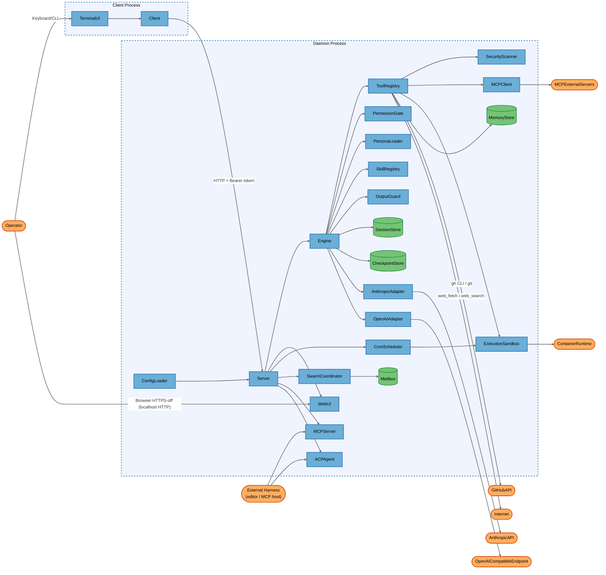
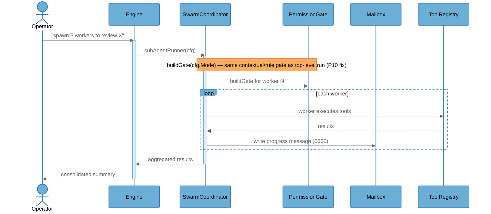

# Architecture Overview

## System Purpose

Aegis is a single Go binary that operates as an AI coding/security agent with a daemon + client architecture. A local daemon (`aegis serve`, or auto-started in-process by the TUI) owns sessions, the LLM provider adapter, a 39+ tool registry, and runs an agent loop over a local HTTP API with SSE streaming; a Bubbletea terminal UI (or an embedded browser UI at `/ui`) connects to it as a client. It targets individual developers and security engineers who want an extensible, tool-using LLM agent — with built-in security scanning, sub-agent swarms, multi-agent debate, MCP client/server integration, and editor integration (ACP) — running on their own workstation against local or cloud LLMs.

## Key Components

| Component | Type | Description |
|-----------|------|-------------|
| TerminalUI | Process | Bubbletea terminal client; renders streamed turns, dialogs, approvals |
| Client | Process | HTTP client wrapper used by TerminalUI/CLI to call the daemon, holds the bearer auth token |
| Server | Process | Daemon HTTP API; wires sessions, tools, permissions, personas, swarm, MCP, cron, checkpoints |
| WebUI | Process | Embedded browser UI served at `/ui` (Preact/Vite SPA, `dist/` committed) |
| Engine | Process | Core agent loop: model calls, tool dispatch, compaction, output guard, loop detection, budget |
| ToolRegistry | Process | Registry of 39+ built-in tools (shell, git/git-pr, web fetch/search, LSP, security scan, memory, diagram, etc.) |
| PermissionGate | Process | Capability gate (read/write/execute/network/spawn), contextual egress gate, text allow/deny rule engine, advisory persona tool gate |
| PersonaLoader | Process | Loads/hot-reloads built-in and project/user persona `.md` files (system prompt, model, mode, tools, rules, guard overrides) |
| SkillRegistry | Process | Progressive-disclosure skill loader: project/user `.md` skills + binary-embedded built-in skills |
| OutputGuard | Process | Optional second model pass validating final output against a rubric/JSON schema |
| SecurityScanner | Process | Wraps external SAST/SCA/DAST tools (semgrep, trivy, grype, kubescape, hadolint, ZAP, etc.) for `/scan` and the `security_scan` tool |
| CronScheduler | Process | SQLite-backed scheduler that fires background shell/tool jobs unattended |
| SwarmCoordinator | Process | Spawns sub-agents as goroutines (in-process) or OS subprocesses; adaptive concurrency limiter |
| MCPClient | Process | Aegis acting as an MCP client (stdio + HTTP/SSE) to external MCP servers; wraps all returned content in an untrusted-provenance marker |
| MCPServer | Process | `aegis mcp-serve` — exposes Aegis sessions as MCP tools (`aegis_prompt`, `aegis_new_session`, `aegis_list_sessions`) to other MCP-speaking harnesses, over stdio |
| ACPAgent | Process | ACP JSON-RPC server (stdio) for editor integrations (Zed, Neovim) |
| ExecutionSandbox | Process | Pluggable exec backend: local shell, Docker, Podman, WSL, Apple Containers; auto-detects and can fall back to local execution |
| ConfigLoader | Process | Layered config (defaults → user config → project config → env vars); loads `.aegis/.env` secrets, redacts API keys on debug print paths |
| AnthropicAdapter | Process | `provider.Adapter` implementation streaming to the Anthropic Messages API |
| OpenAIAdapter | Process | `provider.Adapter` implementation streaming to an OpenAI-compatible endpoint (cloud OpenAI or local Ollama) |
| SessionStore | Data Store | SQLite database of conversations, turn traces, and cost, on local disk |
| CheckpointStore | Data Store | Per-turn file snapshots enabling `/rewind` |
| MemoryStore | Data Store | Project-level and user-level persistent memory files with relevance scoring |
| Mailbox | Data Store | File-based inter-agent mailbox for swarm messaging |
| AnthropicAPI | External Service | Anthropic's cloud Messages API |
| OpenAICompatibleEndpoint | External Service | Cloud OpenAI API or a local Ollama server, selected by configuration |
| MCPExternalServers | External Service | Third-party MCP servers Aegis connects out to as a client |
| GitHubAPI | External Service | Reached indirectly through the `gh` CLI / git credential helper for PR creation |
| Internet | External Service | Arbitrary HTTP(S) targets reached by the web-fetch/web-search tools |
| ContainerRuntime | External Service | Local Docker/Podman/WSL/Apple Containers engine the sandbox execs into |
| Operator | External Interactor | The developer/administrator using the CLI, TUI, or web UI |
| ExternalHarness | External Interactor | An editor (via ACP) or another MCP-speaking harness connecting to MCPServer/ACPAgent |

## Component Diagram



## Top Scenarios

### Scenario 1: Interactive chat turn with tool execution and approval

Operator sends a prompt from the TUI. The daemon streams the model response, and when the model calls a write/execute-capability tool (e.g. shell), the PermissionGate either allows, denies, or (in `build` mode) requests interactive approval before the ExecutionSandbox runs the command and the result streams back.

```mermaid
%%{init: {'theme': 'base', 'themeVariables': {
  'background': '#ffffff',
  'actorBkg': '#6baed6', 'actorBorder': '#2171b5', 'actorTextColor': '#000000',
  'signalColor': '#666666', 'signalTextColor': '#666666',
  'noteBkgColor': '#fdae61', 'noteBorderColor': '#d94701', 'noteTextColor': '#000000',
  'activationBkgColor': '#ddeeff', 'activationBorderColor': '#2171b5'
}}}%%
sequenceDiagram
    actor Operator
    participant TerminalUI as TerminalUI
    participant Server as Server
    participant Engine as Engine
    participant PermissionGate as PermissionGate
    participant ExecutionSandbox as ExecutionSandbox
    participant AnthropicAdapter as AnthropicAdapter

    Operator->>TerminalUI: Type prompt
    TerminalUI->>Server: POST /sessions/{id}/messages (Bearer token)
    activate Server
    Server->>Engine: Run turn
    activate Engine
    Engine->>AnthropicAdapter: Stream request
    AnthropicAdapter-->>Engine: tool_use: shell("...")
    Engine->>PermissionGate: Decide(capability=execute)
    Note over PermissionGate: build mode -> ask; auto mode -> allow
    PermissionGate-->>Engine: approval required
    Engine-->>Server: SSE approval_request
    Server-->>TerminalUI: SSE approval_request
    TerminalUI-->>Operator: Approve? (y/n)
    Operator->>TerminalUI: Approve
    TerminalUI->>Server: POST /approvals/{id}
    Server->>Engine: resume
    Engine->>ExecutionSandbox: Exec(command)
    ExecutionSandbox-->>Engine: stdout/stderr
    Engine->>AnthropicAdapter: continue stream with tool_result
    AnthropicAdapter-->>Engine: final text
    Engine-->>Server: SSE text deltas
    Server-->>TerminalUI: SSE text deltas
    deactivate Engine
    deactivate Server
    TerminalUI-->>Operator: Render response
```

### Scenario 2: Sub-agent swarm delegation

The Engine spawns sub-agents through the SwarmCoordinator to parallelize a workflow. Sub-agents run with the same permission/contextual gate stack as the parent (post-P10 fix) and exchange progress via the file-based Mailbox.



### Scenario 3: External MCP tool call with trust-boundary wrapping

The Engine invokes a tool exposed by a third-party MCP server. MCPClient always wraps the returned content in a `<mcp_untrusted_output>` provenance marker before it re-enters the model's context; an opt-in heuristic scan can additionally flag suspicious content.

```mermaid
%%{init: {'theme': 'base', 'themeVariables': {
  'background': '#ffffff',
  'actorBkg': '#6baed6', 'actorBorder': '#2171b5', 'actorTextColor': '#000000',
  'signalColor': '#666666', 'signalTextColor': '#666666',
  'noteBkgColor': '#fdae61', 'noteBorderColor': '#d94701', 'noteTextColor': '#000000',
  'activationBkgColor': '#ddeeff', 'activationBorderColor': '#2171b5'
}}}%%
sequenceDiagram
    actor Operator
    participant Engine as Engine
    participant MCPClient as MCPClient
    participant MCPExternalServers as MCPExternalServers

    Operator->>Engine: prompt requiring external MCP tool
    activate Engine
    Engine->>MCPClient: CallTool(server, name, args)
    activate MCPClient
    MCPClient->>MCPExternalServers: tools/call (stdio or HTTPS/SSE)
    MCPExternalServers-->>MCPClient: result content
    Note over MCPClient: wrapUntrusted() always marks content untrusted;<br/>scan_output (opt-in) appends [SECURITY WARNING] banner
    MCPClient-->>Engine: <mcp_untrusted_output>...</mcp_untrusted_output>
    deactivate MCPClient
    Engine-->>Operator: response grounded in marked content
    deactivate Engine
```

### Scenario 4: Web UI session access via page-token exchange

A browser navigates to `GET /ui`. The Server mints a single-use, 60-second page token and substitutes it into the served HTML instead of the real daemon bearer token; the frontend immediately redeems it at `POST /auth/exchange` for the real token used on all subsequent calls.

### Scenario 5: Unattended cron job execution

An Operator (via a tool call, in an earlier session) registers a shell command as a scheduled job. CronScheduler fires it at the scheduled time and runs it straight through ExecutionSandbox with only a wall-clock timeout — no interactive approval gate exists for scheduled firings, unlike the equivalent interactive chat-turn tool call in Scenario 1.

## Technology Stack

| Layer | Technologies |
|-------|--------------|
| Languages | Go 1.26, TypeScript (embedded web UI frontend) |
| Frameworks | Bubbletea/Lipgloss/Bubbles/Glamour/Huh v2 (TUI), Preact + Vite (WebUI), Cobra (CLI), koanf (layered config) |
| Data Stores | SQLite (`modernc.org/sqlite`) for sessions and cron jobs; flat files for checkpoints, memory, and swarm mailboxes |
| Infrastructure | Single static binary; optional Docker/Podman/WSL/Apple Containers as pluggable exec sandbox backends |
| Security | Bearer-token daemon auth with constant-time comparison, per-OS token-file ACL hardening, origin/DNS-rebinding guard, capability-based tool gating, contextual egress gate, text allow/deny rule engine, MCP untrusted-output provenance wrapping, output guard (second-model-pass validation), env-strip before shell exec, SSRF-safe HTTP dialer |

## Deployment Model

Aegis ships as a single binary that runs in one of several modes on a single developer workstation: (1) `aegis` with no subcommand — a TUI client that auto-starts an embedded daemon in the same OS process if none is reachable; (2) `aegis serve` — a standalone daemon process that one or more clients (TUI, web browser, `aegis` CLI subcommands) connect to over HTTP; (3) `aegis mcp-serve` / ACP mode — stdio-only integrations for other local harnesses (MCP hosts, editors). The daemon listens by default on `127.0.0.1:4127` (`server.addr` config key, `internal/config/config.go`), guarded by a random 32-byte bearer token written to `daemon.token` in the data directory (`0o600` POSIX, hardened DACL on Windows) and an `Origin` check that rejects any non-loopback origin. `server.addr` is operator-configurable and nothing in `internal/server/server.go` validates or warns if it is changed to a non-loopback address (see FIND for this gap) — the safe behavior is a documented default, not an enforced invariant. There is no Kubernetes/container deployment manifest in the repository; the optional Docker/Podman/WSL/Apple Containers integration is an *outbound* execution sandbox the daemon uses for running tool commands, not a deployment target for Aegis itself.

**Deployment Classification:** `LOCALHOST_SERVICE`

### Component Exposure Table

| Component | Listens On | Auth Required | Reachability | Min Prerequisite | Derived Tier |
|-----------|------------|---------------|--------------|------------------|-------------|
| TerminalUI | N/A — no listener | N/A | No Listener | Host/OS Access | T3 |
| Client | N/A — no listener | N/A | No Listener | Host/OS Access | T3 |
| Server | 127.0.0.1:4127 (default; configurable) | Yes (Bearer token, constant-time compare) | Localhost Only | Local Process Access | T2 |
| WebUI | Served via Server at `/ui`, `/ui/*`, `/auth/exchange` | No (pre-auth page-token mint/exchange by design) | Localhost Only | Local Process Access | T2 |
| Engine | N/A — no listener | N/A | No Listener | Local Process Access | T2 |
| ToolRegistry | N/A — no listener | N/A | No Listener | Local Process Access | T2 |
| PermissionGate | N/A — no listener | N/A | No Listener | Local Process Access | T2 |
| PersonaLoader | N/A — no listener | N/A | No Listener | Local Process Access | T2 |
| SkillRegistry | N/A — no listener | N/A | No Listener | Local Process Access | T2 |
| OutputGuard | N/A — no listener | N/A | No Listener | Local Process Access | T2 |
| SecurityScanner | N/A — no listener | N/A | No Listener | Local Process Access | T2 |
| CronScheduler | N/A — no listener (fires internally on schedule) | N/A | No Listener | Local Process Access | T2 |
| SwarmCoordinator | N/A — no listener | N/A | No Listener | Local Process Access | T2 |
| MCPClient | N/A — outbound only | N/A | No Listener | Local Process Access | T2 |
| MCPServer | stdio (subprocess spawned by caller) | No | Localhost Only | Local Process Access | T2 |
| ACPAgent | stdio (subprocess spawned by editor) | No (auth handshake is a stub) | Localhost Only | Local Process Access | T2 |
| ExecutionSandbox | N/A — no listener (execs locally or via container engine) | N/A | No Listener | Local Process Access | T2 |
| ConfigLoader | N/A — no listener | N/A | No Listener | Host/OS Access | T3 |
| AnthropicAdapter | N/A — outbound only | N/A | No Listener | Local Process Access | T2 |
| OpenAIAdapter | N/A — outbound only | N/A | No Listener | Local Process Access | T2 |
| SessionStore | N/A — local file | N/A | No Listener | Host/OS Access | T3 |
| CheckpointStore | N/A — local file | N/A | No Listener | Host/OS Access | T3 |
| MemoryStore | N/A — local file | N/A | No Listener | Host/OS Access | T3 |
| Mailbox | N/A — local file | N/A | No Listener | Host/OS Access | T3 |
| AnthropicAPI | Cloud (Anthropic-operated) | Yes (API key) | External | Internal Network | T2 |
| OpenAICompatibleEndpoint | Cloud or local (config-selected) | Depends on config (key or none for local Ollama) | External | Internal Network | T2 |
| MCPExternalServers | Operator-configured (stdio or remote HTTP/SSE) | Depends on server | External | Internal Network | T2 |
| GitHubAPI | Cloud (GitHub-operated) | Yes (via `gh`/git credential helper) | External | Internal Network | T2 |
| Internet | Arbitrary | Varies | External | Internal Network | T2 |
| ContainerRuntime | Local Docker/Podman/WSL/Apple Containers socket | OS-level (socket permissions) | Localhost Only | Local Process Access | T2 |

## Security Infrastructure Inventory

| Component | Security Role | Configuration | Notes |
|-----------|---------------|---------------|-------|
| Bearer token auth (`internal/server/auth.go`) | Authenticates every daemon API call except `/healthz`, `/ui`, `/ui/*`, `/auth/exchange` | 32-byte random token, constant-time compare, `0o600` + Windows protected-DACL | Always non-empty at startup; empty-token path defensively rejected |
| Origin/DNS-rebinding guard (`originMiddleware`) | Rejects any request whose `Origin` header is not loopback | Applied to all daemon routes | Mitigates browser-based DNS rebinding against the local daemon |
| Page-token exchange (P15.12, `mintPageToken`/`exchangePageToken`) | Prevents the real daemon token from ever appearing in `/ui` HTML | Single-use, 60s TTL | Closes the "token readable from page source" gap |
| PermissionGate capability model (`internal/permission`) | Gates read/write/execute/network/spawn per tool call by mode (plan/build/auto) | plan=read-only, build=ask on execute, auto=allow all | Base layer beneath rules/contextual gates |
| Text allow/deny rule engine (`internal/permission/rules.go`) | Fine-grained per-tool allow/deny patterns; deny always wins | Shell-metacharacter-restricted glob for execute allow rules; warns on unmatchable/no-op rules | Closes prior "rule bypass via `&&`/`|`" and "silent no-op deny rule" gaps |
| Contextual egress gate (`internal/permission/contextual.go`) | Enforces egress-then-write / network allow-list policies | Config-driven (`Security.EgressThenWrite`, `NetworkAllowList`) | Applied uniformly to top-level runs and sub-agents post-P10 fix |
| PersonaToolGate (`internal/permission/persona_tools.go`) | Advisory-only warn/ask on tool calls outside a persona's declared `Tools` | Never blocks; real enforcement is the gates above | By design — documented as advisory |
| Persona mode/rule escalation guard (`internal/server/sessions.go`) | Prevents a loaded persona from raising a session's permission mode or injecting extra allow rules | `resolveSessionMode`, `filterPersonaRules`; built-ins (`Loaded=false`) bypass by design | Regression-tested |
| SSRF-safe HTTP dialer (`internal/tool/builtin/web.go`) | Blocks the web-fetch/web-search tools from reaching loopback/RFC1918/link-local/cloud-metadata addresses, including on redirect | DNS-then-IP validation, 5-hop redirect cap | Covers `169.254.169.254` metadata endpoint |
| Env-strip before shell exec (`internal/sandbox/local.go`) | Removes provider API keys from the environment passed to shell/tool subprocesses | `filteredEnv`/`stripEnv` | Limits credential exfiltration via the shell tool |
| MCP untrusted-output provenance marker (`internal/mcp/trust.go`) | Always-on wrapping of MCP tool/resource/prompt output as untrusted; opt-in heuristic injection scan | `scan_output` per-server config | Framing/defense-in-depth, not a filter |
| Sandbox strict/fallback warning (`internal/server/server.go` `SelectSandbox`) | Hard-fails or warns when the configured container backend is unavailable and execution falls back to local/unsandboxed | `cfg.Strict` | Surfaced via `/healthz` |
| Sub-agent gate parity (P10 fix, `subAgentRunner`/`executeWorker`) | Sub-agents (in-process or subprocess) get the same contextual/rule gate, env-strip, sandbox, and shared budget tracker as the parent | Regression-tested (`TestSubAgentRunnerAppliesOperatorDenyRule`) | Closes the prior gate-bypass gap |
| Output guard fail-open/fail-closed split (`internal/guard/guard.go`) | Transport errors fail open (availability); ambiguous/unparseable verdicts fail closed | Deliberate design | Documented in package comment |
| Bundle content hash (`internal/bundle/bundle.go`) | SHA-256 trust-on-first-use pin for installed skill/persona bundles | Opt-in `--expect-sha256` | Detects change, does not establish provenance |
| Rewind serialization (`internal/server/sessions.go` `handleRewind`) | Prevents an in-flight turn from reviving truncated content during `/rewind` | Same per-session semaphore as message posting | Regression-tested |
| Security scan target allow-list (`internal/security/target.go`) | Restricts DAST/network scan targets to loopback/RFC1918 or an explicit allow-list, matched as literal strings (no DNS resolution) | `isHostAllowed` | Prevents TOCTOU identity changes on scan targets |

## Repository Structure

| Directory | Purpose |
|-----------|---------|
| `cmd/aegis/` | Binary entry point |
| `internal/cli/` | Cobra subcommands (serve, chat, mcpserve, acp, scan, sandbox, persona, skills, cron, security, ...) |
| `internal/server/` | Daemon HTTP API: auth, sessions, runs/SSE, webui, scan, knowledge, repomap, debate |
| `internal/engine/` | Core agent loop, loop detection |
| `internal/provider/` | `Adapter` interface + Anthropic and OpenAI-compatible implementations |
| `internal/session/` | SQLite-backed session store |
| `internal/tool/` | Tool interface, registry, capability model |
| `internal/tool/builtin/` | 39+ built-in tools (shell, git, gitpr, web, lsp, security, memory, diagram, cron, agent, team, ...) |
| `internal/permission/` | Capability gate, contextual gate, rule engine, persona tool gate |
| `internal/persona/` | Persona loading/hot-reload; `internal/persona/builtin/*.md` embedded built-ins |
| `internal/skills/` | Skill loading, progressive disclosure, `internal/skills/builtin/` embedded skills |
| `internal/swarm/` | Sub-agent spawning (in-process/subprocess), mailbox, adaptive concurrency |
| `internal/debate/` | Multi-agent-debate primitive |
| `internal/mcp/` | MCP client (stdio + HTTP/SSE), trust-boundary wrapping |
| `internal/mcpserver/` | `aegis mcp-serve` — Aegis-as-MCP-server |
| `internal/acp/` | ACP JSON-RPC server for editor integrations |
| `internal/sandbox/` | Pluggable execution sandbox backends |
| `internal/security/` | SAST/SCA/DAST tool wrappers, baseline suppression, target allow-list |
| `internal/checkpoint/` | Per-turn restore points |
| `internal/memory/` | Project/user persistent memory |
| `internal/cron/` | Background job scheduler |
| `internal/config/` | Layered configuration, secret loading |
| `internal/tui/` | Bubbletea terminal UI |
| `internal/server/webui/frontend/` | Preact/Vite web UI source; `dist/` is committed and embedded |
| `internal/bundle/` | Skill/persona bundle content hashing |
| `docs/` | User-facing documentation, including `mcp-trust-boundary.md` |
