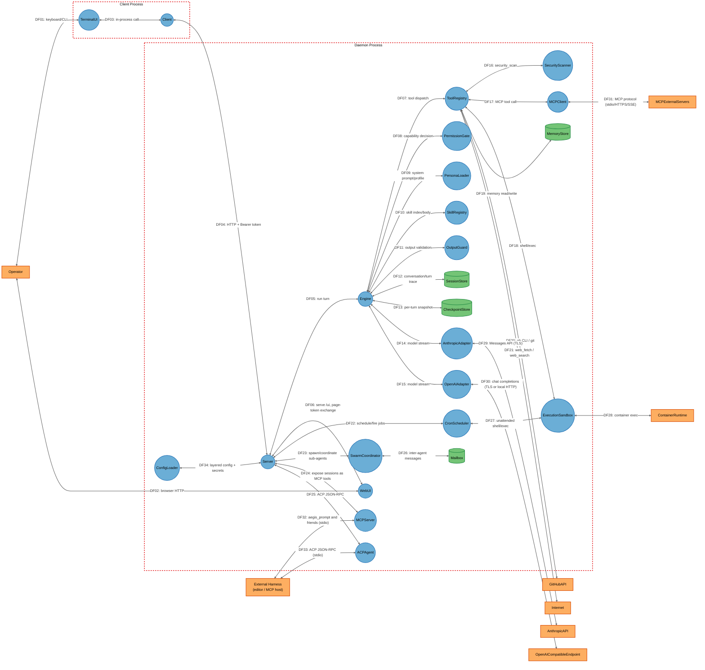

# Threat Model

## Data Flow Diagram

## Element Table

| Element | Type | TMT Category | Description | Trust Boundary |
|---------|------|--------------|-------------|----------------|
| TerminalUI | Process | SE.P.TMCore.ThickClient | Bubbletea terminal client | ClientProc |
| Client | Process | SE.P.TMCore.OSProcess | HTTP client wrapper holding the bearer token | ClientProc |
| Server | Process | SE.P.TMCore.WebSvc | Daemon HTTP API / SSE streaming | DaemonProc |
| WebUI | Process | SE.P.TMCore.WebServer | Embedded browser UI at `/ui` | DaemonProc |
| Engine | Process | SE.P.TMCore.OSProcess | Core agent loop | DaemonProc |
| ToolRegistry | Process | SE.P.TMCore.OSProcess | 39+ built-in tools (shell, git, web, lsp, ...) | DaemonProc |
| PermissionGate | Process | SE.P.TMCore.OSProcess | Capability/contextual/rule-based authorization | DaemonProc |
| PersonaLoader | Process | SE.P.TMCore.OSProcess | Persona `.md` loader/hot-reload | DaemonProc |
| SkillRegistry | Process | SE.P.TMCore.OSProcess | Skill `.md` / embedded skill loader | DaemonProc |
| OutputGuard | Process | SE.P.TMCore.OSProcess | Second-model-pass output validation | DaemonProc |
| SecurityScanner | Process | SE.P.TMCore.OSProcess | SAST/SCA/DAST tool wrapper | DaemonProc |
| CronScheduler | Process | SE.P.TMCore.OSProcess | Unattended scheduled job runner | DaemonProc |
| SwarmCoordinator | Process | SE.P.TMCore.OSProcess | Sub-agent spawning/coordination | DaemonProc |
| MCPClient | Process | SE.P.TMCore.NetApp | Outbound MCP client (stdio/HTTP/SSE) | DaemonProc |
| MCPServer | Process | SE.P.TMCore.WebSvc | `aegis mcp-serve` tool-callable API over stdio | DaemonProc |
| ACPAgent | Process | SE.P.TMCore.WebSvc | ACP JSON-RPC API over stdio | DaemonProc |
| ExecutionSandbox | Process | SE.P.TMCore.OSProcess | Pluggable exec backend (local/Docker/Podman/WSL/Apple) | DaemonProc |
| ConfigLoader | Process | SE.P.TMCore.OSProcess | Layered config + secret loading | DaemonProc |
| AnthropicAdapter | Process | SE.P.TMCore.NetApp | Anthropic Messages API client | DaemonProc |
| OpenAIAdapter | Process | SE.P.TMCore.NetApp | OpenAI-compatible API client | DaemonProc |
| SessionStore | Data Store | SE.DS.TMCore.SQL | SQLite conversations/turn traces/cost | DaemonProc |
| CheckpointStore | Data Store | SE.DS.TMCore.FS | Per-turn file snapshots | DaemonProc |
| MemoryStore | Data Store | SE.DS.TMCore.FS | Project/user persistent memory files | DaemonProc |
| Mailbox | Data Store | SE.DS.TMCore.FS | File-based swarm inter-agent mailbox | DaemonProc |
| AnthropicAPI | External Interactor | SE.EI.TMCore.WebSvc | Anthropic's cloud Messages API | None (external) |
| OpenAICompatibleEndpoint | External Interactor | SE.EI.TMCore.WebSvc | Cloud OpenAI API or local Ollama | None (external) |
| MCPExternalServers | External Interactor | SE.EI.TMCore.WebSvc | Third-party MCP servers | None (external) |
| GitHubAPI | External Interactor | SE.EI.TMCore.WebSvc | GitHub, reached via `gh`/git credential helper | None (external) |
| Internet | External Interactor | SE.EI.TMCore.WebSvc | Arbitrary web-fetch/search targets | None (external) |
| ContainerRuntime | External Interactor | SE.EI.TMCore.WebSvc | Local Docker/Podman/WSL/Apple Containers engine | None (external) |
| Operator | External Interactor | SE.EI.TMCore.User | Developer/administrator | None (external) |
| ExternalHarness | External Interactor | SE.EI.TMCore.WebApp | Editor (ACP) or MCP-speaking harness | None (external) |

## Data Flow Table

| ID | Source | Target | Protocol | Description |
|----|--------|--------|----------|-------------|
| DF01 | Operator | TerminalUI | Keyboard/TTY | Interactive prompts and rendered output |
| DF02 | Operator | WebUI | HTTP (localhost) | Browser-based session interaction |
| DF03 | TerminalUI | Client | In-process call | TUI delegates API calls to the HTTP client |
| DF04 | Client | Server | HTTP + Bearer token | All daemon API calls (sessions, messages, approvals) |
| DF05 | Server | Engine | In-process call | Daemon dispatches a turn to the agent loop |
| DF06 | Server | WebUI | In-process call | Serves `/ui`, mints/exchanges page tokens |
| DF07 | Engine | ToolRegistry | In-process call | Dispatches model-requested tool calls |
| DF08 | Engine | PermissionGate | In-process call | Requests an allow/deny/ask decision per tool call |
| DF09 | Engine | PersonaLoader | In-process call | Retrieves active persona's system prompt/profile |
| DF10 | Engine | SkillRegistry | In-process call | Retrieves skill index and on-demand skill bodies |
| DF11 | Engine | OutputGuard | In-process call | Optional second-pass validation of final output |
| DF12 | Engine | SessionStore | SQL (local file) | Persists/reads conversation, turn traces, cost |
| DF13 | Engine | CheckpointStore | File I/O | Captures/restores per-turn file snapshots |
| DF14 | Engine | AnthropicAdapter | In-process call | Streams model requests/responses |
| DF15 | Engine | OpenAIAdapter | In-process call | Streams model requests/responses |
| DF16 | ToolRegistry | SecurityScanner | In-process call | Invokes SAST/SCA/DAST scans |
| DF17 | ToolRegistry | MCPClient | In-process call | Invokes tools/resources/prompts on external MCP servers |
| DF18 | ToolRegistry | ExecutionSandbox | In-process call | Executes shell/exec-capability tool calls |
| DF19 | ToolRegistry | MemoryStore | File I/O | Reads/writes persistent memory entries |
| DF20 | ToolRegistry | GitHubAPI | HTTPS (via `gh`/git) | Pushes branches, opens pull requests |
| DF21 | ToolRegistry | Internet | HTTP/HTTPS | `web_fetch`/`web_search` outbound requests |
| DF22 | Server | CronScheduler | In-process call | Registers/fires scheduled jobs |
| DF23 | Server | SwarmCoordinator | In-process call | Spawns and coordinates sub-agents |
| DF24 | Server | MCPServer | In-process call | Wires session access into `aegis mcp-serve` |
| DF25 | Server | ACPAgent | In-process call | Wires session access into the ACP server |
| DF26 | SwarmCoordinator | Mailbox | File I/O | Inter-agent progress/result messages |
| DF27 | CronScheduler | ExecutionSandbox | In-process call | Runs a due job's shell command unattended |
| DF28 | ExecutionSandbox | ContainerRuntime | Unix/named-pipe socket | Container-backed command execution |
| DF29 | AnthropicAdapter | AnthropicAPI | HTTPS (TLS) | Streamed Messages API requests |
| DF30 | OpenAIAdapter | OpenAICompatibleEndpoint | HTTPS (TLS) or local HTTP | Streamed chat-completions requests |
| DF31 | MCPClient | MCPExternalServers | stdio / HTTPS / SSE | MCP protocol tool/resource/prompt calls |
| DF32 | ExternalHarness | MCPServer | stdio | `aegis_prompt`, `aegis_new_session`, `aegis_list_sessions` |
| DF33 | ExternalHarness | ACPAgent | stdio | ACP JSON-RPC editor integration |
| DF34 | ConfigLoader | Server | In-process call | Supplies layered config and env/`.env`-sourced secrets at startup |

## Trust Boundary Table

| Boundary | Description | Contains |
|----------|-------------|----------|
| ClientProc | The operator-facing process (TUI/CLI) that holds the daemon's bearer token and issues authenticated HTTP calls | TerminalUI, Client |
| DaemonProc | The daemon process (standalone `aegis serve` or embedded in the TUI process) that owns sessions, tools, and all outbound integrations | Server, WebUI, Engine, ToolRegistry, PermissionGate, PersonaLoader, SkillRegistry, OutputGuard, SecurityScanner, CronScheduler, SwarmCoordinator, MCPClient, MCPServer, ACPAgent, ExecutionSandbox, ConfigLoader, AnthropicAdapter, OpenAIAdapter, SessionStore, CheckpointStore, MemoryStore, Mailbox |

## Summary View

```mermaid
%%{init: {'theme': 'base', 'themeVariables': { 'background': '#ffffff', 'primaryColor': '#ffffff', 'lineColor': '#666666' }}}%%
flowchart LR
    classDef process fill:#6baed6,stroke:#2171b5,stroke-width:2px,color:#000000
    classDef external fill:#fdae61,stroke:#d94701,stroke-width:2px,color:#000000
    classDef datastore fill:#74c476,stroke:#238b45,stroke-width:2px,color:#000000

    Operator["Operator"]:::external
    ExternalHarness["External Harness<br/>(editor / MCP host)"]:::external
    AnthropicAPI["AnthropicAPI"]:::external
    OpenAICompatibleEndpoint["OpenAICompatibleEndpoint"]:::external
    MCPExternalServers["MCPExternalServers"]:::external
    OutboundIntegrations["Outbound Integrations<br/>(GitHubAPI, Internet, ContainerRuntime)"]:::external

    subgraph ClientProc["Client Process"]
        TerminalUI(("TerminalUI")):::process
        Client(("Client")):::process
    end

    subgraph DaemonProc["Daemon Process"]
        Server(("Server")):::process
        WebUI(("WebUI")):::process
        Engine(("Engine")):::process
        ToolRegistry(("ToolRegistry")):::process
        PermissionGate(("PermissionGate")):::process
        ProviderAdapters(("Provider Adapters<br/>(AnthropicAdapter, OpenAIAdapter)")):::process
        MCPClient(("MCPClient")):::process
        MCPServer(("MCPServer")):::process
        ACPAgent(("ACPAgent")):::process
        ExecutionSandbox(("ExecutionSandbox")):::process
        BackgroundAndScanServices(("Background &amp; Scan Services<br/>(CronScheduler, SwarmCoordinator, SecurityScanner)")):::process
        AgentSupportServices(("Agent Support Services<br/>(PersonaLoader, SkillRegistry, OutputGuard, ConfigLoader)")):::process
        SessionStore[("SessionStore")]:::datastore
        SupportingDataStores[("Supporting Data Stores<br/>(CheckpointStore, MemoryStore, Mailbox)")]:::datastore
    end

    Operator <-->|"SDF01: keyboard/CLI + browser"| TerminalUI
    Operator <-->|"SDF01: keyboard/CLI + browser"| WebUI
    TerminalUI <-->|"SDF02: in-process call"| Client
    Client <-->|"SDF03: HTTP + Bearer token"| Server
    Server <-->|"SDF04: run turn"| Engine
    Server <-->|"SDF05: serve /ui, page-token exchange"| WebUI
    Engine <-->|"SDF06: tool dispatch"| ToolRegistry
    Engine <-->|"SDF07: capability decision"| PermissionGate
    Engine <-->|"SDF08: model stream"| ProviderAdapters
    Engine <-->|"SDF09: session/turn/checkpoint state"| SessionStore
    Engine <-->|"SDF09: session/turn/checkpoint state"| SupportingDataStores
    Engine <-->|"SDF10: support services (persona/skill/guard/config)"| AgentSupportServices
    ToolRegistry <-->|"SDF11: MCP tool call"| MCPClient
    ToolRegistry <-->|"SDF12: shell/exec"| ExecutionSandbox
    ToolRegistry <-->|"SDF13: outbound tool calls"| OutboundIntegrations
    ToolRegistry <-->|"SDF14: background/scan services"| BackgroundAndScanServices
    Server <-->|"SDF15: expose sessions as MCP tools"| MCPServer
    Server <-->|"SDF16: ACP JSON-RPC"| ACPAgent
    BackgroundAndScanServices <-->|"SDF17: unattended shell/exec"| ExecutionSandbox
    BackgroundAndScanServices <-->|"SDF18: mailbox messaging"| SupportingDataStores
    ExecutionSandbox <-->|"SDF19: container exec"| OutboundIntegrations
    ProviderAdapters <-->|"SDF20: LLM API (TLS or local HTTP)"| AnthropicAPI
    ProviderAdapters <-->|"SDF20: LLM API (TLS or local HTTP)"| OpenAICompatibleEndpoint
    MCPClient <-->|"SDF21: MCP protocol"| MCPExternalServers
    ExternalHarness <-->|"SDF22: stdio integrations"| MCPServer
    ExternalHarness <-->|"SDF22: stdio integrations"| ACPAgent

    style ClientProc fill:none,stroke:#e31a1c,stroke-width:3px,stroke-dasharray: 5 5
    style DaemonProc fill:none,stroke:#e31a1c,stroke-width:3px,stroke-dasharray: 5 5

    linkStyle default stroke:#666666,stroke-width:2px
```

## Summary to Detailed Mapping

| Summary Element | Contains | Summary Flows | Maps to Detailed Flows |
|-----------------|----------|---------------|------------------------|
| ProviderAdapters | AnthropicAdapter, OpenAIAdapter | SDF08, SDF20 | DF14, DF15, DF29, DF30 |
| BackgroundAndScanServices | CronScheduler, SwarmCoordinator, SecurityScanner | SDF14, SDF17, SDF18 | DF16, DF22, DF23, DF26, DF27 |
| AgentSupportServices | PersonaLoader, SkillRegistry, OutputGuard, ConfigLoader | SDF10 | DF09, DF10, DF11, DF34 |
| SupportingDataStores | CheckpointStore, MemoryStore, Mailbox | SDF09, SDF18 | DF13, DF19, DF26 |
| OutboundIntegrations | GitHubAPI, Internet, ContainerRuntime | SDF13, SDF19 | DF20, DF21, DF28 |
