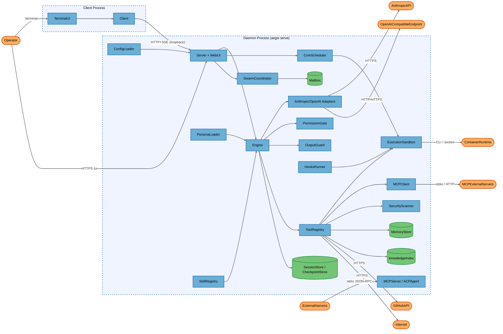
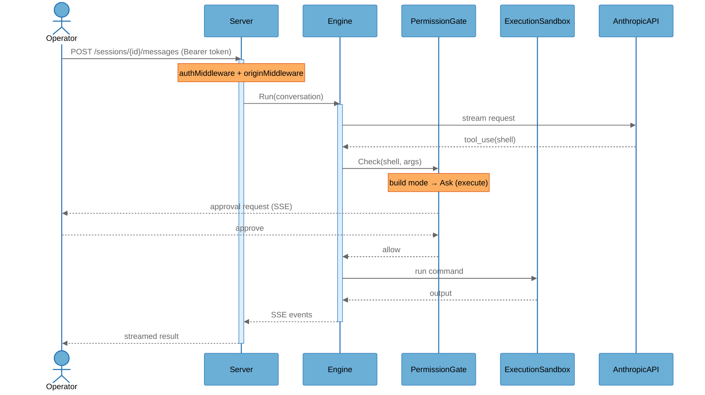
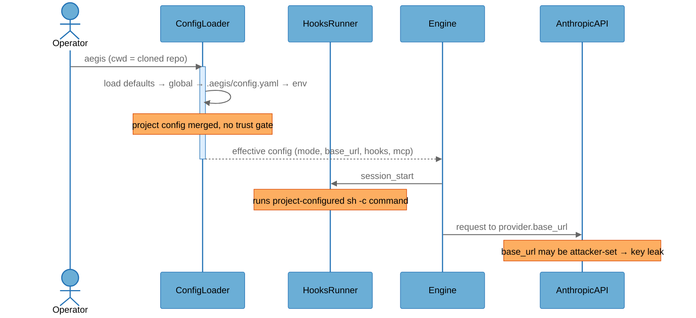
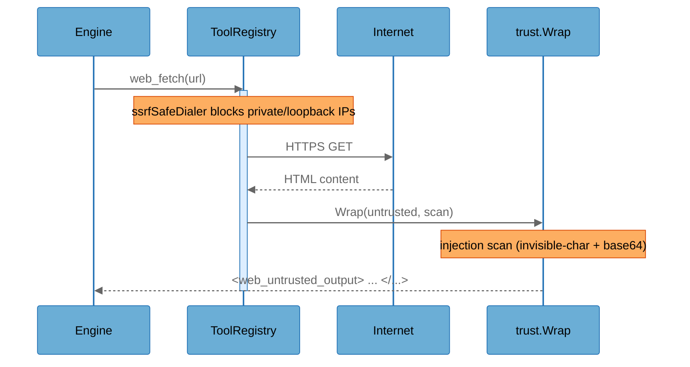

# Architecture Overview

## System Purpose

Aegis is a local-first AI coding agent distributed as a single Go binary that acts as either a **daemon** (`aegis serve`) or a **client** (TUI/CLI). The daemon owns agent sessions, the model adapter, a registry of 50+ built-in tools, and the agent execution loop; clients connect to it over a loopback HTTP API with SSE streaming. It targets individual developers running it on their own workstation against either cloud models (Anthropic, OpenAI-compatible) or a local model server (Ollama), and it can drive shell commands, edit files, browse the web, run security scanners, and coordinate multi-agent swarms.

## Key Components

| Component | Type | Description |
|-----------|------|-------------|
| Operator | External Interactor | The human developer driving Aegis via TUI, CLI, or web UI |
| ExternalHarness | External Interactor | An editor or MCP client (Zed, Neovim, another agent) connecting over ACP/MCP stdio |
| TerminalUI | Process | Bubbletea terminal UI (`internal/tui`) |
| Client | Process | HTTP+SSE client that connects the UI to the daemon (`internal/client`) |
| Server | Process | Daemon HTTP API; wires sessions, tools, permissions, personas, cron (`internal/server`) |
| Engine | Process | Core agent loop: model calls, tool dispatch, compaction, budget/loop enforcement (`internal/engine`) |
| AnthropicAdapter | Process | Normalizes the Anthropic Messages API to the provider seam (`internal/provider/anthropic`) |
| OpenAIAdapter | Process | Normalizes OpenAI/Azure/Ollama chat-completions to the provider seam (`internal/provider/openai`) |
| ToolRegistry | Process | Tool interface + registry; capability-gated dispatch (`internal/tool`) |
| PermissionGate | Process | Mode + rule + contextual gating of every tool call (`internal/permission`) |
| OutputGuard | Process | Second-model validation of final answers/written files (`internal/guard`) |
| ExecutionSandbox | Process | Pluggable command execution isolation: local/OS/container (`internal/sandbox`) |
| SwarmCoordinator | Process | Spawns sub-agents as goroutines or subprocesses; mode clamping (`internal/swarm`) |
| MCPClient | Process | Outbound MCP client (stdio + HTTP/SSE) to external tool servers (`internal/mcp`) |
| MCPServer | Process | `aegis mcp-serve`: exposes Aegis sessions as MCP tools over stdio (`internal/mcpserver`) |
| ACPAgent | Process | ACP JSON-RPC server over stdio for editor integrations (`internal/acp`) |
| WebUI | Process | Embedded Preact web UI served by the daemon at `/ui` (`internal/server/webui`) |
| CronScheduler | Process | Persistent scheduler for background shell/agent tasks (`internal/cron`) |
| HooksRunner | Process | Runs project-configured `sh -c` lifecycle hooks on tool/session events (`internal/hooks`) |
| ConfigLoader | Process | Layered config loader incl. project `.aegis/config.yaml`/`.env` (`internal/config`) |
| PersonaLoader | Process | Loads/ hot-reloads persona system prompts from project/user dirs (`internal/persona`) |
| SkillRegistry | Process | Progressive-disclosure skills from project/user/embedded sources (`internal/skills`) |
| SecurityScanner | Process | Runs SAST/secret/DAST/recon scanners host or container (`internal/security`) |
| SessionStore | Data Store | SQLite store of full conversations, traces, cost, cron (`internal/session`) |
| CheckpointStore | Data Store | Per-turn file-content snapshots for `/rewind`, in the session DB (`internal/checkpoint`) |
| MemoryStore | Data Store | Project/user memory files + long-term memory DB (`internal/memory`) |
| KnowledgeIndex | Data Store | Per-project FTS index of file contents at `.aegis/knowledge.db` (`internal/knowledge`) |
| Mailbox | Data Store | File-based inter-agent message queue for swarms (`internal/swarm`) |
| AnthropicAPI | External Service | `api.anthropic.com` Messages API |
| OpenAICompatibleEndpoint | External Service | OpenAI / Azure / Ollama chat-completions endpoint |
| GitHubAPI | External Service | GitHub (PR URL construction, `gh`-style operations) |
| Internet | External Service | Arbitrary web targets for `web_fetch`/`web_search` and search providers |
| MCPExternalServers | External Service | Operator-configured external MCP tool servers |
| ContainerRuntime | External Service | Docker/Podman/WSL/Apple container runtime backing the sandbox |

## Component Diagram

## Top Scenarios

### Scenario 1: Interactive tool-using turn

The Operator sends a message; the daemon runs the engine loop, which calls the model, dispatches tool calls through the permission gate and sandbox, and streams results back over SSE. Execute-capability tools prompt for approval in the default build mode.

### Scenario 2: Loading a project that ships its own `.aegis/` config

When Aegis starts in a working directory, `ConfigLoader` merges the project's `.aegis/config.yaml` over global config and loads `.aegis/.env`, and `PersonaLoader`/`SkillRegistry`/`MemoryStore` load project persona/skill/memory/context files. These are applied without a workspace-trust prompt.

### Scenario 3: Fetching untrusted web/MCP content

A tool retrieves external content, which is wrapped in an untrusted-provenance marker and optionally scanned for prompt-injection patterns before re-entering the model context.

### Scenario 4: Multi-agent swarm fan-out

The top-level session spawns sub-agents. Each child inherits a clamped (never escalated) permission mode, the full gate stack, and a share of the parent's cost budget.

### Scenario 5: Scheduled cron task

An agent creates a cron job; when it fires, a fire-time gate consults the daemon's current permission mode (and the job's `auto_approve` flag) before running the shell command through the sandbox.

## Technology Stack

| Layer | Technologies |
|-------|--------------|
| Languages | Go (daemon/CLI/TUI), TypeScript/Preact (web UI) |
| Frameworks | Go net/http, Bubbletea (TUI), koanf (config), Vite (web build) |
| Data Stores | SQLite (sessions, checkpoints, cron, long-term memory, knowledge FTS), markdown/YAML files |
| Infrastructure | Local daemon process; optional Docker/Podman/WSL/Apple container sandbox; cron scheduler |
| Security | Bearer-token auth (`crypto/subtle`), origin middleware (DNS-rebind defense), page-token+CSRF for web UI, optional TLS (self-signed pinned cert), `fsguard` owner-only ACLs, permission modes + text rules, capability model, output guard, `trust` untrusted-content wrapping + injection scan, SSRF-safe web dialer, secret redaction (gitleaks) |

## Deployment Model

Aegis runs as a single-user process on a developer workstation. The daemon's HTTP API binds to `127.0.0.1:4127` by default (`internal/config/config.go:715`). Binding to a non-loopback address is refused at startup unless `server.allow_remote: true` is explicitly set (`internal/server/server.go:944-953`). The API is protected by a 32-byte bearer token stored at `<DataDir>/daemon.token` (mode `0o600` + a non-inherited owner-only ACL on Windows via `fsguard`). The embedded web UI is served on the same loopback port and authenticates browser sessions with a single-use page token exchanged under a double-submit CSRF binding. Client↔daemon traffic is plain HTTP over loopback by default; optional TLS pins a locally generated self-signed certificate. The ACP and MCP-serve integration surfaces are stdio-only (no network listener) with an optional shared-secret token. Outbound traffic goes to the configured model provider, optional external MCP servers, and arbitrary web targets requested by tools (behind an SSRF-safe dialer). All persistent state lives under `<DataDir>` (`~/.config/aegis` or `%AppData%\aegis`, created `0o700`) and the project's `.aegis/` directory.

**Deployment Classification:** `LOCALHOST_SERVICE`

### Component Exposure Table

| Component | Listens On | Auth Required | Reachability | Min Prerequisite | Derived Tier |
|-----------|------------|---------------|--------------|------------------|-------------|
| Operator | N/A — no listener | No | No Listener | Host/OS Access | T3 |
| ExternalHarness | N/A — no listener | No | No Listener | Host/OS Access | T3 |
| TerminalUI | N/A — no listener | No | No Listener | Host/OS Access | T3 |
| Client | N/A — no listener | No | No Listener | Host/OS Access | T3 |
| Server | `127.0.0.1:4127` (loopback; non-loopback opt-in) | Yes (bearer token) | Localhost Only | Local Process Access | T2 |
| Engine | via daemon API | Yes (bearer token) | Localhost Only | Local Process Access | T2 |
| AnthropicAdapter | via daemon API | Yes (bearer token) | Localhost Only | Local Process Access | T2 |
| OpenAIAdapter | via daemon API | Yes (bearer token) | Localhost Only | Local Process Access | T2 |
| ToolRegistry | via daemon API | Yes (bearer token) | Localhost Only | Local Process Access | T2 |
| PermissionGate | via daemon API | Yes (bearer token) | Localhost Only | Local Process Access | T2 |
| OutputGuard | via daemon API | Yes (bearer token) | Localhost Only | Local Process Access | T2 |
| ExecutionSandbox | via daemon API | Yes (bearer token) | Localhost Only | Local Process Access | T2 |
| SwarmCoordinator | via daemon API | Yes (bearer token) | Localhost Only | Local Process Access | T2 |
| MCPClient | via daemon API | Yes (bearer token) | Localhost Only | Local Process Access | T2 |
| MCPServer | stdio (no network) | Optional (AEGIS_MCP_TOKEN) | Localhost Only | Local Process Access | T2 |
| ACPAgent | stdio (no network) | Optional (AEGIS_ACP_TOKEN) | Localhost Only | Local Process Access | T2 |
| WebUI | `127.0.0.1:4127` `/ui` | Yes (page token + CSRF) | Localhost Only | Local Process Access | T2 |
| CronScheduler | N/A — in-process | Via daemon API to create | Localhost Only | Local Process Access | T2 |
| HooksRunner | N/A — no listener | No (config-driven) | Localhost Only | Local Process Access | T2 |
| ConfigLoader | N/A — reads disk | No (project files) | Localhost Only | Local Process Access | T2 |
| PersonaLoader | N/A — reads disk | No (project files) | Localhost Only | Local Process Access | T2 |
| SkillRegistry | N/A — reads disk | No (project files) | Localhost Only | Local Process Access | T2 |
| SecurityScanner | via daemon API | Yes (bearer token) | Localhost Only | Local Process Access | T2 |
| SessionStore | N/A — on-disk SQLite | No (filesystem) | No Listener | Host/OS Access | T3 |
| CheckpointStore | N/A — on-disk SQLite | No (filesystem) | No Listener | Host/OS Access | T3 |
| MemoryStore | N/A — on-disk files/SQLite | No (filesystem) | No Listener | Host/OS Access | T3 |
| KnowledgeIndex | N/A — on-disk SQLite | No (filesystem) | No Listener | Host/OS Access | T3 |
| Mailbox | N/A — on-disk files | No (filesystem) | No Listener | Host/OS Access | T3 |
| AnthropicAPI | External endpoint | Yes (API key) | External | Internal Network | T2 |
| OpenAICompatibleEndpoint | External/loopback endpoint | Yes (API key) | External | Internal Network | T2 |
| GitHubAPI | External endpoint | Yes (token) | External | Internal Network | T2 |
| Internet | External endpoints | Varies | External | Local Process Access | T2 |
| MCPExternalServers | Operator-configured | Optional (bearer) | External | Local Process Access | T2 |
| ContainerRuntime | Local socket/CLI | Socket perms | Localhost Only | Local Process Access | T2 |

## Security Infrastructure Inventory

| Component | Security Role | Configuration | Notes |
|-----------|---------------|---------------|-------|
| authMiddleware | API authentication | 32-byte bearer token, constant-time compare | `internal/server/auth.go:45-79`; `/healthz`, `/ui`, `/auth/exchange` exempt |
| originMiddleware | DNS-rebinding defense | Rejects non-loopback `Origin` | `internal/server/auth.go:108-118` |
| Page token + CSRF | Web UI auth | Single-use 60s token, double-submit CSRF, HttpOnly SameSite=Strict cookie | `internal/server/auth.go:120-247` |
| validateListenAddr | Network exposure control | Refuses non-loopback bind unless `allow_remote` | `internal/server/server.go:944-953` |
| ServerTLSConfig | Transport encryption | Optional; self-signed pinned ECDSA cert | `internal/server/tls.go` |
| fsguard.RestrictToOwner | At-rest confidentiality | Owner-only non-inherited ACL on Windows | Applied to daemon.token, daemon.key, sessions.db, .env, memory.md |
| PermissionGate | Authorization | plan/build/auto modes + text allow/deny rules + contextual gate | `internal/permission` |
| RuleGate matching | Injection-resistant scoping | Shell-chaining-safe exec globs, path-normalized file globs | `internal/permission/rules.go` |
| ExecutionSandbox | Command isolation | local (default, env-strip only) / OS (seatbelt/bwrap) / container | `internal/sandbox` |
| trust.Wrap + ScanForInjection | Indirect prompt-injection defense | Untrusted-content markers; invisible-char + base64 scan | `internal/trust`, applied to web + MCP output |
| SSRF-safe dialer | Web tool SSRF defense | Blocks private/loopback/link-local IPs, redirect validation | `internal/tool/builtin/web.go:109-162` |
| OutputGuard | Output validation | Schema/LLM verdict; fail-open on transport error, fail-closed on ambiguous | `internal/guard` |
| Secret redaction | Data-exposure control | gitleaks-backed masking of read-tool output before model send (opt-in) | `internal/security`, `security.redact_secrets` |
| MCP outbound secret scan | Exfiltration signal | Flags credential-shaped tool-call arguments (log-only) | `internal/mcp/outbound.go` |
| Memory integrity sidecar | Tamper detection | sha256 sidecar warns on out-of-band memory edits | `internal/memory/integrity.go` |
| Cost/token budgets | Resource abuse control | BudgetUSD, MaxTokensPerRun, daily/session caps, MaxConcurrentRuns | `internal/config`, `internal/engine` |
| clampMode | Privilege-escalation control | Sub-agents may only restrict, never widen, mode | `internal/swarm/agent.go:555-563` |

## Repository Structure

| Directory | Purpose |
|-----------|---------|
| `cmd/aegis/` | Binary entry point |
| `internal/server/` | Daemon HTTP API, auth, TLS, web UI, config/security admin endpoints |
| `internal/engine/` | Agent loop, budget/loop enforcement, guard integration |
| `internal/provider/` | Anthropic/OpenAI adapters over the normalized provider seam |
| `internal/tool/builtin/` | 50+ built-in tools (file, shell, web, git, security, memory, cron, agent) |
| `internal/permission/` | Mode/rule/contextual gating and capability model |
| `internal/sandbox/` | Local/OS/container execution isolation backends |
| `internal/swarm/` | Sub-agent spawning, mode clamping, file-based mailbox |
| `internal/trust/` | Untrusted-content wrapping + prompt-injection scan |
| `internal/config/` | Layered config, hardening plan, sandbox normalization |
| `internal/session/`, `internal/checkpoint/` | SQLite session/checkpoint stores |
| `internal/memory/`, `internal/knowledge/` | Persistent memory and per-project FTS index |
| `internal/security/` | SAST/secret/DAST/recon scanners, CVE lookup, redaction |
| `internal/fsguard/` | Owner-only filesystem ACL hardening (Windows) |
| `internal/mcp/`, `internal/mcpserver/`, `internal/acp/` | Outbound MCP client; MCP-serve and ACP integration servers |
