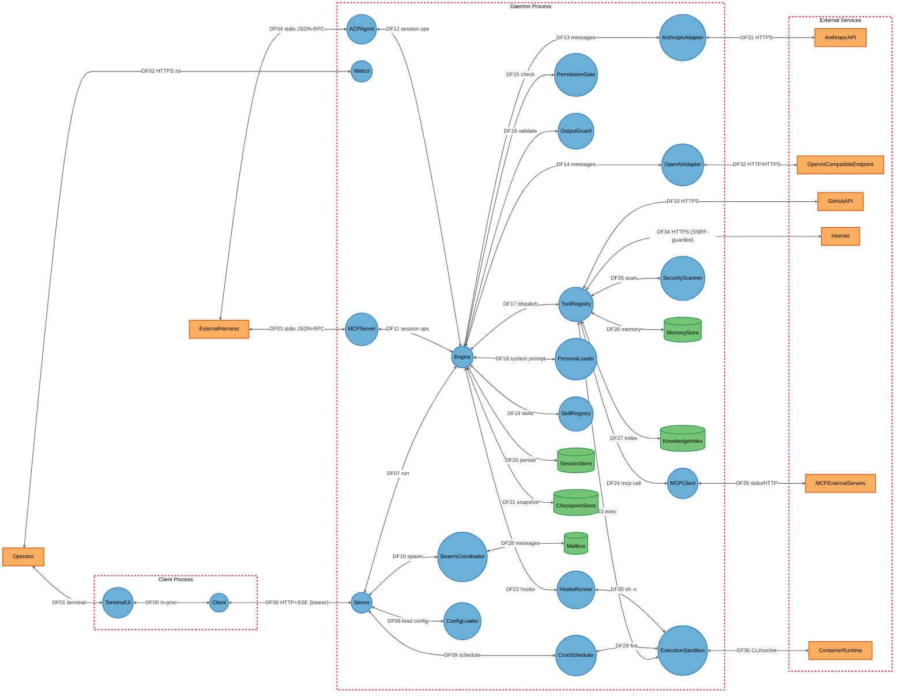
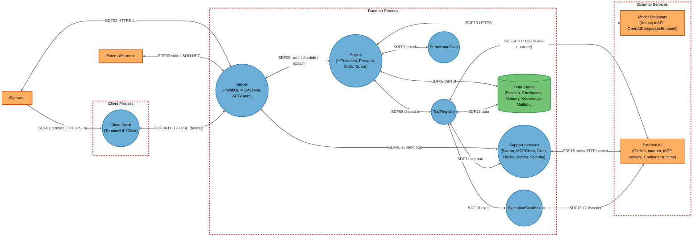

# Threat Model

## Data Flow Diagram

## Element Table

| Element | Type | TMT Category | Description | Trust Boundary |
|---------|------|--------------|-------------|----------------|
| Operator | External Interactor | SE.EI.TMCore.User | Human developer driving Aegis | (actor) |
| ExternalHarness | External Interactor | SE.EI.TMCore.WebApp | Editor/MCP client over stdio | (actor) |
| TerminalUI | Process | SE.P.TMCore.ThickClient | Bubbletea terminal UI | ClientProcess |
| Client | Process | SE.P.TMCore.NetApp | HTTP+SSE client to daemon | ClientProcess |
| Server | Process | SE.P.TMCore.WebSvc | Daemon HTTP API | DaemonProcess |
| WebUI | Process | SE.P.TMCore.WebApp | Embedded web UI at /ui | DaemonProcess |
| Engine | Process | SE.P.TMCore.NetApp | Agent execution loop | DaemonProcess |
| AnthropicAdapter | Process | SE.P.TMCore.NetApp | Anthropic API adapter | DaemonProcess |
| OpenAIAdapter | Process | SE.P.TMCore.NetApp | OpenAI-compatible adapter | DaemonProcess |
| ToolRegistry | Process | SE.P.TMCore.NetApp | Tool dispatch + capability gating | DaemonProcess |
| PermissionGate | Process | SE.P.TMCore.NetApp | Mode/rule/contextual authorization | DaemonProcess |
| OutputGuard | Process | SE.P.TMCore.WebSvc | Second-model output validation | DaemonProcess |
| ExecutionSandbox | Process | SE.P.TMCore.OSProcess | Command execution isolation | DaemonProcess |
| SwarmCoordinator | Process | SE.P.TMCore.NetApp | Sub-agent spawning + mode clamp | DaemonProcess |
| MCPClient | Process | SE.P.TMCore.WebSvc | Outbound MCP client | DaemonProcess |
| MCPServer | Process | SE.P.TMCore.WebSvc | aegis mcp-serve over stdio | DaemonProcess |
| ACPAgent | Process | SE.P.TMCore.WebSvc | ACP JSON-RPC over stdio | DaemonProcess |
| CronScheduler | Process | SE.P.TMCore.OSProcess | Scheduled background tasks | DaemonProcess |
| HooksRunner | Process | SE.P.TMCore.OSProcess | Project-configured sh -c lifecycle hooks | DaemonProcess |
| ConfigLoader | Process | SE.P.TMCore.NetApp | Layered config loader | DaemonProcess |
| PersonaLoader | Process | SE.P.TMCore.NetApp | Persona system-prompt loader | DaemonProcess |
| SkillRegistry | Process | SE.P.TMCore.NetApp | Progressive-disclosure skills | DaemonProcess |
| SecurityScanner | Process | SE.P.TMCore.OSProcess | SAST/secret/DAST/recon scanners | DaemonProcess |
| SessionStore | Data Store | SE.DS.TMCore.SQL | SQLite conversations/traces/cost/cron | DaemonProcess |
| CheckpointStore | Data Store | SE.DS.TMCore.SQL | File-content snapshots for /rewind | DaemonProcess |
| MemoryStore | Data Store | SE.DS.TMCore.FS | Memory files + long-term memory DB | DaemonProcess |
| KnowledgeIndex | Data Store | SE.DS.TMCore.SQL | Per-project FTS index of file contents | DaemonProcess |
| Mailbox | Data Store | SE.DS.TMCore.FS | File-based inter-agent message queue | DaemonProcess |
| AnthropicAPI | External Service | SE.EI.TMCore.WebSvc | Anthropic Messages API | External |
| OpenAICompatibleEndpoint | External Service | SE.EI.TMCore.WebSvc | OpenAI/Azure/Ollama endpoint | External |
| GitHubAPI | External Service | SE.EI.TMCore.WebSvc | GitHub API | External |
| Internet | External Service | SE.EI.TMCore.WebSvc | Arbitrary web fetch/search targets | External |
| MCPExternalServers | External Service | SE.EI.TMCore.WebSvc | External MCP tool servers | External |
| ContainerRuntime | External Service | SE.EI.TMCore.Megaservice | Docker/Podman/WSL/Apple runtime | External |

## Data Flow Table

| ID | Source | Target | Protocol | Description |
|----|--------|--------|----------|-------------|
| DF01 | Operator | TerminalUI | Terminal | Interactive input/output |
| DF02 | Operator | WebUI | HTTPS/HTTP | Browser session at /ui |
| DF03 | ExternalHarness | MCPServer | stdio JSON-RPC | MCP tool calls |
| DF04 | ExternalHarness | ACPAgent | stdio JSON-RPC | ACP editor integration |
| DF05 | TerminalUI | Client | In-process | UI ↔ client calls |
| DF06 | Client | Server | HTTP+SSE (loopback) | Bearer-token API + event stream |
| DF07 | Server | Engine | In-process | Run agent turn |
| DF08 | Server | ConfigLoader | In-process | Load layered config |
| DF09 | Server | CronScheduler | In-process | Create/fire cron jobs |
| DF10 | Server | SwarmCoordinator | In-process | Spawn sub-agents |
| DF11 | MCPServer | Engine | In-process | Session ops via MCP |
| DF12 | ACPAgent | Engine | In-process | Session ops via ACP |
| DF13 | Engine | AnthropicAdapter | In-process | Model request/response |
| DF14 | Engine | OpenAIAdapter | In-process | Model request/response |
| DF15 | Engine | PermissionGate | In-process | Tool-call authorization |
| DF16 | Engine | OutputGuard | In-process | Final output validation |
| DF17 | Engine | ToolRegistry | In-process | Tool dispatch |
| DF18 | Engine | PersonaLoader | In-process | System prompt assembly |
| DF19 | Engine | SkillRegistry | In-process | Skill injection |
| DF20 | Engine | SessionStore | SQLite | Persist conversation/trace |
| DF21 | Engine | CheckpointStore | SQLite | Snapshot files pre-edit |
| DF22 | Engine | HooksRunner | In-process | Lifecycle hook dispatch |
| DF23 | ToolRegistry | ExecutionSandbox | In-process/exec | Run shell/tool commands |
| DF24 | ToolRegistry | MCPClient | In-process | Outbound MCP tool call |
| DF25 | ToolRegistry | SecurityScanner | In-process/exec | Run scanners |
| DF26 | ToolRegistry | MemoryStore | File/SQLite | Read/append memory |
| DF27 | ToolRegistry | KnowledgeIndex | SQLite | Query/build FTS index |
| DF28 | SwarmCoordinator | Mailbox | File | Inter-agent messages |
| DF29 | CronScheduler | ExecutionSandbox | exec | Fire scheduled command |
| DF30 | HooksRunner | ExecutionSandbox | exec (sh -c) | Run hook command |
| DF31 | AnthropicAdapter | AnthropicAPI | HTTPS | Messages API |
| DF32 | OpenAIAdapter | OpenAICompatibleEndpoint | HTTP/HTTPS | Chat completions |
| DF33 | ToolRegistry | GitHubAPI | HTTPS | GitHub operations |
| DF34 | ToolRegistry | Internet | HTTPS | Web fetch/search (SSRF-guarded) |
| DF35 | MCPClient | MCPExternalServers | stdio/HTTP+SSE | External tool servers |
| DF36 | ExecutionSandbox | ContainerRuntime | CLI/socket | Container command execution |

## Trust Boundary Table

| Boundary | Description | Contains |
|----------|-------------|----------|
| ClientProcess | The TUI/CLI client process (may be separate from the daemon) | TerminalUI, Client |
| DaemonProcess | The `aegis serve` process that owns sessions, tools, adapters, and on-disk state | Server, WebUI, Engine, AnthropicAdapter, OpenAIAdapter, ToolRegistry, PermissionGate, OutputGuard, ExecutionSandbox, SwarmCoordinator, MCPClient, MCPServer, ACPAgent, CronScheduler, HooksRunner, ConfigLoader, PersonaLoader, SkillRegistry, SecurityScanner, SessionStore, CheckpointStore, MemoryStore, KnowledgeIndex, Mailbox |
| External | Network/cloud services and container runtime outside the host trust zone | AnthropicAPI, OpenAICompatibleEndpoint, GitHubAPI, Internet, MCPExternalServers, ContainerRuntime |

## Summary View

A condensed diagram (`1.2-threatmodel-summary.mmd`) aggregates the daemon's internal services and data stores while preserving all three trust boundaries and the security-critical entry points (Server, Engine, ToolRegistry, PermissionGate, ExecutionSandbox).

## Summary to Detailed Mapping

| Summary Element | Contains | Summary Flows | Maps to Detailed Flows |
|-----------------|----------|---------------|------------------------|
| ClientStack | TerminalUI, Client | SDF01, SDF04 | DF01, DF05, DF06 |
| Server | Server, WebUI, MCPServer, ACPAgent | SDF02, SDF03, SDF04, SDF05, SDF06 | DF02, DF03, DF04, DF06, DF07, DF08, DF09, DF10, DF11, DF12 |
| Engine | Engine, AnthropicAdapter, OpenAIAdapter, PersonaLoader, SkillRegistry, OutputGuard | SDF05, SDF07, SDF08, SDF09, SDF13 | DF07, DF13–DF21 |
| ToolRegistry | ToolRegistry | SDF08, SDF10, SDF11, SDF12, SDF14 | DF17, DF23–DF27, DF33, DF34 |
| PermissionGate | PermissionGate | SDF07 | DF15 |
| ExecutionSandbox | ExecutionSandbox | SDF10, SDF16 | DF23, DF29, DF30, DF36 |
| SupportServices | SwarmCoordinator, MCPClient, CronScheduler, HooksRunner, ConfigLoader, SecurityScanner | SDF06, SDF11, SDF15 | DF08–DF10, DF22, DF24, DF25, DF28, DF35 |
| DataStores | SessionStore, CheckpointStore, MemoryStore, KnowledgeIndex, Mailbox | SDF09, SDF12 | DF20, DF21, DF26, DF27, DF28 |
| ModelEndpoints | AnthropicAPI, OpenAICompatibleEndpoint | SDF13 | DF31, DF32 |
| ExternalIO | GitHubAPI, Internet, MCPExternalServers, ContainerRuntime | SDF14, SDF15, SDF16 | DF33, DF34, DF35, DF36 |
