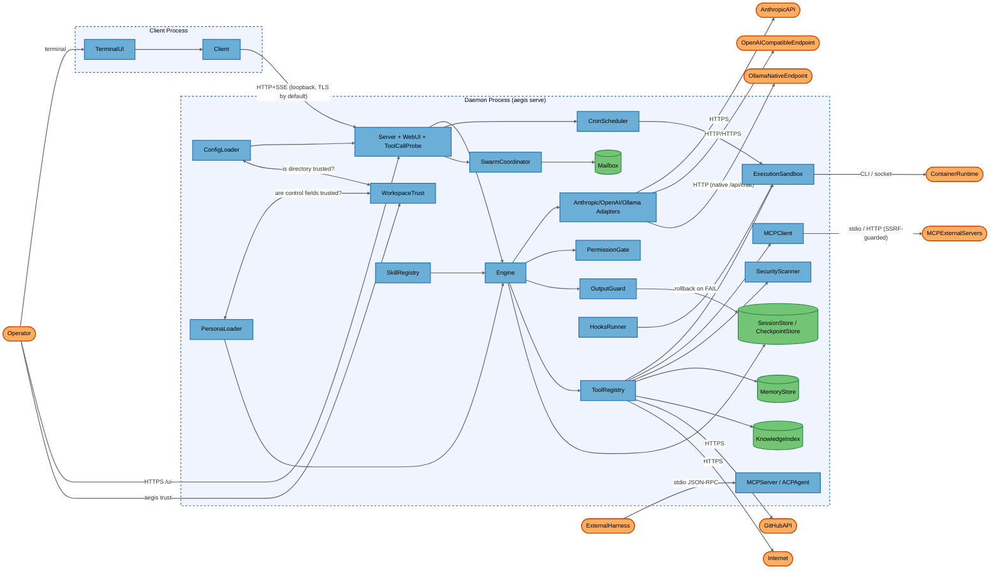
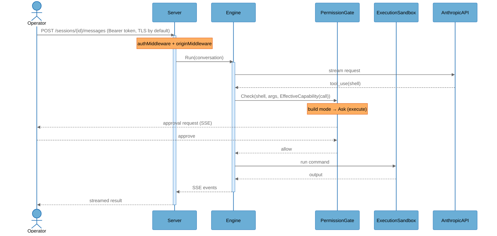
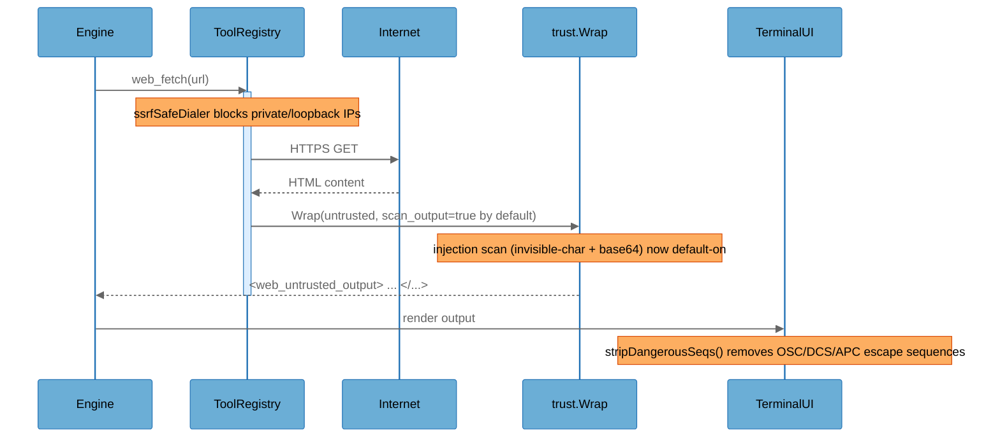

# Architecture Overview

## System Purpose

Aegis is a local-first AI coding agent distributed as a single Go binary that acts as either a **daemon** (`aegis serve`) or a **client** (TUI/CLI). The daemon owns agent sessions, the model adapter, a registry of 50+ built-in tools, and the agent execution loop; clients connect to it over a loopback HTTP API with SSE streaming. It targets individual developers running it on their own workstation against either cloud models (Anthropic, OpenAI-compatible) or a local model server (Ollama, now via both an OpenAI-compatible path and a native `/api/chat` adapter), and it can drive shell commands, edit files, browse the web, run security scanners, and coordinate multi-agent swarms.

Since the 2026-07-12 baseline, the dominant change is a **workspace-trust gate** (`internal/workspacetrust`): a new per-directory trust decision now freezes the security-relevant slice of a project's `.aegis/config.yaml` (permission mode, sandbox backend, MCP servers, notification webhook, lifecycle hooks) and a project persona's control fields back to the user/global baseline unless the operator has explicitly run `aegis trust` for that directory. This closes most of the "hostile cloned repository" attack surface that dominated the prior report. A second batch of changes flips several previously opt-in controls to on-by-default (loopback TLS, secret redaction, injection scanning, concurrency/duration caps, stdio auth tokens) and hardens filesystem ACLs and OS-sandbox read confinement.

## Key Components

| Component | Type | Description |
|-----------|------|-------------|
| Operator | External Interactor | The human developer driving Aegis via TUI, CLI, or web UI |
| ExternalHarness | External Interactor | An editor or MCP client (Zed, Neovim, another agent) connecting over ACP/MCP stdio |
| TerminalUI | Process | Bubbletea terminal UI (`internal/tui`) — now strips dangerous ANSI/OSC escape sequences from untrusted tool output before rendering |
| Client | Process | HTTP+SSE client that connects the UI to the daemon (`internal/client`) — `NewFromConfig` now returns an error to surface TLS pin failures now that loopback TLS defaults on |
| Server | Process | Daemon HTTP API; wires sessions, tools, permissions, personas, cron (`internal/server`) — CSRF cookie `Secure` flag is now scheme/proxy-aware; hosts the new tool-calling capability probe |
| Engine | Process | Core agent loop: model calls, tool dispatch, compaction, budget/loop enforcement (`internal/engine`) — gained output-guard quarantine/rollback and detached-spawn budget-share propagation |
| AnthropicAdapter | Process | Normalizes the Anthropic Messages API to the provider seam (`internal/provider/anthropic`) — refactored onto a shared SSE client helper |
| OpenAIAdapter | Process | Normalizes OpenAI/Azure/Ollama-compat chat-completions to the provider seam (`internal/provider/openai`) — refactored onto the shared SSE client, gained response-header-timeout config |
| **OllamaAdapter** | Process | **[NEW]** Native Ollama `/api/chat` adapter (`internal/provider/ollama`), distinct from the OpenAI-compat path; supports bounded `keep_alive` and response-header-timeout tuning |
| ToolRegistry | Process | Tool interface + registry; capability-gated dispatch (`internal/tool`) — the read-only-downgrade allowlist was expanded to more shell/git/PowerShell read verbs |
| PermissionGate | Process | Mode + rule + contextual gating of every tool call (`internal/permission`) — the contextual gate now consults each tool's *effective* (call-specific) capability rather than its static one |
| OutputGuard | Process | Second-model validation of final answers/written files (`internal/guard`) — package itself unchanged; its failure path now drives a real rollback via CheckpointStore |
| ExecutionSandbox | Process | Pluggable command execution isolation: local/OS/container (`internal/sandbox`) — the OS backend (seatbelt/bwrap) now confines *reads* to an allowlist, not just writes/network |
| SwarmCoordinator | Process | Spawns sub-agents as goroutines or subprocesses; mode clamping (`internal/swarm`) — detached/background spawns now inherit a guaranteed budget share |
| MCPClient | Process | Outbound MCP client (stdio + HTTP/SSE) to external tool servers (`internal/mcp`) — the HTTP/SSE transport now runs behind its own SSRF-safe dialer |
| MCPServer | Process | `aegis mcp-serve`: exposes Aegis sessions as MCP tools over stdio (`internal/mcpserver`) — the CLI entrypoint now always resolves a non-empty auth token before starting |
| ACPAgent | Process | ACP JSON-RPC server over stdio for editor integrations (`internal/acp`) — same always-resolve-a-token pattern as MCPServer |
| WebUI | Process | Embedded Preact web UI served by the daemon at `/ui` (`internal/server/webui`) |
| CronScheduler | Process | Persistent scheduler for background shell/agent tasks (`internal/cron`) — unchanged since baseline |
| HooksRunner | Process | Runs project-configured `sh -c`/PowerShell lifecycle hooks on tool/session events (`internal/hooks`) — hook *definitions* sourced from an untrusted project are now frozen by the workspace-trust gate; the executor itself gained a Windows-aware shell picker |
| ConfigLoader | Process | Layered config loader incl. project `.aegis/config.yaml`/`.env` (`internal/config`) — now applies `applyWorkspaceTrust`, and flips several security defaults on (TLS, redaction, injection scan, concurrency caps) |
| **WorkspaceTrust** | Process | **[NEW]** Per-directory trust store (`internal/workspacetrust`) gating whether a project's security-relevant config/persona overrides are honored; driven by `aegis trust` |
| PersonaLoader | Process | Loads/hot-reloads persona system prompts from project/user dirs (`internal/persona`) — project persona control fields (`mode`/`tools`/`rules`/`output_guard`) now honored only for trusted workspaces |
| SkillRegistry | Process | Progressive-disclosure skills from project/user/embedded sources (`internal/skills`) — gained the embedded `threat-modeling` skill and a YAML-frontmatter parsing fix |
| SecurityScanner | Process | Runs SAST/secret/DAST/recon scanners host or container (`internal/security`) — `nuclei` `templates_version` is now validated against path-traversal/git-arg injection; scanners consolidated into one locally-built multiscanner image |
| **ToolCallProbe** | Process | **[NEW]** Startup/`doctor` capability probe (`internal/toolcallprobe`) that runs a small real inference call to verify a configured model can actually call tools, caching a per-model verdict surfaced as a daemon warning or CLI diagnostic |
| SessionStore | Data Store | SQLite store of full conversations, traces, cost, cron (`internal/session`) — pruning now cascades to checkpoint cleanup |
| CheckpointStore | Data Store | Per-turn file-content snapshots for `/rewind`, in the session DB (`internal/checkpoint`) — gained `Snapshotter.RestoreFiles`, used by the Engine to roll back writes on an exhausted output-guard retry |
| MemoryStore | Data Store | Project/user memory files + long-term memory DB (`internal/memory`) — `longmem.db` is now `fsguard`-hardened, memory file content is now wrapped in the untrusted-content marker, and a retention cap was added |
| KnowledgeIndex | Data Store | Per-project FTS index of file contents at `.aegis/knowledge.db` (`internal/knowledge`) — now `fsguard`-hardened |
| Mailbox | Data Store | File-based inter-agent message queue for swarms (`internal/swarm`) — mailbox root now `fsguard`-hardened; processed messages now written `0o600` instead of `0o644` |
| AnthropicAPI | External Service | `api.anthropic.com` Messages API |
| OpenAICompatibleEndpoint | External Service | OpenAI / Azure / Ollama (OpenAI-compat mode) chat-completions endpoint |
| OllamaNativeEndpoint | External Service | Local Ollama server's native `/api/chat` endpoint (loopback, plain HTTP by default) |
| GitHubAPI | External Service | GitHub (PR URL construction, `gh`-style operations) |
| Internet | External Service | Arbitrary web targets for `web_fetch`/`web_search` and search providers |
| MCPExternalServers | External Service | Operator-configured external MCP tool servers |
| ContainerRuntime | External Service | Docker/Podman/WSL/Apple container runtime backing the sandbox |

## Component Diagram



## Top Scenarios

### Scenario 1: Interactive tool-using turn

The Operator sends a message; the daemon runs the engine loop, which calls the model, dispatches tool calls through the permission gate and sandbox, and streams results back over SSE. Execute-capability tools prompt for approval in the default build mode. The permission gate now checks each tool's *effective* capability for the specific call, not just its static declared capability.



### Scenario 2: Loading a project that ships its own `.aegis/` config — now gated by workspace trust

When Aegis starts in a working directory, `ConfigLoader` checks `WorkspaceTrust` for that directory. If untrusted, the security-relevant keys (`permission.*`, `sandbox.*`, `mcp.servers`, `notify.webhook`, `hooks`) from the project's `.aegis/config.yaml` are frozen back to the user/global baseline before the merged config is used. `provider.base_url` is validated independently (blocking plaintext-HTTP-to-non-loopback with a real key attached) but is **not** one of the five trust-gated keys, so an HTTPS `base_url` override from an untrusted project still only produces a warning.

```mermaid
%%{init: {'theme': 'base', 'themeVariables': {
  'background': '#ffffff',
  'actorBkg': '#6baed6', 'actorBorder': '#2171b5', 'actorTextColor': '#000000',
  'signalColor': '#666666', 'signalTextColor': '#666666',
  'noteBkgColor': '#fdae61', 'noteBorderColor': '#d94701', 'noteTextColor': '#000000',
  'activationBkgColor': '#ddeeff', 'activationBorderColor': '#2171b5'
}}}%%
sequenceDiagram
    actor Operator
    participant Cfg as ConfigLoader
    participant Trust as WorkspaceTrust
    participant Hooks as HooksRunner
    participant Engine as Engine
    participant Model as OpenAICompatibleEndpoint

    Operator->>Cfg: aegis (cwd = cloned repo)
    activate Cfg
    Cfg->>Cfg: load defaults → global → .aegis/config.yaml → env
    Cfg->>Trust: IsTrusted(cwd)?
    Trust-->>Cfg: false (not yet trusted)
    Note over Cfg: applyWorkspaceTrust freezes permission/sandbox/mcp/notify/hooks to baseline
    Cfg-->>Engine: effective config (frozen security keys; base_url still project-controlled)
    deactivate Cfg
    Engine->>Hooks: session_start
    Note over Hooks: project-sourced hooks do NOT run until trusted
    Engine->>Model: request to provider.base_url
    Note over Model: base_url validated only for plaintext-HTTP-non-loopback; HTTPS override still warns-only
```

### Scenario 3: Fetching untrusted web/MCP content

A tool retrieves external content, which is wrapped in an untrusted-provenance marker and — now by default — scanned for prompt-injection patterns before re-entering the model context. Terminal rendering of any untrusted output additionally strips dangerous escape sequences before display.



### Scenario 4: Multi-agent swarm fan-out

The top-level session spawns sub-agents. Each child inherits a clamped (never escalated) permission mode, the full gate stack, and a guaranteed share of the parent's cost/token budget — including detached/background spawns, which previously escaped the shared tracker.

### Scenario 5: Scheduled cron task

An agent creates a cron job; when it fires, a fire-time gate consults the daemon's current permission mode (and the job's `auto_approve` flag) before running the shell command through the sandbox. This mechanism is unchanged since the baseline — the text allow/deny rules and contextual gate still are not re-applied at fire time.

## Technology Stack

| Layer | Technologies |
|-------|--------------|
| Languages | Go (daemon/CLI/TUI), TypeScript/Preact (web UI) |
| Frameworks | Go net/http, Bubbletea (TUI), koanf (config), Vite (web build) |
| Data Stores | SQLite (sessions, checkpoints, cron, long-term memory, knowledge FTS), markdown/YAML files, JSON (`workspace_trust.json`) |
| Infrastructure | Local daemon process; optional Docker/Podman/WSL/Apple container sandbox; cron scheduler |
| Security | Bearer-token auth (`crypto/subtle`), origin middleware (DNS-rebind defense), page-token+CSRF for web UI (scheme/proxy-aware `Secure` flag), loopback TLS **on by default**, `fsguard` owner-only ACLs (now covering `longmem.db`, `knowledge.db`, mailbox tree), permission modes + text rules + effective-capability contextual gate, output guard with write-rollback on FAIL, `trust` untrusted-content wrapping + injection scan **on by default**, SSRF-safe web + MCP dialers, secret redaction (gitleaks) **on by default**, workspace-trust gate for project config/persona overrides, tool-calling capability probe |

## Deployment Model

Aegis runs as a single-user process on a developer workstation. The daemon's HTTP API binds to `127.0.0.1:4127` by default (`internal/config/config.go:715`). Binding to a non-loopback address is refused at startup unless `server.allow_remote: true` is explicitly set (`internal/server/server.go:944-953`). The API is protected by a 32-byte bearer token stored at `<DataDir>/daemon.token` (mode `0o600` + a non-inherited owner-only ACL on Windows via `fsguard`). The embedded web UI is served on the same loopback port and authenticates browser sessions with a single-use page token exchanged under a double-submit CSRF binding, whose `Secure` flag now reflects the actual scheme (direct TLS, or `X-Forwarded-Proto` only when `Server.TrustProxyHeaders` is explicitly enabled). Client↔daemon traffic now defaults to loopback TLS with a pinned self-signed certificate (previously opt-in). The ACP and MCP-serve integration surfaces are stdio-only (no network listener); both now always resolve a non-empty shared-secret token before starting, rather than defaulting to unauthenticated. Outbound traffic goes to the configured model provider (Anthropic, OpenAI-compatible, or native Ollama), optional external MCP servers (now behind an SSRF-safe dialer for both stdio-adjacent HTTP and MCP), and arbitrary web targets requested by tools (behind an SSRF-safe dialer). All persistent state lives under `<DataDir>` (`~/.config/aegis` or `%AppData%\aegis`, created `0o700`) and the project's `.aegis/` directory; a new per-directory workspace-trust decision (`<DataDir>/workspace_trust.json`) gates whether that project's security-relevant config/persona overrides take effect.

**Deployment Classification:** `LOCALHOST_SERVICE` (unchanged)

### Component Exposure Table

| Component | Listens On | Auth Required | Reachability | Min Prerequisite | Derived Tier |
|-----------|------------|---------------|--------------|------------------|-------------|
| Operator | N/A — no listener | No | No Listener | Host/OS Access | T3 |
| ExternalHarness | N/A — no listener | No | No Listener | Host/OS Access | T3 |
| TerminalUI | N/A — no listener | No | No Listener | Host/OS Access | T3 |
| Client | N/A — no listener | No | No Listener | Host/OS Access | T3 |
| Server | `127.0.0.1:4127` (loopback; non-loopback opt-in) | Yes (bearer token) | Localhost Only | Local Process Access | T2 |
| Engine | via daemon API | Yes (bearer token) | Localhost Only | Local Process Access | T2 |
| AnthropicAdapter | via daemon API | Yes (bearer token) | Localhost Only | Local Process Access | T2 |
| OpenAIAdapter | via daemon API | Yes (bearer token) | Localhost Only | Local Process Access | T2 |
| OllamaAdapter | via daemon API | Yes (bearer token) | Localhost Only | Local Process Access | T2 |
| ToolRegistry | via daemon API | Yes (bearer token) | Localhost Only | Local Process Access | T2 |
| PermissionGate | via daemon API | Yes (bearer token) | Localhost Only | Local Process Access | T2 |
| OutputGuard | via daemon API | Yes (bearer token) | Localhost Only | Local Process Access | T2 |
| ExecutionSandbox | via daemon API | Yes (bearer token) | Localhost Only | Local Process Access | T2 |
| SwarmCoordinator | via daemon API | Yes (bearer token) | Localhost Only | Local Process Access | T2 |
| MCPClient | via daemon API | Yes (bearer token) | Localhost Only | Local Process Access | T2 |
| MCPServer | stdio (no network) | Yes (token now always resolved) | Localhost Only | Local Process Access | T2 |
| ACPAgent | stdio (no network) | Yes (token now always resolved) | Localhost Only | Local Process Access | T2 |
| WebUI | `127.0.0.1:4127` `/ui` | Yes (page token + CSRF) | Localhost Only | Local Process Access | T2 |
| CronScheduler | N/A — in-process | Via daemon API to create | Localhost Only | Local Process Access | T2 |
| HooksRunner | N/A — no listener | No (config-driven; project hooks frozen unless trusted) | Localhost Only | Local Process Access | T2 |
| ConfigLoader | N/A — reads disk | No (project files; security keys trust-gated) | Localhost Only | Local Process Access | T2 |
| WorkspaceTrust | N/A — reads/writes disk | N/A (operator-driven via `aegis trust`) | Localhost Only | Local Process Access | T2 |
| PersonaLoader | N/A — reads disk | No (project files; control fields trust-gated) | Localhost Only | Local Process Access | T2 |
| SkillRegistry | N/A — reads disk | No (project files) | Localhost Only | Local Process Access | T2 |
| SecurityScanner | via daemon API | Yes (bearer token) | Localhost Only | Local Process Access | T2 |
| ToolCallProbe | N/A — invoked at startup/`doctor` | Via daemon API / CLI | Localhost Only | Local Process Access | T2 |
| SessionStore | N/A — on-disk SQLite | No (filesystem) | No Listener | Host/OS Access | T3 |
| CheckpointStore | N/A — on-disk SQLite | No (filesystem) | No Listener | Host/OS Access | T3 |
| MemoryStore | N/A — on-disk files/SQLite | No (filesystem; now `fsguard`-hardened) | No Listener | Host/OS Access | T3 |
| KnowledgeIndex | N/A — on-disk SQLite | No (filesystem; now `fsguard`-hardened) | No Listener | Host/OS Access | T3 |
| Mailbox | N/A — on-disk files | No (filesystem; root now `fsguard`-hardened) | No Listener | Host/OS Access | T3 |
| AnthropicAPI | External endpoint | Yes (API key) | External | Internal Network | T2 |
| OpenAICompatibleEndpoint | External/loopback endpoint | Yes (API key) | External | Internal Network | T2 |
| OllamaNativeEndpoint | Loopback endpoint (typically) | No (local Ollama default) | Localhost Only | Local Process Access | T2 |
| GitHubAPI | External endpoint | Yes (token) | External | Internal Network | T2 |
| Internet | External endpoints | Varies | External | Local Process Access | T2 |
| MCPExternalServers | Operator-configured | Optional (bearer) | External | Local Process Access | T2 |
| ContainerRuntime | Local socket/CLI | Socket perms | Localhost Only | Local Process Access | T2 |

## Security Infrastructure Inventory

| Component | Security Role | Configuration | Notes |
|-----------|---------------|---------------|-------|
| authMiddleware | API authentication | 32-byte bearer token, constant-time compare | `internal/server/auth.go:45-79`; `/healthz`, `/ui`, `/auth/exchange` exempt |
| originMiddleware | DNS-rebinding defense | Rejects non-loopback `Origin` | `internal/server/auth.go:108-118` |
| Page token + CSRF | Web UI auth | Single-use 60s token, double-submit CSRF, HttpOnly SameSite=Strict cookie, scheme/proxy-aware `Secure` flag | `internal/server/webui.go` (P31.3, P32.10) |
| validateListenAddr | Network exposure control | Refuses non-loopback bind unless `allow_remote` | `internal/server/server.go:944-953` |
| ServerTLSConfig | Transport encryption | **Default-on**; self-signed pinned ECDSA cert | `internal/server/tls.go` (P27.5) |
| **WorkspaceTrust** | **[NEW]** Project-config/persona trust gate | Freezes `permission.*`, `sandbox.*`, `mcp.servers`, `notify.webhook`, `hooks` to baseline until `aegis trust` | `internal/workspacetrust`, `internal/config/config.go:applyWorkspaceTrust` (P27.1) |
| validateBaseURL | Credential-redirection defense | Blocks plaintext-HTTP `base_url` to a non-loopback host with a real key attached; HTTPS overrides only warn | `internal/providerfactory/factory.go:108-154` (P27.2) — **narrower than FIND-03's original scope** |
| fsguard.RestrictToOwner | At-rest confidentiality | Owner-only non-inherited ACL on Windows | Now applied to daemon.token, daemon.key, sessions.db, .env, memory.md, **longmem.db, knowledge.db, mailbox root** (P27.10, P27.11) |
| PermissionGate + EffectiveCapability | Authorization | plan/build/auto modes + text allow/deny rules + contextual gate now keyed on the call-specific effective capability | `internal/permission`, `internal/permission/contextual.go:105` (P32.2) |
| RuleGate matching | Injection-resistant scoping | Shell-chaining-safe exec globs, path-normalized file globs | `internal/permission/rules.go` |
| ExecutionSandbox | Command isolation | local (default, env-strip only) / OS (seatbelt/bwrap, **now read-confined too**) / container | `internal/sandbox` (P27.18) |
| trust.Wrap + ScanForInjection | Indirect prompt-injection defense | Untrusted-content markers; invisible-char + base64 scan **now default-on** for MCP/search output, memory files | `internal/trust` (P27.13) |
| SSRF-safe dialers | Web + MCP tool SSRF defense | Blocks private/loopback/link-local IPs, redirect validation | `internal/tool/builtin/web.go:109-162`, **`internal/mcp/http.go:18-95`** (P27.8) |
| OutputGuard + rollback | Output validation | Schema/LLM verdict; **now drives a file-write rollback via CheckpointStore on exhausted-retry FAIL** | `internal/guard`, `internal/checkpoint/checkpoint.go:266-278` (P27.16) |
| Secret redaction | Data-exposure control | gitleaks-backed masking of read-tool output before model send, **now default-on** | `internal/security`, `security.redact_secrets` (P27.3) |
| MCP outbound secret scan | Exfiltration signal | Flags credential-shaped tool-call arguments (log-only) | `internal/mcp/outbound.go` |
| Memory integrity + trust wrap | Tamper detection + injection defense | sha256 sidecar warns on out-of-band edits; memory file content **now wrapped in untrusted-content marker** | `internal/memory/integrity.go`, `internal/memory/context.go` (P27.6-class) |
| Cost/token budgets | Resource abuse control | BudgetUSD, MaxTokensPerRun, daily/session caps, **`max_concurrent_runs` defaults to 10, `max_run_duration_sec` to 1800** | `internal/config`, `internal/engine` (P27.12) |
| clampMode | Privilege-escalation control | Sub-agents may only restrict, never widen, mode | `internal/swarm/agent.go:555-563` |
| Swarm budget-share guarantee | Resource abuse control | Detached/background spawns now inherit a guaranteed fair share of the parent's remaining budget | `internal/swarm` (FIND-14/P27.17) |
| Stdio auth tokens | Authentication | `aegis mcp-serve`/`aegis acp` now always resolve a non-empty token before starting | `internal/cli/stdiotoken.go` (P27.4) |
| ToolCallProbe | Diagnostic capability check | Verifies a configured model can call tools before relying on it | `internal/toolcallprobe` (P34.2) |
| nuclei templates_version validation | Path-traversal / arg-injection defense | Rejects values outside `^[A-Za-z0-9._-]+$` or leading `-`/pure-dot | `internal/security/recon.go` (P31.1) |
| TerminalUI escape-sequence stripping | Terminal-spoofing defense | Strips OSC/DCS/APC/PM/SOS and non-SGR CSI sequences from untrusted output before render | `internal/tui/sanitize.go:72-129` (P28.1) |

## Repository Structure

| Directory | Purpose |
|-----------|---------|
| `cmd/aegis/` | Binary entry point |
| `internal/server/` | Daemon HTTP API, auth, TLS, web UI, config/security admin endpoints, tool-calling probe wiring |
| `internal/engine/` | Agent loop, budget/loop enforcement, guard integration + rollback |
| `internal/provider/` | Anthropic/OpenAI/**Ollama (native)** adapters over the normalized provider seam, plus a shared SSE client helper (`internal/provider/sse`) |
| `internal/tool/builtin/` | 50+ built-in tools (file, shell, web, git, security, memory, cron, agent) |
| `internal/permission/` | Mode/rule/contextual gating (now effective-capability-aware) and capability model |
| `internal/sandbox/` | Local/OS/container execution isolation backends (OS backend now read-confined) |
| `internal/swarm/` | Sub-agent spawning, mode clamping, file-based mailbox (now `fsguard`-hardened), budget-share guarantee |
| `internal/trust/` | Untrusted-content wrapping + prompt-injection scan |
| `internal/workspacetrust/` | **[NEW]** Per-directory workspace-trust decision store |
| `internal/config/` | Layered config, hardening plan, sandbox normalization, workspace-trust application |
| `internal/session/`, `internal/checkpoint/` | SQLite session/checkpoint stores; checkpoint restore now backs guard rollback |
| `internal/memory/`, `internal/knowledge/` | Persistent memory and per-project FTS index (both now `fsguard`-hardened) |
| `internal/security/` | SAST/secret/DAST/recon scanners, CVE lookup, redaction, single-image multiscanner |
| `internal/fsguard/` | Owner-only filesystem ACL hardening (Windows) |
| `internal/mcp/`, `internal/mcpserver/`, `internal/acp/` | Outbound MCP client (now SSRF-guarded); MCP-serve and ACP integration servers (now always-token-gated) |
| `internal/toolcallprobe/` | **[NEW]** Tool-calling capability smoke probe |
