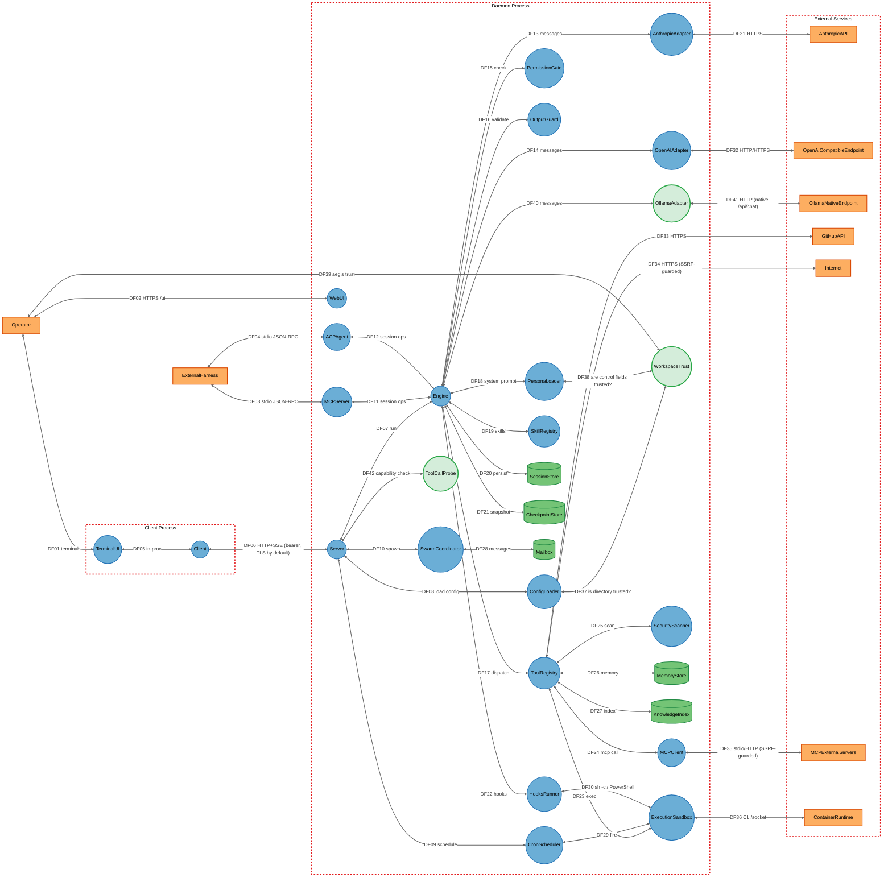
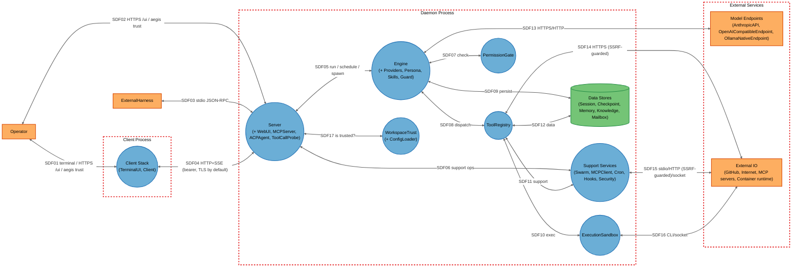

# Threat Model

## Data Flow Diagram

## Element Table

| Element | Type | TMT Category | Description | Trust Boundary | Status |
|---------|------|--------------|-------------|----------------|--------|
| Operator | External Interactor | SE.EI.TMCore.User | Human developer driving Aegis | (actor) | Unchanged |
| ExternalHarness | External Interactor | SE.EI.TMCore.WebApp | Editor/MCP client over stdio | (actor) | Unchanged |
| TerminalUI | Process | SE.P.TMCore.ThickClient | Bubbletea terminal UI; now strips dangerous escape sequences | ClientProcess | Modified |
| Client | Process | SE.P.TMCore.NetApp | HTTP+SSE client to daemon; TLS-pin-aware | ClientProcess | Modified |
| Server | Process | SE.P.TMCore.WebSvc | Daemon HTTP API | DaemonProcess | Modified |
| WebUI | Process | SE.P.TMCore.WebApp | Embedded web UI at /ui | DaemonProcess | Modified |
| Engine | Process | SE.P.TMCore.NetApp | Agent execution loop; guard rollback, budget-share propagation | DaemonProcess | Modified |
| AnthropicAdapter | Process | SE.P.TMCore.NetApp | Anthropic API adapter | DaemonProcess | Modified |
| OpenAIAdapter | Process | SE.P.TMCore.NetApp | OpenAI-compatible adapter | DaemonProcess | Modified |
| OllamaAdapter | Process | SE.P.TMCore.NetApp | Native Ollama `/api/chat` adapter | DaemonProcess | New |
| ToolRegistry | Process | SE.P.TMCore.NetApp | Tool dispatch + capability gating | DaemonProcess | Modified |
| PermissionGate | Process | SE.P.TMCore.NetApp | Mode/rule/contextual authorization (effective-capability-aware) | DaemonProcess | Modified |
| OutputGuard | Process | SE.P.TMCore.WebSvc | Second-model output validation | DaemonProcess | Unchanged |
| ExecutionSandbox | Process | SE.P.TMCore.OSProcess | Command execution isolation (OS backend now read-confined) | DaemonProcess | Modified |
| SwarmCoordinator | Process | SE.P.TMCore.NetApp | Sub-agent spawning + mode clamp | DaemonProcess | Modified |
| MCPClient | Process | SE.P.TMCore.WebSvc | Outbound MCP client (now SSRF-guarded) | DaemonProcess | Modified |
| MCPServer | Process | SE.P.TMCore.WebSvc | aegis mcp-serve over stdio (now always token-gated) | DaemonProcess | Modified |
| ACPAgent | Process | SE.P.TMCore.WebSvc | ACP JSON-RPC over stdio (now always token-gated) | DaemonProcess | Modified |
| CronScheduler | Process | SE.P.TMCore.OSProcess | Scheduled background tasks | DaemonProcess | Unchanged |
| HooksRunner | Process | SE.P.TMCore.OSProcess | Project-configured lifecycle hooks | DaemonProcess | Modified |
| ConfigLoader | Process | SE.P.TMCore.NetApp | Layered config loader; now applies workspace-trust gate | DaemonProcess | Modified |
| WorkspaceTrust | Process | SE.P.TMCore.NetApp | Per-directory trust decision store | DaemonProcess | New |
| PersonaLoader | Process | SE.P.TMCore.NetApp | Persona system-prompt loader (control fields trust-gated) | DaemonProcess | Modified |
| SkillRegistry | Process | SE.P.TMCore.NetApp | Progressive-disclosure skills | DaemonProcess | Modified |
| SecurityScanner | Process | SE.P.TMCore.OSProcess | SAST/secret/DAST/recon scanners | DaemonProcess | Modified |
| ToolCallProbe | Process | SE.P.TMCore.NetApp | Tool-calling capability smoke probe | DaemonProcess | New |
| SessionStore | Data Store | SE.DS.TMCore.SQL | SQLite conversations/traces/cost/cron | DaemonProcess | Modified |
| CheckpointStore | Data Store | SE.DS.TMCore.SQL | File-content snapshots for /rewind; now backs guard rollback | DaemonProcess | Modified |
| MemoryStore | Data Store | SE.DS.TMCore.FS | Memory files + long-term memory DB (now fsguard-hardened) | DaemonProcess | Modified |
| KnowledgeIndex | Data Store | SE.DS.TMCore.SQL | Per-project FTS index (now fsguard-hardened) | DaemonProcess | Modified |
| Mailbox | Data Store | SE.DS.TMCore.FS | File-based inter-agent message queue (now fsguard-hardened) | DaemonProcess | Modified |
| AnthropicAPI | External Service | SE.EI.TMCore.WebSvc | Anthropic Messages API | External | Unchanged |
| OpenAICompatibleEndpoint | External Service | SE.EI.TMCore.WebSvc | OpenAI/Azure/Ollama-compat endpoint | External | Unchanged |
| OllamaNativeEndpoint | External Service | SE.EI.TMCore.WebSvc | Local Ollama native /api/chat endpoint | External | New |
| GitHubAPI | External Service | SE.EI.TMCore.WebSvc | GitHub API | External | Unchanged |
| Internet | External Service | SE.EI.TMCore.WebSvc | Arbitrary web fetch/search targets | External | Unchanged |
| MCPExternalServers | External Service | SE.EI.TMCore.WebSvc | External MCP tool servers | External | Unchanged |
| ContainerRuntime | External Service | SE.EI.TMCore.Megaservice | Docker/Podman/WSL/Apple runtime | External | Unchanged |

## Data Flow Table

| ID | Source | Target | Protocol | Description | Status |
|----|--------|--------|----------|-------------|--------|
| DF01 | Operator | TerminalUI | Terminal | Interactive input/output | Unchanged |
| DF02 | Operator | WebUI | HTTPS/HTTP | Browser session at /ui | Unchanged |
| DF03 | ExternalHarness | MCPServer | stdio JSON-RPC | MCP tool calls | Unchanged |
| DF04 | ExternalHarness | ACPAgent | stdio JSON-RPC | ACP editor integration | Unchanged |
| DF05 | TerminalUI | Client | In-process | UI ↔ client calls | Unchanged |
| DF06 | Client | Server | HTTP+SSE (loopback, TLS by default) | Bearer-token API + event stream | Modified |
| DF07 | Server | Engine | In-process | Run agent turn | Unchanged |
| DF08 | Server | ConfigLoader | In-process | Load layered config | Unchanged |
| DF09 | Server | CronScheduler | In-process | Create/fire cron jobs | Unchanged |
| DF10 | Server | SwarmCoordinator | In-process | Spawn sub-agents | Unchanged |
| DF11 | MCPServer | Engine | In-process | Session ops via MCP | Unchanged |
| DF12 | ACPAgent | Engine | In-process | Session ops via ACP | Unchanged |
| DF13 | Engine | AnthropicAdapter | In-process | Model request/response | Unchanged |
| DF14 | Engine | OpenAIAdapter | In-process | Model request/response | Unchanged |
| DF15 | Engine | PermissionGate | In-process | Tool-call authorization | Unchanged |
| DF16 | Engine | OutputGuard | In-process | Final output validation | Unchanged |
| DF17 | Engine | ToolRegistry | In-process | Tool dispatch | Unchanged |
| DF18 | Engine | PersonaLoader | In-process | System prompt assembly | Unchanged |
| DF19 | Engine | SkillRegistry | In-process | Skill injection | Unchanged |
| DF20 | Engine | SessionStore | SQLite | Persist conversation/trace | Unchanged |
| DF21 | Engine | CheckpointStore | SQLite | Snapshot files pre-edit; source for guard rollback | Modified |
| DF22 | Engine | HooksRunner | In-process | Lifecycle hook dispatch | Unchanged |
| DF23 | ToolRegistry | ExecutionSandbox | In-process/exec | Run shell/tool commands | Unchanged |
| DF24 | ToolRegistry | MCPClient | In-process | Outbound MCP tool call | Unchanged |
| DF25 | ToolRegistry | SecurityScanner | In-process/exec | Run scanners | Unchanged |
| DF26 | ToolRegistry | MemoryStore | File/SQLite | Read/append memory | Unchanged |
| DF27 | ToolRegistry | KnowledgeIndex | SQLite | Query/build FTS index | Unchanged |
| DF28 | SwarmCoordinator | Mailbox | File | Inter-agent messages | Unchanged |
| DF29 | CronScheduler | ExecutionSandbox | exec | Fire scheduled command | Unchanged |
| DF30 | HooksRunner | ExecutionSandbox | exec (sh -c / PowerShell) | Run hook command | Modified |
| DF31 | AnthropicAdapter | AnthropicAPI | HTTPS | Messages API | Unchanged |
| DF32 | OpenAIAdapter | OpenAICompatibleEndpoint | HTTP/HTTPS | Chat completions | Unchanged |
| DF33 | ToolRegistry | GitHubAPI | HTTPS | GitHub operations | Unchanged |
| DF34 | ToolRegistry | Internet | HTTPS | Web fetch/search (SSRF-guarded) | Unchanged |
| DF35 | MCPClient | MCPExternalServers | stdio/HTTP+SSE | External tool servers (now SSRF-guarded) | Modified |
| DF36 | ExecutionSandbox | ContainerRuntime | CLI/socket | Container command execution | Unchanged |
| DF37 | ConfigLoader | WorkspaceTrust | In-process | Is this directory trusted? | New |
| DF38 | PersonaLoader | WorkspaceTrust | In-process | Are project persona control fields trusted? | New |
| DF39 | Operator | WorkspaceTrust | CLI (`aegis trust`) | Grant/revoke workspace trust | New |
| DF40 | Engine | OllamaAdapter | In-process | Model request/response | New |
| DF41 | OllamaAdapter | OllamaNativeEndpoint | HTTP (native /api/chat) | Native Ollama chat | New |
| DF42 | Server | ToolCallProbe | In-process | Tool-calling capability check | New |

## Trust Boundary Table

| Boundary | Description | Contains | Status |
|----------|-------------|----------|--------|
| ClientProcess | The TUI/CLI client process (may be separate from the daemon) | TerminalUI, Client | Unchanged |
| DaemonProcess | The `aegis serve` process that owns sessions, tools, adapters, and on-disk state | Server, WebUI, Engine, AnthropicAdapter, OpenAIAdapter, OllamaAdapter, ToolRegistry, PermissionGate, OutputGuard, ExecutionSandbox, SwarmCoordinator, MCPClient, MCPServer, ACPAgent, CronScheduler, HooksRunner, ConfigLoader, WorkspaceTrust, PersonaLoader, SkillRegistry, SecurityScanner, ToolCallProbe, SessionStore, CheckpointStore, MemoryStore, KnowledgeIndex, Mailbox | Modified (3 new members) |
| External | Network/cloud services and container runtime outside the host trust zone | AnthropicAPI, OpenAICompatibleEndpoint, OllamaNativeEndpoint, GitHubAPI, Internet, MCPExternalServers, ContainerRuntime | Modified (1 new member) |

## Summary View

A condensed diagram (`1.2-threatmodel-summary.mmd`) aggregates the daemon's internal services and data stores while preserving all three trust boundaries and the security-critical entry points (Server, Engine, ToolRegistry, PermissionGate, ExecutionSandbox, WorkspaceTrust).

## Summary to Detailed Mapping

| Summary Element | Contains | Summary Flows | Maps to Detailed Flows |
|-----------------|----------|---------------|------------------------|
| ClientStack | TerminalUI, Client | SDF01, SDF04 | DF01, DF05, DF06 |
| Server | Server, WebUI, MCPServer, ACPAgent, ToolCallProbe | SDF02, SDF03, SDF04, SDF05, SDF06, SDF17 | DF02, DF03, DF04, DF06, DF07, DF08, DF09, DF10, DF11, DF12, DF42 |
| Engine | Engine, AnthropicAdapter, OpenAIAdapter, OllamaAdapter, PersonaLoader, SkillRegistry, OutputGuard | SDF05, SDF07, SDF08, SDF09, SDF13 | DF07, DF13–DF21, DF40 |
| ToolRegistry | ToolRegistry | SDF08, SDF10, SDF11, SDF12, SDF14 | DF17, DF23–DF27, DF33, DF34 |
| PermissionGate | PermissionGate | SDF07 | DF15 |
| ExecutionSandbox | ExecutionSandbox | SDF10, SDF16 | DF23, DF29, DF30, DF36 |
| TrustGate | WorkspaceTrust, ConfigLoader | SDF17 | DF08, DF37, DF38, DF39 |
| SupportServices | SwarmCoordinator, MCPClient, CronScheduler, HooksRunner, SecurityScanner | SDF06, SDF11, SDF15 | DF09, DF10, DF22, DF24, DF25, DF28, DF35 |
| DataStores | SessionStore, CheckpointStore, MemoryStore, KnowledgeIndex, Mailbox | SDF09, SDF12 | DF20, DF21, DF26, DF27, DF28 |
| ModelEndpoints | AnthropicAPI, OpenAICompatibleEndpoint, OllamaNativeEndpoint | SDF13 | DF31, DF32, DF41 |
| ExternalIO | GitHubAPI, Internet, MCPExternalServers, ContainerRuntime | SDF14, SDF15, SDF16 | DF33, DF34, DF35, DF36 |
