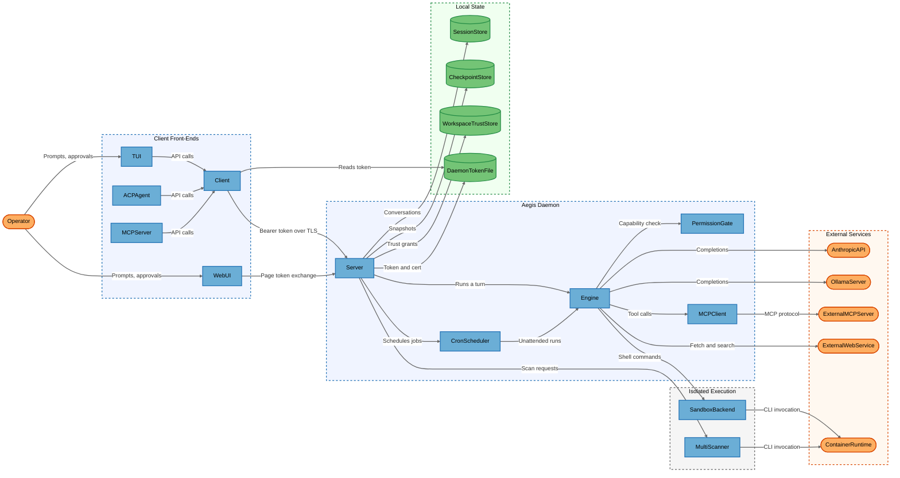
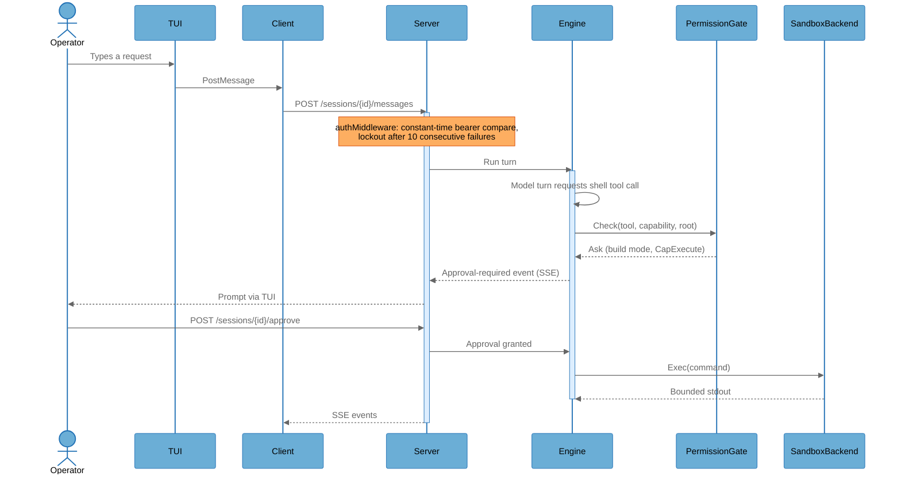

# Architecture Overview

## System Purpose

Aegis is a single-binary local AI coding agent for Go, shipped as a daemon plus multiple client front-ends. It runs an agentic loop (`internal/engine`) that drives an LLM provider — a local Ollama server or a cloud API (Anthropic / OpenAI-compatible) — through 50+ built-in tools that read and write the operator's source tree, execute shell commands in a sandbox, fetch web content, call external MCP servers, and run containerized security scanners. Its users are individual developers and operators on a single workstation; the daemon binds loopback by default and is protected by a bearer token written to disk. Its central security problem is that a probabilistic model, steered by content the operator did not author (web pages, MCP servers, repository files), is given the ability to execute commands and modify files on the host.

## Key Components

| Component | Type | Description |
|-----------|------|-------------|
| Operator | External Interactor | The human developer driving the agent through a terminal or browser. |
| TUI | Process | Bubbletea terminal UI (`internal/tui`); the default front-end started by bare `aegis`. |
| Client | Process | HTTP client to the daemon (`internal/client`, type `Client`); owns TLS cert pinning and bearer-token loading. |
| WebUI | Process | Browser SPA served from the daemon's embedded `dist/` (`internal/server/webui.go` + `webui/frontend`). |
| ACPAgent | Process | ACP JSON-RPC agent for Zed/Neovim over stdio (`internal/acp/agent.go`, type `Agent`). |
| MCPServer | Process | `aegis mcp-serve` — exposes Aegis itself as an MCP server over stdio (`internal/mcpserver/server.go`, type `Server`). |
| Server | Process | The daemon: HTTP API, session lifecycle, auth middleware, engine construction (`internal/server/server.go`, type `Server`). |
| Engine | Process | The agent loop: model turns, tool dispatch, parallel rounds, compaction, budgets (`internal/engine/engine.go`, type `Engine`). |
| PermissionGate | Process | Capability/mode/rule gate consulted before every tool call (`internal/permission/permission.go`, type `Gate`). |
| MCPClient | Process | Outbound MCP client for stdio and HTTP/SSE servers (`internal/mcp/mcp.go`, type `Client`). |
| CronScheduler | Process | Background job scheduler that starts unattended agent runs (`internal/cron/cron.go`, type `Scheduler`). |
| SandboxBackend | Process | Command execution isolation — container, OS-level, WSL or unsandboxed local (`internal/sandbox`). |
| MultiScanner | Process | Containerized security scanner orchestration (`internal/security/multiscanner.go`). |
| SessionStore | Data Store | SQLite store of conversations, traces and cost (`internal/session/session.go`, type `Store`). |
| CheckpointStore | Data Store | Per-turn file snapshots backing `/rewind` (`internal/checkpoint/checkpoint.go`, type `Store`). |
| WorkspaceTrustStore | Data Store | Per-directory trust grants pinned to a config fingerprint (`internal/workspacetrust/workspacetrust.go`, type `Store`). |
| DaemonTokenFile | Data Store | `daemon.token` / `daemon.crt` / `daemon.key` on disk (`internal/server/auth.go`, `generateAndWriteToken`). |
| AnthropicAPI | External Service | Cloud LLM API reached over HTTPS with an `x-api-key` header (`internal/provider/anthropic`). |
| OllamaServer | External Service | Local model server, typically `http://localhost:11434` (`internal/provider/ollama`). |
| ExternalMCPServer | External Service | Third-party MCP servers launched as subprocesses or reached over HTTP/SSE (`internal/mcp`). |
| ExternalWebService | External Service | Arbitrary HTTP(S) endpoints and search backends reached by `web_fetch`/`web_search` (`internal/tool/builtin/web.go`). |
| ContainerRuntime | External Service | Docker or Podman on the host, driven by CLI (`internal/sandbox/docker.go`, type `ContainerRuntime`). |

## Component Diagram



## Top Scenarios

### Scenario 1: Interactive agent turn with a gated shell command

The operator types a request in the TUI. `Client` posts it to the daemon over pinned-certificate TLS with the bearer token from `daemon.token`. `Engine` streams a model turn, the model requests a `shell` tool call, `PermissionGate` classifies its capability and — in the default `build` mode — the call is held for operator approval before `SandboxBackend` executes it.



### Scenario 2: Web UI page-token exchange

A browser navigating to `GET /ui` cannot send a bearer token, so the daemon mints a single-use page token plus a CSRF nonce, embeds the token in the HTML and sets the nonce as an `HttpOnly; SameSite=Strict` cookie. The SPA immediately trades both at `POST /auth/exchange` for the real daemon token used on every later call.

```mermaid
%%{init: {'theme': 'base', 'themeVariables': {
  'background': '#ffffff',
  'actorBkg': '#6baed6', 'actorBorder': '#2171b5', 'actorTextColor': '#000000',
  'signalColor': '#666666', 'signalTextColor': '#666666',
  'noteBkgColor': '#fdae61', 'noteBorderColor': '#d94701', 'noteTextColor': '#000000',
  'activationBkgColor': '#ddeeff', 'activationBorderColor': '#2171b5',
  'sequenceNumberColor': '#767676',
  'labelBoxBkgColor': '#f0f0f0', 'labelBoxBorderColor': '#666666', 'labelTextColor': '#000000',
  'loopTextColor': '#000000'
}}}%%
sequenceDiagram
    actor Operator
    participant WebUI as WebUI
    participant Server as Server

    Operator->>WebUI: Opens http://127.0.0.1:4127/ui
    WebUI->>Server: GET /ui
    activate Server
    Note over Server: mintPageToken: 60s TTL, single use,<br/>capped at 1024 outstanding
    Server-->>WebUI: HTML with page token + Set-Cookie CSRF nonce
    deactivate Server
    WebUI->>Server: POST /auth/exchange (Bearer page token, X-Aegis-CSRF)
    activate Server
    Note over Server: Constant-time compare of cookie vs header;<br/>page token deleted whatever the outcome
    Server-->>WebUI: Real daemon token
    deactivate Server
    WebUI->>Server: GET /sessions (Bearer daemon token)
    Server-->>WebUI: Session list
```

### Scenario 3: Untrusted content reaching model context

`web_fetch` resolves a URL through the SSRF-blocking dialer, retrieves content, and wraps it in a provenance marker before it enters the model's context. The same wrapper is applied to every MCP tool result. The marker frames the content as data, and an optional heuristic scan surfaces injection patterns as a visible warning rather than dropping the content.

```mermaid
%%{init: {'theme': 'base', 'themeVariables': {
  'background': '#ffffff',
  'actorBkg': '#6baed6', 'actorBorder': '#2171b5', 'actorTextColor': '#000000',
  'signalColor': '#666666', 'signalTextColor': '#666666',
  'noteBkgColor': '#fdae61', 'noteBorderColor': '#d94701', 'noteTextColor': '#000000',
  'activationBkgColor': '#ddeeff', 'activationBorderColor': '#2171b5',
  'sequenceNumberColor': '#767676',
  'labelBoxBkgColor': '#f0f0f0', 'labelBoxBorderColor': '#666666', 'labelTextColor': '#000000',
  'loopTextColor': '#000000'
}}}%%
sequenceDiagram
    participant Engine as Engine
    participant ExternalWebService as ExternalWebService
    participant ExternalMCPServer as ExternalMCPServer

    Engine->>Engine: Model requests web_fetch(url)
    Note over Engine: netblock.SafeDialer rejects loopback,<br/>RFC1918, CGNAT, NAT64, multicast
    Engine->>ExternalWebService: HTTPS GET
    ExternalWebService-->>Engine: HTML body
    Note over Engine: trust.Wrap tags content as untrusted;<br/>ScanForInjection annotates hits
    Engine->>ExternalMCPServer: tools/call
    ExternalMCPServer-->>Engine: Tool result
    Note over Engine: wrapUntrusted applied unconditionally
    Engine->>Engine: Wrapped content enters model context
```

### Scenario 4: Unattended scheduled run

`CronScheduler` fires a stored job on its schedule and starts an agent run with no operator present. The run inherits the job's configured permission mode, so a job created with `auto` mode executes tool calls without any interactive approval.

### Scenario 5: Containerized security scan

`aegis security scan` drives `MultiScanner`, which runs each scanner image through `ContainerRuntime` with `--network none`, `--cap-drop=ALL` and `--security-opt=no-new-privileges`, mounting the workspace. `aegis security update-db` is the only networked run of that image; the separate `aegis-netscanner` image runs with network but never a workspace mount.

## Technology Stack

| Layer | Technologies |
|-------|--------------|
| Languages | Go 1.26, TypeScript/JavaScript (web UI frontend), Shell/PowerShell (build scripts) |
| Frameworks | Cobra (CLI), Bubbletea/Lipgloss/Huh (TUI), net/http `ServeMux` (daemon), koanf (config), Vite + npm (web UI) |
| Data Stores | SQLite via `modernc.org/sqlite` (sessions, cron, knowledge, checkpoints), JSON files (workspace trust), plain files (`daemon.token`, `daemon.crt`, `daemon.key`, spill files) |
| Infrastructure | Docker/Podman/WSL/Apple `seatbelt`/`bwrap` sandboxes, GitHub Actions (CI, CodeQL, release), containerized scanner images |
| Security | Bearer-token auth with constant-time compare and exponential lockout, self-signed pinned TLS, double-submit CSRF for the UI page-token exchange, `internal/permission` gate stack, `internal/sandbox` path validation and OCI hardening flags, `internal/netblock` SSRF blocklist, `internal/trust` untrusted-content marking and injection scan, `internal/redact` secret redaction, `internal/workspacetrust` fingerprint-pinned trust grants, `internal/fsguard` Windows ACL restriction, govulncheck/staticcheck/CodeQL |

## Deployment Model

Aegis ships as one Go binary run on a developer workstation. `aegis serve` starts the daemon, which binds `server.addr` — defaulting to `127.0.0.1:4127` (`internal/config/config.go:156`). `validateListenAddr` (`internal/server/lifecycle.go:88-100`) refuses to start on any non-loopback address unless `server.allow_remote: true` is set explicitly. TLS is on by default (`server.tls.enabled: true`) using a self-signed ECDSA P-256 certificate generated once into the data directory and pinned by every in-repo client. All HTTP routes except `/healthz`, `/ui`, `/ui/` and `/auth/exchange` require a bearer token read from `daemon.token`, which is written `0o600` and additionally ACL-restricted to its owner on Windows via `fsguard.RestrictToOwner`. Bare `aegis` starts an embedded daemon in-process if none is reachable. `aegis mcp-serve` and the ACP agent are stdio subprocesses started by an editor, with no network listener of their own. Outbound connections go to the configured LLM provider (loopback Ollama or a cloud HTTPS API), to MCP servers, and to arbitrary web endpoints via the fetch/search tools.

**Deployment Classification:** `LOCALHOST_SERVICE`

### Component Exposure Table

| Component | Listens On | Auth Required | Reachability | Min Prerequisite | Derived Tier |
|-----------|------------|---------------|--------------|------------------|-------------|
| Operator | N/A — no listener | N/A | No Listener | Host/OS Access | T3 |
| TUI | N/A — no listener | N/A | No Listener | Host/OS Access | T3 |
| Client | N/A — no listener | N/A | No Listener | Host/OS Access | T3 |
| WebUI | N/A — served by Server | No (page served tokenless) | Localhost Only | Local Process Access | T2 |
| ACPAgent | N/A — stdio only | Yes (`authenticate` method) | No Listener | Host/OS Access | T3 |
| MCPServer | N/A — stdio only | Yes (`authenticate` method) | No Listener | Host/OS Access | T3 |
| Server | `127.0.0.1:4127` | Yes (bearer token) | Localhost Only | Local Process Access | T2 |
| Engine | N/A — no listener | N/A | No Listener | Host/OS Access | T3 |
| PermissionGate | N/A — no listener | N/A | No Listener | Host/OS Access | T3 |
| MCPClient | N/A — outbound only | N/A | No Listener | Host/OS Access | T3 |
| CronScheduler | N/A — no listener | N/A | No Listener | Host/OS Access | T3 |
| SandboxBackend | N/A — no listener | N/A | No Listener | Host/OS Access | T3 |
| MultiScanner | N/A — no listener | N/A | No Listener | Host/OS Access | T3 |
| SessionStore | N/A — local SQLite file | No (filesystem ACL only) | No Listener | Host/OS Access | T3 |
| CheckpointStore | N/A — local files | No (filesystem ACL only) | No Listener | Host/OS Access | T3 |
| WorkspaceTrustStore | N/A — local JSON file | No (filesystem ACL only) | No Listener | Host/OS Access | T3 |
| DaemonTokenFile | N/A — local files | No (filesystem ACL only) | No Listener | Host/OS Access | T3 |
| AnthropicAPI | Vendor-operated HTTPS endpoint | Yes (`x-api-key`) | External | Authenticated User | T2 |
| OllamaServer | `http://localhost:11434` (operator-run) | No | Localhost Only | Local Process Access | T2 |
| ExternalMCPServer | stdio subprocess or operator-configured HTTP endpoint | Configurable per server | Localhost Only | Local Process Access | T2 |
| ExternalWebService | Third-party HTTPS endpoints | No | External | Authenticated User | T2 |
| ContainerRuntime | Local Docker/Podman socket | No (socket group membership) | Localhost Only | Local Process Access | T2 |

## Security Infrastructure Inventory

| Component | Security Role | Configuration | Notes |
|-----------|---------------|---------------|-------|
| `internal/server/auth.go` | Bearer-token authentication with lockout | 32-byte random token, `authLockThreshold: 10`, backoff 1s→60s | Constant-time compare; valid token served through an active lockout window to prevent local self-DoS. |
| `internal/server/auth.go` (`originMiddleware`) | DNS-rebinding defense | Non-loopback `Origin` header → 403 | Applies to every route. |
| `internal/server/webui.go` | Browser hardening headers | CSP `default-src 'self'`, `X-Frame-Options: DENY`, `nosniff` | `frame-ancestors 'none'` present in CSP. |
| `internal/server/auth.go` (page tokens) | Double-submit CSRF for tokenless page load | 60s TTL, single use, cap 1024 outstanding | Binds `/auth/exchange` to the browser that loaded `/ui`. |
| `internal/config/config_server.go` (`ServerTLSConfig`) | Transport encryption | `server.tls.enabled: true` by default | Self-signed cert, pinned by `client.NewFromConfig`; browsers see a warning. |
| `internal/server/lifecycle.go` (`validateListenAddr`) | Bind-address guard | Refuses non-loopback unless `server.allow_remote` | Startup WARN when remote binding is enabled. |
| `internal/permission` | Capability/mode/rule gate | `permission.mode: build` by default, `auto_approve_exec: false` | `Gate.Check` consults `tool.EffectiveCapability` before `Policy.Decide`. |
| `internal/tool/builtin/shell_readonly.go` | Read-only shell classification | `permission.plan_mode_shell_reads` (default `true`) | ~1,129 lines of argument parsing across 40+ commands; the load-bearing parser behind plan mode's guarantee. |
| `internal/sandbox` | Command execution isolation | `sandbox.backend: container` by default, `sandbox.network: false` | Cascades container → OS → local with a WARN; `OCIHardeningFlags` sets `--cap-drop=ALL`, `--security-opt=no-new-privileges`, memory/CPU/PID limits. |
| `internal/sandbox/pathvalidator.go` | Workspace path confinement | `ValidatePath`/`ValidatePathIn` | Resolves symlinks per root before the containment check. |
| `internal/netblock` | SSRF blocklist and dialer | Shared by `web_fetch` and the HTTP MCP client | Covers `0.0.0.0/8`, RFC1918, CGNAT, link-local, multicast, reserved and the NAT64 prefix; redirects re-validated. |
| `internal/trust` | Untrusted-content provenance and injection scan | `security.scan_file_reads: true` by default | Applied unconditionally to MCP and web content. |
| `internal/redact` | Secret redaction in shared/persisted output | `security.redact_secrets: true` | Patterns for PEM keys, AWS/GitHub/Slack/OpenAI keys, JWTs, bearer tokens. |
| `internal/workspacetrust` | Per-directory trust grants | Grant pinned to `config.SecurityFingerprint` | Store written `0o600` in a `0o700` directory; a changed security-relevant key re-prompts. |
| `internal/config/fingerprint.go` | Security-relevant config freeze | `securityRelevantConfigLines` | Unparseable project config hashes to a sentinel rather than the empty set. |
| `internal/providerfactory/factory.go` (`validateBaseURL`) | Credential-exposure guard | Refuses plaintext HTTP to a non-loopback host when a real API key is present | Warns when a cloud provider's host is overridden. |
| `internal/fsguard` | Windows owner-only ACL | Applied to `daemon.token`, `.aegis/.env` | No-op on POSIX. |
| `internal/security/target.go` (`isHostAllowed`) | Network-scan target authorization | `security.dast.allowed_targets`, `security.dast.allow_active: false` | Loopback and RFC1918 are always allowed with no allowlist entry. |
| `internal/security/execbound.go` | Scanner output bounding | `maxScanOutputBytes: 64 MiB` | Prevents a rogue scanner exhausting daemon heap. |
| `.github/workflows/codeql.yml` | Static analysis | Push, PR, weekly schedule | The only workflow still triggered by push/PR. |

## Repository Structure

| Directory | Purpose |
|-----------|---------|
| `cmd/aegis/` | Single binary entry point. |
| `internal/server/` | HTTP daemon: routes, auth, sessions, engine construction, web UI serving. |
| `internal/engine/` | Agent loop: model turns, parallel tool rounds, compaction, budgets, loop detection. |
| `internal/provider/` | Provider `Adapter` seam plus Anthropic/OpenAI/Ollama adapters and retry/failover decorators. |
| `internal/tool/`, `internal/tool/builtin/` | Tool interface and registry; 51 built-in tool source files including `shell`, file editors, web, git, security. |
| `internal/permission/` | Mode gate, allow/deny rules, contextual policy, persona tool gate, scope layer. |
| `internal/enginecfg/` | The single place engine-construction decisions (gate stack, run limits, hooks) are made. |
| `internal/sandbox/` | Local/Docker/Podman/WSL/Apple execution backends and workspace path validation. |
| `internal/security/` | Containerized scanners, SBOM/CVE/SARIF handling, DAST and network recon. |
| `internal/mcp/`, `internal/mcpserver/` | Outbound MCP client and inbound MCP server. |
| `internal/acp/` | ACP JSON-RPC agent for editor integrations. |
| `internal/session/`, `internal/checkpoint/`, `internal/sqlitestore/` | Persistent session, trace and snapshot storage. |
| `internal/config/` | Layered configuration, security freeze and fingerprinting. |
| `internal/workspacetrust/` | Per-directory trust grant store. |
| `internal/netblock/`, `internal/trust/`, `internal/redact/` | SSRF blocklist, untrusted-content marking, secret redaction. |
| `internal/tui/`, `internal/client/` | Terminal UI and daemon HTTP client. |
| `internal/server/webui/frontend/`, `internal/server/webui/dist/` | Web UI source and its committed, embedded build output. |
| `.github/workflows/` | CI, CodeQL, nightly eval and release pipelines. |
| `docs/`, `research/` | Operator documentation and the project's roadmap/review record. |
