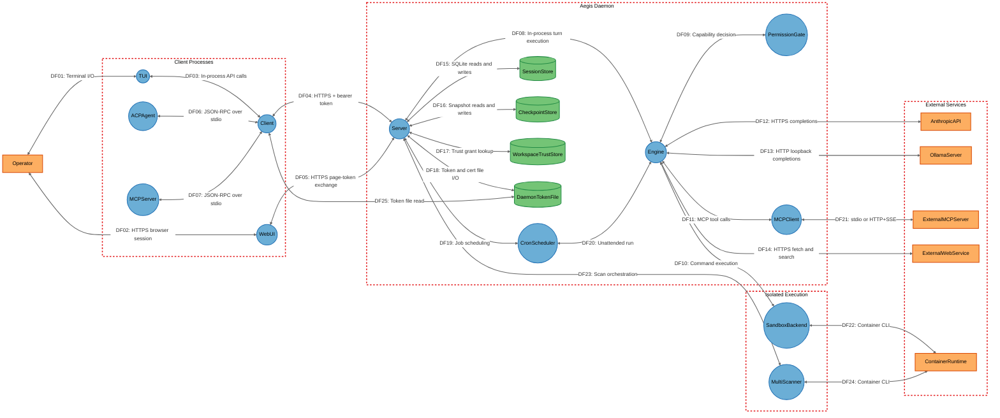
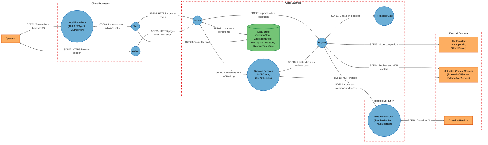

# Threat Model

## Data Flow Diagram

## Element Table

| Element | Type | TMT Category | Description | Trust Boundary |
|---------|------|--------------|-------------|----------------|
| Operator | External Interactor | `SE.EI.TMCore.User` | The human developer issuing prompts and granting tool approvals. | External |
| TUI | Process | `SE.P.TMCore.ThickClient` | Bubbletea terminal UI; the default front-end and the approval surface. | Client |
| Client | Process | `SE.P.TMCore.NetApp` | HTTP client library that loads `daemon.token` and pins the daemon's TLS certificate. | Client |
| WebUI | Process | `SE.P.TMCore.BrowserClient` | Browser SPA served from the daemon's embedded `dist/`. | Client |
| ACPAgent | Process | `SE.P.TMCore.WebSvc` | ACP JSON-RPC agent driven by an editor over stdio. | Client |
| MCPServer | Process | `SE.P.TMCore.WebSvc` | `aegis mcp-serve`, exposing Aegis as an MCP server over stdio. | Client |
| Server | Process | `SE.P.TMCore.WebServer` | The daemon's HTTP API, auth middleware and session lifecycle. | Daemon |
| Engine | Process | `SE.P.TMCore.Thread` | The agent loop driving model turns and parallel tool rounds. | Daemon |
| PermissionGate | Process | `SE.P.TMCore.NetApp` | Capability, mode, rule, persona and scope gate for every tool call. | Daemon |
| MCPClient | Process | `SE.P.TMCore.WebSvc` | Outbound MCP client for stdio subprocess and HTTP/SSE servers. | Daemon |
| CronScheduler | Process | `SE.P.TMCore.Thread` | Background scheduler starting unattended agent runs. | Daemon |
| SandboxBackend | Process | `SE.P.TMCore.OSProcess` | Executes model-requested shell commands under container, OS or no isolation. | Sandbox |
| MultiScanner | Process | `SE.P.TMCore.VM` | Runs security scanner container images against the workspace. | Sandbox |
| SessionStore | Data Store | `SE.DS.TMCore.SQL` | SQLite database of conversations, traces and cost records. | Daemon |
| CheckpointStore | Data Store | `SE.DS.TMCore.FS` | Per-turn file snapshots supporting `/rewind`. | Daemon |
| WorkspaceTrustStore | Data Store | `SE.DS.TMCore.ConfigFile` | JSON store of per-directory trust grants pinned to a config fingerprint. | Daemon |
| DaemonTokenFile | Data Store | `SE.DS.TMCore.FS` | `daemon.token`, `daemon.crt` and `daemon.key` on the local filesystem. | Daemon |
| AnthropicAPI | External Service | `SE.EI.TMCore.WebSvc` | Cloud LLM API authenticated with an `x-api-key` header over HTTPS. | External |
| OllamaServer | External Service | `SE.EI.TMCore.WebSvc` | Operator-run local model server, typically unauthenticated on loopback. | External |
| ExternalMCPServer | External Service | `SE.EI.TMCore.WebSvc` | Third-party MCP servers supplying tools and returning untrusted content. | External |
| ExternalWebService | External Service | `SE.EI.TMCore.WebSvc` | Arbitrary HTTP(S) endpoints and search backends reached by the web tools. | External |
| ContainerRuntime | External Service | `SE.EI.TMCore.Megaservice` | Docker or Podman daemon on the host, driven through its CLI. | External |

## Data Flow Table

| ID | Source | Target | Protocol | Description |
|----|--------|--------|----------|-------------|
| DF01 | Operator | TUI | Terminal I/O | Prompts, slash commands and approval decisions. |
| DF02 | Operator | WebUI | HTTPS | Browser session against the daemon's embedded SPA. |
| DF03 | TUI | Client | In-process | Session, message and approval API calls. |
| DF04 | Client | Server | HTTPS (pinned self-signed) | Authenticated API traffic carrying the bearer token and full conversation content. |
| DF05 | WebUI | Server | HTTPS | Page-token mint and exchange, then bearer-authenticated API calls and SSE. |
| DF06 | ACPAgent | Client | JSON-RPC over stdio | Editor-driven session creation, prompts and permission responses. |
| DF07 | MCPServer | Client | JSON-RPC over stdio | MCP client-driven session creation and prompt turns. |
| DF08 | Server | Engine | In-process | Turn execution, event streaming and approval round-trips. |
| DF09 | Engine | PermissionGate | In-process | Per-call capability classification and allow/ask/deny decision. |
| DF10 | Engine | SandboxBackend | Process spawn | Model-requested shell commands and their bounded output. |
| DF11 | Engine | MCPClient | In-process | MCP tool invocation and wrapped results. |
| DF12 | Engine | AnthropicAPI | HTTPS | Prompt, file content and tool results sent to a cloud model. |
| DF13 | Engine | OllamaServer | HTTP (loopback) | Prompt and tool results sent to a local model. |
| DF14 | Engine | ExternalWebService | HTTPS | `web_fetch`/`web_search` requests and retrieved page content. |
| DF15 | Server | SessionStore | SQLite (file) | Conversation, trace and cost persistence. |
| DF16 | Server | CheckpointStore | File I/O | Snapshot writes before mutating tool calls and restores on rewind. |
| DF17 | Server | WorkspaceTrustStore | File I/O | Trust grant lookup and recording, keyed by directory and fingerprint. |
| DF18 | Server | DaemonTokenFile | File I/O | Auth token and TLS key material generation and reuse. |
| DF19 | Server | CronScheduler | In-process | Job registration, listing and lifecycle. |
| DF20 | CronScheduler | Engine | In-process | Unattended run start with the job's stored mode and workdir. |
| DF21 | MCPClient | ExternalMCPServer | stdio or HTTP+SSE | Tool listing and invocation against a third-party server. |
| DF22 | SandboxBackend | ContainerRuntime | CLI invocation | `docker`/`podman run` with hardening flags and workspace mount. |
| DF23 | Server | MultiScanner | In-process | Scan requests and aggregated findings. |
| DF24 | MultiScanner | ContainerRuntime | CLI invocation | Scanner image execution with `--network none` and a workspace mount. |
| DF25 | Client | DaemonTokenFile | File I/O | Reads `daemon.token` and the pinned certificate to authenticate. |

## Trust Boundary Table

| Boundary | Description | Contains |
|----------|-------------|----------|
| Client | Front-end processes on the operator's host that hold the daemon credential; includes the browser, which runs untrusted-by-default script. | TUI, Client, WebUI, ACPAgent, MCPServer |
| Daemon | The `aegis serve` process: HTTP listener, agent loop, permission decisions and all local state. Everything inside runs with the operator's full OS privileges. | Server, Engine, PermissionGate, MCPClient, CronScheduler, SessionStore, CheckpointStore, WorkspaceTrustStore, DaemonTokenFile |
| Sandbox | Command and scanner execution isolated from the daemon by a container, an OS sandbox profile, or — as a documented fallback — nothing at all. | SandboxBackend, MultiScanner |
| External | Services outside the operator's control or outside Aegis's process tree, whose responses are treated as untrusted input. | AnthropicAPI, OllamaServer, ExternalMCPServer, ExternalWebService, ContainerRuntime |

## Summary View

## Summary to Detailed Mapping

| Summary Element | Contains | Summary Flows | Maps to Detailed Flows |
|-----------------|----------|---------------|------------------------|
| Local Front-Ends | TUI, ACPAgent, MCPServer | SDF01, SDF03 | DF01, DF03, DF06, DF07 |
| Client | Client | SDF03, SDF04, SDF08 | DF03, DF04, DF06, DF07, DF25 |
| WebUI | WebUI | SDF02, SDF05 | DF02, DF05 |
| Server | Server | SDF04, SDF05, SDF06, SDF07, SDF09 | DF04, DF05, DF08, DF15, DF16, DF17, DF18, DF19, DF23 |
| Engine | Engine | SDF06, SDF10, SDF11, SDF12, SDF13, SDF14 | DF08, DF09, DF10, DF11, DF12, DF13, DF14, DF20 |
| PermissionGate | PermissionGate | SDF11 | DF09 |
| Daemon Services | MCPClient, CronScheduler | SDF09, SDF10, SDF15 | DF11, DF19, DF20, DF21 |
| Local State | SessionStore, CheckpointStore, WorkspaceTrustStore, DaemonTokenFile | SDF07, SDF08 | DF15, DF16, DF17, DF18, DF25 |
| Isolated Execution | SandboxBackend, MultiScanner | SDF12, SDF16 | DF10, DF22, DF23, DF24 |
| LLM Providers | AnthropicAPI, OllamaServer | SDF13 | DF12, DF13 |
| Untrusted Content Sources | ExternalMCPServer, ExternalWebService | SDF14, SDF15 | DF14, DF21 |
| ContainerRuntime | ContainerRuntime | SDF16 | DF22, DF24 |
